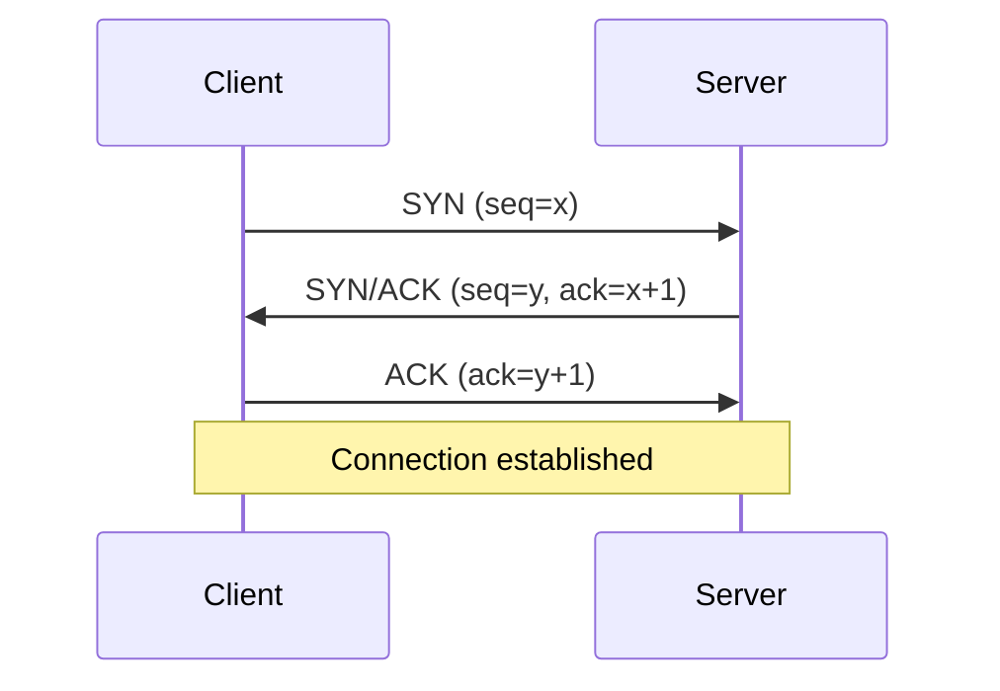
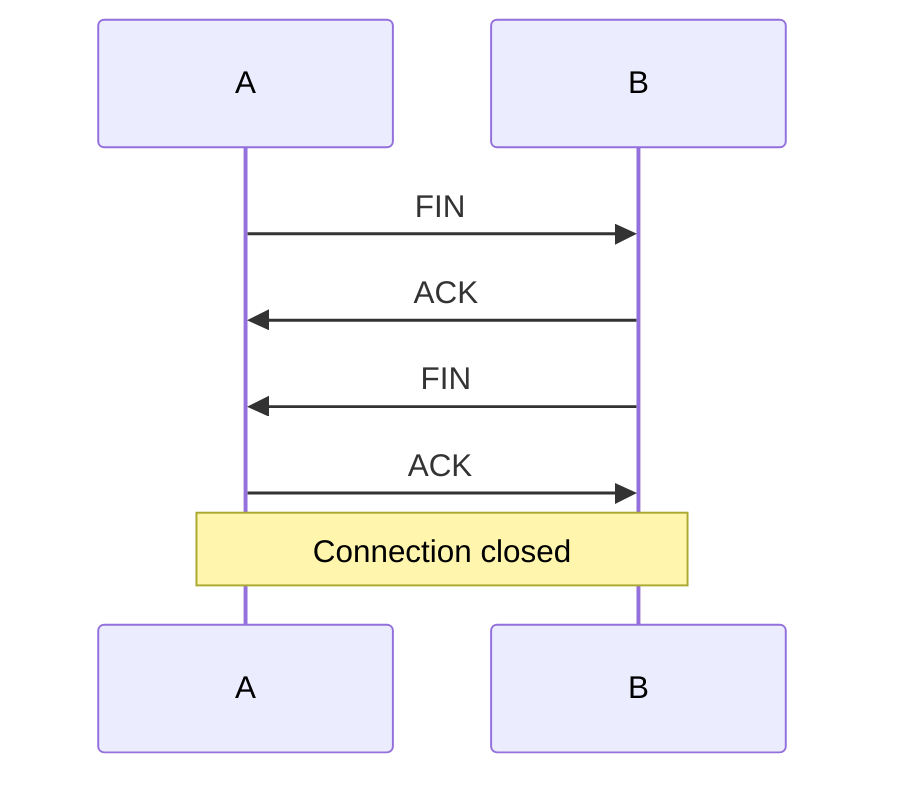

# OS and networking

These questions often come intermixed with coding ("What's a page fault?"), especially in early stages of the loop. You must answer confidently in 1-2 sentences.

This chapter gives you the foundations + memorized answers to the 20 most frequent questions.

## Part 1 — Operating system

### What it is

Base software that makes the computer run. Main tasks:

1. **Process management**: start, suspend, schedule.
2. **Memory management**: allocate, isolate, virtualize.
3. **I/O management**: disks, network, devices.
4. **Security**: user separation, permissions.

Examples: Linux, Windows, macOS, Android (Linux-based), iOS.

### Kernel space vs user space

The **kernel** is the OS's privileged "core". Directly accesses hardware. User applications live in **user space**, protected.

To do privileged things (open files, allocate memory), the app makes a **system call** → trap into kernel → kernel executes on behalf of the app.

System calls are expensive (tens of μs). That's why they're batched (`writev`, `sendmsg`, etc.).

## Part 2 — Processes

### What it is

A process is an **instance in execution** of a program. It has:

- Own address space (virtual memory).
- Open file descriptors.
- PCB (Process Control Block) with state, registers, priority.
- At least 1 thread.

In Linux you can see them with `ps`, `top`.

### Process states

- **Running**: using the CPU.
- **Ready**: ready, in scheduling queue.
- **Blocked**: waiting for I/O or event.
- **Zombie**: terminated but parent hasn't read exit code yet.

### Fork & exec (Unix)

- `fork()`: duplicates current process. Child and parent continue identical.
- `exec()`: replaces current program with a new one.

"Fork + exec" pattern: create a new process running another program.

### Process ID

`getpid()` returns the PID. PID 1 is `init` (started by kernel at boot).

## Part 3 — Thread (recap)

Already seen in ch. 19. Summary:

- Same process → shared memory.
- Different process → isolated memory, IPC to communicate.

## Part 4 — Scheduling

The OS decides which process/thread to execute at each moment.

**Algorithms**:

- **FCFS (FIFO)**: take turns. Simple but "convoy effect" (long processes block short ones).
- **Round Robin**: fixed time slice (e.g. 10 ms). Fair.
- **Priority**: high priority first. Starvation risk.
- **MLFQ (Multi-Level Feedback Queue)**: modern OSes. I/O-bound processes go up in priority, CPU-bound go down. Rewards interactivity.

Linux uses **CFS** (Completely Fair Scheduler) — fair share variant.

### Preemptive vs cooperative

- **Preemptive**: OS can interrupt any process. Linux, Windows, macOS.
- **Cooperative**: processes yield voluntarily. Old OSes, some runtimes (Lua, old Mac OS).

## Part 5 — Virtual memory

Key concept: **each process sees its own "complete" virtual address space**, as if it had all RAM to itself.

### Page table

The **MMU** (Memory Management Unit) translates virtual addresses → physical via a **page table**.

Memory divided into **pages** (typically 4 KB). Each virtual page mapped to a physical page (or disk swap).

### Advantages

- **Isolation**: process A doesn't see B's memory.
- **Memory > physical**: inactive pages go to swap. The OS can "promise" more RAM than you have.
- **Lazy loading**: allocated but unused pages don't occupy RAM.

### Page fault

When a process accesses a page **not in RAM**, MMU generates a page fault → kernel loads it from disk (or swap). Expensive: 1-10 ms (1 million times slower than RAM access).

### TLB

Page table cache. O(1) hit for translation, miss → page table walk (expensive).

### Thrashing

When too many page faults → CPU spends more time paging than working. Symptom: 100% disk, very slow system.

## Part 6 — Heap vs stack

Two regions of a process's memory:

### Stack

- **Local variables**, function parameters, return address.
- LIFO. Grows downward.
- Limit ~1-8 MB. Stack overflow if exceeded.
- Fast: allocation = decrement of a pointer.

### Heap

- **Dynamically allocated memory** (`malloc`, `new`, Python `list = [...]`).
- Limited by total RAM.
- Slower: block management, fragmentation.
- Garbage collector (Java, Python, Go) or manual (C, C++).

In Python: every object is on the heap. Local variables are references to objects (on stack).

## Part 7 — Filesystem

### Inode

A file's metadata: size, owner, permissions, timestamps, list of blocks on disk. Inode does NOT contain the file's name.

### Directory

A mapping name → inode. Directories are special files.

### Hard link vs soft link

- **Hard link**: two names → same inode. Deleting one doesn't delete the file (if other links exist). Same filesystem.
- **Soft link** (symlink): file containing the destination's path. Can point cross-filesystem or to non-existent files.

### Permissions (Unix)

```
-rwxr-xr-x  owner=alice  group=devs
```

- `r` = read, `w` = write, `x` = execute.
- 3 groups: owner, group, other.
- In octal: `rwxr-xr-x` = `755`.

## Part 8 — Essential networking

### OSI / TCP-IP stack

7 OSI layers (academic model), 5 in the practical TCP/IP stack:

1. **Physical**: bits on wire / radio.
2. **Data link**: frames, MAC. Ethernet, WiFi.
3. **Network**: packets, IP, routing.
4. **Transport**: TCP, UDP. Reliability, multiplexing.
5. **Application**: HTTP, DNS, SMTP, SSH.

### IP (Internet Protocol)

- **IPv4**: 32 bits (4 bytes). 4 billion addresses, **exhausted**. Ex: `192.168.1.10`.
- **IPv6**: 128 bits. Replacing IPv4. Ex: `2001:0db8:85a3::8a2e:0370:7334`.
- **CIDR**: notation `10.0.0.0/24` = first 24 bits fixed (subnet), last 8 variable (host).
- **NAT**: same public IP for multiple private devices (home router).

### TCP vs UDP

| | TCP | UDP |
|---|---|---|
| Connection-oriented | yes (3-way handshake) | no |
| Reliable | yes (retransmit, ack) | no |
| Ordered | yes | no |
| Flow control | yes | no |
| Overhead | high | low |
| Use case | HTTP, SSH, DB | DNS, video streaming, gaming, DoH |

### TCP 3-way handshake



3 round trips to establish connection. For HTTPS add TLS handshake (1-2 RTT). That's why HTTP/3 over QUIC reduces to 1 RTT.

### TCP teardown (4-way)



### TCP congestion control

TCP "slows down" if it suspects congestion (loss detection).

- **Slow start**: cwnd doubles every RTT (exponential up to threshold).
- **Congestion avoidance**: cwnd grows linearly after threshold.
- **Fast retransmit/recovery**: on duplicate ACK.

Algorithms: Reno, Cubic (Linux default), BBR (Google, based on bandwidth).

## Part 9 — DNS

Name → IP resolution. E.g. `google.com` → `142.250.184.46`.

### Hierarchy

Domain Name System is hierarchical:

- **Root** (`.`) → 13 root servers worldwide.
- **TLD** (top-level domain): `.com`, `.org`, `.it`...
- **Authoritative**: server with the truth for a domain (e.g. ns1.google.com).
- **Recursive resolver**: your ISP or 8.8.8.8 does the round for you.

### Cache

DNS is aggressive in caching. TTL on every record. DNS modification = wait for propagation.

### Record types

- **A**: IPv4.
- **AAAA**: IPv6.
- **CNAME**: alias of another name.
- **MX**: email server.
- **TXT**: free text (SPF, DKIM, DNSSEC).
- **NS**: authoritative name servers.

## Part 10 — HTTP

### Methods

- **GET**: idempotent, safe, cacheable.
- **POST**: NOT idempotent (creation).
- **PUT**: idempotent (upsert).
- **PATCH**: partial, usually not idempotent.
- **DELETE**: idempotent.
- HEAD, OPTIONS, TRACE.

### Status codes

- **1xx** informational.
- **2xx** success: 200 OK, 201 Created, 204 No Content.
- **3xx** redirect: 301 permanent, 302 temp, 304 not modified.
- **4xx** client error: 400 bad, 401 unauthorized, 403 forbidden, 404 not found, 429 rate limit.
- **5xx** server error: 500 internal, 502 bad gateway, 503 unavailable, 504 gateway timeout.

### Versions

- **HTTP/1.1**: text-based, 1 request/connection (pipelining poorly supported), repeated headers.
- **HTTP/2**: binary, **multiplexing** (many parallel requests on one connection), header compression (HPACK), server push.
- **HTTP/3** (over QUIC, on top of UDP): 1-RTT setup, no head-of-line blocking, 0-RTT with resume.

### Common headers

- `Content-Type`, `Content-Length`
- `Authorization: Bearer <token>`
- `Cache-Control`, `ETag`, `Last-Modified` (caching)
- `Cookie` / `Set-Cookie`
- `Access-Control-Allow-Origin` (CORS)

### REST vs gRPC vs GraphQL

- **REST**: HTTP + JSON, resources/verbs. Cacheable. Verbose (overfetching).
- **gRPC**: HTTP/2 + Protobuf. Bidirectional streaming. Polyglot. Faster. Less debuggable.
- **GraphQL**: query specified by client. Reduces overfetching. Complicates caching and backend.

## Part 11 — TLS

Encryption + authentication.

### Handshake (simplified)

1. Client Hello: "I'd like to communicate. Here are the ciphers I support."
2. Server Hello + certificate (proves its identity).
3. Client verifies certificate vs CA root (preinstalled in OS/browser).
4. Key exchange (Diffie-Hellman) to derive symmetric keys.
5. "Finished" → from here everything encrypted.

**TLS 1.3** reduces to 1-RTT. Resume with 0-RTT.

### Cert chain

```
Server cert (e.g. *.google.com)
  ← signed by intermediate CA
    ← signed by root CA (preinstalled in trust store)
```

## Part 12 — Idempotency

Same request multiple times = same effect as the first. Critical for safe retry.

POST typically not idempotent (creates resource). To fix: **Idempotency-Key** in header.

```
POST /payment
Idempotency-Key: abc123
```

Server memorizes the key; duplicate calls with same key return first result without recreating.

## Part 13 — The 15 quick questions (memorize the answers)

### 1. What happens when you type `google.com`?

1. Browser searches local cache + hostfile.
2. If miss, DNS query → recursive resolver → root → TLD (.com) → authoritative.
3. Receive A record (IP).
4. TCP handshake with IP, port 443.
5. TLS handshake.
6. HTTP GET / with headers.
7. Server: LB → app server → cache + DB → generates HTML.
8. Server responds with HTML + asset links.
9. Browser parses, downloads CSS/JS/img in parallel (also CDN).
10. Renders DOM, runs JS.

### 2. Process vs thread difference?

See parts 2-3. Brief: threads share memory in same process; processes are isolated.

### 3. Page fault?

Access to page not in RAM → MMU generates trap → OS loads from disk. ms vs ns: 1M× slower.

### 4. `kill -9`?

SIGKILL: not handleable by process. OS terminates it immediately. No cleanup, no signal handler.

### 5. HTTP vs WebSocket?

HTTP: request-response. WebSocket: full duplex, persistent. Starts with HTTP upgrade handshake.

### 6. TCP congestion window?

How many un-ack'd bytes can be in flight. Increases on success, decreases on loss.

### 7. TCP vs UDP?

See Part 8.

### 8. DNS?

See Part 9.

### 9. Zombie process?

Terminated process whose exit code hasn't been read by parent yet (`waitpid`). Occupies an entry in PID table.

### 10. Fork vs exec?

Fork: clone process. Exec: replace process's program.

### 11. GIL?

Python's Global Interpreter Lock. Prevents threads from executing bytecode in parallel. For CPU parallelism use multiprocessing.

### 12. When UDP instead of TCP?

When losses OK + latency matters: video streaming, gaming, DNS, DoH.

### 13. HTTP/1 vs 2 vs 3?

1: text, 1 req/conn. 2: binary, multiplexing, HPACK. 3: over QUIC/UDP, 1-RTT, no head-of-line block.

### 14. REST: idempotent verbs?

GET, PUT, DELETE, HEAD, OPTIONS. POST and PATCH no (by default).

### 15. SAML/OAuth/JWT?

- **SAML**: XML standard for enterprise SSO (somewhat obsolete).
- **OAuth2**: authorization framework. Lets an app access resources on behalf of a user without receiving the password.
- **JWT**: token format (JSON + signature). Often used as access token in OAuth.

### 16. Mutex vs semaphore?

Mutex: 1 thread. Semaphore: N threads.

### 17. Virtual memory?

Each process sees a virtual space. MMU translates to physical. Isolation, swap, lazy loading.

### 18. Heap vs stack?

Stack: local variables, LIFO, ~MB limit. Heap: dynamically allocated, ~RAM limit.

### 19. `select` / `epoll`?

System calls to handle I/O multiplexing: one thread managing thousands of sockets. `epoll` (Linux) scales better than `select`.

### 20. Load balancer L4 vs L7?

L4: sees only TCP/UDP, routes by IP+port. L7: sees HTTP, routes by path/header.

## Summary

1. **Process** = program instance. **Thread** = scheduling unit inside process.
2. **Virtual memory**: each process sees isolated virtual space. Page fault = expensive.
3. **TCP** reliable/connection-oriented, **UDP** fast/no-guarantees.
4. **HTTP**: methods, status codes, idempotency, cache headers.
5. **DNS**: hierarchical, aggressively cached.
6. **TLS**: handshake with cert chain → symmetric encryption.

Memorize the 20 answers above. In quick technical interview, a good answer in 30 seconds distinguishes you.
