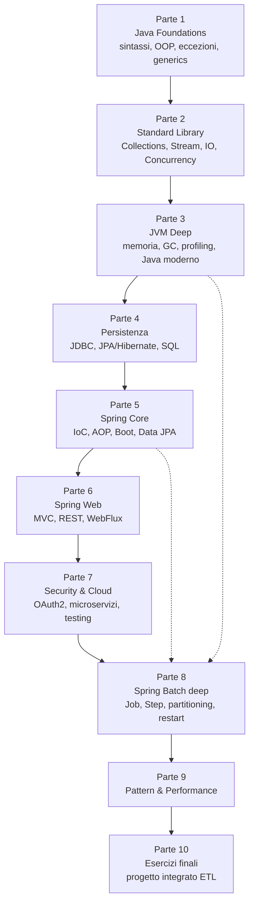

# Il percorso e la giusta mentalità

## Perché Java + Spring nel 2026

Java compie 31 anni nel 2026 ed è ancora il linguaggio più richiesto in banche, assicurazioni, telco, PA, retail e aerospaziale. Spring è di fatto il **framework standard** per costruire applicazioni server-side enterprise: lo trovi in ENI, Generali, Intesa, Poste, Telecom, Ferrari, Ferrovie. Spring Batch — sottoframework specifico per processi batch — gira la notte negli ETL bancari, nelle riconciliazioni di pagamento, nella generazione di estratti conto, nel risk management.

Imparare bene **Java + Spring + Spring Batch** ti rende immediatamente impiegabile in qualunque grande azienda italiana ed europea. Non è una moda: è infrastruttura.

## La mappa: come è strutturato il percorso

Il percorso è suddiviso in 10 parti che vanno dalle basi al "ti chiamano per consulenze":



> **Non saltare i fondamenti.** Spring è "magico" solo se non capisci la JVM, le annotazioni, i proxy, le transazioni. Se le capisci, è prevedibile. Il 90% dei bug Spring nasce dal non aver mai veramente studiato Java base.

## Come studiare

### 1) Leggi, poi scrivi codice. Sempre.

Ogni concetto in questo sito ha esempi runnabili. Non leggere passivamente: **apri l'IDE, scrivi, compila, fallo crashare, capisci perché**. Senza la fase "fallo crashare", non lo sai davvero.

### 2) Spaced repetition sui meccanismi profondi

Memory model Java, lifecycle di un bean Spring, ordine degli interceptor: torna a rileggerli ogni 2-3 settimane. Non sono cose che impari una volta — sono cose che decanti.

### 3) Costruisci qualcosa di tuo, anche brutto

Mentre fai il percorso, abbi un progetto-pet (es. "gestore delle mie spese", "monitor dei feed RSS", "batch di import OFX"). Ogni nuovo concetto provalo lì. Senza un progetto vero non scopri mai i problemi reali (configurazione, deploy, log, retry).

### 4) Leggi il codice degli altri

Il codice sorgente di Spring (`spring-projects/spring-framework` su GitHub) è scritto da gente bravissima. Ogni tanto vai a leggere come è implementato `@Transactional` o `DispatcherServlet`. È come leggere un libro di letteratura: lì c'è la lingua vera.

### 5) Italiano *e* inglese

Tutto il sito è bilingue: leggilo prima in italiano per fissare i concetti, poi **rileggilo in inglese** per imparare i termini tecnici "veri". Tutto il mondo del lavoro su Java parla inglese: `bean`, `wiring`, `scope`, `proxy`, `interceptor`, `chunk`, `tasklet`, `partitioner`. Devi sapere come si chiamano in originale.

## Setup veloce

Apri PowerShell o terminale e verifica:

```powershell
java -version
# atteso: openjdk version "21.x.x" o superiore

mvn -version
# atteso: Apache Maven 3.9+

# (opzionale ma consigliato)
docker --version
# atteso: Docker version 24+ o superiore
```

Se manca qualcosa:

- **JDK 21**: scarica da [adoptium.net](https://adoptium.net) (Eclipse Temurin) o [bell-sw.com](https://bell-sw.com) (Liberica).
- **Maven**: [maven.apache.org](https://maven.apache.org) (estrai, aggiungi `bin/` al PATH).
- **IntelliJ IDEA Community**: gratis, [jetbrains.com/idea](https://www.jetbrains.com/idea/).

## Errori mentali tipici (evitali)

| Errore | Perché è un problema |
|---|---|
| "Spring è troppo magico, non capisco — vado avanti" | Tornerai indietro con un bug di produzione, garantito. Fermati e capisci. |
| "Salto JDBC e vado diretto a JPA" | Non capirai cosa fa Hibernate finché non sai esattamente cosa fa una `Connection` e una `PreparedStatement`. |
| "I generics non mi servono" | Servono per leggere qualunque libreria seria, incluso Spring. |
| "La concorrenza la guardo dopo" | In Spring c'è ovunque: pool del web server, `@Async`, `@Scheduled`, batch multi-threaded. |
| "Faccio tutto a memoria senza scrivere codice" | In una settimana non ricordi nulla. Servono le dita sulla tastiera. |
| "Uso solo annotazioni magiche, non guardo cosa generano" | Spring è proxy e codice generato a runtime. Devi sapere cosa sta succedendo. |

## Convenzione tipografica del sito

In ogni pagina trovi:

- **Teoria** con `# h1` (titolo), `## h2` (sezioni), `### h3` (sotto-sezioni).
- **Codice Java** in blocchi <code>```java</code>. Quasi sempre compilabile/runnabile.
- **Shell/PowerShell** in blocchi <code>```powershell</code> o <code>```bash</code>.
- **Diagrammi** in Mermaid (flowchart, sequence) o SVG inline. Mai ASCII art.
- **Esercizi** in box espandibili (`<details>`) con soluzione nascosta.
- **Tip box** in `> blockquote` con etichetta in **grassetto** all'inizio.

```java
// Esempio di blocco codice
public class Hello {
    public static void main(String[] args) {
        System.out.println("Pronto a partire?");
    }
}
```

## Esercizio zero

<details>
<summary>Es. 0.1 — Setup completo (10 minuti)</summary>

1. Installa JDK 21 e verifica con `java -version`.
2. Installa IntelliJ IDEA Community.
3. Crea un nuovo progetto Maven con `groupId = it.tuonome.zth` e `artifactId = playground`.
4. Apri `src/main/java/Hello.java` e scrivi:
   ```java
   public class Hello {
       public static void main(String[] args) {
           System.out.println("Pronto a partire? " + System.getProperty("java.version"));
       }
   }
   ```
5. Esegui. Devi vedere `Pronto a partire? 21.x.x`.

Se tutto funziona, sei pronto. Vai alla Sezione 1.

</details>

## Come ti accorgi di star imparando

Tre indicatori — guardali ogni 2 settimane:

1. **Riesci a leggere codice altrui senza googlare ogni parola.** All'inizio guardi un file Spring e ti spaventi. Dopo 2 mesi inizi a riconoscere gli schemi.
2. **Sai *prevedere* cosa fa un'annotazione.** Vedi `@Transactional(propagation = REQUIRES_NEW)` e sai dirmi cosa succederà se la chiami da dentro un altro `@Transactional`.
3. **Sai *spiegare* a un junior cosa fa la JVM quando lanci `java -jar`.** Senza guardare le slide.

Quando rispondi sì a tutte e tre, hai chiuso il livello "competente". Da lì in poi è una vita di pratica.

---

Pronto? Apri la **Sezione 1**.
