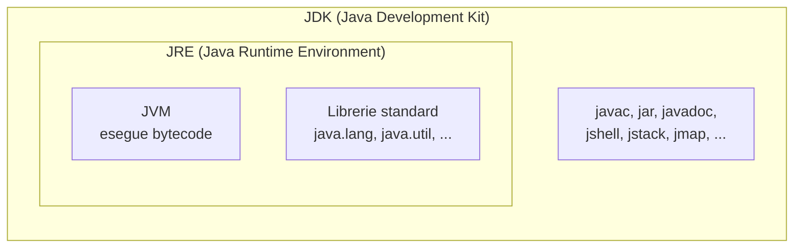
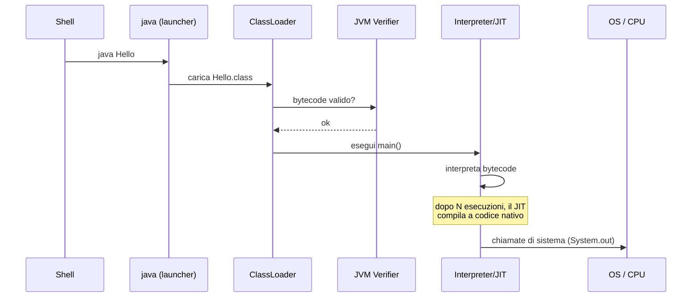

# Java: cos'è davvero, JVM/JRE/JDK, primo programma

## Java come linguaggio e come piattaforma

"Java" è due cose insieme:

1. **Il linguaggio Java**: una sintassi (`class`, `if`, `for`, `int`, `String`, ...).
2. **La piattaforma Java**: un ecosistema fatto da JVM, librerie standard, strumenti.

Quando dici "scrivo in Java" stai scrivendo nel linguaggio. Quando dici "gira su Java" intendi la piattaforma — cioè la **JVM**, che può eseguire anche altri linguaggi (Kotlin, Scala, Groovy, Clojure, ...).

### Caratteristiche fondamentali del linguaggio

- **Tipato staticamente**: ogni variabile ha un tipo dichiarato a compile-time. `int x = 3;` funziona, `x = "ciao";` non compila.
- **Orientato agli oggetti**: tutto vive dentro classi (più o meno; ci sono primitivi e static, vedremo). Eredità singola, interfacce multiple.
- **Compilato a bytecode, interpretato/JITtato a runtime**: il `.java` diventa `.class` (bytecode), che la JVM esegue.
- **Garbage Collected**: non devi liberare la memoria a mano (niente `free()` o `delete`).
- **"Write once, run anywhere"**: lo stesso `.class` gira su Windows/Linux/Mac/AIX/zOS — perché ogni piattaforma ha la sua JVM.

## JVM, JRE, JDK: la differenza che tutti confondono



- **JVM (Java Virtual Machine)**: il programma C++ che legge e *esegue* i `.class`. Da sola non basta a sviluppare.
- **JRE (Java Runtime Environment)** = JVM + librerie standard. Serve a *eseguire* programmi Java, non a compilarli. Dal Java 11 non viene più distribuita come pacchetto separato.
- **JDK (Java Development Kit)** = JRE + strumenti per sviluppare (`javac` = compilatore, `jar`, `javadoc`, `jshell`, `jdb`, debugger, profiler, ...).

> **Quale installare?** Tu installi sempre **il JDK**. Punto. Anche se fai solo "girare" applicazioni, oggi conviene il JDK.

### Distribuzioni del JDK

Lo stesso codice OpenJDK è distribuito da vari fornitori, tutti compatibili:

| Distribuzione | Chi la fa | Note |
|---|---|---|
| **Eclipse Temurin** | Eclipse Foundation (Adoptium) | Default consigliato. Gratis, certificato TCK. |
| **Oracle JDK** | Oracle | Gratis solo per uso non-commerciale dopo i 6 mesi, poi licenza a pagamento per ambienti enterprise. |
| **Bellsoft Liberica** | BellSoft | Gratis, supporto LTS lungo, varianti con JavaFX. |
| **Amazon Corretto** | Amazon | Gratis, supporto LTS Amazon. Default su AWS. |
| **Azul Zulu** | Azul Systems | Gratis (Zulu OpenJDK), supporto a pagamento (Zulu Prime). |
| **Red Hat OpenJDK** | Red Hat | Per ambienti RHEL. |

**Versioni LTS attuali (Long Term Support)**: 8, 11, 17, **21** (uscita settembre 2023). Java 25 sarà LTS nel 2025.

> **Per questo percorso**: usa **JDK 21**. È moderno e supportato a lungo. Tutti gli esempi sono testati su 21.

## Bytecode e portabilità: cosa succede quando compili

Prendiamo un sorgente `Hello.java`:

```java
public class Hello {
    public static void main(String[] args) {
        System.out.println("Ciao mondo");
    }
}
```

Lo compili:

```powershell
javac Hello.java
# crea Hello.class — bytecode neutrale rispetto alla CPU
```

`Hello.class` non è binario x86, ARM o RISC-V: è **bytecode JVM**, un set di istruzioni virtuali (es. `getstatic`, `ldc`, `invokevirtual`, `return`). Lo puoi disassemblare con `javap`:

```powershell
javap -c Hello.class
```

Output (semplificato):

```
public class Hello {
  public static void main(java.lang.String[]);
    Code:
       0: getstatic     #7    // Field java/lang/System.out
       3: ldc           #13   // String "Ciao mondo"
       5: invokevirtual #15   // Method java/io/PrintStream.println
       8: return
}
```

Quando lanci `java Hello`:



- **Class Loader** carica il `.class` in memoria.
- **Verifier** controlla che il bytecode rispetti le regole (niente salti fuori metodo, niente cast malformati, ...). Questo è perché Java è "sicuro": non puoi eseguire `.class` malformati.
- **Interpreter** esegue le istruzioni una per una.
- **JIT (Just-In-Time compiler)**: i metodi caldi vengono compilati a codice nativo per la CPU specifica, e da lì in poi vanno a velocità "C". Vedremo i dettagli in [JVM internals](15-jvm-internals.html).

## Struttura di un sorgente Java

Regole base che valgono *sempre*:

1. Un file `.java` contiene **una classe pubblica** (al massimo), con lo stesso nome del file. `Hello.java` ⟶ `public class Hello { ... }`.
2. Una classe sta in un **package**. Il package corrisponde alla cartella. `it.zth.demo.Hello` ⟶ `it/zth/demo/Hello.java`.
3. Il punto di ingresso è `public static void main(String[] args)`. Senza quello, "non è eseguibile da `java`".
4. Le istruzioni terminano con `;`.
5. Java è **case-sensitive**: `String` ≠ `string`.

### Naming conventions (rispettale: tutti lo fanno)

| Cosa | Convenzione | Esempio |
|---|---|---|
| Classi | `UpperCamelCase` | `CustomerService` |
| Metodi e variabili | `lowerCamelCase` | `getName`, `totalAmount` |
| Costanti `static final` | `SCREAMING_SNAKE_CASE` | `MAX_RETRIES` |
| Package | `tutto.minuscolo.puntato` | `it.zth.batch` |
| Interfacce | `UpperCamelCase`, spesso un sostantivo o aggettivo | `Repository`, `Runnable` |

## Hello World, spiegato riga per riga

```java
package it.zth.demo;            // (1) il "casato" del file

import java.time.LocalDateTime; // (2) importi una classe esterna

public class Hello {            // (3) dichiarazione di classe pubblica

    public static void main(String[] args) {  // (4) entry-point
        String saluto = "Ciao";               // (5) variabile locale
        System.out.println(saluto + " mondo, sono le " + LocalDateTime.now());
        //                ^---------- concatenazione di stringhe (operator +)
    }
}
```

1. **`package`**: dichiari il "casato". Deve corrispondere alla struttura cartelle. Se ometti, sei nel "default package" (sconsigliato, non si fa nei progetti veri).
2. **`import`**: porti dentro una classe da un altro package. `java.lang` è importato automaticamente.
3. **`public class Hello`**: visibilità `public` (chiunque può vederla), nome `Hello` (stesso del file).
4. **`public static void main(String[] args)`**:
   - `public` — chiamabile da fuori (la JVM la chiama).
   - `static` — non serve un'istanza di `Hello` per chiamarla.
   - `void` — non restituisce nulla.
   - `String[] args` — parametri da riga di comando.
5. **`String saluto = "Ciao"`**: dichiari una variabile, tipo `String`, valore `"Ciao"`. Le stringhe in Java sono oggetti `String`, non primitivi.

### Compila ed esegui

```powershell
# dalla cartella che contiene src/it/zth/demo/Hello.java
javac -d out src/it/zth/demo/Hello.java
java -cp out it.zth.demo.Hello
# output: Ciao mondo, sono le 2026-05-20T10:30:12.345
```

`-d out` dice "metti i .class in `out/`". `-cp out` dice "cerca i .class in `out/`".

In pratica nessuno compila a mano: usi **Maven** o **Gradle**. Ma una volta nella vita devi farlo a mano per capire cosa succede.

## Maven in 60 secondi (anteprima)

Crei una cartella, ci metti un `pom.xml` minimo:

```xml
<project xmlns="http://maven.apache.org/POM/4.0.0">
  <modelVersion>4.0.0</modelVersion>
  <groupId>it.zth</groupId>
  <artifactId>playground</artifactId>
  <version>0.1.0</version>
  <packaging>jar</packaging>
  <properties>
    <maven.compiler.source>21</maven.compiler.source>
    <maven.compiler.target>21</maven.compiler.target>
    <project.build.sourceEncoding>UTF-8</project.build.sourceEncoding>
  </properties>
</project>
```

Metti il sorgente in `src/main/java/it/zth/demo/Hello.java`. Poi:

```powershell
mvn compile
mvn exec:java -Dexec.mainClass=it.zth.demo.Hello
```

Tutti i dettagli di Maven li vediamo nella sezione sui tool. Per ora: sappi che esiste.

## Esercizi

<details>
<summary>Es 1.1 — Hello bilingue</summary>

Scrivi un programma che stampa "Ciao mondo" in italiano se l'argomento da linea di comando è `it`, "Hello world" se è `en`.

```java
public class HelloBi {
    public static void main(String[] args) {
        if (args.length == 0) {
            System.out.println("Usage: java HelloBi <it|en>");
            return;
        }
        switch (args[0]) {
            case "it" -> System.out.println("Ciao mondo");
            case "en" -> System.out.println("Hello world");
            default -> System.out.println("Lingua sconosciuta: " + args[0]);
        }
    }
}
```

Nota: `switch` "freccia" è una feature Java 14+. La vedremo bene più avanti.

</details>

<details>
<summary>Es 1.2 — Versione JVM al volo</summary>

Stampa la versione di Java in uso, il nome del sistema operativo, e l'username dell'utente.

```java
public class SysInfo {
    public static void main(String[] args) {
        System.out.println("Java:    " + System.getProperty("java.version"));
        System.out.println("OS:      " + System.getProperty("os.name") + " "
                                       + System.getProperty("os.version"));
        System.out.println("User:    " + System.getProperty("user.name"));
        System.out.println("Working: " + System.getProperty("user.dir"));
    }
}
```

`System.getProperty(...)` è la finestra sul sistema. Esistono decine di proprietà standard.

</details>

<details>
<summary>Es 1.3 — Disassembla</summary>

1. Compila `Hello.java` con `javac`.
2. Esegui `javap -c -v Hello.class > Hello.txt`.
3. Apri `Hello.txt`. Identifica:
   - L'istruzione `getstatic` che recupera `System.out`.
   - L'istruzione `ldc` che carica la stringa `"Ciao mondo"`.
   - L'istruzione `invokevirtual` che chiama `println`.

Questo è quello che la JVM esegue davvero. Le annotazioni `# 7`, `# 13`, ... sono indici nel **constant pool** della classe.

</details>

<details>
<summary>Es 1.4 — Fai crashare il classloader</summary>

1. Compila `Hello.java` in `out/`.
2. Esegui `java -cp out Hello`. Funziona.
3. Sposta `Hello.class` in `out/altro/`.
4. Riesegui `java -cp out Hello`. Cosa succede?

Risposta: `Error: Could not find or load main class Hello`. Perché? Il classloader cerca `Hello.class` nelle root del classpath, non nelle sotto-cartelle (a meno che la classe sia in un package corrispondente).

</details>

<details>
<summary>Es 1.5 — Comprendi il `public static void main`</summary>

Cosa succede se in `main` togli `static`?

```java
public class Boom {
    public void main(String[] args) {  // niente static
        System.out.println("?");
    }
}
```

Compila ma non esegue:

```
Error: Main method is not static in class Boom, please define the main method as:
   public static void main(String[] args)
```

Perché? Per chiamare un metodo *non* static la JVM dovrebbe prima creare un'istanza di `Boom` — ma non sa come (non sa quale costruttore chiamare, con quali parametri). Quindi: il `main` deve essere `static`.

</details>

## Cosa devi portarti via

- Java è linguaggio + piattaforma. La piattaforma è la **JVM**.
- **JDK = JRE + tool**, **JRE = JVM + librerie**. Installa il JDK.
- Codice Java ⟶ `.class` bytecode ⟶ JVM ⟶ JIT a codice nativo.
- Usa **JDK 21** in questo percorso.
- Un sorgente `.java`: un `package`, eventuali `import`, una classe pubblica con il nome del file, un `main` per essere eseguibile.

Prossimo passo: la sintassi vera del linguaggio — tipi, variabili, controllo di flusso, operatori.
