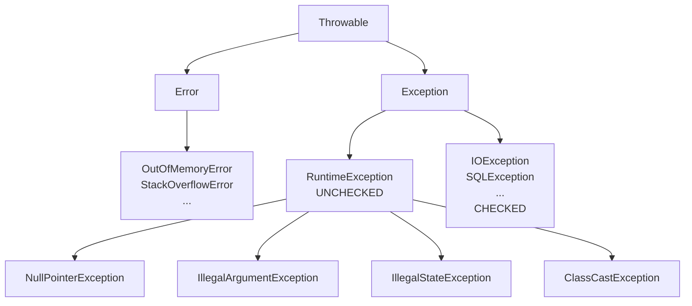

# Eccezioni: checked vs unchecked, try-with-resources, custom

## La gerarchia



- **`Throwable`** è il padre comune.
- **`Error`** = problemi gravi della JVM. Non li catturi.
- **`Exception`** = problemi recuperabili dall'app.
  - **Checked** (sotto `Exception` ma non `RuntimeException`): il compilatore obbliga a gestirle.
  - **Unchecked** (`RuntimeException` e sotto): il compilatore non obbliga, ma puoi catturarle.

## Checked vs unchecked

### Checked

Devi *o* catturarle *o* dichiararle:

```java
public void leggi(String path) throws IOException {   // dichiarata
    Files.readString(Path.of(path));
}

// oppure
public void leggi(String path) {
    try {
        Files.readString(Path.of(path));
    } catch (IOException e) {
        System.err.println("errore: " + e.getMessage());
    }
}
```

Esempi: `IOException`, `SQLException`, `ClassNotFoundException`, `InterruptedException`.

### Unchecked

Non vengono controllate dal compilatore. Tipicamente segnalano bug:

```java
String s = null;
s.length();   // NullPointerException - non serve dichiararla
```

Esempi: `NullPointerException`, `IllegalArgumentException`, `IllegalStateException`, `ArithmeticException`, `ClassCastException`, `ArrayIndexOutOfBoundsException`.

### Quando usare quale?

| Situazione | Eccezione |
|---|---|
| Bug del programmatore (parametro nullo, indice fuori range) | **Unchecked** (`IllegalArgumentException`, ...) |
| Errore prevedibile e recuperabile (file non trovato, rete giù) | Storicamente **checked**; nuove API preferiscono unchecked. |
| Stato dell'oggetto incoerente | `IllegalStateException` |

> **Trend moderno**: Spring, Hibernate, JDK moderni (NIO.2, Stream) preferiscono **unchecked**. Le checked exception "appestano" le firme. In codice nuovo, usa unchecked tranne casi specifici.

## `try / catch / finally`

```java
try {
    int x = Integer.parseInt(s);
    System.out.println(100 / x);
} catch (NumberFormatException e) {
    System.err.println("non è un numero: " + s);
} catch (ArithmeticException e) {
    System.err.println("divisione per zero");
} finally {
    System.out.println("eseguito sempre");
}
```

- Più `catch`, primo che matcha vince.
- `finally` viene eseguito *sempre* — anche se c'è `return` o se rilanci.
- L'ordine importa: il più specifico prima del più generico.

### Multi-catch

```java
try {
    ...
} catch (IOException | SQLException e) {   // alternativa
    log.error("errore: ", e);
}
```

### `try-with-resources`

Quando hai una risorsa da chiudere (`AutoCloseable`):

```java
try (BufferedReader r = Files.newBufferedReader(Path.of("x.txt"))) {
    String line;
    while ((line = r.readLine()) != null) System.out.println(line);
}
// r.close() automatico, anche in caso di eccezione
```

Più risorse:

```java
try (Connection c = ds.getConnection();
     PreparedStatement ps = c.prepareStatement("SELECT 1");
     ResultSet rs = ps.executeQuery()) {
    ...
}
// chiude in ordine inverso: rs, ps, c
```

## `throw` e `throws`

- `throw` lancia un'eccezione.
- `throws` la dichiara nella firma del metodo.

```java
public Persona trova(long id) throws NotFoundException {
    if (id < 0) throw new IllegalArgumentException("id negativo");
    Persona p = repo.findById(id);
    if (p == null) throw new NotFoundException("id " + id);
    return p;
}
```

## Stack trace e chaining

```java
try {
    leggiFile();
} catch (IOException e) {
    throw new ServiceException("impossibile leggere config", e);   // cause
}
```

La `cause` (secondo argomento) preserva l'eccezione originale nello stack trace. **Sempre** preserva la cause: senza, debugging diventa un incubo.

```
ServiceException: impossibile leggere config
    at MyService.load(MyService.java:42)
    ...
Caused by: java.nio.file.NoSuchFileException: config.yml
    at sun.nio.fs.WindowsException.translateToIOException(...)
    ...
```

## Eccezioni custom

```java
public class NotFoundException extends RuntimeException {
    public NotFoundException(String msg) { super(msg); }
    public NotFoundException(String msg, Throwable cause) { super(msg, cause); }
}
```

Convenzioni:
- Nome termina con `Exception`.
- Estendi `RuntimeException` se vuoi unchecked (di solito sì).
- Costruttori standard: stringa, stringa + cause.

Se hai dati da portare con l'eccezione:

```java
public class InsufficientBalanceException extends RuntimeException {
    private final String iban;
    private final BigDecimal richiesto;

    public InsufficientBalanceException(String iban, BigDecimal richiesto) {
        super("saldo insufficiente su " + iban + " per " + richiesto);
        this.iban = iban;
        this.richiesto = richiesto;
    }

    public String getIban() { return iban; }
    public BigDecimal getRichiesto() { return richiesto; }
}
```

## Best practice (e antipattern)

### ✅ DO

- Catch specifico, gestione esplicita.
- Preserva la cause: `throw new X(msg, e);`.
- Logga e basta: o gestisci, o rilancia. **Non** entrambi (genera log doppi).
- Usa `try-with-resources` per qualsiasi cosa con `close()`.
- Le eccezioni nel `finally` mascherano quelle del `try`: attenzione.

### ❌ DON'T

- **Catch e ignora**: `catch (Exception e) { /* ignored */ }` è un crimine.
- **`catch (Throwable e)`**: catturi anche `OutOfMemoryError`, non vuoi.
- **Usare eccezioni per controllo di flusso**: lente e illeggibili.
- **`e.printStackTrace()`** nel codice di produzione: usa un logger.
- **Wrappare e perdere la cause**: `throw new X(msg);` (manca `, e`).
- **`catch (NullPointerException e)`**: la NPE è un bug, fixalo.

### Anti-pattern classico

```java
try {
    ...
} catch (Exception e) {
    e.printStackTrace();         // logga male
    return null;                 // svuota il valore
}
```

Cosa succede? Errore mascherato, ritorno `null`, il caller crasha più tardi senza contesto. **Non farlo**.

## `NullPointerException`: il bug più frequente

`NullPointerException` (NPE) succede quando tenti di **derefereniare** un riferimento nullo:

```java
String s = null;
s.length();        // NPE
s.toString();      // NPE
List<X> l = ricerca();
for (X x : l) ...  // se l è null, NPE qui
```

Java 14+ ti dà messaggi NPE descrittivi ("Cannot invoke ... because s is null").

### Strategie

1. **Inizializza sempre**: invece di campo `null`, parti con valore di default (es. `List.of()` invece di `null`).
2. **`Optional<T>`** per "potrebbe esserci o no" (vedi sezione 10).
3. **Annotation `@NonNull`/`@Nullable`** (JetBrains, JSR-305): segnala intenzioni.
4. **Defensive check** ai *bordi* dell'API. Non spruzzare `if (x != null)` ovunque.

### Pattern "guard clause"

```java
public void send(Email e) {
    Objects.requireNonNull(e, "email");
    Objects.requireNonNull(e.getTo(), "destinatario");
    // logica
}
```

## Esercizi

<details>
<summary>Es 7.1 — Eccezione custom</summary>

Crea `InvalidCodiceFiscaleException extends IllegalArgumentException` con i campi `codice` e `motivo`. Costruisci e lancia.

```java
public class InvalidCodiceFiscaleException extends IllegalArgumentException {
    private final String codice;
    private final String motivo;

    public InvalidCodiceFiscaleException(String codice, String motivo) {
        super("CF invalido [" + codice + "]: " + motivo);
        this.codice = codice;
        this.motivo = motivo;
    }
    public String getCodice() { return codice; }
    public String getMotivo() { return motivo; }
}
```

</details>

<details>
<summary>Es 7.2 — `try-with-resources` con due risorse</summary>

Apri un file di input e uno di output, copia il contenuto.

```java
import java.io.*;
import java.nio.file.*;

public class Copia {
    public static void main(String[] args) throws IOException {
        try (BufferedReader in = Files.newBufferedReader(Path.of("in.txt"));
             BufferedWriter out = Files.newBufferedWriter(Path.of("out.txt"))) {
            String line;
            while ((line = in.readLine()) != null) {
                out.write(line);
                out.newLine();
            }
        }
    }
}
```

</details>

<details>
<summary>Es 7.3 — Chaining esplicito</summary>

Wrappa una `IOException` in una `ServiceException` mantenendo la cause. Stampa lo stack trace completo (vedrai entrambe le eccezioni).

```java
class ServiceException extends RuntimeException {
    public ServiceException(String msg, Throwable cause) { super(msg, cause); }
}

try {
    Files.readString(Path.of("nope.txt"));
} catch (IOException e) {
    ServiceException se = new ServiceException("caricamento config fallito", e);
    se.printStackTrace();   // mostra anche "Caused by: java.nio.file.NoSuchFileException..."
}
```

</details>

<details>
<summary>Es 7.4 — Identifica il bug</summary>

```java
public Connection getConn() {
    try {
        return DriverManager.getConnection(url, u, p);
    } catch (SQLException e) {
        e.printStackTrace();
        return null;
    }
}
```

Tre problemi:
1. `e.printStackTrace()` invece di logger.
2. Restituisce `null` in caso di errore: il caller crasha con NPE più tardi senza contesto.
3. Cattura troppo larga: forse vuoi distinguere "host irraggiungibile" da "user/pwd sbagliati".

Versione migliore:

```java
public Connection getConn() {
    try {
        return DriverManager.getConnection(url, u, p);
    } catch (SQLException e) {
        throw new DataAccessException("impossibile connettersi a " + url, e);
    }
}
```

</details>

<details>
<summary>Es 7.5 — `finally` con `return`</summary>

Cosa stampa?

```java
public static int test() {
    try {
        return 1;
    } finally {
        System.out.println("finally");
        return 2;
    }
}
public static void main(String[] args) {
    System.out.println(test());
}
```

Output:
```
finally
2
```

Il `return` nel `finally` **sovrascrive** quello del `try`. **Non farlo mai** in codice reale: il `finally` deve cleanup, non cambiare il valore di ritorno.

</details>

## Cosa devi portarti via

- `Error` non si cattura. `Exception` sì. `RuntimeException` è unchecked.
- Usa `try-with-resources` per ogni risorsa chiudibile.
- **Preserva la cause** quando wrappi (`new X(msg, e)`).
- Non catturare `Exception` o `Throwable` genericamente.
- Eccezioni custom: estendi `RuntimeException`, costruttori standard, dati extra come campi.
- Mai usare eccezioni per controllo di flusso normale.

Prossimo: generics (PECS, type erasure, wildcards).
