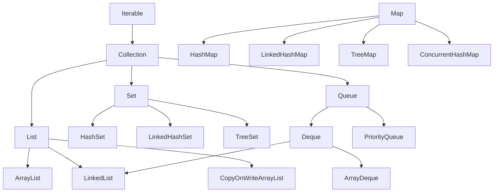

# Collections: List, Set, Map, Queue, complessità, scelta della struttura

## La gerarchia



`Map` è **fuori** dalla gerarchia `Collection` (non è una collezione di elementi singoli ma di coppie chiave-valore).

## `List`: sequenza ordinata, duplicati ammessi

### `ArrayList`

Array dinamico. Veloce per accesso indicizzato, lento per inserimenti in mezzo.

```java
List<String> list = new ArrayList<>();
list.add("a");
list.add("b");
list.add(1, "c");        // inserisci a indice 1
String x = list.get(0);
list.remove("a");
list.contains("b");
list.size();
list.isEmpty();
```

| Operazione | Complessità |
|---|---|
| `get(i)`, `set(i, x)` | O(1) |
| `add(x)` in coda | O(1) ammortizzata |
| `add(i, x)` in mezzo | O(n) |
| `remove(i)` | O(n) |
| `contains(x)` | O(n) |

### `LinkedList`

Lista doppiamente concatenata. Veloce in inserimenti in testa/coda, **lenta in get**.

| Operazione | Complessità |
|---|---|
| `get(i)`, `set(i, x)` | **O(n)** |
| `add(x)` in coda | O(1) |
| `addFirst(x)`, `removeFirst()` | O(1) |
| `contains(x)` | O(n) |

> **Regola pratica**: usa **sempre** `ArrayList`. `LinkedList` è quasi mai una buona scelta in pratica — la cache locality di un array supera quasi sempre la "teoria" della lista concatenata. Eccezione: usi pesanti come `Deque`, ma anche lì `ArrayDeque` è più veloce.

### `CopyOnWriteArrayList`

Thread-safe. Ogni modifica crea una copia interna. Ottimo per "molte letture, poche scritture" (event listeners, configurazione).

## `Set`: nessun duplicato

### `HashSet`

Backing `HashMap`. Ordine **indefinito**.

| Operazione | Complessità |
|---|---|
| `add`, `remove`, `contains` | O(1) ammortizzata |

Richiede `equals` e `hashCode` corretti sugli elementi (vedi sez. 6).

### `LinkedHashSet`

Come `HashSet` ma mantiene l'**ordine di inserimento**.

### `TreeSet`

Backing rosso-nero (BST bilanciato). Ordinato per `Comparable` (o `Comparator`).

| Operazione | Complessità |
|---|---|
| `add`, `remove`, `contains` | O(log n) |
| `first()`, `last()` | O(log n) |
| `headSet(x)`, `tailSet(x)` | O(1) per la vista |

Ti dà operazioni "navigazionali": `ceiling`, `floor`, `higher`, `lower`.

## `Map`: chiave → valore

### `HashMap`

Backing array di bucket + linked list (poi alberi quando il bucket è troppo pieno, Java 8+).

| Operazione | Complessità |
|---|---|
| `put`, `get`, `remove`, `containsKey` | O(1) ammortizzata |

```java
Map<String, Integer> m = new HashMap<>();
m.put("a", 1);
m.put("b", 2);
m.get("a");                      // 1
m.getOrDefault("z", 0);          // 0
m.put("a", m.get("a") + 1);       // pattern incrementa
m.merge("a", 1, Integer::sum);    // più elegante
m.putIfAbsent("c", 3);
for (var e : m.entrySet()) {
    System.out.println(e.getKey() + " = " + e.getValue());
}
```

### `LinkedHashMap`

Mantiene ordine di inserimento (o di accesso, se configurato — base per LRU cache).

### `TreeMap`

Ordinata per chiave. Operazioni O(log n).

### `ConcurrentHashMap`

Thread-safe, alta concorrenza. La vediamo in concurrency.

## `Queue` e `Deque`

`Queue` = coda FIFO. `Deque` = doppia, opera ai due estremi.

```java
Deque<Integer> stack = new ArrayDeque<>();
stack.push(1); stack.push(2); stack.push(3);
stack.pop();      // 3 (LIFO)

Deque<Integer> queue = new ArrayDeque<>();
queue.offer(1); queue.offer(2); queue.offer(3);
queue.poll();    // 1 (FIFO)
```

### `PriorityQueue`

Min-heap (per default, il più piccolo prima):

```java
PriorityQueue<Integer> pq = new PriorityQueue<>();
pq.offer(5); pq.offer(1); pq.offer(3);
pq.poll();    // 1
pq.poll();    // 3
pq.poll();    // 5
```

## Tabella riepilogativa: quando usare cosa

| Esigenza | Struttura |
|---|---|
| Lista ordinata, accesso casuale | `ArrayList` |
| Lista, push/pop frequente in testa | `ArrayDeque` |
| Insieme unico, no ordine | `HashSet` |
| Insieme unico, ordine inserimento | `LinkedHashSet` |
| Insieme ordinato per valore | `TreeSet` |
| Mappa chiave → valore | `HashMap` |
| Mappa ordinata (per chiave) | `TreeMap` |
| Mappa con ordine inserimento | `LinkedHashMap` |
| Mappa LRU (cache) | `LinkedHashMap(accessOrder=true)` + override `removeEldestEntry` |
| Coda FIFO | `ArrayDeque` (come `Queue`) |
| Coda con priorità | `PriorityQueue` |
| Multithreading lettore-scrittore | `ConcurrentHashMap`, `CopyOnWriteArrayList` |

## Iteratori e `ConcurrentModificationException`

```java
List<String> l = new ArrayList<>(List.of("a", "b", "c"));
for (String s : l) {
    if (s.equals("b")) l.remove(s);   // ConcurrentModificationException!
}
```

L'iteratore "fail-fast" rileva la modifica. Soluzioni:

1. **`Iterator.remove()`**:
   ```java
   var it = l.iterator();
   while (it.hasNext()) {
       if (it.next().equals("b")) it.remove();
   }
   ```
2. **`removeIf` (Java 8+)**:
   ```java
   l.removeIf(s -> s.equals("b"));
   ```
3. **Copia, itera, rimuovi**:
   ```java
   for (String s : new ArrayList<>(l)) {
       if (...) l.remove(s);
   }
   ```

## Collezioni immutabili

```java
List<String> immList = List.of("a", "b", "c");
Set<Integer>  immSet  = Set.of(1, 2, 3);
Map<String,Integer> immMap = Map.of("a", 1, "b", 2);

immList.add("d");   // UnsupportedOperationException
```

`List.copyOf(other)`, `Set.copyOf(other)`, `Map.copyOf(other)` creano copie immutabili. **Sempre** preferiscile quando passi collezioni "in lettura sola" — più sicuro e talvolta più efficiente.

> **Attenzione**: `List.of(null)` lancia NPE. Le collezioni immutabili **non ammettono null**.

## Collections utility class

```java
Collections.sort(list);
Collections.sort(list, Comparator.reverseOrder());
Collections.reverse(list);
Collections.shuffle(list);
Collections.frequency(list, "x");
Collections.min(list);
Collections.max(list);
Collections.emptyList();        // List vuota immutabile
Collections.singletonList("a"); // List immutabile con 1 elemento
Collections.unmodifiableList(l);// wrapper read-only di una List mutabile
```

## Esercizi

<details>
<summary>Es 9.1 — Conta frequenze</summary>

Conta quante volte appare ogni parola in una lista.

```java
List<String> parole = List.of("a", "b", "a", "c", "a", "b");
Map<String, Integer> count = new HashMap<>();
for (String p : parole) {
    count.merge(p, 1, Integer::sum);
}
// {a=3, b=2, c=1}
```

</details>

<details>
<summary>Es 9.2 — Top-K più frequenti</summary>

Dato un `Map<String, Integer>` di parole → frequenza, restituisci le top K.

```java
public static List<String> topK(Map<String, Integer> freq, int k) {
    return freq.entrySet().stream()
        .sorted(Map.Entry.<String,Integer>comparingByValue().reversed())
        .limit(k)
        .map(Map.Entry::getKey)
        .toList();
}
```

Vedremo gli stream meglio nella prossima sezione.

</details>

<details>
<summary>Es 9.3 — LRU cache</summary>

Implementa una semplice LRU cache di capacità N.

```java
public class LRUCache<K, V> extends LinkedHashMap<K, V> {
    private final int capacity;
    public LRUCache(int capacity) {
        super(capacity, 0.75f, true);  // accessOrder=true
        this.capacity = capacity;
    }
    @Override
    protected boolean removeEldestEntry(Map.Entry<K, V> eldest) {
        return size() > capacity;
    }
}

LRUCache<String, String> c = new LRUCache<>(2);
c.put("a", "1");
c.put("b", "2");
c.get("a");          // rinfresca "a"
c.put("c", "3");     // "b" viene espulso (più vecchio non acceduto)
System.out.println(c.keySet());  // [a, c]
```

</details>

<details>
<summary>Es 9.4 — Rimuovi duplicati preservando l'ordine</summary>

```java
List<Integer> deduped = new ArrayList<>(new LinkedHashSet<>(input));
// o con stream:
List<Integer> deduped = input.stream().distinct().toList();
```

</details>

<details>
<summary>Es 9.5 — `ConcurrentModificationException` evitato</summary>

Rimuovi tutti gli elementi che soddisfano un predicato.

```java
list.removeIf(x -> x % 2 == 0);   // semplice
```

</details>

## Cosa devi portarti via

- **`ArrayList`** quasi sempre per `List`. **`HashMap`** quasi sempre per `Map`.
- `Set` quando vuoi unicità. `TreeSet`/`TreeMap` per ordine ordinato.
- **Conosci la complessità** di ogni operazione: la scelta della struttura cambia performance di 100x.
- `removeIf` invece di iterare e modificare.
- Collezioni immutabili (`List.of`, ecc.) per parametri "in lettura sola".
- `Map.merge` per pattern "incrementa il contatore".

Prossimo: Stream API, lambda, functional interfaces, Optional.
