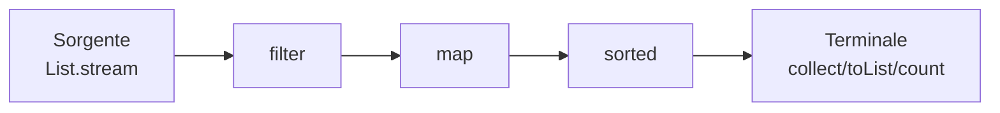

# Stream API, lambda, functional interfaces, Optional

## Lambda: blocco di codice come valore

Una **lambda** è una funzione anonima passata come valore.

```java
Runnable r = () -> System.out.println("ciao");
r.run();   // ciao

Comparator<Integer> c = (a, b) -> Integer.compare(a, b);
c.compare(2, 3);   // -1
```

Sintassi:
- `() -> espressione`
- `(x) -> espressione` o `x -> espressione`
- `(x, y) -> espressione`
- `(x) -> { istruzioni; return ... }`

### Method reference

Forma compatta di lambda:

```java
list.forEach(System.out::println);            // (x) -> System.out.println(x)
list.stream().map(String::toUpperCase);       // (s) -> s.toUpperCase()
list.stream().sorted(Integer::compare);
List<Persona> ps = nomi.stream().map(Persona::new).toList();  // costruttore
```

Tipi:
- `Classe::metodoStatico` (`Integer::parseInt`)
- `oggetto::metodoIstanza` (`System.out::println`)
- `Classe::metodoIstanza` (`String::length` — primo argomento è l'oggetto)
- `Classe::new` (costruttore)

## Functional interfaces

Sono interfacce con **un solo metodo astratto** (SAM). Una lambda implementa la SAM.

Le più importanti (`java.util.function`):

| Interfaccia | Firma | Esempio |
|---|---|---|
| `Function<T, R>` | `R apply(T)` | `s -> s.length()` |
| `BiFunction<T, U, R>` | `R apply(T, U)` | `(a, b) -> a + b` |
| `Predicate<T>` | `boolean test(T)` | `s -> s.isEmpty()` |
| `Consumer<T>` | `void accept(T)` | `System.out::println` |
| `BiConsumer<T, U>` | `void accept(T, U)` | `(k, v) -> log(k, v)` |
| `Supplier<T>` | `T get()` | `() -> new ArrayList<>()` |
| `UnaryOperator<T>` | `T apply(T)` | `i -> i * 2` |
| `BinaryOperator<T>` | `T apply(T, T)` | `Integer::sum` |
| `Runnable` | `void run()` | `() -> doStuff()` |
| `Callable<V>` | `V call() throws ...` | `() -> result()` |

Varianti per primitivi: `IntFunction`, `IntPredicate`, `ToIntFunction`, `IntUnaryOperator`, `LongConsumer`, ... per evitare boxing.

### Esempio: creare la tua

```java
@FunctionalInterface
public interface Validator<T> {
    boolean valid(T value);
    default Validator<T> and(Validator<T> other) {
        return v -> valid(v) && other.valid(v);
    }
}

Validator<String> nonVuota = s -> s != null && !s.isBlank();
Validator<String> almeno8 = s -> s.length() >= 8;
Validator<String> password = nonVuota.and(almeno8);
```

`@FunctionalInterface` è opzionale ma controlla che ci sia una sola SAM.

## Stream API

Uno **stream** è una **sequenza pipelinata di elementi**. Non sostituisce le collezioni: è una vista per elaborarle.

```java
List<Persona> persone = ...;

double mediaEtaUomini = persone.stream()
    .filter(p -> p.getSesso() == M)
    .mapToInt(Persona::getEta)
    .average()
    .orElse(0);
```

### Pipeline = sorgente + operazioni intermedie + terminale



Le operazioni intermedie sono **lazy**: non eseguono nulla finché non chiami un'operazione terminale.

### Operazioni intermedie

| Op | Cosa fa |
|---|---|
| `filter(Predicate)` | Tiene gli elementi che soddisfano il predicato |
| `map(Function)` | Trasforma ogni elemento |
| `flatMap(Function)` | Trasforma e "appiattisce" stream annidati |
| `sorted()` / `sorted(Comparator)` | Ordina |
| `distinct()` | Elimina duplicati (usa `equals`) |
| `limit(n)` | Tiene i primi n |
| `skip(n)` | Salta i primi n |
| `peek(Consumer)` | Side-effect per debug |
| `mapToInt/Long/Double` | Specializza in stream primitivi |

### Operazioni terminali

| Op | Cosa restituisce |
|---|---|
| `collect(Collector)` | `Collectors.toList()`, `.toSet()`, `.toMap(...)`, ... |
| `toList()` (Java 16+) | List immutabile |
| `forEach(Consumer)` | void |
| `count()` | long |
| `min(Cmp)`, `max(Cmp)` | `Optional<T>` |
| `findFirst()`, `findAny()` | `Optional<T>` |
| `reduce(BinaryOperator)` | `Optional<T>` o `T` |
| `anyMatch / allMatch / noneMatch` | boolean |
| `sum / average` (su `IntStream`, ecc.) | numero |

### Esempi

```java
// Lista di nomi maiuscoli, ordinati alfabeticamente
List<String> result = persone.stream()
    .map(Persona::nome)
    .map(String::toUpperCase)
    .sorted()
    .toList();

// Mappa: città → lista di persone
Map<String, List<Persona>> perCitta = persone.stream()
    .collect(Collectors.groupingBy(Persona::citta));

// Mappa: città → media età
Map<String, Double> mediaPerCitta = persone.stream()
    .collect(Collectors.groupingBy(
        Persona::citta,
        Collectors.averagingInt(Persona::eta)
    ));

// Unisci le città con virgola
String csv = persone.stream()
    .map(Persona::citta)
    .distinct()
    .sorted()
    .collect(Collectors.joining(", "));

// Trova la persona più anziana
Optional<Persona> piuAnziana = persone.stream()
    .max(Comparator.comparingInt(Persona::eta));

// Reduce: somma di età
int totaleEta = persone.stream()
    .mapToInt(Persona::eta)
    .sum();
```

### `flatMap`: stream di stream → stream piatto

```java
List<List<Integer>> nested = List.of(
    List.of(1, 2, 3),
    List.of(4, 5),
    List.of(6, 7, 8)
);
List<Integer> piatto = nested.stream()
    .flatMap(List::stream)
    .toList();
// [1, 2, 3, 4, 5, 6, 7, 8]
```

### Stream paralleli

```java
long count = bigList.parallelStream()
    .filter(predicato)
    .count();
```

Usa fork-join pool comune. **Non sempre più veloce**: per operazioni leggere e dataset piccoli, l'overhead di splitting domina. Bench prima di adottare.

> **Attenzione**: gli stream paralleli condividono il pool comune con tutto il resto dell'app (incluso Spring). Per task lunghi/CPU-intensive, considera un pool dedicato.

## Trappole degli stream

1. **Stream consumati una sola volta**:
   ```java
   Stream<X> s = ...;
   s.count();
   s.toList();   // IllegalStateException
   ```
2. **Side-effects in map/filter**: pessima pratica. `peek` solo per debug.
3. **Stato condiviso nei parallel stream**: race condition garantita.
4. **`Collectors.toMap` con chiavi duplicate**: lancia `IllegalStateException`. Usa la versione con merger:
   ```java
   .collect(Collectors.toMap(k -> k.id, k -> k, (a, b) -> a));
   ```

## `Optional<T>`: alternativa a `null`

```java
Optional<User> u = repo.find(42);
if (u.isPresent()) {
    System.out.println(u.get().getName());
}

// più idiomatico:
u.ifPresent(user -> System.out.println(user.getName()));

// trasforma
String name = u.map(User::getName).orElse("anonimo");

// se assente, eccezione
User user = u.orElseThrow(() -> new NotFoundException("user 42"));
```

### Regole d'oro

- **Non usare `Optional` come parametro di metodo o campo**. Usalo come **return type** di metodi che potrebbero non trovare il risultato.
- Mai `optional.get()` senza prima `isPresent()` (lancia se vuoto). Preferisci `orElse`, `orElseThrow`, `ifPresent`.
- Mai `Optional<List<X>>`: restituisci `List<X>` vuota.

## Esercizi

<details>
<summary>Es 10.1 — Filtra e trasforma</summary>

Da una `List<Persona>`, ottieni i nomi degli adulti in maiuscolo, ordinati.

```java
List<String> r = persone.stream()
    .filter(p -> p.getEta() >= 18)
    .map(Persona::getNome)
    .map(String::toUpperCase)
    .sorted()
    .toList();
```

</details>

<details>
<summary>Es 10.2 — Group by + count</summary>

Conta quante persone ci sono per ogni città.

```java
Map<String, Long> count = persone.stream()
    .collect(Collectors.groupingBy(Persona::citta, Collectors.counting()));
```

</details>

<details>
<summary>Es 10.3 — Stream da file</summary>

Conta le righe non vuote di un file.

```java
try (Stream<String> lines = Files.lines(Path.of("data.txt"))) {
    long n = lines.filter(s -> !s.isBlank()).count();
    System.out.println(n);
}
```

`Files.lines` ritorna uno stream "lazy" — richiede `try-with-resources`.

</details>

<details>
<summary>Es 10.4 — Optional chaining</summary>

```java
public record Order(Optional<Customer> customer) {}
public record Customer(Optional<Address> address) {}
public record Address(String city) {}

String city = order
    .flatMap(Order::customer)
    .flatMap(Customer::address)
    .map(Address::city)
    .orElse("sconosciuta");
```

`flatMap` per concatenare `Optional`. (`map` con `Optional` darebbe `Optional<Optional<...>>`.)

</details>

<details>
<summary>Es 10.5 — Custom collector</summary>

Costruisci un collector che concatena le stringhe alternando virgole e punti.

```java
String result = Stream.of("a", "b", "c", "d")
    .collect(Collectors.joining(", "));
// "a, b, c, d"
```

Vedi `Collectors.joining(", ", "[", "]")` per prefisso/suffisso.

</details>

## Cosa devi portarti via

- **Lambda** = funzione anonima. **Method reference** la rende più compatta.
- **Stream**: pipeline lazy, intermedie + terminale.
- `filter`, `map`, `flatMap`, `collect(groupingBy/toList/joining)`, `reduce`.
- `Optional` solo come **return type** quando il valore può mancare. Mai come campo o parametro.
- Stream paralleli: utili ma da bench. Mai con stato condiviso.

Prossimo: I/O e NIO.2.
