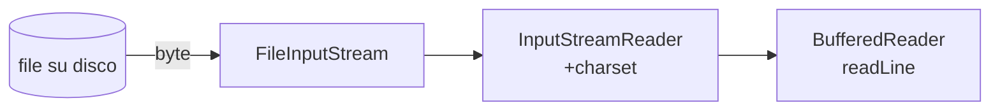

# I/O e NIO.2: File, Path, channels, buffer

## Due API, una stessa cosa

Java ha due famiglie I/O:

- **`java.io`** (originaria, Java 1.0): `File`, `FileInputStream`, `BufferedReader`, ...
- **`java.nio.file`** (Java 7+): `Path`, `Files`, `Channels`, ...

**Per file**: usa **sempre NIO.2** (`java.nio.file`). Più potente, più moderno, gestisce simboliche e attributi.

## Stream byte vs Reader/Writer

- `InputStream`/`OutputStream` = byte. Per file binari (immagini, archivi, dati raw).
- `Reader`/`Writer` = caratteri. Per file di testo (con charset).



`BufferedReader` aggiunge un buffer in memoria (più veloce).

## `Path` e `Files`

```java
Path p = Path.of("data", "config.yml");        // relative
Path abs = p.toAbsolutePath();
Path home = Path.of(System.getProperty("user.home"));

Files.exists(p);
Files.isDirectory(p);
Files.isRegularFile(p);
Files.size(p);                                 // bytes
Files.getLastModifiedTime(p);
```

### Leggere

```java
String contenuto = Files.readString(p, StandardCharsets.UTF_8);
List<String> righe = Files.readAllLines(p, StandardCharsets.UTF_8);
byte[] bytes = Files.readAllBytes(p);
```

Per file grandi, **streaming**:

```java
try (Stream<String> lines = Files.lines(p, StandardCharsets.UTF_8)) {
    lines.filter(s -> !s.isBlank()).forEach(System.out::println);
}
```

`Files.lines` apre un lazy stream; richiede `try-with-resources`.

### Scrivere

```java
Files.writeString(p, "ciao", StandardCharsets.UTF_8);
Files.write(p, List.of("riga 1", "riga 2"), StandardCharsets.UTF_8);
Files.write(p, "x\n".getBytes(UTF_8),
    StandardOpenOption.APPEND, StandardOpenOption.CREATE);
```

### Buffered I/O

Per controllo fine:

```java
try (BufferedReader r = Files.newBufferedReader(p, UTF_8);
     BufferedWriter w = Files.newBufferedWriter(out, UTF_8)) {
    String line;
    while ((line = r.readLine()) != null) {
        w.write(line.toUpperCase());
        w.newLine();
    }
}
```

### Copy, move, delete

```java
Files.copy(src, dst, StandardCopyOption.REPLACE_EXISTING);
Files.move(src, dst, StandardCopyOption.ATOMIC_MOVE);
Files.delete(p);
Files.deleteIfExists(p);
```

### Creazione directory

```java
Files.createDirectory(dir);
Files.createDirectories(deep);   // ricorsivo
```

### Walk: visita ricorsiva

```java
try (Stream<Path> s = Files.walk(root)) {
    s.filter(Files::isRegularFile)
     .filter(p -> p.toString().endsWith(".java"))
     .forEach(System.out::println);
}
```

Oppure `Files.find(root, depth, BiPredicate)` per filtri sul nome+attributi.

### Watching

```java
WatchService ws = FileSystems.getDefault().newWatchService();
dir.register(ws, StandardWatchEventKinds.ENTRY_MODIFY,
                 StandardWatchEventKinds.ENTRY_CREATE,
                 StandardWatchEventKinds.ENTRY_DELETE);

while (true) {
    WatchKey key = ws.take();
    for (WatchEvent<?> e : key.pollEvents()) {
        System.out.println(e.kind() + ": " + e.context());
    }
    key.reset();
}
```

## Charset: NON usare la default

```java
// MALE: dipende dalla piattaforma
Files.readString(p);

// BENE:
Files.readString(p, StandardCharsets.UTF_8);
```

Specifica sempre la charset. Di default, su Windows ITA è `windows-1252`, su Linux `UTF-8`: differenze garantite.

## File binari

Per file binari grandi usi `FileChannel` con `ByteBuffer`:

```java
try (FileChannel fc = FileChannel.open(p, StandardOpenOption.READ)) {
    ByteBuffer buf = ByteBuffer.allocate(4096);
    while (fc.read(buf) != -1) {
        buf.flip();
        // consuma buf
        buf.clear();
    }
}
```

Per la maggior parte dei casi `Files.readAllBytes(p)` è sufficiente.

## `Properties`, `Yaml`, JSON

Per configurazioni:

```java
Properties props = new Properties();
try (InputStream is = Files.newInputStream(Path.of("app.properties"))) {
    props.load(is);
}
String host = props.getProperty("db.host", "localhost");
```

In Spring Boot la configurazione è gestita per te (YAML/properties).

Per JSON: usa **Jackson** (`com.fasterxml.jackson`):

```java
ObjectMapper m = new ObjectMapper();
Persona p = m.readValue(Path.of("p.json").toFile(), Persona.class);
String s = m.writerWithDefaultPrettyPrinter().writeValueAsString(p);
```

## Esercizi

<details>
<summary>Es 11.1 — Word count su file</summary>

```java
try (Stream<String> lines = Files.lines(Path.of("text.txt"), UTF_8)) {
    long words = lines.flatMap(l -> Arrays.stream(l.split("\\s+")))
                      .filter(s -> !s.isBlank())
                      .count();
    System.out.println(words);
}
```

</details>

<details>
<summary>Es 11.2 — Trova tutti i .log nelle ultime 24h</summary>

```java
Instant cutoff = Instant.now().minus(24, ChronoUnit.HOURS);
try (Stream<Path> s = Files.walk(root)) {
    s.filter(Files::isRegularFile)
     .filter(p -> p.toString().endsWith(".log"))
     .filter(p -> {
         try {
             return Files.getLastModifiedTime(p).toInstant().isAfter(cutoff);
         } catch (IOException e) { return false; }
     })
     .forEach(System.out::println);
}
```

</details>

<details>
<summary>Es 11.3 — Copia con controllo</summary>

Copia un file solo se la destinazione non esiste, altrimenti errore.

```java
try {
    Files.copy(src, dst);  // no REPLACE_EXISTING
} catch (FileAlreadyExistsException e) {
    System.err.println("destinazione esiste: " + dst);
}
```

</details>

<details>
<summary>Es 11.4 — Append a un log</summary>

```java
Files.writeString(Path.of("app.log"), "[" + LocalDateTime.now() + "] start\n",
    UTF_8, StandardOpenOption.CREATE, StandardOpenOption.APPEND);
```

</details>

## Cosa devi portarti via

- Usa **NIO.2** (`Path`, `Files`). Lascia `java.io.File` a codice legacy.
- **Sempre** specifica la **charset** (`StandardCharsets.UTF_8`).
- `Files.lines` + `try-with-resources` per file grandi.
- Per JSON usa **Jackson**.
- `Files.walk` per esplorare directory ricorsivamente.

Prossimo: concorrenza (thread, sincronizzazione, volatile).
