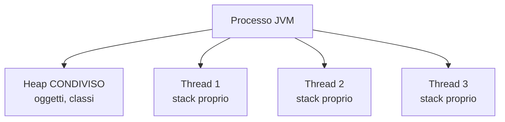

# Concurrency I — Thread, sincronizzazione, volatile, JMM

## Cos'è un thread

Un **thread** è un'unità di esecuzione dentro un processo. Più thread condividono memoria (heap, classi caricate), ognuno ha il proprio stack.



Java espone i thread del sistema operativo (con eccezione dei **virtual threads** Java 21, vedremo).

## Creare un thread

```java
// 1) classe che estende Thread (raro, scoraggiato)
class MioThread extends Thread {
    public void run() { System.out.println("ciao"); }
}
new MioThread().start();

// 2) Runnable
Runnable r = () -> System.out.println("ciao");
new Thread(r).start();

// 3) lambda direttamente
new Thread(() -> System.out.println("ciao")).start();
```

`start()` lancia il nuovo thread. `run()` lo eseguirebbe nel thread corrente (sbagliato).

### Ciclo di vita

`NEW → RUNNABLE → (BLOCKED/WAITING/TIMED_WAITING) → TERMINATED`

```java
Thread t = new Thread(...);
t.start();          // RUNNABLE
t.join();           // aspetta che finisca
t.getState();       // TERMINATED
```

## Race condition

```java
class Contatore {
    int n = 0;
    void inc() { n++; }
}

Contatore c = new Contatore();
List<Thread> ts = new ArrayList<>();
for (int i = 0; i < 10; i++) {
    Thread t = new Thread(() -> {
        for (int j = 0; j < 10_000; j++) c.inc();
    });
    ts.add(t); t.start();
}
for (Thread t : ts) t.join();
System.out.println(c.n);   // ~93000, NON 100000
```

`n++` non è atomico: è "leggi n, somma 1, scrivi n". Due thread possono leggere lo stesso valore e scriverlo: perdi un incremento.

## `synchronized`: mutex implicito

```java
class Contatore {
    int n = 0;
    synchronized void inc() { n++; }
}
```

Solo un thread alla volta può entrare in `inc()`. Il **monitor** è l'oggetto stesso (`this` per metodi di istanza, `Contatore.class` per static).

### Block

```java
synchronized (lock) {
    // codice protetto
}
```

Best practice: usa un oggetto **dedicato** come lock (`private final Object LOCK = new Object();`), non `this`. Più sicuro.

### Costo

Synchronized è veloce, ma sempre più costoso di un accesso non sincronizzato. Per contatori semplici, vedi `AtomicInteger`.

## `volatile`: visibilità tra thread

```java
class Worker {
    private volatile boolean running = true;
    void stop() { running = false; }
    void loop() {
        while (running) { /* ... */ }
    }
}
```

Senza `volatile`, il thread che esegue `loop()` potrebbe **non vedere mai** la scritta `running = false` (JIT può cachare in registro/L1). `volatile` garantisce:

- **Visibilità**: tutte le scritture sono viste da tutti i thread.
- **Niente riordino**: il compilatore non può spostare oltre la barriera.

**`volatile` NON è atomico per operazioni composite**. `volatile int n; n++;` non è thread-safe.

## Java Memory Model (JMM) in 10 minuti

Il JMM definisce **cosa garantisce la JVM** sull'ordine in cui le scritture di un thread sono visibili a un altro.

Default: **niente**. Senza sincronizzazione, due thread possono vedere ordini diversi delle operazioni.

Garanzie offerte da:
- `synchronized` (entry/exit del monitor)
- `volatile` (read/write)
- `Lock` (`lock/unlock`)
- `AtomicXxx` (operazioni atomiche)
- thread `start()`/`join()` (happens-before)
- `final` campi (dopo costruzione)

> Se il tuo codice multi-thread "funziona ma non sai perché", probabilmente è fortunato. Studia il JMM o usa primitive di alto livello (`java.util.concurrent`).

## Deadlock

Due thread, due lock, ognuno tiene uno e aspetta l'altro:

```java
Object A = new Object();
Object B = new Object();

// thread 1
synchronized (A) {
    synchronized (B) { ... }
}
// thread 2
synchronized (B) {
    synchronized (A) { ... }   // DEADLOCK
}
```

**Prevenzione**:
1. Acquisisci sempre i lock nello **stesso ordine** in tutto il programma.
2. Usa `tryLock(timeout)` invece di `synchronized` quando rischi deadlock.
3. Minimizza la durata del lock (calcoli fuori dal blocco).

Diagnostica: `jstack <pid>` mostra "Found one Java-level deadlock".

## `wait/notify`: pattern produttore-consumatore (vecchia scuola)

```java
class Coda {
    private final Queue<Integer> q = new LinkedList<>();
    private final int max;
    public Coda(int max) { this.max = max; }

    public synchronized void put(int v) throws InterruptedException {
        while (q.size() == max) wait();
        q.add(v);
        notifyAll();
    }
    public synchronized int take() throws InterruptedException {
        while (q.isEmpty()) wait();
        int v = q.poll();
        notifyAll();
        return v;
    }
}
```

Punti chiave:
- `wait()` rilascia il monitor e mette il thread in attesa.
- `notify()`/`notifyAll()` svegliano i thread in attesa.
- **Sempre** in un `while`, mai in `if` (spurious wakeup).

> **In codice nuovo, usa `BlockingQueue`** (sez. 14). `wait/notify` è da museo.

## Esercizi

<details>
<summary>Es 12.1 — Race condition</summary>

Esegui il codice del contatore non sincronizzato e annota il valore finale. Confronta con la versione `synchronized`.

</details>

<details>
<summary>Es 12.2 — Stop con volatile</summary>

Lancia un thread con un loop `while (running)`. Da un altro thread, dopo 1 secondo, setta `running = false`. Verifica che funziona solo se `running` è `volatile`.

</details>

<details>
<summary>Es 12.3 — Deadlock voluto</summary>

Scrivi un programma che va in deadlock. Lancia `jstack <pid>` e osserva il messaggio.

```java
public class Deadlock {
    static Object A = new Object();
    static Object B = new Object();

    public static void main(String[] a) {
        new Thread(() -> {
            synchronized (A) {
                try { Thread.sleep(100); } catch (Exception e) {}
                synchronized (B) { System.out.println("t1"); }
            }
        }).start();
        new Thread(() -> {
            synchronized (B) {
                try { Thread.sleep(100); } catch (Exception e) {}
                synchronized (A) { System.out.println("t2"); }
            }
        }).start();
    }
}
```

</details>

## Cosa devi portarti via

- `Thread` + `Runnable` + lambda per il base. `start()` lancia, `run()` no.
- Race condition: `n++` non è atomico. Sincronizza o usa `Atomic*`.
- `synchronized` per mutex implicito. Lock dedicato meglio di `this`.
- `volatile` per visibilità, NON per atomicità.
- Deadlock: acquisisci sempre i lock nello stesso ordine.
- Per codice multi-thread: preferisci API di alto livello (sez. 13-14).

Prossimo: `ExecutorService`, `Future`, `CompletableFuture`.
