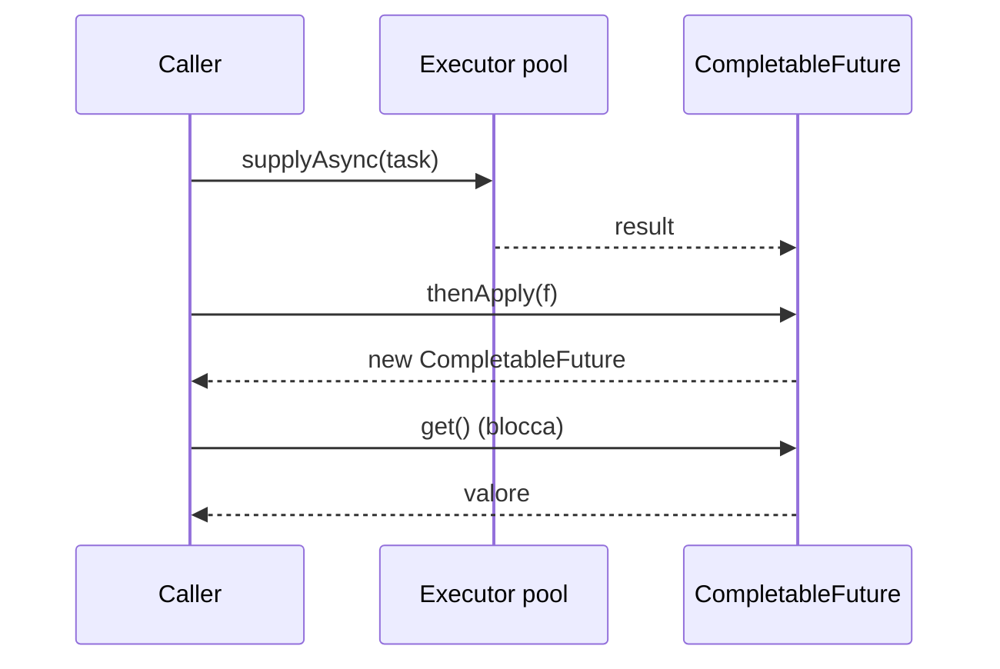

# Concurrency II — ExecutorService, Future, CompletableFuture

## Perché un pool

Creare `new Thread()` ogni volta è costoso: il sistema operativo alloca stack, registri, contesto. Un **thread pool** ricicla thread.

```java
ExecutorService ex = Executors.newFixedThreadPool(8);
ex.submit(() -> doWork());
ex.shutdown();
```

`ExecutorService` è l'interfaccia. Factory in `Executors`:

| Factory | Quando usare |
|---|---|
| `newFixedThreadPool(n)` | Pool di taglia fissa. CPU-bound a "n = numero di core". |
| `newCachedThreadPool()` | Pool elastico, crea on-demand, riusa idle. Pericoloso se i task possono esplodere. |
| `newSingleThreadExecutor()` | Un solo thread, esegue task in ordine. |
| `newScheduledThreadPool(n)` | Task schedulati nel tempo. |
| `newVirtualThreadPerTaskExecutor()` (Java 21) | Un virtual thread per task. Idoneo a I/O-bound. |

`shutdown()` dice "non accettare più task, finisci quelli in coda". `shutdownNow()` interrompe quelli in esecuzione.

## `Runnable` vs `Callable`

- `Runnable` (`void run()`) — non ritorna valore.
- `Callable<V>` (`V call() throws Exception`) — ritorna `V` o lancia.

```java
Future<Integer> f = ex.submit(() -> {
    Thread.sleep(1000);
    return 42;
});
Integer r = f.get();    // BLOCCA fino al completamento
```

### `Future`

| Metodo | Cosa fa |
|---|---|
| `get()` | Blocca, restituisce il risultato (o lancia) |
| `get(timeout, TimeUnit)` | Blocca con timeout |
| `cancel(boolean mayInterrupt)` | Annulla il task |
| `isDone()`, `isCancelled()` | Stato |

`Future` è limitato: non puoi concatenare, non puoi combinare risultati. Per quello, `CompletableFuture`.

## `CompletableFuture`: il futuro componibile

```java
CompletableFuture<Integer> cf = CompletableFuture.supplyAsync(() -> compute());

// trasforma
CompletableFuture<String> s = cf.thenApply(i -> "valore: " + i);

// concatena async
CompletableFuture<User> u = cf.thenCompose(id -> findUserAsync(id));

// side-effect
cf.thenAccept(v -> System.out.println("ricevuto " + v));

// gestione errori
cf.exceptionally(ex -> { log(ex); return -1; });

// combina due futuri
CompletableFuture<Integer> a = CompletableFuture.supplyAsync(() -> svc1());
CompletableFuture<Integer> b = CompletableFuture.supplyAsync(() -> svc2());
CompletableFuture<Integer> sum = a.thenCombine(b, Integer::sum);

// aspetta n futuri
CompletableFuture.allOf(a, b).join();

// primo che completa
CompletableFuture<Object> first = CompletableFuture.anyOf(a, b);
```

### Diagramma di flusso



### Async vs sync chaining

- `thenApply(f)` — esegue `f` nel thread che completa il CF (potrebbe essere quello chiamante).
- `thenApplyAsync(f)` — esegue `f` nel **common pool** (o nel pool passato).

> Per workflow non triviali, usa sempre `Async` con un executor tuo per evitare di intasare il common pool.

## Pattern comuni

### Parallelizzare N chiamate I/O

```java
List<CompletableFuture<Resp>> futures = ids.stream()
    .map(id -> CompletableFuture.supplyAsync(() -> client.fetch(id), pool))
    .toList();

List<Resp> results = futures.stream()
    .map(CompletableFuture::join)
    .toList();
```

### Timeout

```java
cf.orTimeout(2, TimeUnit.SECONDS)
  .exceptionally(ex -> fallback());
```

### Composizione con eccezione

```java
client.fetchAsync(id)
    .thenApply(this::process)
    .exceptionallyCompose(ex -> client.fetchBackupAsync(id))
    .thenApply(this::process);
```

## Virtual threads (Java 21)

Una rivoluzione: thread leggerissimi gestiti dalla JVM, non dal SO. Puoi crearne **milioni**.

```java
try (var ex = Executors.newVirtualThreadPerTaskExecutor()) {
    ex.submit(() -> blockingHttpCall());
}
```

Usali per **task I/O-bound** (chiamate HTTP, DB, file). Per CPU-bound, restano i pool tradizionali.

> Per Spring (3.2+) abilita `spring.threads.virtual.enabled=true` per usare virtual threads nel container Tomcat.

## Esercizi

<details>
<summary>Es 13.1 — Pool con submit</summary>

Calcola la somma dei quadrati da 1 a 1.000.000 dividendo in 4 task paralleli.

```java
ExecutorService ex = Executors.newFixedThreadPool(4);
List<Future<Long>> futs = new ArrayList<>();
int chunk = 250_000;
for (int i = 0; i < 4; i++) {
    final int from = i * chunk + 1, to = (i + 1) * chunk;
    futs.add(ex.submit(() -> {
        long s = 0;
        for (long j = from; j <= to; j++) s += j * j;
        return s;
    }));
}
long total = 0;
for (var f : futs) total += f.get();
ex.shutdown();
```

</details>

<details>
<summary>Es 13.2 — Combine async</summary>

Due chiamate finte (`sleep + return`), combina i risultati.

```java
CompletableFuture<Integer> a = CompletableFuture.supplyAsync(() -> { sleep(500); return 10; });
CompletableFuture<Integer> b = CompletableFuture.supplyAsync(() -> { sleep(300); return 20; });
int sum = a.thenCombine(b, Integer::sum).join();
```

</details>

<details>
<summary>Es 13.3 — Virtual threads</summary>

```java
try (var ex = Executors.newVirtualThreadPerTaskExecutor()) {
    for (int i = 0; i < 100_000; i++) {
        ex.submit(() -> Thread.sleep(Duration.ofSeconds(1)));
    }
}
// finisce in ~1 secondo, non in 100.000
```

</details>

## Cosa devi portarti via

- Non creare `new Thread()` ovunque: usa un pool.
- `Callable` se devi restituire; `Runnable` se no.
- `CompletableFuture` per workflow asincroni componibili.
- `thenCombine` per combinare, `allOf` per aspettare tutti, `exceptionally` per errori.
- Virtual threads (Java 21) per I/O-bound massivo.

Prossimo: lock avanzati e `java.util.concurrent` (Atomic, concurrent collections).
