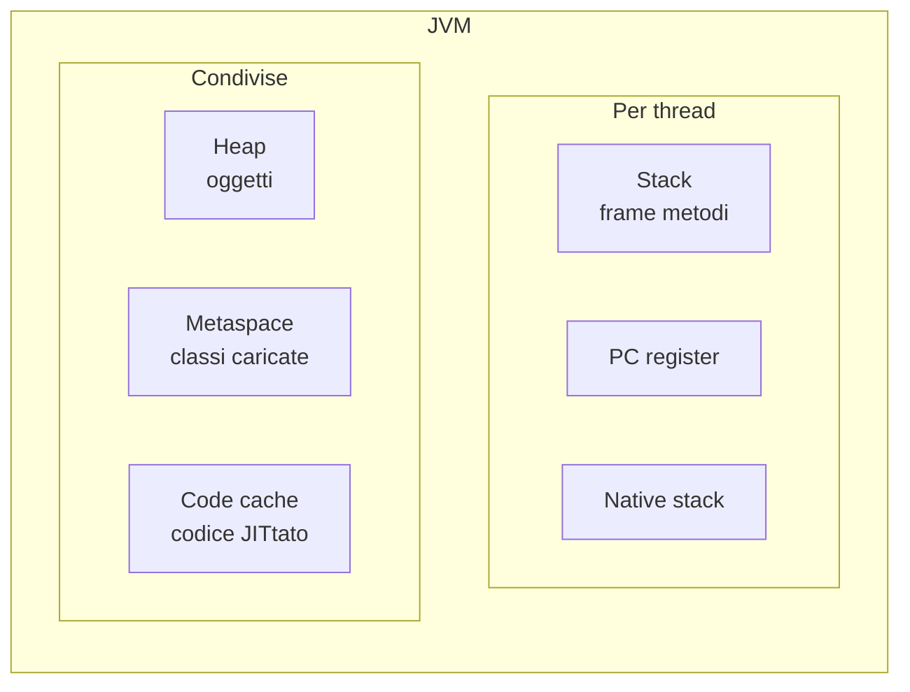
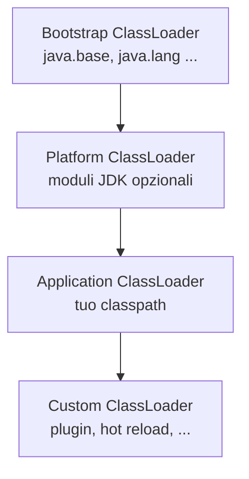
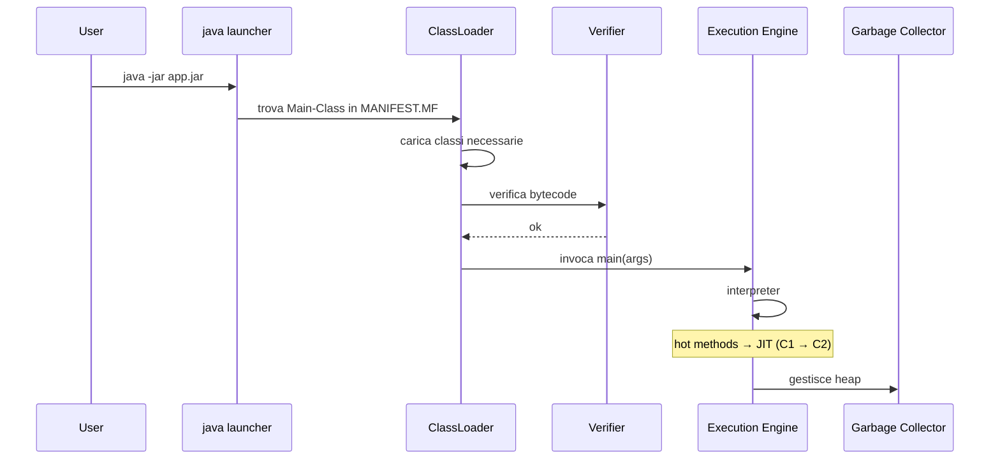

# JVM internals: classloader, bytecode, runtime data areas, JIT

## Le aree di memoria della JVM



- **Heap**: tutti gli oggetti `new ...()`. Diviso in Young (Eden + Survivor) e Old/Tenured.
- **Stack**: una pila di **frame** (uno per chiamata di metodo). Contiene variabili locali, operand stack, riferimenti. Esiste un stack per thread.
- **Metaspace**: classi, metodi, costanti. Sostituisce la vecchia "PermGen" da Java 8.
- **Code Cache**: codice nativo generato dal JIT.

### Esempio di flusso

```java
void m(int x) {
    Persona p = new Persona("Anna", x);
}
```

- `x` e `p` sono nello **stack frame** del thread.
- L'oggetto `Persona` è sull'**heap**.
- La classe `Persona` è nel **metaspace**.

## Classloader



**Parent-first delegation**: prima di caricare una classe, ogni classloader chiede al padre. Così le classi del JDK non possono essere ridefinite da utente.

Operazioni nel caricamento:
1. **Loading**: trova il `.class` e crea l'oggetto `Class`.
2. **Linking**: verifica bytecode, prepara campi statici, risolve simboli.
3. **Initialization**: esegue inizializzatori statici.

Quando? **Alla prima necessità** (uso di una classe). Le costanti `final` di tipo primitivo possono essere risolte senza inizializzare la classe.

### Vedere chi ha caricato cosa

```java
System.out.println(String.class.getClassLoader());     // null (bootstrap)
System.out.println(MyClass.class.getClassLoader());    // app classloader
```

## Bytecode

Compila `Hello.java` e disassembla:

```powershell
javac Hello.java
javap -c Hello.class
```

Esempio:

```
0: ldc           #2    // String "Ciao"
2: astore_1
3: getstatic     #3    // Field java/lang/System.out
6: aload_1
7: invokevirtual #4    // Method println
10: return
```

Istruzioni chiave:
- `aload_N`, `astore_N` — load/store reference su slot N
- `iload_N`, `istore_N` — int
- `getstatic`, `putstatic` — accesso a campi statici
- `getfield`, `putfield` — accesso a campi di istanza
- `invokevirtual` — chiamata di metodo virtuale (polimorfica)
- `invokestatic` — chiamata a metodo statico
- `invokespecial` — costruttori, `super.method()`
- `invokedynamic` — risoluzione a runtime (lambda, string concat moderno)
- `invokeinterface` — chiamata via interfaccia
- `new`, `dup`, `anewarray` — creazione oggetti/array

## Stack frame e operand stack

Ogni metodo ha:
- **Locals**: array di slot per variabili locali (compresi parametri e `this`).
- **Operand stack**: pila per i calcoli; le istruzioni leggono/scrivono qui.

```
int z = x + y;
```

Bytecode tipico:
```
iload x      // push x sulla operand stack
iload y      // push y
iadd         // pop 2, push x+y
istore z     // pop e mettila in locals[z]
```

## JIT: dal bytecode al codice nativo

La JVM moderna (HotSpot) ha **tiered compilation**:

1. **Interpreter**: esegue bytecode lentamente.
2. **C1 (Client compiler)**: compila a codice nativo, ottimizzazioni rapide.
3. **C2 (Server compiler)**: ottimizzazioni profonde (inlining, escape analysis, ...).

Quando un metodo viene chiamato spesso ("hot"), passa al C2.

Vedi cosa il JIT decide:

```powershell
java -XX:+PrintCompilation MyApp
```

### Ottimizzazioni del JIT

- **Method inlining**: copia il corpo del metodo nel chiamante (elimina overhead).
- **Escape analysis**: se un oggetto non "fugge" dal metodo, allocazione su stack (no GC).
- **Loop unrolling**: srotola loop piccoli.
- **Dead code elimination**.
- **Speculative inlining**: assume la classe più frequente, se sbaglia "deopt".

`-XX:+PrintInlining` (con flag debug) mostra cosa viene inlineato.

## Cosa succede quando lanci `java -jar app.jar`



## Esercizi

<details>
<summary>Es 15.1 — Esplora con javap</summary>

Scrivi `Calc.java`:
```java
public class Calc {
    public static int add(int a, int b) { return a + b; }
    public static void main(String[] args) { System.out.println(add(2, 3)); }
}
```
Compila e fai `javap -c -v Calc.class`. Identifica le istruzioni `iload_0`, `iload_1`, `iadd`, `ireturn`.

</details>

<details>
<summary>Es 15.2 — PrintCompilation</summary>

Crea un loop che chiama un metodo trivial 100k volte. Lancia con `-XX:+PrintCompilation` e osserva quando viene "compilato" (vedrai `n 3 ...` per C1, `n 4 ...` per C2).

</details>

<details>
<summary>Es 15.3 — Stack overflow</summary>

Scrivi una ricorsione infinita. Quanti frame ci entrano? (Dipende da `-Xss`; default ~512KB.)

```java
public class SO {
    static int n = 0;
    public static void f() { n++; f(); }
    public static void main(String[] a) {
        try { f(); } catch (StackOverflowError e) { System.out.println(n); }
    }
}
```

</details>

## Cosa devi portarti via

- JVM = heap (oggetti) + stack per thread + metaspace (classi) + code cache (JIT).
- Classloader parent-first. Lo capisci ⟶ capisci i bug "ClassNotFoundException" e "NoClassDefFoundError".
- Bytecode è un set d'istruzioni virtuale. `javap -c` per leggerlo.
- JIT compila i metodi caldi a codice nativo via C1/C2. Per questo Java è veloce.

Prossimo: memoria e garbage collection.
