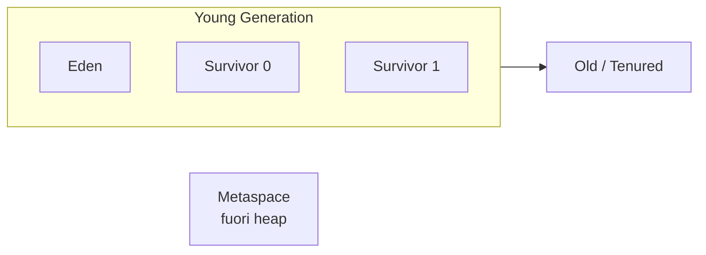

# Memoria e garbage collection

## Heap diviso in generazioni



**Hypothesis generationelle**: la maggior parte degli oggetti muore giovane. Quindi conviene visitare prima i giovani (più morti, GC più veloce).

### Ciclo di vita di un oggetto

1. `new X()` ⟶ allocato in **Eden**.
2. Eden pieno ⟶ **Minor GC**: oggetti vivi spostati in Survivor.
3. Sopravvive `n` minor GC ⟶ promosso in **Old**.
4. Old pieno ⟶ **Major GC** (Full GC): lento, ferma tutto.

## Mark-and-sweep + copying

L'algoritmo base:
1. **Mark**: parti dalle GC root (variabili locali, statici, ...) e marca tutto ciò che è raggiungibile.
2. **Sweep/copy**: ciò che non è marcato è spazzatura. Eden è copying: gli oggetti vivi vengono COPIATI nei survivor (compatta).

## GC algorithms in JDK 21

| GC | Pausa | Throughput | Memoria | Uso tipico |
|---|---|---|---|---|
| **Serial** (`-XX:+UseSerialGC`) | Alta | Media | Bassa | Piccole app, mono-core |
| **Parallel** (`-XX:+UseParallelGC`) | Alta | **Alta** | Bassa | Batch CPU-bound |
| **G1** (`-XX:+UseG1GC`) — DEFAULT | Bassa | Buona | Media | App general-purpose |
| **ZGC** (`-XX:+UseZGC`) | <1 ms | Buona | Maggiore | Latenza ultra-bassa, heap grandi |
| **Shenandoah** (`-XX:+UseShenandoahGC`) | <10 ms | Buona | Maggiore | Latenza bassa (RedHat) |

> Per la maggior parte delle app server: **G1 di default va bene**. Per richieste a bassa latenza (trading, gaming, ad-bidding) considera ZGC.

### Tuning fondamentale

```powershell
java -Xms2g -Xmx4g -XX:+UseG1GC -XX:MaxGCPauseMillis=200 -jar app.jar
```

- `-Xms`: heap iniziale (sotto cui non scende).
- `-Xmx`: heap massimo. **Sopra cui muore con OutOfMemoryError.**
- `-XX:+UseG1GC`: scegli il GC.
- `-XX:MaxGCPauseMillis`: target di pausa (G1 ci prova).

**Regola**: per server set `-Xms == -Xmx`. Evita resize del heap durante l'esecuzione.

### Monitoring

```powershell
jstat -gc <pid> 1000
# o
jcmd <pid> GC.heap_info
jcmd <pid> GC.run   # forza un Full GC (sconsigliato in prod)
```

In live: VisualVM, JConsole, Java Mission Control, oppure metriche Micrometer.

## `OutOfMemoryError`: tipi

| Tipo | Causa |
|---|---|
| `Java heap space` | Heap insufficiente per la working set |
| `GC overhead limit exceeded` | Hai passato >98% di tempo in GC con <2% di memoria liberata |
| `Metaspace` | Caricamento eccessivo di classi (es. classloader leak) |
| `Direct buffer memory` | Esaurimento di memoria off-heap (NIO) |
| `Unable to create new native thread` | Hai esaurito i thread del SO |

### Heap dump al crash

```powershell
java -XX:+HeapDumpOnOutOfMemoryError -XX:HeapDumpPath=./heap.hprof -jar app.jar
```

Analizzi `heap.hprof` con **Eclipse MAT** (memory analyzer tool): dominator tree, leak suspects, retained heap.

## Memory leaks comuni in Java

- **Collezioni dimenticate**: `static List<X>` che cresce senza limite.
- **Cache senza eviction**: usa `LinkedHashMap(accessOrder=true)` o **Caffeine**.
- **Listener non rimossi**: si tengono il vecchio oggetto vivo.
- **ThreadLocal non puliti** in thread riusati (es. tomcat).
- **Classloader leak**: ridistribuzione di webapp che lascia classloader vecchi.

## Riferimenti deboli (`WeakReference`, `SoftReference`)

```java
WeakReference<X> wr = new WeakReference<>(new X());
// quando solo wr punta a X, il GC può eliminarlo
X x = wr.get();   // potrebbe essere null
```

- `WeakReference`: GC libera al prossimo ciclo se solo deboli puntano.
- `SoftReference`: liberato solo se la JVM è sotto pressione di memoria. Usata in alcune cache.
- `PhantomReference`: usato per cleanup post-GC (raro).
- `WeakHashMap`: chiavi sono `WeakReference`. Sparite quando non più referenziate.

## Esercizi

<details>
<summary>Es 16.1 — Forza un OOM</summary>

```java
List<byte[]> chunks = new ArrayList<>();
while (true) chunks.add(new byte[10 * 1024 * 1024]);
```

Lancia con `-Xmx128m -XX:+HeapDumpOnOutOfMemoryError`. Apri l'hprof con MAT.

</details>

<details>
<summary>Es 16.2 — jstat in azione</summary>

Lancia l'app sopra. In un altro terminale:
```powershell
jps                            # trova il pid
jstat -gc <pid> 500            # snapshot ogni 500ms
```
Osserva EU (Eden used), OU (Old used), YGC (numero minor GC), FGC (full GC).

</details>

<details>
<summary>Es 16.3 — Confronta i GC</summary>

Stesso workload con `-XX:+UseParallelGC` vs `-XX:+UseG1GC` vs `-XX:+UseZGC`. Misura latenze e throughput.

</details>

## Cosa devi portarti via

- Heap è generazionale: young (allocation veloce) e old (oggetti lunghi).
- **G1 è il default** in JDK 21. ZGC per pause sub-ms.
- `-Xms == -Xmx` in server. Setta entrambi.
- `OutOfMemoryError`: dump + Eclipse MAT.
- Memory leak ⟶ tipicamente collezioni statiche o cache senza eviction.

Prossimo: profiling pratico (JFR, async-profiler, jstack, jmap).
