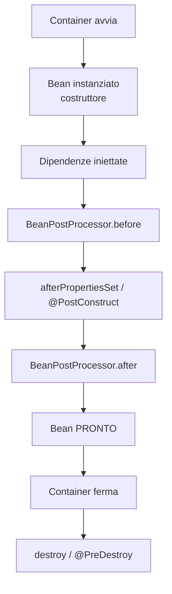

# Bean: scopes, lifecycle, BeanPostProcessor, FactoryBean

## I 6 scope di Spring

| Scope | Quante istanze |
|---|---|
| `singleton` (default) | **Una sola** per container |
| `prototype` | **Nuova ogni iniezione/getBean** |
| `request` | Una per richiesta HTTP |
| `session` | Una per sessione HTTP |
| `application` | Una per ServletContext |
| `websocket` | Una per WebSocket |

```java
@Component
@Scope("prototype")
public class TaskRunner { ... }
```

### Trappola: singleton che inietta prototype

```java
@Service                                // singleton
public class A {
    @Autowired private B b;             // prototype
}
@Component @Scope("prototype")
public class B { ... }
```

Quando A viene creato, B viene iniettato **una sola volta**. A da quel momento ha sempre lo stesso B (a dispetto dello scope). Soluzioni:

1. **`ObjectProvider<B>`**:
   ```java
   @Autowired private ObjectProvider<B> bProvider;
   public void doIt() { B b = bProvider.getObject(); /* nuovo */ }
   ```
2. **Method injection** (`@Lookup`).
3. **Proxy** sul prototype.

## Lifecycle



### Callback di inizializzazione / distruzione

```java
@Component
public class MyService {
    @PostConstruct
    public void init() {
        // dopo costruzione + iniezione, prima dell'uso
    }
    @PreDestroy
    public void close() {
        // prima della distruzione (container shutdown)
    }
}
```

Equivalente "vecchia scuola":

```java
public class MyService implements InitializingBean, DisposableBean {
    @Override public void afterPropertiesSet() { ... }
    @Override public void destroy() { ... }
}
```

Oppure nel `@Bean`:

```java
@Bean(initMethod = "init", destroyMethod = "close")
public MyService myService() { ... }
```

## BeanPostProcessor

Hook globale che vede **tutti** i bean prima/dopo l'inizializzazione:

```java
@Component
public class TimingBPP implements BeanPostProcessor {
    @Override
    public Object postProcessBeforeInitialization(Object bean, String name) {
        if (bean instanceof MyService s) {
            // intervieni
        }
        return bean;
    }
}
```

Spring usa BPP internamente per implementare `@Autowired`, `@Transactional`, AOP, ...

### BeanFactoryPostProcessor

Più "basso": opera sui **definizioni** di bean prima che vengano istanziati.

```java
@Component
public class MyBFPP implements BeanFactoryPostProcessor {
    @Override
    public void postProcessBeanFactory(ConfigurableListableBeanFactory bf) {
        BeanDefinition bd = bf.getBeanDefinition("myService");
        bd.setLazyInit(true);
    }
}
```

## `FactoryBean<T>`: factory di bean

Quando creare un bean è complesso:

```java
@Component
public class DataSourceFactoryBean implements FactoryBean<DataSource> {
    @Override
    public DataSource getObject() throws Exception {
        HikariDataSource ds = new HikariDataSource();
        // configurazione fancy
        return ds;
    }
    @Override
    public Class<?> getObjectType() { return DataSource.class; }
    @Override
    public boolean isSingleton() { return true; }
}
```

`@Autowired DataSource ds` riceverà l'oggetto creato da `getObject()`, NON la `FactoryBean`. Per ricevere la factory: `@Autowired @Qualifier("&dataSourceFactoryBean") FactoryBean<DataSource> fb;`.

## Lazy init

```java
@Component
@Lazy
public class HeavyService { ... }   // creato solo quando serve
```

Globale:
```yaml
spring.main.lazy-initialization: true
```

> Spring Boot 2.2+ supporta lazy init di default. Tempo di avvio più rapido, ma errori di config emergono solo quando il bean viene usato.

## Profili

```java
@Component
@Profile("dev")
public class InMemoryRepo implements Repo { ... }

@Component
@Profile("prod")
public class JdbcRepo implements Repo { ... }
```

Attivi con `spring.profiles.active=prod` (env, file properties, ecc.).

## Esercizi

<details>
<summary>Es 23.1 — Singleton vs prototype</summary>

Crea un `@Service` singleton che inietta un `@Scope("prototype")`. Verifica che il bean prototype iniettato è sempre lo stesso. Risolvi con `ObjectProvider`.

</details>

<details>
<summary>Es 23.2 — @PostConstruct logger</summary>

Aggiungi `@PostConstruct` per stampare "bean X pronto" su tutti i tuoi service. Lancia e osserva l'ordine.

</details>

<details>
<summary>Es 23.3 — BeanPostProcessor che misura</summary>

Implementa un BPP che logga il tempo di inizializzazione di ogni bean.

</details>

## Cosa devi portarti via

- Default scope: `singleton`. Quasi sempre quello che vuoi.
- `prototype` con cautela. `ObjectProvider` per romperlo dai singleton.
- `@PostConstruct` per init, `@PreDestroy` per cleanup.
- `BeanPostProcessor` per estensioni globali (lo usano Spring stesso e Lombok).
- `@Lazy`, `@Profile` per controllo fine.

Prossimo: configurazione (XML, Java config, profili, conditionals).
