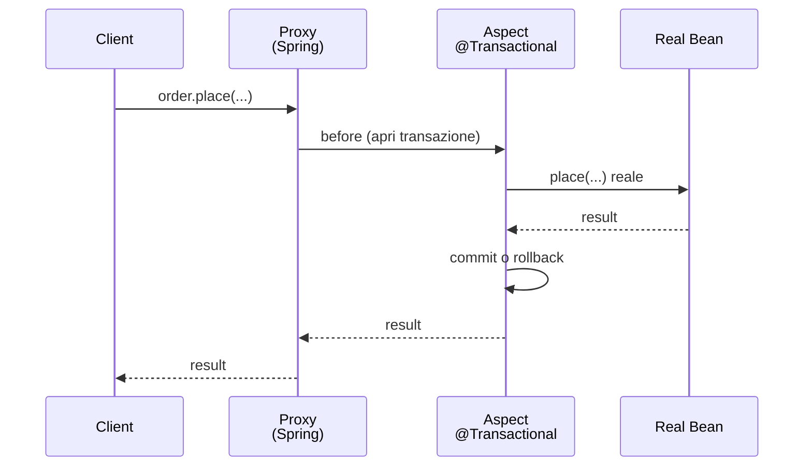

# AOP, proxy, @Transactional: cosa accade davvero

## AOP in due righe

**Aspect-Oriented Programming** ti permette di applicare comportamenti "trasversali" (logging, transazioni, sicurezza) a metodi/classi senza modificarli. Spring lo fa tramite **proxy**.

Vocabolario:
- **JoinPoint**: punto in cui interviene l'aspect (in Spring sempre l'invocazione di metodo).
- **Pointcut**: espressione che seleziona i JoinPoint.
- **Advice**: il codice da eseguire (Before / After / Around).
- **Aspect**: classe che raggruppa pointcut + advice.

## Esempio: logging del tempo

```java
@Aspect
@Component
public class TimingAspect {

    @Around("@annotation(it.zth.app.Timed)")
    public Object measure(ProceedingJoinPoint pjp) throws Throwable {
        long t0 = System.nanoTime();
        try {
            return pjp.proceed();   // chiama il metodo originale
        } finally {
            long ms = (System.nanoTime() - t0) / 1_000_000;
            System.out.println(pjp.getSignature().getName() + " took " + ms + " ms");
        }
    }
}

@Retention(RUNTIME) @Target(METHOD)
public @interface Timed {}

@Service
public class OrderService {
    @Timed
    public Order place(NewOrder n) { ... }
}
```

Spring intercetta `place(...)`, esegue l'advice prima e dopo, restituisce il risultato.

## Proxy: come fa la magia

Quando un bean ha aspetti applicati (es. `@Transactional`, `@Async`, AOP custom), Spring **non** ti dà la classe vera: ti dà un **proxy**.



### JDK dynamic proxy vs CGLIB

- **JDK proxy**: il bean implementa **un'interfaccia**, Spring crea un proxy che la implementa.
- **CGLIB**: il bean **non** implementa interfaccia, Spring crea una **sottoclasse** runtime.

Spring Boot 2.0+ default: **CGLIB sempre** (controllato via `spring.aop.proxy-target-class=true`).

Conseguenze:
- I metodi finali e privati **non possono** essere intercettati.
- Le classi `final` non possono essere proxiate (CGLIB le sottoclasses).

## `@Transactional`: l'aspetto più importante

```java
@Service
public class OrderService {
    @Transactional
    public Order place(NewOrder n) {
        // tutto qui dentro è in transazione
    }
}
```

Cosa fa il proxy:
1. Inizio: apre una transazione (chiede una `Connection` al `DataSource`, `setAutoCommit(false)`).
2. Esegue il metodo.
3. Se nessuna eccezione ⟶ **commit**.
4. Se eccezione **RuntimeException** o **Error** ⟶ **rollback**.
5. Se eccezione **checked** ⟶ **commit** (default!). Cambia con `rollbackFor`:
   ```java
   @Transactional(rollbackFor = Exception.class)
   ```

### Propagation

```java
@Transactional(propagation = Propagation.REQUIRED)    // default: usa esistente o creane una
@Transactional(propagation = Propagation.REQUIRES_NEW) // sempre nuova (sospende l'eventuale esistente)
@Transactional(propagation = Propagation.SUPPORTS)     // partecipa se c'è, altrimenti no
@Transactional(propagation = Propagation.NOT_SUPPORTED)// sospendi quella esistente
@Transactional(propagation = Propagation.NEVER)        // errore se ce n'è già una
@Transactional(propagation = Propagation.MANDATORY)    // errore se NON ce n'è una
@Transactional(propagation = Propagation.NESTED)       // savepoint dentro l'esistente
```

### Read-only

```java
@Transactional(readOnly = true)
public List<X> findAll() { ... }
```

Hibernate può ottimizzare (no dirty checking).

## Trappola: self-invocation

```java
@Service
public class A {
    @Transactional
    public void m1() { m2(); }     // m2 NON sarà transazionale!

    @Transactional(propagation = REQUIRES_NEW)
    public void m2() { ... }
}
```

`this.m2()` chiama direttamente il metodo della classe, **bypassando il proxy**. Soluzioni:

1. Inietta `A` in se stessa (con `@Autowired private A self`). Brutto.
2. Sposta `m2` in un altro bean.
3. Usa `AopContext.currentProxy()` (rumoroso).

**Lezione**: le annotazioni AOP agiscono solo quando il metodo è chiamato **attraverso il proxy** (cioè da fuori del bean).

## Altre annotazioni AOP-based di Spring

- `@Async` ⟶ esegui in thread separato (richiede `@EnableAsync`).
- `@Scheduled` ⟶ esegui a intervallo (richiede `@EnableScheduling`).
- `@Cacheable`, `@CacheEvict` ⟶ caching.
- `@Retryable` (Spring Retry).
- `@PreAuthorize`, `@Secured` (Spring Security).

Tutte funzionano con lo stesso meccanismo di proxy.

## Esercizi

<details>
<summary>Es 25.1 — Aspect di logging</summary>

Crea `@LogIt` come annotation e un aspect che logga "[IN] metodo X" prima, "[OUT] metodo X" dopo.

</details>

<details>
<summary>Es 25.2 — @Transactional + rollback</summary>

Service che dentro `@Transactional` fa 2 update + lancia `RuntimeException`. Verifica rollback. Poi con checked exception: nota che NON rolla. Aggiungi `rollbackFor`.

</details>

<details>
<summary>Es 25.3 — Self-invocation</summary>

Riproduci il bug: due metodi `@Transactional` nella stessa classe, uno chiama l'altro. Osserva che il secondo non apre nuova transazione anche con `REQUIRES_NEW`.

</details>

## Cosa devi portarti via

- Spring AOP = intercezione via proxy (CGLIB di default).
- `@Transactional` è il caso d'uso più comune.
- **Rollback** solo su RuntimeException, salvo `rollbackFor`.
- **Self-invocation bypassa il proxy**: ricordatelo sempre.
- Stesso meccanismo per `@Async`, `@Scheduled`, `@Cacheable`, `@PreAuthorize`.

Prossimo: Spring Boot — auto-configurazione, starters, actuator.
