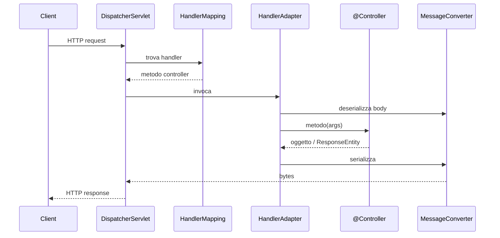

# Spring MVC: DispatcherServlet, controller, REST

## Architettura



Spring Boot starter-web configura tutto.

## `@RestController`

```java
@RestController
@RequestMapping("/api/customers")
public class CustomerController {

    private final CustomerService svc;
    public CustomerController(CustomerService svc) { this.svc = svc; }

    @GetMapping
    public List<CustomerDto> list(@RequestParam(required = false) String city) {
        return svc.list(city);
    }

    @GetMapping("/{id}")
    public CustomerDto get(@PathVariable long id) {
        return svc.get(id);
    }

    @PostMapping
    @ResponseStatus(HttpStatus.CREATED)
    public CustomerDto create(@RequestBody @Valid NewCustomerRequest req) {
        return svc.create(req);
    }

    @PutMapping("/{id}")
    public CustomerDto update(@PathVariable long id, @RequestBody @Valid UpdateRequest req) {
        return svc.update(id, req);
    }

    @DeleteMapping("/{id}")
    @ResponseStatus(HttpStatus.NO_CONTENT)
    public void delete(@PathVariable long id) {
        svc.delete(id);
    }
}
```

`@RestController` = `@Controller` + `@ResponseBody` (serializza il return in JSON via Jackson).

## Parametri

| Annotazione | Cosa lega |
|---|---|
| `@PathVariable` | Parte del path: `/users/{id}` |
| `@RequestParam` | Query string: `?city=Milano` |
| `@RequestBody` | Corpo della richiesta (JSON/XML) |
| `@RequestHeader` | Header HTTP |
| `@CookieValue` | Cookie |
| `@ModelAttribute` | Form data (binding) |
| `@AuthenticationPrincipal` | Utente autenticato (Spring Security) |

`Pageable` viene risolto automaticamente dalla query string.

## `ResponseEntity` per controllo fine

```java
@GetMapping("/{id}")
public ResponseEntity<CustomerDto> get(@PathVariable long id) {
    return svc.find(id)
        .map(ResponseEntity::ok)
        .orElse(ResponseEntity.notFound().build());
}

@PostMapping
public ResponseEntity<CustomerDto> create(@RequestBody NewCustomerRequest req) {
    CustomerDto c = svc.create(req);
    return ResponseEntity
        .created(URI.create("/api/customers/" + c.id()))
        .body(c);
}
```

## Validation

```xml
<dependency>
  <groupId>org.springframework.boot</groupId>
  <artifactId>spring-boot-starter-validation</artifactId>
</dependency>
```

```java
public record NewCustomerRequest(
    @NotBlank @Size(max = 100) String name,
    @Email String email,
    @Min(0) @Max(150) Integer age
) {}

@PostMapping
public CustomerDto create(@RequestBody @Valid NewCustomerRequest req) { ... }
```

Se la validazione fallisce, Spring lancia `MethodArgumentNotValidException` ⟶ 400.

## Exception handler globale

```java
@RestControllerAdvice
public class GlobalExceptionHandler {

    @ExceptionHandler(NotFoundException.class)
    public ResponseEntity<ErrorResponse> notFound(NotFoundException e) {
        return ResponseEntity.status(HttpStatus.NOT_FOUND)
            .body(new ErrorResponse("NOT_FOUND", e.getMessage()));
    }

    @ExceptionHandler(MethodArgumentNotValidException.class)
    public ResponseEntity<ErrorResponse> validation(MethodArgumentNotValidException e) {
        List<String> errors = e.getBindingResult().getFieldErrors().stream()
            .map(f -> f.getField() + ": " + f.getDefaultMessage())
            .toList();
        return ResponseEntity.badRequest()
            .body(new ErrorResponse("VALIDATION", String.join(", ", errors)));
    }

    @ExceptionHandler(Exception.class)
    public ResponseEntity<ErrorResponse> generic(Exception e) {
        log.error("uncaught", e);
        return ResponseEntity.internalServerError()
            .body(new ErrorResponse("INTERNAL", "errore interno"));
    }
}

public record ErrorResponse(String code, String message) {}
```

In alternative, **`ProblemDetail`** (RFC 7807, supportato da Spring 6+).

## ContentNegotiation

Cosa restituire? Spring guarda l'header `Accept` o l'estensione del path.

```java
@GetMapping(value = "/{id}", produces = MediaType.APPLICATION_JSON_VALUE)
public CustomerDto getJson(...) { ... }

@GetMapping(value = "/{id}", produces = MediaType.APPLICATION_XML_VALUE)
public CustomerDto getXml(...) { ... }
```

## Filter, Interceptor, HandlerMethodArgumentResolver

- **Filter** (Servlet API): pre/post tutto, anche prima di Spring.
- **Interceptor** (Spring): pre/post handler, conosce il metodo.
- **HandlerMethodArgumentResolver**: aggiungi un nuovo tipo iniettabile come parametro di controller.

```java
@Component
public class TimingInterceptor implements HandlerInterceptor {
    public boolean preHandle(HttpServletRequest req, HttpServletResponse res, Object handler) {
        req.setAttribute("t0", System.nanoTime());
        return true;
    }
    public void afterCompletion(HttpServletRequest req, HttpServletResponse res, Object handler, Exception e) {
        long t0 = (long) req.getAttribute("t0");
        log.info("{} {} {}ms", req.getMethod(), req.getRequestURI(), (System.nanoTime() - t0) / 1_000_000);
    }
}

@Configuration
public class WebConfig implements WebMvcConfigurer {
    @Override
    public void addInterceptors(InterceptorRegistry r) { r.addInterceptor(new TimingInterceptor()); }
}
```

## Esercizi

<details>
<summary>Es 28.1 — CRUD REST completo</summary>

Implementa CRUD per `Customer` con `@RestController`. Aggiungi validation e `@RestControllerAdvice` per gestione errori.

</details>

<details>
<summary>Es 28.2 — Paginazione + sorting via query string</summary>

`GET /customers?page=0&size=20&sort=name,asc` ⟶ `Page<CustomerDto>`.

</details>

<details>
<summary>Es 28.3 — Interceptor</summary>

Aggiungi un interceptor che logga `method path status timeMs` per ogni richiesta.

</details>

## Cosa devi portarti via

- `@RestController` per API REST.
- `@PathVariable`, `@RequestParam`, `@RequestBody`, `@Valid`.
- `ResponseEntity` per controllo fine di status code/headers.
- **Sempre** `@RestControllerAdvice` per errori uniformi.
- Validation con annotation Bean Validation.

Prossimo: best practice REST, HATEOAS, OpenAPI.
