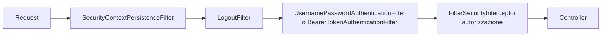

# Spring Security: filter chain, autenticazione, autorizzazione

## Cos'è Spring Security

Spring Security è una **catena di filtri Servlet** che intercetta ogni richiesta prima del controller. Risolve autenticazione, autorizzazione, protezione (CSRF, XSS headers, ...).



## Aggiungere Security

```xml
<dependency>
  <groupId>org.springframework.boot</groupId>
  <artifactId>spring-boot-starter-security</artifactId>
</dependency>
```

**Subito** ti chiede una password. La default è auto-generata e nel log (`Using generated security password: ...`).

## Configurazione (Spring Security 6+)

```java
@Configuration
@EnableWebSecurity
public class SecurityConfig {

    @Bean
    public SecurityFilterChain chain(HttpSecurity http) throws Exception {
        http
            .csrf(csrf -> csrf.disable())                  // per REST API stateless
            .authorizeHttpRequests(auth -> auth
                .requestMatchers("/api/public/**").permitAll()
                .requestMatchers("/actuator/health").permitAll()
                .requestMatchers("/api/admin/**").hasRole("ADMIN")
                .anyRequest().authenticated()
            )
            .httpBasic(Customizer.withDefaults());
        return http.build();
    }

    @Bean
    public PasswordEncoder passwordEncoder() {
        return new BCryptPasswordEncoder();
    }
}
```

## `UserDetailsService`: da dove vengono gli utenti

```java
@Service
public class JpaUserDetailsService implements UserDetailsService {

    private final UserRepository repo;
    public JpaUserDetailsService(UserRepository repo) { this.repo = repo; }

    @Override
    public UserDetails loadUserByUsername(String username) {
        var u = repo.findByEmail(username)
            .orElseThrow(() -> new UsernameNotFoundException(username));
        return User.builder()
            .username(u.getEmail())
            .password(u.getPasswordHash())      // BCrypt hash
            .roles(u.getRoles().toArray(String[]::new))
            .build();
    }
}
```

Spring confronta automaticamente la password fornita con l'hash usando il `PasswordEncoder` configurato.

## Autorizzazione

### A livello URL

Vedi `requestMatchers(...).hasRole("ADMIN")`.

### A livello metodo

```java
@EnableMethodSecurity
@Configuration
public class MethodSec {}

@Service
public class OrderService {

    @PreAuthorize("hasRole('ADMIN') or #order.customerId == authentication.principal.id")
    public Order get(Order order) { ... }
}
```

## JWT (token bearer)

JWT = JSON Web Token. Stringa firmata che il server emette al login. Il client la include in `Authorization: Bearer <token>` ad ogni richiesta successiva.

```xml
<dependency>
  <groupId>org.springframework.boot</groupId>
  <artifactId>spring-boot-starter-oauth2-resource-server</artifactId>
</dependency>
```

```yaml
spring:
  security:
    oauth2:
      resourceserver:
        jwt:
          issuer-uri: https://auth.acme.com
```

```java
http.oauth2ResourceServer(o -> o.jwt(Customizer.withDefaults()));
```

Spring valida la firma usando le chiavi pubbliche di `https://auth.acme.com/.well-known/jwks.json`.

### Emettere JWT con `JwtEncoder`

```java
@Bean
public JwtEncoder jwtEncoder(/*RSA keys*/) {
    return new NimbusJwtEncoder(new ImmutableJWKSet<>(jwkSet));
}

public String issue(String subject, Collection<String> roles) {
    JwtClaimsSet claims = JwtClaimsSet.builder()
        .issuer("https://my-app")
        .issuedAt(Instant.now())
        .expiresAt(Instant.now().plus(1, ChronoUnit.HOURS))
        .subject(subject)
        .claim("roles", roles)
        .build();
    return encoder.encode(JwtEncoderParameters.from(claims)).getTokenValue();
}
```

## OAuth2 / OpenID Connect

Per delegare login a Google, Microsoft, Keycloak, Okta, Auth0:

```xml
<dependency>
  <groupId>org.springframework.boot</groupId>
  <artifactId>spring-boot-starter-oauth2-client</artifactId>
</dependency>
```

```yaml
spring:
  security:
    oauth2:
      client:
        registration:
          google:
            client-id: ${GOOGLE_CLIENT_ID}
            client-secret: ${GOOGLE_CLIENT_SECRET}
            scope: openid,profile,email
```

```java
http.oauth2Login(Customizer.withDefaults());
```

Risultato: `/login` ha pulsante "Login with Google".

## CSRF, CORS, XSS headers

- **CSRF**: difesa contro form falsi. Per **API REST stateless** disabilita: `csrf().disable()`.
- **CORS**: vedi sez. 29.
- **Security headers**: Spring Security default abilita `X-Frame-Options`, `X-Content-Type-Options`, `Content-Security-Policy`, `Strict-Transport-Security`.

## Password hashing

```java
String hash = encoder.encode("password123");
// $2a$10$...
boolean ok = encoder.matches("password123", hash);
```

**Sempre BCrypt** (o Argon2). **Mai** SHA-256/MD5: troppo veloci, brute-forceabili.

## Esercizi

<details>
<summary>Es 31.1 — App con login form</summary>

Aggiungi Spring Security, definisci un `UserDetailsService` in-memory con 2 utenti (`user/USER`, `admin/ADMIN`). Proteggi `/admin/**` ad `ADMIN`.

</details>

<details>
<summary>Es 31.2 — JWT resource server</summary>

Configura come "resource server" con `issuer-uri` di un Keycloak/Auth0 di test. Aggiungi `@PreAuthorize` su un endpoint.

</details>

<details>
<summary>Es 31.3 — Method security</summary>

Abilita `@EnableMethodSecurity`. Aggiungi `@PreAuthorize("hasRole('ADMIN')")` su un metodo di service. Verifica che chiamarlo come utente normale ti dà 403.

</details>

## Cosa devi portarti via

- `SecurityFilterChain` bean: il modo moderno di configurare.
- `UserDetailsService` per integrare con il tuo DB.
- **BCrypt** per password.
- JWT con `oauth2-resource-server` (lato API).
- OAuth2/OIDC per login esterno.
- CSRF disabilitato per API REST stateless.

Prossimo: Spring Cloud — microservizi, config server, discovery, gateway.
