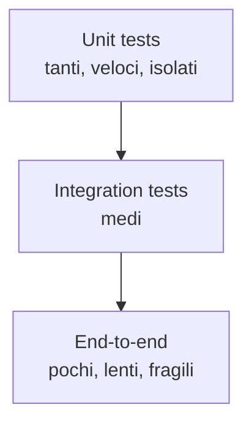

# Testing: JUnit 5, Mockito, MockMvc, Testcontainers

## La piramide dei test



**80% unit, 15% integration, 5% E2E**. Bilanciamento sensato.

## JUnit 5

```java
import org.junit.jupiter.api.*;
import static org.junit.jupiter.api.Assertions.*;
import static org.assertj.core.api.Assertions.assertThat;

class CalcTest {

    Calc calc;

    @BeforeEach void setup() { calc = new Calc(); }

    @Test
    void somma() {
        assertEquals(5, calc.add(2, 3));
        assertThat(calc.add(2, 3)).isEqualTo(5);   // AssertJ, più fluente
    }

    @Test
    void divisione_per_zero() {
        assertThrows(ArithmeticException.class, () -> calc.div(1, 0));
    }

    @ParameterizedTest
    @CsvSource({
        "1, 1, 2",
        "2, 3, 5",
        "10, 20, 30"
    })
    void parametrized(int a, int b, int expected) {
        assertThat(calc.add(a, b)).isEqualTo(expected);
    }

    @Disabled("flaky, da fixare")
    @Test
    void test_flaky() {}
}
```

Lifecycle:
- `@BeforeAll` / `@AfterAll` — una volta (statici).
- `@BeforeEach` / `@AfterEach` — prima/dopo ogni test.

## AssertJ: assertion fluide

```java
assertThat(list).hasSize(3).contains("a", "b").doesNotContain("z");
assertThat(map).containsEntry("a", 1);
assertThat(customer).hasFieldOrPropertyWithValue("name", "Anna");
```

Più leggibile di JUnit assert. Già nello `spring-boot-starter-test`.

## Mockito: mock e verify

```java
@ExtendWith(MockitoExtension.class)
class OrderServiceTest {

    @Mock CustomerRepository repo;
    @Mock PaymentGateway pay;
    @InjectMocks OrderService svc;

    @Test
    void place_order() {
        Customer c = new Customer("Anna");
        when(repo.findById(1L)).thenReturn(Optional.of(c));
        when(pay.charge(any(), any())).thenReturn("TX123");

        Order o = svc.place(1L, BigDecimal.TEN);

        assertThat(o.getTxId()).isEqualTo("TX123");
        verify(pay).charge(c, BigDecimal.TEN);
        verify(repo, never()).save(any());
    }

    @Test
    void argument_captor() {
        var captor = ArgumentCaptor.forClass(Order.class);
        svc.save(new Order(...));
        verify(repo).saveOrder(captor.capture());
        assertThat(captor.getValue().getTotal()).isEqualTo(BigDecimal.TEN);
    }
}
```

`@Mock`, `@Spy`, `@InjectMocks`, `when(...).thenReturn(...)`, `verify(...)`, `verifyNoMoreInteractions(...)`.

## Test Spring

### `@SpringBootTest` (integrazione completa)

```java
@SpringBootTest
class AppIntegrationTest {

    @Autowired CustomerService svc;

    @Test
    void create_persists() {
        var c = svc.create("Anna");
        assertThat(c.getId()).isNotNull();
    }
}
```

Carica TUTTO il contesto Spring. **Lento**: per quando vuoi test end-to-end veri.

### `@WebMvcTest` (solo MVC)

```java
@WebMvcTest(CustomerController.class)
class CustomerControllerTest {

    @Autowired MockMvc mvc;
    @MockBean CustomerService svc;

    @Test
    void get_by_id() throws Exception {
        when(svc.get(1L)).thenReturn(new CustomerDto(1L, "Anna"));

        mvc.perform(get("/api/customers/1"))
           .andExpect(status().isOk())
           .andExpect(jsonPath("$.name").value("Anna"));
    }
}
```

Carica solo Spring MVC (no JPA, no Security a meno che configurati). Veloce.

### `@DataJpaTest`

```java
@DataJpaTest
class CustomerRepositoryTest {

    @Autowired CustomerRepository repo;

    @Test
    void find_by_email() {
        repo.save(new Customer("anna@x.it"));
        var found = repo.findByEmail("anna@x.it");
        assertThat(found).isPresent();
    }
}
```

Carica solo lo strato JPA + H2 in-memory di default. Veloce.

## Testcontainers: DB reali nei test

```xml
<dependency>
  <groupId>org.testcontainers</groupId>
  <artifactId>junit-jupiter</artifactId>
  <scope>test</scope>
</dependency>
<dependency>
  <groupId>org.testcontainers</groupId>
  <artifactId>postgresql</artifactId>
  <scope>test</scope>
</dependency>
```

```java
@SpringBootTest
@Testcontainers
class IntegrationTest {

    @Container
    @ServiceConnection
    static PostgreSQLContainer<?> postgres = new PostgreSQLContainer<>("postgres:16-alpine");

    @Autowired CustomerRepository repo;

    @Test
    void real_db() {
        repo.save(new Customer("Anna"));
        assertThat(repo.findAll()).hasSize(1);
    }
}
```

`@ServiceConnection` (Spring Boot 3.1+) auto-configura il `DataSource`. Niente più stringhe di connessione.

**Lentissimo**: parte Postgres reale in Docker. Usalo per test critici (es. query native, transazioni). Per il resto, `@DataJpaTest` con H2.

## REST Assured / RestTemplate per E2E

```java
given()
    .baseUri("http://localhost:8080")
    .contentType(ContentType.JSON)
    .body("""
        {"name":"Anna"}""")
.when()
    .post("/api/customers")
.then()
    .statusCode(201)
    .body("id", notNullValue());
```

## Esercizi

<details>
<summary>Es 33.1 — Unit test con Mockito</summary>

Testa `OrderService.place(...)` mockando repository e payment gateway.

</details>

<details>
<summary>Es 33.2 — `@WebMvcTest`</summary>

Testa `CustomerController.create(...)`. Verifica che 400 venga restituito se `name` è vuoto.

</details>

<details>
<summary>Es 33.3 — Testcontainers con Postgres</summary>

Test di integrazione che salva e recupera entità su Postgres reale.

</details>

## Cosa devi portarti via

- 80% unit, 15% integration, 5% E2E.
- JUnit 5 + AssertJ. Mockito per le dipendenze.
- `@SpringBootTest` (lento, completo), `@WebMvcTest` (solo MVC), `@DataJpaTest` (solo JPA).
- **MockMvc** per testare controller senza server.
- **Testcontainers** per DB/Kafka/Redis reali in test.

Prossimo: la parte regina del percorso — Spring Batch in profondità.
