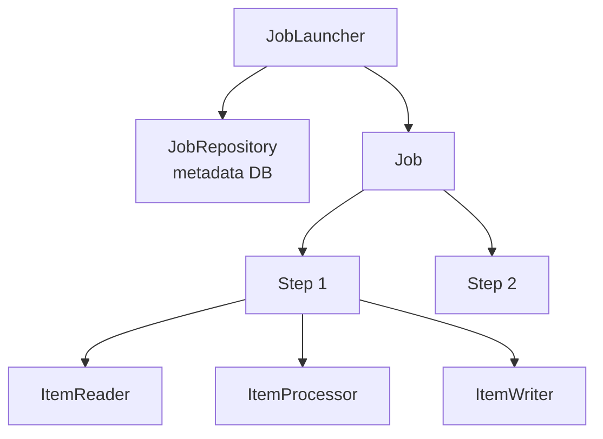
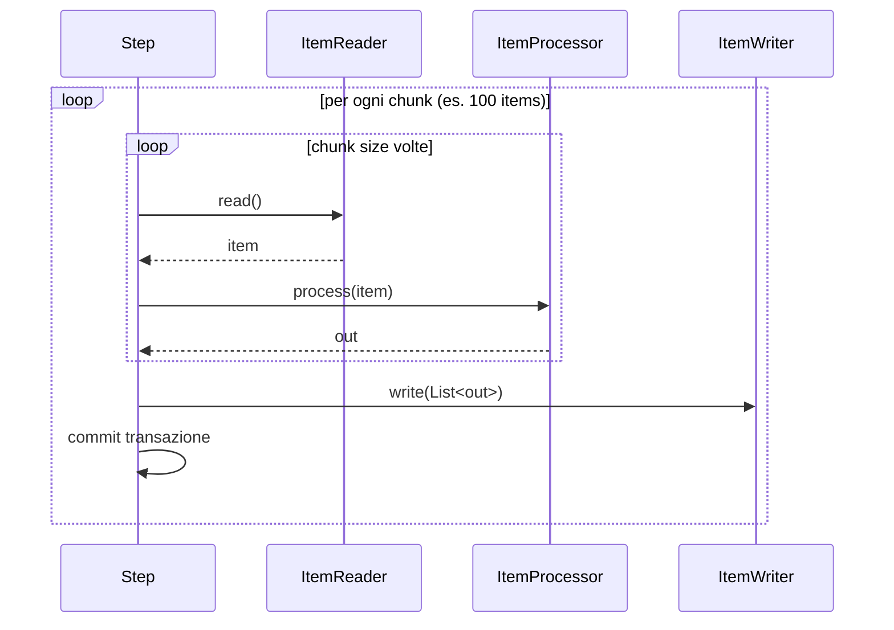

# Spring Batch intro: domain model e primo Job

## A cosa serve Spring Batch

Spring Batch è il framework standard di Java per **elaborazioni batch**: carichi di lavoro non-interattivi che processano grandi volumi di dati (migliaia/milioni/miliardi di record), tipicamente schedulati di notte.

Esempi tipici (visti nel mondo reale ENI, Intesa, Poste, ...):

- **ETL bancario**: import quotidiano dei movimenti dai sistemi sorgenti, normalizzazione, caricamento in data warehouse.
- **Riconciliazione pagamenti**: confronto tra estratto conto banca e log delle transazioni dell'app.
- **Estratti conto mensili**: generazione di milioni di PDF di estratto.
- **Risk management**: ricalcolo VaR notturno.
- **Sincronizzazione anagrafiche**: aggiornamento cliente master.
- **Fatturazione massiva**: emissione di 100.000 fatture in un job.

Cosa offre Spring Batch:

- Gestione del **chunk** (transazioni per blocco, non riga per riga).
- **Restart**: se il job crasha a metà, lo riavvi dal punto in cui era.
- **Skip / retry** di record problematici.
- **Multi-thread** e **partitioning** per scalare.
- **Metadati** persistenti su DB (job execution, step execution, stato).
- Integrazione con Spring Boot, scheduling (`@Scheduled` o esterni), monitoring.

## Domain model



| Componente | Cosa fa |
|---|---|
| **`Job`** | L'unità di esecuzione (es. "import movimenti del giorno"). Contiene N step. |
| **`Step`** | Una fase del job. Due tipi: **chunk-oriented** o **tasklet**. |
| **`ItemReader<T>`** | Legge un elemento alla volta da una sorgente (file, DB, queue). |
| **`ItemProcessor<I, O>`** | Trasforma un elemento (o filtra ritornando `null`). Opzionale. |
| **`ItemWriter<O>`** | Scrive un **chunk** di elementi (lista). |
| **`JobLauncher`** | Avvia un Job con `JobParameters`. |
| **`JobRepository`** | Persiste metadata (esecuzioni, stati, contesti). |
| **`JobExecution`** | Una specifica esecuzione di un Job. |
| **`StepExecution`** | Una specifica esecuzione di uno Step. |
| **`ExecutionContext`** | Mappa chiave/valore persistita: stato per restart. |

## Chunk-oriented step

Lo step legge **N** elementi (chunk size, es. 100), li processa, li scrive — il tutto in **una transazione**. Poi commit, e prossimo chunk.



**Perché chunk?**
- Più veloce di "transazione per riga".
- Tollerante a errore: rollback solo il chunk corrente.
- Ottimo per batch insert.

## Setup minimo (Spring Boot)

```xml
<dependency>
  <groupId>org.springframework.boot</groupId>
  <artifactId>spring-boot-starter-batch</artifactId>
</dependency>
<dependency>
  <groupId>org.springframework.boot</groupId>
  <artifactId>spring-boot-starter-data-jpa</artifactId>
</dependency>
<dependency>
  <groupId>org.postgresql</groupId>
  <artifactId>postgresql</artifactId>
</dependency>
```

```yaml
spring:
  batch:
    jdbc:
      initialize-schema: always   # crea le tabelle BATCH_JOB_*
    job:
      enabled: false              # non eseguire job all'avvio (li lanciamo a richiesta)
  datasource:
    url: jdbc:postgresql://localhost:5432/mydb
    username: postgres
    password: secret
```

`spring.batch.jdbc.initialize-schema=always` crea le ~10 tabelle di metadati (`BATCH_JOB_INSTANCE`, `BATCH_JOB_EXECUTION`, `BATCH_STEP_EXECUTION`, ...).

## Primo Job: CSV → DB

`customers.csv`:
```
id,name,email
1,Anna,anna@x.it
2,Beppe,beppe@x.it
3,Carla,carla@x.it
```

Entità:
```java
@Entity
@Table(name = "customer")
public class Customer {
    @Id Long id;
    String name;
    String email;
    // costruttori, getter, setter
}
```

Job config:
```java
@Configuration
public class CustomerImportJob {

    @Bean
    public FlatFileItemReader<Customer> reader() {
        return new FlatFileItemReaderBuilder<Customer>()
            .name("customerReader")
            .resource(new ClassPathResource("customers.csv"))
            .linesToSkip(1)                       // header
            .delimited()
            .names("id", "name", "email")
            .targetType(Customer.class)
            .build();
    }

    @Bean
    public ItemProcessor<Customer, Customer> processor() {
        return c -> {
            c.setEmail(c.getEmail().toLowerCase());
            return c;
        };
    }

    @Bean
    public JpaItemWriter<Customer> writer(EntityManagerFactory emf) {
        JpaItemWriter<Customer> w = new JpaItemWriter<>();
        w.setEntityManagerFactory(emf);
        return w;
    }

    @Bean
    public Step importStep(JobRepository jobRepo, PlatformTransactionManager tx,
                            ItemReader<Customer> reader,
                            ItemProcessor<Customer, Customer> processor,
                            ItemWriter<Customer> writer) {
        return new StepBuilder("importStep", jobRepo)
            .<Customer, Customer>chunk(100, tx)
            .reader(reader)
            .processor(processor)
            .writer(writer)
            .build();
    }

    @Bean
    public Job importJob(JobRepository jobRepo, Step importStep) {
        return new JobBuilder("importJob", jobRepo)
            .start(importStep)
            .build();
    }
}
```

## Avviare il Job

### Da CommandLineRunner

```java
@SpringBootApplication
public class App implements CommandLineRunner {

    private final JobLauncher launcher;
    private final Job importJob;

    public App(JobLauncher launcher, @Qualifier("importJob") Job importJob) {
        this.launcher = launcher;
        this.importJob = importJob;
    }

    public static void main(String[] a) { SpringApplication.run(App.class, a); }

    @Override
    public void run(String... args) throws Exception {
        JobParameters params = new JobParametersBuilder()
            .addLong("ts", System.currentTimeMillis())   // unico per ogni run
            .toJobParameters();
        launcher.run(importJob, params);
    }
}
```

`JobParameters` devono essere **unici** per ogni esecuzione del job (altrimenti Spring Batch rifiuta: pensa che sia un restart).

### Da REST endpoint

```java
@RestController
public class JobController {
    private final JobLauncher launcher;
    private final Job importJob;
    public JobController(JobLauncher launcher, @Qualifier("importJob") Job importJob) {
        this.launcher = launcher; this.importJob = importJob;
    }
    @PostMapping("/jobs/import")
    public Map<String, Object> run() throws Exception {
        var p = new JobParametersBuilder()
            .addLong("ts", System.currentTimeMillis())
            .toJobParameters();
        var exec = launcher.run(importJob, p);
        return Map.of("status", exec.getStatus(), "id", exec.getId());
    }
}
```

### Da `@Scheduled`

```java
@EnableScheduling
@Component
public class JobScheduler {
    private final JobLauncher launcher;
    private final Job importJob;
    ...

    @Scheduled(cron = "0 0 2 * * *")  // ogni notte alle 2:00
    public void nightly() throws Exception {
        var p = new JobParametersBuilder()
            .addLocalDate("date", LocalDate.now())
            .toJobParameters();
        launcher.run(importJob, p);
    }
}
```

## Verifica esito

Tabella `BATCH_JOB_EXECUTION` ti dice se il job è andato OK:

```sql
SELECT job_instance_id, status, exit_code, start_time, end_time
FROM batch_job_execution
ORDER BY start_time DESC;
```

`status`: `COMPLETED`, `FAILED`, `STOPPED`, `STARTED`, `ABANDONED`.

## ExecutionContext

Mappa persistita su `BATCH_STEP_EXECUTION_CONTEXT` e `BATCH_JOB_EXECUTION_CONTEXT`. Usata da Spring Batch per il restart (es. "ho letto fino al record 4500"), e tu puoi usarla per stato custom:

```java
@Component
@StepScope
public class MyReader implements ItemReader<X> {
    private long offset = 0;

    @BeforeStep
    public void beforeStep(StepExecution se) {
        offset = se.getExecutionContext().getLong("offset", 0);
    }

    @AfterStep
    public ExitStatus afterStep(StepExecution se) {
        se.getExecutionContext().putLong("offset", offset);
        return ExitStatus.COMPLETED;
    }
}
```

## Esercizi

<details>
<summary>Es 34.1 — Hello batch</summary>

Setup minimo. Job con un solo step "tasklet" che stampa "ciao da batch". Lancialo da `CommandLineRunner` e verifica `BATCH_JOB_EXECUTION` su H2.

</details>

<details>
<summary>Es 34.2 — Chunk CSV → DB</summary>

Implementa il job dell'esempio. Verifica che con 1000 record nel CSV ottieni 1000 nel DB.

</details>

<details>
<summary>Es 34.3 — Stato del job</summary>

Lancia il job 2 volte con stessi `JobParameters` (es. stesso `ts` fisso). Cosa succede al secondo lancio? Cambia il parametro: il job riparte.

</details>

## Cosa devi portarti via

- Spring Batch = framework per processi non-interattivi su grandi volumi.
- **Domain model**: Job → Step → Reader + Processor + Writer.
- **Chunk-oriented** (default): transazione per chunk, non per record.
- `JobParameters` unici per ogni esecuzione.
- I metadati sono **persisted** ⟶ restart, audit, monitoring gratis.

Prossimo: JobRepository e metadati in dettaglio.
