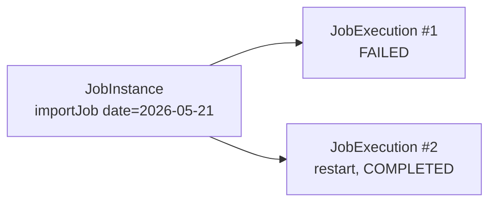

# JobRepository, JobLauncher, schema dei metadati

## Le tabelle BATCH_*

Quando attivi `spring.batch.jdbc.initialize-schema=always`, Spring crea queste tabelle:

| Tabella | Cosa contiene |
|---|---|
| `BATCH_JOB_INSTANCE` | Un'istanza logica di un job (nome + parametri identificativi). |
| `BATCH_JOB_EXECUTION` | Una esecuzione concreta. Una `JobInstance` può avere più execution (in caso di restart). |
| `BATCH_JOB_EXECUTION_PARAMS` | Parametri con cui è stata lanciata. |
| `BATCH_JOB_EXECUTION_CONTEXT` | ExecutionContext del job (serializzato). |
| `BATCH_STEP_EXECUTION` | Esecuzione di un singolo step. `read_count`, `write_count`, `commit_count`, `skip_count`, etc. |
| `BATCH_STEP_EXECUTION_CONTEXT` | ExecutionContext per step. |
| `BATCH_*_SEQ` | Sequenze per le PK. |

## JobInstance vs JobExecution



- **JobInstance** = ("nome del job" + parametri identificanti). Unica per quella combinazione.
- **JobExecution** = un tentativo. Se il primo fallisce, ne puoi avere altri (restart) sulla stessa JobInstance.

Spring Batch identifica una JobInstance dai `JobParameters` **marcati come identifying**:

```java
new JobParametersBuilder()
    .addLocalDate("businessDate", date)               // identifying = true di default
    .addString("env", "prod", false)                  // non-identifying
    .toJobParameters();
```

> Se rilanci il job con stessi parametri identifying e l'esecuzione precedente è `COMPLETED`: Spring rifiuta (`JobInstanceAlreadyCompleteException`). Se è `FAILED` o `STOPPED`: tratta come **restart**.

## JobExplorer: query sui metadati

```java
@Autowired JobExplorer jobExplorer;

// ultime esecuzioni di un job
List<JobInstance> instances = jobExplorer.getJobInstances("importJob", 0, 10);

// status di un'esecuzione
JobExecution exec = jobExplorer.getJobExecution(id);

// nomi di tutti i job conosciuti
Set<String> names = jobExplorer.getJobNames();

// esecuzioni in corso
Set<JobExecution> running = jobExplorer.findRunningJobExecutions("importJob");
```

## JobOperator: comandi runtime

```java
@Autowired JobOperator op;

op.startNextInstance("importJob");      // nuova istanza (parametri auto-incrementati)
op.restart(executionId);                 // restart di un'esecuzione fallita
op.stop(executionId);                    // ferma elegantemente
op.abandon(executionId);                 // marca come ABANDONED (recuperabile)
```

## Datasource per i metadata: separato dal business

In produzione, di solito si **separa** il datasource dei metadati Batch da quello dei dati di business: così puoi farti un truncate/restore senza toccare i log batch.

```java
@Configuration
public class BatchConfig extends DefaultBatchConfiguration {

    @Override
    @Bean
    protected DataSource getDataSource() {
        // datasource solo per le tabelle BATCH_*
        return new HikariDataSource(...);
    }
}
```

Oppure dichiari due `@Bean DataSource` e usi `@BatchDataSource`.

## Pulizia dei metadati

Le tabelle crescono per ogni esecuzione. Per evitare gigabyte:

```sql
-- elimina esecuzioni più vecchie di 90 giorni
DELETE FROM batch_step_execution_context
WHERE step_execution_id IN (
    SELECT step_execution_id FROM batch_step_execution
    WHERE start_time < NOW() - INTERVAL '90 days'
);
DELETE FROM batch_step_execution WHERE start_time < NOW() - INTERVAL '90 days';
DELETE FROM batch_job_execution_context WHERE job_execution_id IN (
    SELECT job_execution_id FROM batch_job_execution WHERE start_time < NOW() - INTERVAL '90 days'
);
DELETE FROM batch_job_execution_params WHERE job_execution_id IN (
    SELECT job_execution_id FROM batch_job_execution WHERE start_time < NOW() - INTERVAL '90 days'
);
DELETE FROM batch_job_execution WHERE start_time < NOW() - INTERVAL '90 days';
DELETE FROM batch_job_instance WHERE job_instance_id NOT IN (
    SELECT job_instance_id FROM batch_job_execution
);
```

Spring Batch ha API per "deleteJobInstance" in versioni recenti (5.x).

## Tabella di lookup veloce

```sql
SELECT
    ji.job_name,
    je.status,
    je.exit_code,
    je.start_time,
    je.end_time,
    EXTRACT(EPOCH FROM (je.end_time - je.start_time)) AS duration_seconds
FROM batch_job_execution je
JOIN batch_job_instance ji ON ji.job_instance_id = je.job_instance_id
ORDER BY je.start_time DESC
LIMIT 50;
```

## Esercizi

<details>
<summary>Es 35.1 — Esplora le tabelle</summary>

Lancia un job 3 volte (parametri diversi). Apri il DB e controlla `BATCH_JOB_INSTANCE` (3 righe), `BATCH_JOB_EXECUTION` (3 righe), `BATCH_STEP_EXECUTION` (3 righe per step).

</details>

<details>
<summary>Es 35.2 — Restart manuale</summary>

Forza un fail nel processor (es. lancia eccezione al 50° record). Il job termina FAILED. Rilanciato con **stessi** parametri: Spring continua dal punto in cui era (se il reader è restartable).

</details>

<details>
<summary>Es 35.3 — JobExplorer endpoint</summary>

Crea `GET /batch/jobs/{name}/runs` che restituisce le ultime 20 esecuzioni con status e durata.

</details>

## Cosa devi portarti via

- JobInstance = nome + parametri identifying. JobExecution = singolo tentativo.
- `JobExplorer` per query, `JobOperator` per comandi runtime.
- Separa datasource metadati da quello del business.
- Pulisci periodicamente le tabelle.

Prossimo: chunk processing in dettaglio (commit interval, skip, retry).
