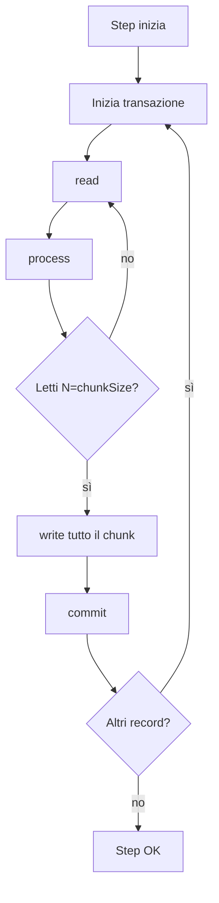

# Chunk processing in dettaglio

## Anatomia di un chunk-oriented step



Configurazione base:

```java
return new StepBuilder("step", jobRepo)
    .<In, Out>chunk(100, tx)         // chunk size = 100
    .reader(reader)
    .processor(processor)
    .writer(writer)
    .build();
```

## Dimensionare il chunk size

| Chunk size | Pro | Contro |
|---|---|---|
| 1 | Massima granularità, restart preciso | Transazioni costose, lento |
| 100-500 | Sweet spot per molti casi | — |
| 1000-5000 | Grande throughput | Rollback costoso se errore; memoria maggiore |
| 10.000+ | Per writer batch-friendly (JDBC `addBatch`) | Memoria, lock prolungati |

**Regola**: parti da 100, fai bench. Punto di equilibrio: dove la curva di throughput si appiattisce.

## Skip: tollerare errori

```java
.<In, Out>chunk(100, tx)
.reader(reader)
.processor(processor)
.writer(writer)
.faultTolerant()
.skipLimit(50)
.skip(InvalidRecordException.class)
.noSkip(SystemException.class)
```

Se `InvalidRecordException` viene lanciata nel reader/processor/writer:
- Il record viene **skippato** (loggato in `BATCH_STEP_EXECUTION.skip_count`).
- Fino a `skipLimit` skip totali nello step. Oltre, lo step fallisce.

### Cosa succede al chunk?

Spring fa un **trick** sottile: quando una eccezione skippable arriva durante la **scrittura** di un chunk, non sa quale record l'ha causata. Soluzione:
1. Rollback del chunk.
2. Ri-processa **uno alla volta**, individuando il record colpevole.
3. Skippa solo quello, ripassa gli altri.

Conseguenza: writer in modo "single-item" è più lento. **Skippa quanto basta**, non come ammortizzatore generico.

### Skip listener

```java
@Component
public class MySkipListener implements SkipListener<In, Out> {
    public void onSkipInRead(Throwable t) { log.warn("skip read: {}", t.getMessage()); }
    public void onSkipInProcess(In item, Throwable t) { log.warn("skip proc {}: {}", item, t.getMessage()); }
    public void onSkipInWrite(Out item, Throwable t) { log.warn("skip write {}: {}", item, t.getMessage()); }
}
```

Registra:
```java
.listener(new MySkipListener())
```

## Retry: errori transienti

```java
.faultTolerant()
.retryLimit(3)
.retry(TransientException.class)
.retry(DataAccessResourceFailureException.class)
```

Errore transient ⟶ Spring riprova fino a `retryLimit` volte (con backoff esponenziale se configurato).

```java
.backOffPolicy(new ExponentialBackOffPolicy() {{
    setInitialInterval(200);
    setMultiplier(2);
    setMaxInterval(5000);
}})
```

### Skip + Retry insieme

Ordine: prima retry (se errore transient passa). Poi skip (se permane).

## Cosa succede al rollback

Quando un chunk fa rollback:
- Le **scritture nel DB** sono annullate.
- Il `read_count` resta (la lettura non è transazionale).
- I record sono ri-processati al prossimo chunk.

**Conseguenza**: i side-effect del processor (es. una `System.out.println`, una mail) NON sono ritirati. Idempotenza nel processor è una virtù.

## `noRollback` (per writer specifici)

```java
.faultTolerant()
.noRollback(BusinessValidationException.class)
```

Caso: validazione "soft" che non deve invalidare l'intera transazione.

## Listener vari

```java
.listener(stepListener)         // @BeforeStep, @AfterStep
.listener(chunkListener)        // @BeforeChunk, @AfterChunk, @AfterChunkError
.listener(itemReadListener)     // @BeforeRead, @AfterRead, @OnReadError
.listener(itemProcessListener)  // @BeforeProcess, @AfterProcess, @OnProcessError
.listener(itemWriteListener)    // @BeforeWrite, @AfterWrite, @OnWriteError
.listener(skipListener)
.listener(retryListener)
```

## Pattern: invio errori a "dead letter queue"

```java
public class ErrorDlqWriter implements SkipListener<In, Out> {

    private final JdbcTemplate jdbc;

    @Override
    public void onSkipInProcess(In item, Throwable t) {
        jdbc.update(
            "INSERT INTO batch_errors(payload, error, ts) VALUES (?, ?, NOW())",
            item.toString(), t.getMessage()
        );
    }
}
```

In produzione: i record skippati vanno **archiviati** per riprocessamento manuale.

## Esercizi

<details>
<summary>Es 36.1 — Chunk size benchmark</summary>

Esegui il job dell'Es 34.2 con chunk 1, 10, 100, 1000, 10000. Misura il tempo. Trova lo sweet spot.

</details>

<details>
<summary>Es 36.2 — Skip controllato</summary>

Aggiungi al processor: lancia `InvalidRecordException` se `email` non contiene `@`. Configura `skipLimit(10)`. Verifica `BATCH_STEP_EXECUTION.skip_count`.

</details>

<details>
<summary>Es 36.3 — Retry transient</summary>

Simula un writer che fallisce 2 volte ogni 100 chiamate. Configura retry e verifica il successo.

</details>

## Cosa devi portarti via

- Chunk = unit transazionale. Dimensione: bench 100-1000.
- `.faultTolerant()` + `.skip(...)` + `.retry(...)` per gestione errori.
- Skip listener obbligatorio per audit.
- Idempotenza nel processor: il chunk può rollback.

Prossimo: tasklet, flow control (decisioni, split, conditional).
