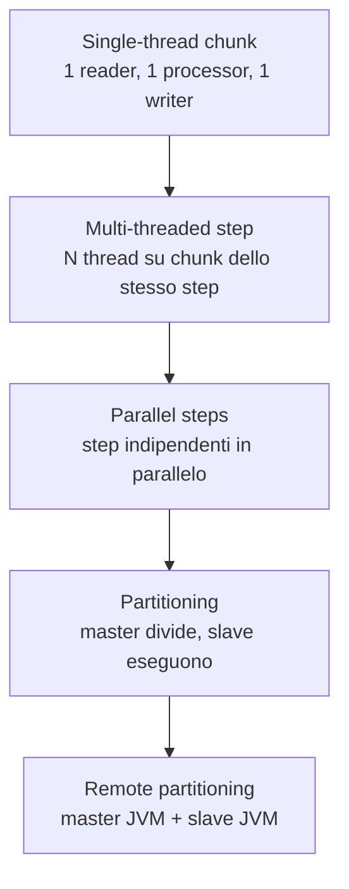
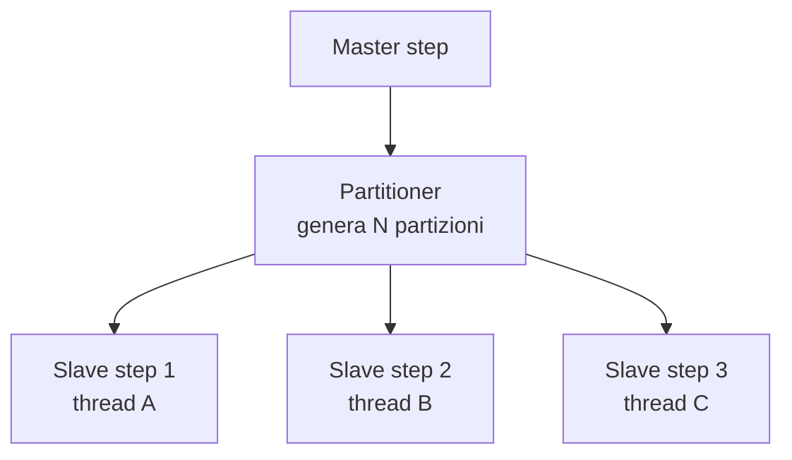
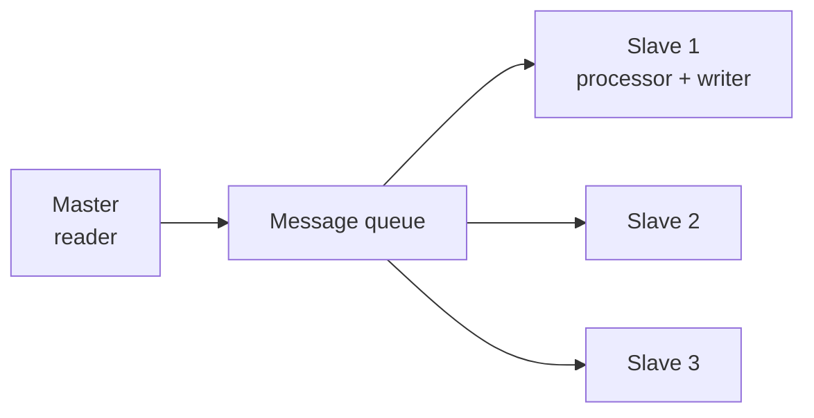

# Scaling: parallelizzare i Job

## Quattro strategie



## 1) Multi-threaded step

Più thread che eseguono lo stesso step concorrentemente.

```java
@Bean
public Step mtStep(JobRepository jr, PlatformTransactionManager tx,
                    ItemReader<X> reader, ItemWriter<X> writer) {
    return new StepBuilder("mt", jr)
        .<X, X>chunk(100, tx)
        .reader(reader)
        .writer(writer)
        .taskExecutor(new ThreadPoolTaskExecutor() {{
            setCorePoolSize(8);
            setMaxPoolSize(8);
            initialize();
        }})
        .build();
}
```

**Vincoli**:
- Il **reader deve essere thread-safe** (la maggior parte degli ItemReader standard NON lo è).
- `JdbcCursorItemReader` NON thread-safe.
- `JdbcPagingItemReader` SÌ thread-safe.
- `FlatFileItemReader` non è thread-safe (i thread leggerebbero righe random).

Per file: usa `SynchronizedItemStreamReader` come wrapper, ma comunque c'è un collo di bottiglia.

> Multi-threaded step funziona bene con reader da DB paging. Per file: meglio partitioning.

## 2) Parallel steps (split)

Vedi sez. 37: due step indipendenti in `Flow.split()`.

Tipico: "step A scarica da fonte 1, step B scarica da fonte 2, poi step C li unisce".

## 3) Partitioning (locale)

Il **master** divide il lavoro in **N partizioni**. Ogni partizione esegue un'istanza dello step **slave** in un thread diverso.



```java
@Component
public class CityPartitioner implements Partitioner {
    @Override
    public Map<String, ExecutionContext> partition(int gridSize) {
        Map<String, ExecutionContext> partitions = new HashMap<>();
        List<String> cities = List.of("Milano", "Roma", "Napoli", "Torino");
        int i = 0;
        for (String city : cities) {
            ExecutionContext ec = new ExecutionContext();
            ec.putString("city", city);
            partitions.put("partition-" + (i++), ec);
        }
        return partitions;
    }
}

@Bean
public Step slaveStep(JobRepository jr, PlatformTransactionManager tx) {
    return new StepBuilder("slave", jr)
        .<Customer, Customer>chunk(500, tx)
        .reader(partitionedReader(null))   // @StepScope, prende city
        .writer(writer())
        .build();
}

@Bean
@StepScope
public JdbcPagingItemReader<Customer> partitionedReader(
        @Value("#{stepExecutionContext['city']}") String city) {
    // ... reader filtrato per city
}

@Bean
public Step masterStep(JobRepository jr, Step slaveStep, CityPartitioner partitioner) {
    return new StepBuilder("master", jr)
        .partitioner("slave", partitioner)
        .step(slaveStep)
        .taskExecutor(new SimpleAsyncTaskExecutor())
        .gridSize(4)
        .build();
}
```

**Vantaggi rispetto a multi-thread**:
- Ogni partizione ha il suo reader (di solito su una porzione disgiunta).
- Niente sincronizzazione.
- Restart funziona partizione per partizione.

Pattern di partitioning:
- **Per range**: `WHERE id BETWEEN 1 AND 1000`, poi 1001-2000, ...
- **Per chiave naturale**: per città, per categoria, per giorno.
- **Per hash**: `WHERE MOD(id, 4) = 0` per la partizione 0, ecc.

## 4) Remote partitioning

Master e slave su **JVM diverse** (anche macchine diverse). Master invia messaggi (RabbitMQ, Kafka, JMS); slave consumano e processano.

Configurazione complessa. Usato in produzione su Kubernetes per scaling orizzontale.

Vedi `spring-batch-integration` (`MessageChannelPartitionHandler`).

## Remote chunking

Diverso dal partitioning: il **master** ha il reader, e invia singoli chunk via messaging agli slave che processano e scrivono.



Quando? Reader è il collo di bottiglia e il processor è pesante. Più raro del partitioning.

## Tuning: quanti thread?

Per CPU-bound: `numero_core_logici`. Per I/O-bound (DB, HTTP): più alto, fai bench.

`spring.task.execution.pool.core-size = 8` (Spring Boot 3) per il default executor.

## Quale strategia scegliere?

| Scenario | Strategia |
|---|---|
| Reader veloce, processor leggero, dataset piccolo | Single-thread |
| Reader DB paginato, processor leggero | **Multi-threaded step** |
| 2 fonti indipendenti, poi merge | **Parallel steps (split)** |
| Dataset partizionabile per chiave naturale | **Local partitioning** |
| Throughput estremo, K8s | **Remote partitioning** |

## Esercizi

<details>
<summary>Es 40.1 — Multi-threaded</summary>

Job dell'Es 34.2 con `JdbcPagingItemReader`. Aggiungi `taskExecutor` con 4 thread. Misura speedup.

</details>

<details>
<summary>Es 40.2 — Partitioning per range</summary>

Partitioner che divide 1M record in 8 partizioni di 125k. Ogni slave legge un range con `JdbcPagingItemReader`. Misura il tempo totale.

</details>

<details>
<summary>Es 40.3 — Restart partizionato</summary>

Forza fail al 50% di una partizione. Restart: solo la partizione fallita riparte.

</details>

## Cosa devi portarti via

- 4 strategie di scaling. Sceglile in base al collo di bottiglia.
- **Multi-thread step**: reader thread-safe obbligatorio (paging sì).
- **Partitioning locale**: il pattern più potente e gestibile.
- **Remote partitioning**: per scala orizzontale su K8s.
- Bench prima di scegliere il chunk size e i thread.

Prossimo: listener, restart, monitoring, integrazione con K8s.
