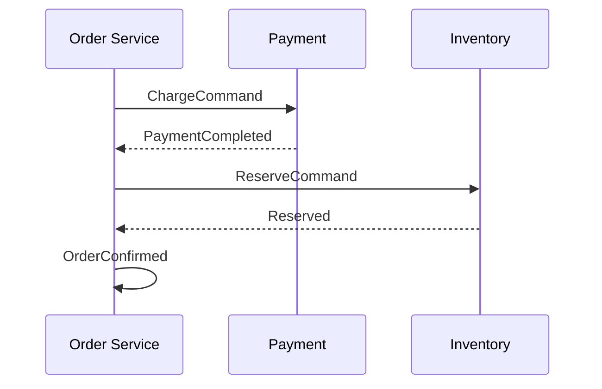

# Design pattern essenziali in Java/Spring

## Pattern GoF in Java moderno

### Singleton

Una sola istanza di una classe.

```java
public class Logger {
    private static final Logger INSTANCE = new Logger();
    private Logger() {}
    public static Logger get() { return INSTANCE; }
}
```

In Spring, default scope è singleton: tutti i `@Component` sono singleton **per ApplicationContext**. Non scrivere singleton "a mano" se sei in Spring.

### Factory Method / Abstract Factory

Decentra la creazione.

```java
public interface Connection { ... }

public class ConnectionFactory {
    public static Connection of(String type) {
        return switch (type) {
            case "tcp" -> new TcpConnection();
            case "udp" -> new UdpConnection();
            default -> throw new IllegalArgumentException();
        };
    }
}
```

In Spring: `@Bean` method in `@Configuration` *è* un factory method.

### Builder

Per oggetti con tanti parametri opzionali:

```java
public class HttpRequest {
    private final String url;
    private final String method;
    private final Map<String, String> headers;

    private HttpRequest(Builder b) {
        this.url = b.url; this.method = b.method; this.headers = Map.copyOf(b.headers);
    }

    public static Builder builder() { return new Builder(); }

    public static class Builder {
        private String url, method = "GET";
        private final Map<String, String> headers = new HashMap<>();

        public Builder url(String u) { this.url = u; return this; }
        public Builder method(String m) { this.method = m; return this; }
        public Builder header(String k, String v) { this.headers.put(k, v); return this; }
        public HttpRequest build() {
            Objects.requireNonNull(url);
            return new HttpRequest(this);
        }
    }
}

HttpRequest r = HttpRequest.builder().url("...").header("X", "Y").build();
```

In pratica: usa **Lombok `@Builder`** o **records** + costruttore esplicito.

### Strategy

Sostituisci algoritmo a runtime.

```java
public interface PricingStrategy {
    BigDecimal price(Cart cart);
}

public class StandardPricing implements PricingStrategy { ... }
public class BlackFridayPricing implements PricingStrategy { ... }

@Service
public class Checkout {
    private PricingStrategy strategy;
    public void setStrategy(PricingStrategy s) { this.strategy = s; }
    public BigDecimal price(Cart c) { return strategy.price(c); }
}
```

In Spring: inietta `List<PricingStrategy>` e scegli dinamicamente. O `@Qualifier`.

### Template Method

Algoritmo fisso, dettagli variabili.

```java
public abstract class HttpService {
    public final Response call(Request r) {
        beforeCall(r);
        Response res = doCall(r);
        afterCall(r, res);
        return res;
    }
    protected void beforeCall(Request r) {}
    protected abstract Response doCall(Request r);
    protected void afterCall(Request r, Response res) {}
}
```

### Observer / Pub-Sub

Disaccoppia produttori e consumatori.

In Spring:
```java
@Component
public class OrderService {
    private final ApplicationEventPublisher publisher;
    public void place(Order o) {
        // ...
        publisher.publishEvent(new OrderPlacedEvent(o));
    }
}

@Component
public class EmailListener {
    @EventListener
    public void on(OrderPlacedEvent e) { ... }
}
```

`@Async` per esecuzione asincrona.

### Decorator

Aggiungi funzionalità a un oggetto senza modificarlo.

```java
public interface DataSource {
    Connection getConnection();
}

public class CachingDataSource implements DataSource {
    private final DataSource delegate;
    public CachingDataSource(DataSource d) { this.delegate = d; }
    @Override public Connection getConnection() {
        // cache logic
        return delegate.getConnection();
    }
}
```

In Spring: `@Cacheable`, `@Transactional` sono decorator (via proxy).

### Adapter

Adatta un'interfaccia a un'altra.

```java
public interface PaymentGateway {
    String charge(BigDecimal amount);
}

public class StripeAdapter implements PaymentGateway {
    private final StripeApi stripe;   // libreria esterna

    @Override
    public String charge(BigDecimal amount) {
        return stripe.createCharge(amount.movePointRight(2).intValueExact()).id();
    }
}
```

Isola la tua app dalle API esterne.

### Proxy

Sostituisci l'oggetto vero con un sostituto. Spring AOP usa proxy ovunque.

### Command

Incapsula una richiesta come oggetto.

```java
public interface Command {
    void execute();
}

public class SendEmail implements Command {
    private final Email email;
    @Override public void execute() { /* manda */ }
}

queue.submit(new SendEmail(...));
```

`Runnable` di Java è essenzialmente un Command.

## Pattern DDD-lite

### Repository

Astrazione su persistenza:

```java
public interface CustomerRepository {
    Optional<Customer> findById(long id);
    Customer save(Customer c);
}
```

Spring Data ti dà l'implementazione gratis.

### Service

Logica di business orchestratore:

```java
@Service
public class OrderService {
    private final CustomerRepository customers;
    private final InventoryService inventory;
    private final PaymentGateway payment;

    @Transactional
    public Order place(NewOrder req) {
        Customer c = customers.findById(req.customerId()).orElseThrow();
        inventory.reserve(req.items());
        String txId = payment.charge(c, req.total());
        // ...
    }
}
```

### Value Object

Immutabile, ha senso solo per il suo valore (no identità).

```java
public record Money(BigDecimal amount, String currency) {
    public Money {
        Objects.requireNonNull(amount);
        Objects.requireNonNull(currency);
    }
    public Money add(Money other) {
        if (!currency.equals(other.currency)) throw new IllegalArgumentException();
        return new Money(amount.add(other.amount), currency);
    }
}
```

I **`record`** in Java moderno sono fatti apposta.

### Aggregate

Entità "root" che gestisce un grafo di altre entità.

```java
@Entity
public class Order {
    @Id Long id;
    @OneToMany(cascade = ALL, orphanRemoval = true)
    List<OrderLine> lines = new ArrayList<>();

    public void addLine(Product p, int qty) {
        if (qty <= 0) throw new IllegalArgumentException();
        lines.add(new OrderLine(p, qty));
    }
}
```

L'aggregato `Order` è l'unico "punto di ingresso": non manipoli `OrderLine` esternamente.

### Specification

Vedi sez. 27.

### Saga (microservizi)

Transazioni distribuite tramite eventi.



In caso di errore: emetti **compensating events** (Refund, Release).

## Anti-pattern da evitare

- **God class**: classe da 2000 righe. Splittala per responsabilità.
- **Anemic domain model**: entity solo getter/setter, tutta la logica nei service. Per app con regole complesse, sposta logica nelle entity.
- **Service Locator**: invece di DI. Usa DI.
- **Singleton mutabile**: stato condiviso, bug di concorrenza garantiti.
- **N+1**: vedi sez. 20.

## Esercizi

<details>
<summary>Es 42.1 — Strategy per IVA</summary>

`VatStrategy` con impl `Standard` (22%), `Reduced` (10%), `SuperReduced` (4%). Inietta `Map<String, VatStrategy>` in un service.

</details>

<details>
<summary>Es 42.2 — Builder con record</summary>

`record HttpReq(String url, String method, Map<String,String> headers)` con factory `builder()` interno fluente.

</details>

<details>
<summary>Es 42.3 — Event-driven</summary>

`OrderPlacedEvent`, listener che manda mail. Aggiungi `@Async`.

</details>

## Cosa devi portarti via

- I 10 GoF pattern in Java: la maggior parte sono già "incarnati" in Spring.
- DDD-lite: Repository + Service + Value Object + Aggregate per app complesse.
- Saga per transazioni distribuite (microservizi).
- Evita anti-pattern: god class, service locator, singleton mutabile.

Prossimo: performance tuning e observability production-grade.
