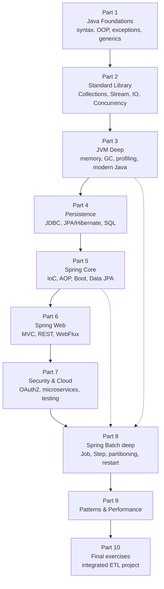

# The path and the right mindset

## Why Java + Spring in 2026

Java turns 31 in 2026 and is still the most requested language in banking, insurance, telco, government, retail and aerospace. Spring is the **de-facto standard framework** for building server-side enterprise applications. Spring Batch — a sub-framework dedicated to batch processing — runs every night inside bank ETLs, payment reconciliations, statement generation, risk management pipelines.

Learning Java + Spring + Spring Batch *well* makes you immediately employable in any large company in Europe, the US and globally. It is not a fad: it is infrastructure.

## The map: how the path is structured

The path is split into 10 parts, going from the basics to "people call you for consulting":



> **Don't skip the fundamentals.** Spring feels "magic" only if you don't understand the JVM, annotations, proxies and transactions. If you understand them, it is predictable. 90% of Spring bugs come from never having studied core Java.

## How to study

### 1) Read, then write code. Always.

Every concept on this site has runnable examples. Don't read passively: **open the IDE, write, compile, make it crash, understand why**. Without the "make it crash" phase, you don't really know it.

### 2) Spaced repetition on the deep mechanisms

Java memory model, Spring bean lifecycle, interceptor ordering: come back to them every 2-3 weeks. They are not things you learn once — they are things you let settle.

### 3) Build something of your own, even ugly

While following the path, have a pet project (e.g. "track my expenses", "RSS feeds monitor", "OFX import batch"). Try every new concept there. Without a real project you never discover the real problems (configuration, deployment, logs, retries).

### 4) Read other people's code

The Spring source code (`spring-projects/spring-framework` on GitHub) is written by extremely sharp people. Every now and then go read how `@Transactional` or `DispatcherServlet` is implemented. It's like reading literature: that's the real language.

### 5) English *and* your native language

The site is fully bilingual: read it first in your strongest language to lock the concepts, then **re-read it in English** to learn the real technical terms. The entire Java job market speaks English: `bean`, `wiring`, `scope`, `proxy`, `interceptor`, `chunk`, `tasklet`, `partitioner`.

## Quick setup

Open PowerShell or a terminal and check:

```powershell
java -version
# expected: openjdk version "21.x.x" or newer

mvn -version
# expected: Apache Maven 3.9+

# optional but recommended
docker --version
# expected: Docker version 24+ or newer
```

If something is missing:

- **JDK 21**: download from [adoptium.net](https://adoptium.net) (Eclipse Temurin) or [bell-sw.com](https://bell-sw.com) (Liberica).
- **Maven**: [maven.apache.org](https://maven.apache.org) (extract, add `bin/` to PATH).
- **IntelliJ IDEA Community**: free, [jetbrains.com/idea](https://www.jetbrains.com/idea/).

## Typical mental mistakes (avoid them)

| Mistake | Why it's a problem |
|---|---|
| "Spring is too magic, I don't get it — I'll move on" | You will come back, with a production bug. Stop and understand. |
| "I skip JDBC and jump straight to JPA" | You won't understand what Hibernate does until you know exactly what a `Connection` and a `PreparedStatement` do. |
| "I don't need generics" | You need them to read any serious library, Spring included. |
| "Concurrency: I'll look at it later" | It is *everywhere* in Spring: web server pool, `@Async`, `@Scheduled`, multi-threaded batch. |
| "I memorize without writing code" | In a week you remember nothing. You need fingers on keyboard. |
| "I use magic annotations and never check what they generate" | Spring is proxies and runtime-generated code. You have to know what's happening. |

## Site typographic convention

On every page you'll find:

- **Theory** with `# h1` (title), `## h2` (sections), `### h3` (sub-sections).
- **Java code** in <code>```java</code> blocks. Almost always runnable.
- **Shell/PowerShell** in <code>```powershell</code> or <code>```bash</code> blocks.
- **Diagrams** in Mermaid (flowchart, sequence) or inline SVG. Never ASCII art.
- **Exercises** in expandable boxes (`<details>`) with hidden solutions.
- **Tip boxes** in `> blockquote` with **bold** label up front.

```java
// Example code block
public class Hello {
    public static void main(String[] args) {
        System.out.println("Ready to start?");
    }
}
```

## Exercise zero

<details>
<summary>Ex 0.1 — Full setup (10 minutes)</summary>

1. Install JDK 21 and check with `java -version`.
2. Install IntelliJ IDEA Community.
3. Create a new Maven project with `groupId = your.name.zth` and `artifactId = playground`.
4. Open `src/main/java/Hello.java` and write:
   ```java
   public class Hello {
       public static void main(String[] args) {
           System.out.println("Ready to start? " + System.getProperty("java.version"));
       }
   }
   ```
5. Run it. You should see `Ready to start? 21.x.x`.

If everything works, you're ready. Go to Section 1.

</details>

## How you notice you're learning

Three indicators — check them every 2 weeks:

1. **You can read other people's code without googling every word.** At first a Spring file scares you. After 2 months you start recognizing the patterns.
2. **You can *predict* what an annotation does.** You see `@Transactional(propagation = REQUIRES_NEW)` and you can tell me what happens if you call it from inside another `@Transactional`.
3. **You can *explain* to a junior what the JVM does when you run `java -jar`.** Without looking at slides.

When you answer yes to all three, you have completed the "competent" level. From there, it's a lifetime of practice.

---

Ready? Open **Section 1**.
