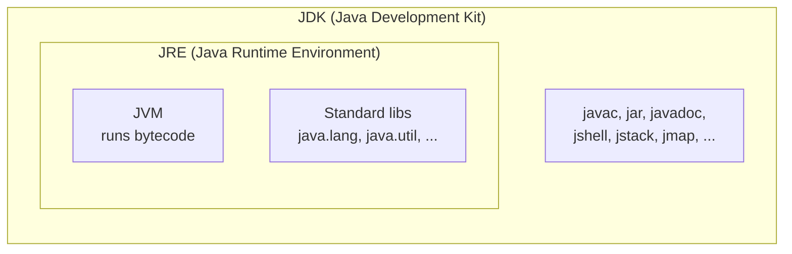
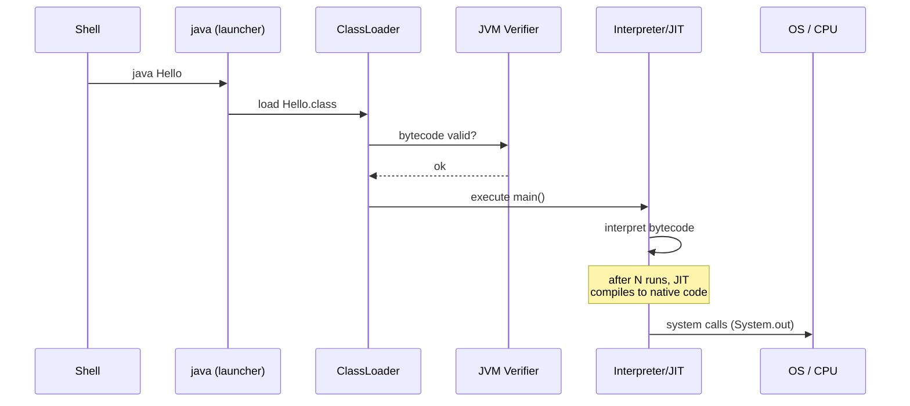

# Java: what it really is, JVM/JRE/JDK, first program

## Java as a language and as a platform

"Java" is two things at once:

1. **The Java language**: a syntax (`class`, `if`, `for`, `int`, `String`, ...).
2. **The Java platform**: an ecosystem made of the JVM, standard libraries, tools.

When you say "I write in Java" you mean the language. When you say "it runs on Java" you mean the platform — i.e. the **JVM**, which can also run other languages (Kotlin, Scala, Groovy, Clojure, ...).

### Language fundamentals

- **Statically typed**: every variable has a type known at compile time. `int x = 3;` works, `x = "hello";` does not compile.
- **Object-oriented**: everything lives inside classes (mostly; there are primitives and static, we'll see). Single inheritance, multiple interfaces.
- **Compiled to bytecode, interpreted/JITted at runtime**: the `.java` becomes a `.class` (bytecode), which the JVM executes.
- **Garbage Collected**: you don't free memory by hand (no `free()` or `delete`).
- **"Write once, run anywhere"**: the same `.class` runs on Windows/Linux/Mac/AIX/zOS — because each platform has its JVM.

## JVM, JRE, JDK: the difference everyone confuses



- **JVM (Java Virtual Machine)**: the C++ program that loads and *executes* `.class` files. Not enough on its own to develop.
- **JRE (Java Runtime Environment)** = JVM + standard libraries. Used to *run* Java programs, not to compile them. Since Java 11 it is no longer shipped as a separate package.
- **JDK (Java Development Kit)** = JRE + development tools (`javac` = compiler, `jar`, `javadoc`, `jshell`, `jdb` debugger, profilers, ...).

> **Which one to install?** You always install **the JDK**. Period. Even if you only run apps, the JDK is the right choice today.

### JDK distributions

The same OpenJDK source is shipped by several vendors, all interchangeable:

| Distribution | Vendor | Notes |
|---|---|---|
| **Eclipse Temurin** | Eclipse Foundation (Adoptium) | Recommended default. Free, TCK-certified. |
| **Oracle JDK** | Oracle | Free only for non-commercial use after 6 months, then commercial license for enterprise environments. |
| **Bellsoft Liberica** | BellSoft | Free, long LTS support, JavaFX-bundled variants. |
| **Amazon Corretto** | Amazon | Free, Amazon LTS support. Default on AWS. |
| **Azul Zulu** | Azul Systems | Free (Zulu OpenJDK), paid support (Zulu Prime). |
| **Red Hat OpenJDK** | Red Hat | For RHEL environments. |

**Current LTS versions (Long Term Support)**: 8, 11, 17, **21** (released September 2023). Java 25 will be LTS in 2025.

> **For this path**: use **JDK 21**. It is modern and supported long-term. All examples are tested on 21.

## Bytecode and portability: what happens when you compile

Take a source file `Hello.java`:

```java
public class Hello {
    public static void main(String[] args) {
        System.out.println("Hello world");
    }
}
```

Compile it:

```powershell
javac Hello.java
# creates Hello.class — CPU-neutral bytecode
```

`Hello.class` is not x86, ARM or RISC-V binary: it is **JVM bytecode**, a virtual instruction set (e.g. `getstatic`, `ldc`, `invokevirtual`, `return`). You can disassemble it with `javap`:

```powershell
javap -c Hello.class
```

Output (simplified):

```
public class Hello {
  public static void main(java.lang.String[]);
    Code:
       0: getstatic     #7    // Field java/lang/System.out
       3: ldc           #13   // String "Hello world"
       5: invokevirtual #15   // Method java/io/PrintStream.println
       8: return
}
```

When you run `java Hello`:



- **Class Loader** loads the `.class` into memory.
- **Verifier** checks that the bytecode follows the rules (no jumps outside methods, no malformed casts, ...). This is why Java is "safe": you cannot execute malformed `.class` files.
- **Interpreter** runs instructions one by one.
- **JIT (Just-In-Time compiler)**: hot methods are compiled to native code for the specific CPU, and from then on run at "C" speed. Details in [JVM internals](15-jvm-internals.html).

## Java source file structure

Rules that hold *always*:

1. A `.java` file contains **one public class** (at most), with the same name as the file. `Hello.java` ⟶ `public class Hello { ... }`.
2. A class lives in a **package**. The package matches the folder. `it.zth.demo.Hello` ⟶ `it/zth/demo/Hello.java`.
3. The entry point is `public static void main(String[] args)`. Without it, "not runnable from `java`".
4. Statements end with `;`.
5. Java is **case-sensitive**: `String` ≠ `string`.

### Naming conventions (follow them — everyone does)

| Thing | Convention | Example |
|---|---|---|
| Classes | `UpperCamelCase` | `CustomerService` |
| Methods and variables | `lowerCamelCase` | `getName`, `totalAmount` |
| `static final` constants | `SCREAMING_SNAKE_CASE` | `MAX_RETRIES` |
| Packages | `all.lowercase.dotted` | `it.zth.batch` |
| Interfaces | `UpperCamelCase`, often a noun or adjective | `Repository`, `Runnable` |

## Hello World, line by line

```java
package it.zth.demo;            // (1) the file's "family name"

import java.time.LocalDateTime; // (2) you import an external class

public class Hello {            // (3) public class declaration

    public static void main(String[] args) {  // (4) entry-point
        String greeting = "Hello";            // (5) local variable
        System.out.println(greeting + " world, it's " + LocalDateTime.now());
        //                ^---------- string concatenation (operator +)
    }
}
```

1. **`package`**: declares the "family". Must match the folder structure. If omitted, you're in the "default package" (discouraged, not done in real projects).
2. **`import`**: brings in a class from another package. `java.lang` is imported automatically.
3. **`public class Hello`**: visibility `public` (everyone can see it), name `Hello` (matches the file).
4. **`public static void main(String[] args)`**:
   - `public` — callable from outside (the JVM calls it).
   - `static` — no `Hello` instance is needed to call it.
   - `void` — returns nothing.
   - `String[] args` — command-line arguments.
5. **`String greeting = "Hello"`**: declares a variable, type `String`, value `"Hello"`. Strings in Java are `String` objects, not primitives.

### Compile and run

```powershell
# from the folder containing src/it/zth/demo/Hello.java
javac -d out src/it/zth/demo/Hello.java
java -cp out it.zth.demo.Hello
# output: Hello world, it's 2026-05-20T10:30:12.345
```

`-d out` says "put `.class` files in `out/`". `-cp out` says "look for `.class` files in `out/`".

In practice nobody compiles by hand: you use **Maven** or **Gradle**. But once in your life you have to do it by hand to understand what's going on.

## Maven in 60 seconds (preview)

Create a folder, put a minimal `pom.xml` inside:

```xml
<project xmlns="http://maven.apache.org/POM/4.0.0">
  <modelVersion>4.0.0</modelVersion>
  <groupId>it.zth</groupId>
  <artifactId>playground</artifactId>
  <version>0.1.0</version>
  <packaging>jar</packaging>
  <properties>
    <maven.compiler.source>21</maven.compiler.source>
    <maven.compiler.target>21</maven.compiler.target>
    <project.build.sourceEncoding>UTF-8</project.build.sourceEncoding>
  </properties>
</project>
```

Put your source in `src/main/java/it/zth/demo/Hello.java`. Then:

```powershell
mvn compile
mvn exec:java -Dexec.mainClass=it.zth.demo.Hello
```

All Maven details come later. For now: just know it exists.

## Exercises

<details>
<summary>Ex 1.1 — Bilingual Hello</summary>

Write a program that prints "Hello world" if the command-line argument is `en`, "Ciao mondo" if it's `it`.

```java
public class HelloBi {
    public static void main(String[] args) {
        if (args.length == 0) {
            System.out.println("Usage: java HelloBi <it|en>");
            return;
        }
        switch (args[0]) {
            case "it" -> System.out.println("Ciao mondo");
            case "en" -> System.out.println("Hello world");
            default -> System.out.println("Unknown language: " + args[0]);
        }
    }
}
```

Note: arrow `switch` is a Java 14+ feature. We'll cover it properly later.

</details>

<details>
<summary>Ex 1.2 — Quick JVM info</summary>

Print the current Java version, OS name, and the user's username.

```java
public class SysInfo {
    public static void main(String[] args) {
        System.out.println("Java:    " + System.getProperty("java.version"));
        System.out.println("OS:      " + System.getProperty("os.name") + " "
                                       + System.getProperty("os.version"));
        System.out.println("User:    " + System.getProperty("user.name"));
        System.out.println("Working: " + System.getProperty("user.dir"));
    }
}
```

`System.getProperty(...)` is the window onto the system. Dozens of standard properties exist.

</details>

<details>
<summary>Ex 1.3 — Disassemble</summary>

1. Compile `Hello.java` with `javac`.
2. Run `javap -c -v Hello.class > Hello.txt`.
3. Open `Hello.txt`. Find:
   - The `getstatic` instruction that retrieves `System.out`.
   - The `ldc` instruction that loads the `"Hello world"` string.
   - The `invokevirtual` instruction that calls `println`.

This is what the JVM actually runs. The `# 7`, `# 13`, ... annotations are indexes into the class's **constant pool**.

</details>

<details>
<summary>Ex 1.4 — Break the classloader</summary>

1. Compile `Hello.java` into `out/`.
2. Run `java -cp out Hello`. Works.
3. Move `Hello.class` to `out/other/`.
4. Run `java -cp out Hello` again. What happens?

Answer: `Error: Could not find or load main class Hello`. Why? The classloader looks for `Hello.class` at the classpath root, not in subfolders (unless the class is in a corresponding package).

</details>

<details>
<summary>Ex 1.5 — Understand `public static void main`</summary>

What happens if you drop `static` from `main`?

```java
public class Boom {
    public void main(String[] args) {  // no static
        System.out.println("?");
    }
}
```

Compiles, doesn't run:

```
Error: Main method is not static in class Boom, please define the main method as:
   public static void main(String[] args)
```

Why? To call a *non*-static method the JVM would first have to create a `Boom` instance — but it doesn't know how (which constructor to call, with which arguments). Hence: `main` must be `static`.

</details>

## Take-aways

- Java is a language + a platform. The platform is the **JVM**.
- **JDK = JRE + tools**, **JRE = JVM + libraries**. Install the JDK.
- Java source ⟶ `.class` bytecode ⟶ JVM ⟶ JIT to native code.
- Use **JDK 21** in this path.
- A `.java` source: one `package`, optional `import`s, one public class with the file's name, a `main` to be runnable.

Next step: the real language syntax — types, variables, control flow, operators.
