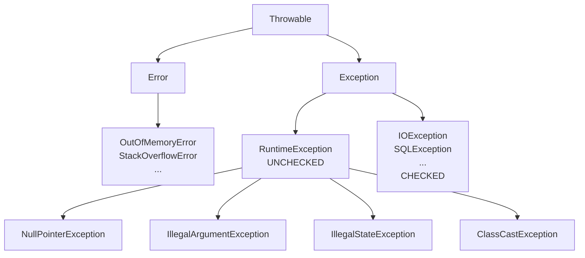

# Exceptions: checked vs unchecked, try-with-resources, custom

## The hierarchy



- **`Throwable`** common ancestor.
- **`Error`** = severe JVM problems. Don't catch.
- **`Exception`** = recoverable problems.
  - **Checked** (under `Exception` but not `RuntimeException`): the compiler forces handling.
  - **Unchecked** (`RuntimeException` and below): the compiler doesn't force, but you can catch.

## Checked vs unchecked

### Checked

You must either catch or declare:

```java
public void read(String path) throws IOException {   // declared
    Files.readString(Path.of(path));
}

// or
public void read(String path) {
    try {
        Files.readString(Path.of(path));
    } catch (IOException e) {
        System.err.println("error: " + e.getMessage());
    }
}
```

Examples: `IOException`, `SQLException`, `ClassNotFoundException`, `InterruptedException`.

### Unchecked

Not checked by the compiler. Typically programmer bugs:

```java
String s = null;
s.length();   // NullPointerException - no need to declare
```

Examples: `NullPointerException`, `IllegalArgumentException`, `IllegalStateException`, `ArithmeticException`, `ClassCastException`, `ArrayIndexOutOfBoundsException`.

### Which to use?

| Situation | Exception |
|---|---|
| Programmer bug (null arg, out-of-range index) | **Unchecked** (`IllegalArgumentException`, ...) |
| Predictable, recoverable error (missing file, network down) | Historically **checked**; modern APIs prefer unchecked. |
| Inconsistent object state | `IllegalStateException` |

> **Modern trend**: Spring, Hibernate, modern JDK APIs (NIO.2, Stream) prefer **unchecked**. Checked exceptions "infect" signatures. In new code prefer unchecked unless you have a strong reason.

## `try / catch / finally`

```java
try {
    int x = Integer.parseInt(s);
    System.out.println(100 / x);
} catch (NumberFormatException e) {
    System.err.println("not a number: " + s);
} catch (ArithmeticException e) {
    System.err.println("division by zero");
} finally {
    System.out.println("always runs");
}
```

- Multiple `catch`, first match wins.
- `finally` always runs — even on `return` or re-throw.
- Order matters: specific before general.

### Multi-catch

```java
try {
    ...
} catch (IOException | SQLException e) {
    log.error("error: ", e);
}
```

### `try-with-resources`

For any `AutoCloseable` resource:

```java
try (BufferedReader r = Files.newBufferedReader(Path.of("x.txt"))) {
    String line;
    while ((line = r.readLine()) != null) System.out.println(line);
}
// r.close() automatic, even on exception
```

Multiple resources:

```java
try (Connection c = ds.getConnection();
     PreparedStatement ps = c.prepareStatement("SELECT 1");
     ResultSet rs = ps.executeQuery()) {
    ...
}
// closed in reverse: rs, ps, c
```

## `throw` and `throws`

- `throw` throws an exception.
- `throws` declares it in the method signature.

```java
public Person find(long id) throws NotFoundException {
    if (id < 0) throw new IllegalArgumentException("negative id");
    Person p = repo.findById(id);
    if (p == null) throw new NotFoundException("id " + id);
    return p;
}
```

## Stack trace and chaining

```java
try {
    readFile();
} catch (IOException e) {
    throw new ServiceException("cannot read config", e);   // cause
}
```

The `cause` (second arg) preserves the original exception in the stack trace. **Always** preserve the cause: without it, debugging becomes a nightmare.

```
ServiceException: cannot read config
    at MyService.load(MyService.java:42)
    ...
Caused by: java.nio.file.NoSuchFileException: config.yml
    at sun.nio.fs.WindowsException.translateToIOException(...)
    ...
```

## Custom exceptions

```java
public class NotFoundException extends RuntimeException {
    public NotFoundException(String msg) { super(msg); }
    public NotFoundException(String msg, Throwable cause) { super(msg, cause); }
}
```

Conventions:
- Name ends in `Exception`.
- Extend `RuntimeException` for unchecked (usually yes).
- Standard constructors: string, string + cause.

With extra data:

```java
public class InsufficientBalanceException extends RuntimeException {
    private final String iban;
    private final BigDecimal requested;

    public InsufficientBalanceException(String iban, BigDecimal requested) {
        super("insufficient balance on " + iban + " for " + requested);
        this.iban = iban;
        this.requested = requested;
    }

    public String getIban() { return iban; }
    public BigDecimal getRequested() { return requested; }
}
```

## Best practices (and anti-patterns)

### ✅ DO

- Specific catch, explicit handling.
- Preserve the cause: `throw new X(msg, e);`.
- Log and stop: either handle, or rethrow. **Not** both (double logs).
- Use `try-with-resources` for anything with `close()`.
- Exceptions in `finally` mask the ones in `try`: be careful.

### ❌ DON'T

- **Catch and ignore**: `catch (Exception e) { /* ignored */ }` is a crime.
- **`catch (Throwable e)`**: catches `OutOfMemoryError` too. Don't.
- **Use exceptions for flow control**: slow and unreadable.
- **`e.printStackTrace()`** in production code: use a logger.
- **Wrap and lose the cause**: `throw new X(msg);` (missing `, e`).
- **`catch (NullPointerException e)`**: NPE is a bug, fix it.

### Classic anti-pattern

```java
try {
    ...
} catch (Exception e) {
    e.printStackTrace();         // bad logging
    return null;                 // swallow value
}
```

What happens? Masked error, `null` return, caller crashes later with no context. **Don't do it**.

## `NullPointerException`: the most common bug

NPE happens when you **dereference** a null reference:

```java
String s = null;
s.length();        // NPE
List<X> l = search();
for (X x : l) ...  // if l is null, NPE here
```

Java 14+ gives helpful NPE messages ("Cannot invoke ... because s is null").

### Strategies

1. **Always initialize**: instead of a `null` field, start with a default (e.g. `List.of()` instead of `null`).
2. **`Optional<T>`** for "may or may not exist" (section 10).
3. **`@NonNull`/`@Nullable` annotations** (JetBrains, JSR-305): signal intent.
4. **Defensive check** at API *edges*. Don't sprinkle `if (x != null)` everywhere.

### Guard clause pattern

```java
public void send(Email e) {
    Objects.requireNonNull(e, "email");
    Objects.requireNonNull(e.getTo(), "recipient");
    // logic
}
```

## Exercises

<details>
<summary>Ex 7.1 — Custom exception</summary>

Create `InvalidTaxCodeException extends IllegalArgumentException` with `code` and `reason` fields.

```java
public class InvalidTaxCodeException extends IllegalArgumentException {
    private final String code;
    private final String reason;

    public InvalidTaxCodeException(String code, String reason) {
        super("invalid tax code [" + code + "]: " + reason);
        this.code = code;
        this.reason = reason;
    }
    public String getCode() { return code; }
    public String getReason() { return reason; }
}
```

</details>

<details>
<summary>Ex 7.2 — `try-with-resources` with two resources</summary>

```java
import java.io.*;
import java.nio.file.*;

public class Copy {
    public static void main(String[] args) throws IOException {
        try (BufferedReader in = Files.newBufferedReader(Path.of("in.txt"));
             BufferedWriter out = Files.newBufferedWriter(Path.of("out.txt"))) {
            String line;
            while ((line = in.readLine()) != null) {
                out.write(line);
                out.newLine();
            }
        }
    }
}
```

</details>

<details>
<summary>Ex 7.3 — Explicit chaining</summary>

```java
class ServiceException extends RuntimeException {
    public ServiceException(String msg, Throwable cause) { super(msg, cause); }
}

try {
    Files.readString(Path.of("nope.txt"));
} catch (IOException e) {
    ServiceException se = new ServiceException("config load failed", e);
    se.printStackTrace();   // also shows "Caused by: java.nio.file.NoSuchFileException..."
}
```

</details>

<details>
<summary>Ex 7.4 — Identify the bug</summary>

```java
public Connection getConn() {
    try {
        return DriverManager.getConnection(url, u, p);
    } catch (SQLException e) {
        e.printStackTrace();
        return null;
    }
}
```

Three problems:
1. `printStackTrace` instead of logger.
2. Returns `null` on error: caller crashes with NPE later with no context.
3. Catch too broad: maybe you want to distinguish "host unreachable" from "wrong creds".

Better:
```java
public Connection getConn() {
    try {
        return DriverManager.getConnection(url, u, p);
    } catch (SQLException e) {
        throw new DataAccessException("cannot connect to " + url, e);
    }
}
```

</details>

<details>
<summary>Ex 7.5 — `finally` with `return`</summary>

```java
public static int test() {
    try {
        return 1;
    } finally {
        System.out.println("finally");
        return 2;
    }
}
```

Output: `finally` then `2`. `return` in `finally` **overrides** the `try`'s. **Never do this** in real code: `finally` is for cleanup, not to change the return value.

</details>

## Take-aways

- `Error` not caught. `Exception` yes. `RuntimeException` is unchecked.
- Use `try-with-resources` for any closeable resource.
- **Preserve the cause** when wrapping (`new X(msg, e)`).
- Don't generically catch `Exception` or `Throwable`.
- Custom exceptions: extend `RuntimeException`, standard constructors, extra data as fields.
- Never use exceptions for normal flow control.

Next: generics (PECS, type erasure, wildcards).
