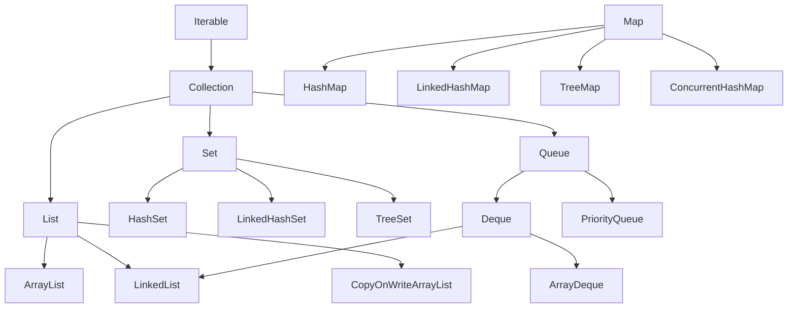

# Collections: List, Set, Map, Queue, complexity, choosing the right structure

## The hierarchy



`Map` is **outside** the `Collection` hierarchy (it's a collection of pairs, not single elements).

## `List`: ordered sequence, duplicates allowed

### `ArrayList`

Dynamic array. Fast indexed access, slow middle inserts.

| Operation | Complexity |
|---|---|
| `get(i)`, `set(i, x)` | O(1) |
| `add(x)` at tail | O(1) amortized |
| `add(i, x)` in middle | O(n) |
| `remove(i)` | O(n) |
| `contains(x)` | O(n) |

### `LinkedList`

Doubly-linked list. Fast head/tail inserts, **slow `get`**.

| Operation | Complexity |
|---|---|
| `get(i)`, `set(i, x)` | **O(n)** |
| `add(x)` at tail | O(1) |
| `addFirst(x)`, `removeFirst()` | O(1) |
| `contains(x)` | O(n) |

> **Rule of thumb**: use `ArrayList`. `LinkedList` is almost never a good practical choice — array cache locality almost always beats the linked-list "theory". Exception: heavy `Deque` use, but `ArrayDeque` is faster there too.

### `CopyOnWriteArrayList`

Thread-safe. Each write copies the internal array. Great for "many reads, few writes" (event listeners, config).

## `Set`: no duplicates

### `HashSet`

Backed by `HashMap`. Order **undefined**.

| Operation | Complexity |
|---|---|
| `add`, `remove`, `contains` | O(1) amortized |

Requires correct `equals` and `hashCode`.

### `LinkedHashSet`

Like `HashSet` but preserves **insertion order**.

### `TreeSet`

Red-black tree. Sorted by `Comparable` (or `Comparator`).

| Operation | Complexity |
|---|---|
| `add`, `remove`, `contains` | O(log n) |
| `first()`, `last()` | O(log n) |

Gives you "navigational" ops: `ceiling`, `floor`, `higher`, `lower`.

## `Map`: key → value

### `HashMap`

Array of buckets + linked list (then trees when too full, Java 8+).

| Operation | Complexity |
|---|---|
| `put`, `get`, `remove`, `containsKey` | O(1) amortized |

```java
Map<String, Integer> m = new HashMap<>();
m.put("a", 1);
m.put("b", 2);
m.get("a");                      // 1
m.getOrDefault("z", 0);          // 0
m.put("a", m.get("a") + 1);
m.merge("a", 1, Integer::sum);    // more elegant
m.putIfAbsent("c", 3);
for (var e : m.entrySet()) {
    System.out.println(e.getKey() + " = " + e.getValue());
}
```

### `LinkedHashMap`

Preserves insertion order (or access order if configured — LRU cache foundation).

### `TreeMap`

Sorted by key. O(log n) operations.

### `ConcurrentHashMap`

Thread-safe, high concurrency. Covered in concurrency.

## `Queue` and `Deque`

`Queue` = FIFO. `Deque` = double-ended.

```java
Deque<Integer> stack = new ArrayDeque<>();
stack.push(1); stack.push(2); stack.push(3);
stack.pop();      // 3 (LIFO)

Deque<Integer> queue = new ArrayDeque<>();
queue.offer(1); queue.offer(2); queue.offer(3);
queue.poll();    // 1 (FIFO)
```

### `PriorityQueue`

Min-heap (smallest first by default):

```java
PriorityQueue<Integer> pq = new PriorityQueue<>();
pq.offer(5); pq.offer(1); pq.offer(3);
pq.poll();    // 1
```

## Summary table: when to use what

| Need | Structure |
|---|---|
| Ordered list, random access | `ArrayList` |
| List with frequent head push/pop | `ArrayDeque` |
| Unique set, no order | `HashSet` |
| Unique set, insertion order | `LinkedHashSet` |
| Sorted set by value | `TreeSet` |
| Key → value map | `HashMap` |
| Sorted map by key | `TreeMap` |
| Map with insertion order | `LinkedHashMap` |
| LRU cache | `LinkedHashMap(accessOrder=true)` + override `removeEldestEntry` |
| FIFO queue | `ArrayDeque` (as `Queue`) |
| Priority queue | `PriorityQueue` |
| Multi-threaded reader-writer | `ConcurrentHashMap`, `CopyOnWriteArrayList` |

## Iterators and `ConcurrentModificationException`

```java
List<String> l = new ArrayList<>(List.of("a", "b", "c"));
for (String s : l) {
    if (s.equals("b")) l.remove(s);   // ConcurrentModificationException!
}
```

The "fail-fast" iterator detects the modification. Solutions:

1. `Iterator.remove()`:
   ```java
   var it = l.iterator();
   while (it.hasNext()) {
       if (it.next().equals("b")) it.remove();
   }
   ```
2. `removeIf` (Java 8+):
   ```java
   l.removeIf(s -> s.equals("b"));
   ```
3. Copy, iterate, remove:
   ```java
   for (String s : new ArrayList<>(l)) {
       if (...) l.remove(s);
   }
   ```

## Immutable collections

```java
List<String> immList = List.of("a", "b", "c");
Set<Integer>  immSet  = Set.of(1, 2, 3);
Map<String,Integer> immMap = Map.of("a", 1, "b", 2);

immList.add("d");   // UnsupportedOperationException
```

`List.copyOf(other)`, `Set.copyOf(other)`, `Map.copyOf(other)` create immutable copies. **Always** prefer them for "read-only" parameters — safer and sometimes more efficient.

> **Watch out**: `List.of(null)` throws NPE. Immutable collections **don't allow null**.

## Collections utility class

```java
Collections.sort(list);
Collections.sort(list, Comparator.reverseOrder());
Collections.reverse(list);
Collections.shuffle(list);
Collections.frequency(list, "x");
Collections.min(list);
Collections.max(list);
```

## Exercises

<details>
<summary>Ex 9.1 — Count frequencies</summary>

```java
List<String> words = List.of("a", "b", "a", "c", "a", "b");
Map<String, Integer> count = new HashMap<>();
for (String p : words) {
    count.merge(p, 1, Integer::sum);
}
// {a=3, b=2, c=1}
```

</details>

<details>
<summary>Ex 9.2 — Top-K most frequent</summary>

```java
public static List<String> topK(Map<String, Integer> freq, int k) {
    return freq.entrySet().stream()
        .sorted(Map.Entry.<String,Integer>comparingByValue().reversed())
        .limit(k)
        .map(Map.Entry::getKey)
        .toList();
}
```

</details>

<details>
<summary>Ex 9.3 — LRU cache</summary>

```java
public class LRUCache<K, V> extends LinkedHashMap<K, V> {
    private final int capacity;
    public LRUCache(int capacity) {
        super(capacity, 0.75f, true);  // accessOrder=true
        this.capacity = capacity;
    }
    @Override
    protected boolean removeEldestEntry(Map.Entry<K, V> eldest) {
        return size() > capacity;
    }
}
```

</details>

<details>
<summary>Ex 9.4 — Dedup preserving order</summary>

```java
List<Integer> deduped = new ArrayList<>(new LinkedHashSet<>(input));
// or with streams:
List<Integer> deduped = input.stream().distinct().toList();
```

</details>

<details>
<summary>Ex 9.5 — Avoiding `ConcurrentModificationException`</summary>

```java
list.removeIf(x -> x % 2 == 0);
```

</details>

## Take-aways

- **`ArrayList`** almost always for `List`. **`HashMap`** almost always for `Map`.
- `Set` when you want uniqueness. `TreeSet`/`TreeMap` for sorted order.
- **Know the complexity** of each operation: structure choice changes performance 100x.
- `removeIf` instead of iterate + modify.
- Immutable collections (`List.of`, ...) for read-only params.
- `Map.merge` for "increment counter" patterns.

Next: Stream API, lambdas, functional interfaces, Optional.
