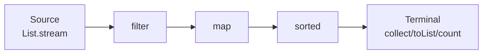

# Stream API, lambdas, functional interfaces, Optional

## Lambda: code block as a value

A **lambda** is an anonymous function passed as a value.

```java
Runnable r = () -> System.out.println("hi");
r.run();   // hi

Comparator<Integer> c = (a, b) -> Integer.compare(a, b);
c.compare(2, 3);   // -1
```

Syntax:
- `() -> expression`
- `(x) -> expression` or `x -> expression`
- `(x, y) -> expression`
- `(x) -> { statements; return ... }`

### Method references

Compact lambda form:

```java
list.forEach(System.out::println);            // (x) -> System.out.println(x)
list.stream().map(String::toUpperCase);
list.stream().sorted(Integer::compare);
List<Person> ps = names.stream().map(Person::new).toList();  // constructor
```

Types:
- `Class::staticMethod` (`Integer::parseInt`)
- `object::instanceMethod` (`System.out::println`)
- `Class::instanceMethod` (`String::length` — first arg is the object)
- `Class::new` (constructor)

## Functional interfaces

Interfaces with **exactly one abstract method** (SAM). A lambda implements it.

Most important (`java.util.function`):

| Interface | Signature | Example |
|---|---|---|
| `Function<T, R>` | `R apply(T)` | `s -> s.length()` |
| `BiFunction<T, U, R>` | `R apply(T, U)` | `(a, b) -> a + b` |
| `Predicate<T>` | `boolean test(T)` | `s -> s.isEmpty()` |
| `Consumer<T>` | `void accept(T)` | `System.out::println` |
| `BiConsumer<T, U>` | `void accept(T, U)` | `(k, v) -> log(k, v)` |
| `Supplier<T>` | `T get()` | `() -> new ArrayList<>()` |
| `UnaryOperator<T>` | `T apply(T)` | `i -> i * 2` |
| `BinaryOperator<T>` | `T apply(T, T)` | `Integer::sum` |
| `Runnable` | `void run()` | `() -> doStuff()` |
| `Callable<V>` | `V call() throws ...` | `() -> result()` |

Primitive variants: `IntFunction`, `IntPredicate`, `ToIntFunction`, etc. — avoid boxing.

### Your own

```java
@FunctionalInterface
public interface Validator<T> {
    boolean valid(T value);
    default Validator<T> and(Validator<T> other) {
        return v -> valid(v) && other.valid(v);
    }
}

Validator<String> nonEmpty = s -> s != null && !s.isBlank();
Validator<String> atLeast8 = s -> s.length() >= 8;
Validator<String> password = nonEmpty.and(atLeast8);
```

`@FunctionalInterface` is optional but enforces SAM-only.

## Stream API

A **stream** is a **pipelined sequence of elements**. Not a replacement for collections: a view to process them.

```java
List<Person> people = ...;

double avgAgeMen = people.stream()
    .filter(p -> p.getSex() == M)
    .mapToInt(Person::getAge)
    .average()
    .orElse(0);
```

### Pipeline = source + intermediate + terminal



Intermediate ops are **lazy**: nothing runs until a terminal op.

### Intermediate ops

| Op | What it does |
|---|---|
| `filter(Predicate)` | Keeps matching elements |
| `map(Function)` | Transforms each element |
| `flatMap(Function)` | Transforms and flattens nested streams |
| `sorted()` / `sorted(Comparator)` | Sorts |
| `distinct()` | Removes duplicates (uses `equals`) |
| `limit(n)` | Keeps first n |
| `skip(n)` | Skips first n |
| `peek(Consumer)` | Side-effect for debug |
| `mapToInt/Long/Double` | Specialize to primitive stream |

### Terminal ops

| Op | Returns |
|---|---|
| `collect(Collector)` | `Collectors.toList()`, `.toSet()`, `.toMap(...)`, ... |
| `toList()` (Java 16+) | Immutable List |
| `forEach(Consumer)` | void |
| `count()` | long |
| `min(Cmp)`, `max(Cmp)` | `Optional<T>` |
| `findFirst()`, `findAny()` | `Optional<T>` |
| `reduce(BinaryOperator)` | `Optional<T>` or `T` |
| `anyMatch / allMatch / noneMatch` | boolean |
| `sum / average` (on `IntStream`, etc.) | number |

### Examples

```java
// Uppercased names, alphabetical
List<String> result = people.stream()
    .map(Person::name)
    .map(String::toUpperCase)
    .sorted()
    .toList();

// Map: city → list of people
Map<String, List<Person>> byCity = people.stream()
    .collect(Collectors.groupingBy(Person::city));

// Map: city → average age
Map<String, Double> avgByCity = people.stream()
    .collect(Collectors.groupingBy(
        Person::city,
        Collectors.averagingInt(Person::age)
    ));

// Join cities with comma
String csv = people.stream()
    .map(Person::city)
    .distinct()
    .sorted()
    .collect(Collectors.joining(", "));

// Oldest person
Optional<Person> oldest = people.stream()
    .max(Comparator.comparingInt(Person::age));

// Reduce: total age
int totalAge = people.stream()
    .mapToInt(Person::age)
    .sum();
```

### `flatMap`: stream of streams → flat stream

```java
List<List<Integer>> nested = List.of(
    List.of(1, 2, 3),
    List.of(4, 5),
    List.of(6, 7, 8)
);
List<Integer> flat = nested.stream()
    .flatMap(List::stream)
    .toList();
```

### Parallel streams

```java
long count = bigList.parallelStream()
    .filter(predicate)
    .count();
```

Uses the common fork-join pool. **Not always faster**: for light ops and small datasets, splitting overhead dominates. Benchmark first.

> **Warning**: parallel streams share the common pool with everything else (Spring included). For long/CPU-bound work, use a dedicated pool.

## Stream pitfalls

1. **Streams consumed once**:
   ```java
   Stream<X> s = ...;
   s.count();
   s.toList();   // IllegalStateException
   ```
2. **Side-effects in map/filter**: bad practice. `peek` only for debug.
3. **Shared state in parallel streams**: race condition guaranteed.
4. **`Collectors.toMap` with duplicate keys**: throws `IllegalStateException`. Use the merger version:
   ```java
   .collect(Collectors.toMap(k -> k.id, k -> k, (a, b) -> a));
   ```

## `Optional<T>`: alternative to `null`

```java
Optional<User> u = repo.find(42);
if (u.isPresent()) {
    System.out.println(u.get().getName());
}

// more idiomatic:
u.ifPresent(user -> System.out.println(user.getName()));

// transform
String name = u.map(User::getName).orElse("anonymous");

// throw if missing
User user = u.orElseThrow(() -> new NotFoundException("user 42"));
```

### Golden rules

- **Don't use `Optional` as parameter or field**. Use it as **return type** of methods that might not find a result.
- Never `optional.get()` without `isPresent()` (throws if empty). Prefer `orElse`, `orElseThrow`, `ifPresent`.
- Never `Optional<List<X>>`: return empty `List<X>`.

## Exercises

<details>
<summary>Ex 10.1 — Filter and transform</summary>

```java
List<String> r = people.stream()
    .filter(p -> p.getAge() >= 18)
    .map(Person::getName)
    .map(String::toUpperCase)
    .sorted()
    .toList();
```

</details>

<details>
<summary>Ex 10.2 — Group by + count</summary>

```java
Map<String, Long> count = people.stream()
    .collect(Collectors.groupingBy(Person::city, Collectors.counting()));
```

</details>

<details>
<summary>Ex 10.3 — Stream from file</summary>

```java
try (Stream<String> lines = Files.lines(Path.of("data.txt"))) {
    long n = lines.filter(s -> !s.isBlank()).count();
    System.out.println(n);
}
```

`Files.lines` returns a lazy stream — requires `try-with-resources`.

</details>

<details>
<summary>Ex 10.4 — Optional chaining</summary>

```java
public record Order(Optional<Customer> customer) {}
public record Customer(Optional<Address> address) {}
public record Address(String city) {}

String city = order
    .flatMap(Order::customer)
    .flatMap(Customer::address)
    .map(Address::city)
    .orElse("unknown");
```

</details>

<details>
<summary>Ex 10.5 — Joining</summary>

```java
String result = Stream.of("a", "b", "c", "d")
    .collect(Collectors.joining(", ", "[", "]"));
// "[a, b, c, d]"
```

</details>

## Take-aways

- **Lambda** = anonymous function. **Method reference** makes it more compact.
- **Stream**: lazy pipeline, intermediate + terminal.
- `filter`, `map`, `flatMap`, `collect(groupingBy/toList/joining)`, `reduce`.
- `Optional` only as **return type** when value may be missing. Never as field or parameter.
- Parallel streams: useful but benchmark. Never with shared state.

Next: I/O and NIO.2.
