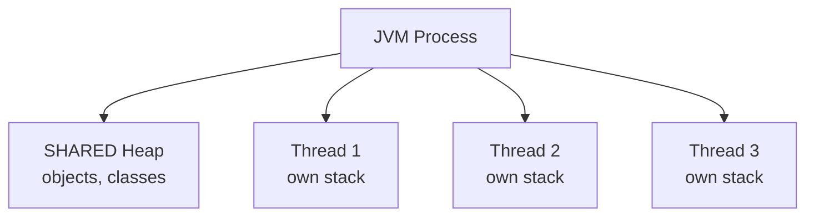

# Concurrency I — Threads, synchronization, volatile, JMM

## What a thread is

A **thread** is a unit of execution inside a process. Multiple threads share memory (heap, loaded classes), each has its own stack.



Java exposes OS threads (with the exception of **virtual threads** in Java 21).

## Creating a thread

```java
// 1) extend Thread (rare, discouraged)
class MyThread extends Thread { public void run() { System.out.println("hi"); } }
new MyThread().start();

// 2) Runnable
Runnable r = () -> System.out.println("hi");
new Thread(r).start();

// 3) lambda directly
new Thread(() -> System.out.println("hi")).start();
```

`start()` launches the new thread. `run()` would execute in the current thread (wrong).

### Lifecycle

`NEW → RUNNABLE → (BLOCKED/WAITING/TIMED_WAITING) → TERMINATED`

```java
Thread t = new Thread(...);
t.start();
t.join();           // wait for completion
t.getState();       // TERMINATED
```

## Race condition

```java
class Counter {
    int n = 0;
    void inc() { n++; }
}

Counter c = new Counter();
List<Thread> ts = new ArrayList<>();
for (int i = 0; i < 10; i++) {
    Thread t = new Thread(() -> {
        for (int j = 0; j < 10_000; j++) c.inc();
    });
    ts.add(t); t.start();
}
for (Thread t : ts) t.join();
System.out.println(c.n);   // ~93000, NOT 100000
```

`n++` is not atomic: it's "read n, add 1, write n". Two threads can read the same value and write it: you lose an increment.

## `synchronized`: implicit mutex

```java
class Counter {
    int n = 0;
    synchronized void inc() { n++; }
}
```

Only one thread at a time can enter `inc()`. The **monitor** is the object itself (`this` for instance methods, `Counter.class` for static).

### Block form

```java
synchronized (lock) {
    // protected code
}
```

Best practice: use a **dedicated** lock object (`private final Object LOCK = new Object();`), not `this`. Safer.

### Cost

Synchronized is fast, but always more expensive than unsynchronized. For simple counters, see `AtomicInteger`.

## `volatile`: visibility between threads

```java
class Worker {
    private volatile boolean running = true;
    void stop() { running = false; }
    void loop() {
        while (running) { /* ... */ }
    }
}
```

Without `volatile`, the thread running `loop()` might **never see** `running = false` (JIT may cache it in a register/L1). `volatile` guarantees:

- **Visibility**: all writes are seen by all threads.
- **No reordering**: the compiler can't move past the barrier.

**`volatile` is NOT atomic for composite operations**. `volatile int n; n++;` is not thread-safe.

## Java Memory Model (JMM) in 10 minutes

The JMM defines **what the JVM guarantees** about the order in which one thread's writes become visible to another.

Default: **nothing**. Without synchronization, two threads may see different operation orders.

Guarantees provided by:
- `synchronized` (monitor enter/exit)
- `volatile` (read/write)
- `Lock` (`lock/unlock`)
- `AtomicXxx` (atomic operations)
- thread `start()`/`join()` (happens-before)
- `final` fields (after construction)

> If your multi-threaded code "works but you don't know why", it's probably lucky. Study the JMM or use high-level primitives (`java.util.concurrent`).

## Deadlock

Two threads, two locks, each holding one and waiting for the other:

```java
Object A = new Object();
Object B = new Object();

// thread 1
synchronized (A) {
    synchronized (B) { ... }
}
// thread 2
synchronized (B) {
    synchronized (A) { ... }   // DEADLOCK
}
```

**Prevention**:
1. Always acquire locks in the **same order** across the whole program.
2. Use `tryLock(timeout)` instead of `synchronized` when risk exists.
3. Minimize lock duration (do computation outside the block).

Diagnosis: `jstack <pid>` shows "Found one Java-level deadlock".

## `wait/notify`: old-school producer-consumer

```java
class Queue {
    private final java.util.Queue<Integer> q = new LinkedList<>();
    private final int max;
    public Queue(int max) { this.max = max; }

    public synchronized void put(int v) throws InterruptedException {
        while (q.size() == max) wait();
        q.add(v);
        notifyAll();
    }
    public synchronized int take() throws InterruptedException {
        while (q.isEmpty()) wait();
        int v = q.poll();
        notifyAll();
        return v;
    }
}
```

Key points:
- `wait()` releases the monitor and parks the thread.
- `notify()`/`notifyAll()` wake waiting threads.
- **Always** in a `while`, never an `if` (spurious wakeup).

> **In new code, use `BlockingQueue`** (section 14). `wait/notify` is museum-tier.

## Exercises

<details>
<summary>Ex 12.1 — Race condition</summary>

Run the unsynchronized counter code and note the final value. Compare with the `synchronized` version.

</details>

<details>
<summary>Ex 12.2 — Stop with volatile</summary>

Spawn a thread with a `while (running)` loop. From another thread, after 1 second, set `running = false`. Check that it only works when `running` is `volatile`.

</details>

<details>
<summary>Ex 12.3 — Intentional deadlock</summary>

```java
public class Deadlock {
    static Object A = new Object();
    static Object B = new Object();

    public static void main(String[] a) {
        new Thread(() -> {
            synchronized (A) {
                try { Thread.sleep(100); } catch (Exception e) {}
                synchronized (B) { System.out.println("t1"); }
            }
        }).start();
        new Thread(() -> {
            synchronized (B) {
                try { Thread.sleep(100); } catch (Exception e) {}
                synchronized (A) { System.out.println("t2"); }
            }
        }).start();
    }
}
```

</details>

## Take-aways

- `Thread` + `Runnable` + lambda for basics. `start()` launches, `run()` doesn't.
- Race condition: `n++` is not atomic. Synchronize or use `Atomic*`.
- `synchronized` for implicit mutex. Dedicated lock better than `this`.
- `volatile` for visibility, NOT atomicity.
- Deadlock: always acquire locks in the same order.
- For multi-threaded code: prefer high-level APIs (sections 13-14).

Next: `ExecutorService`, `Future`, `CompletableFuture`.
