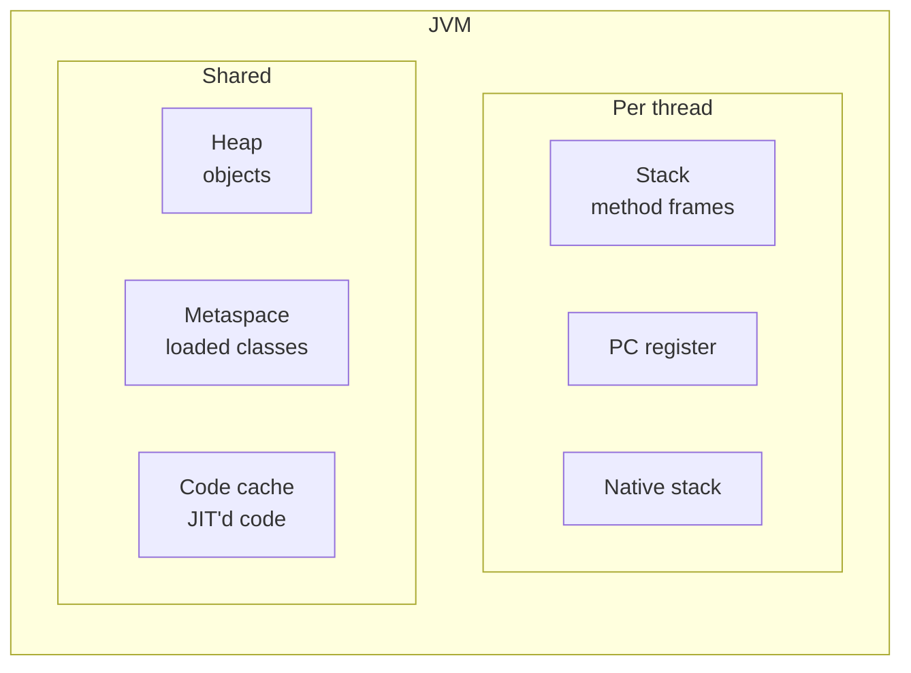
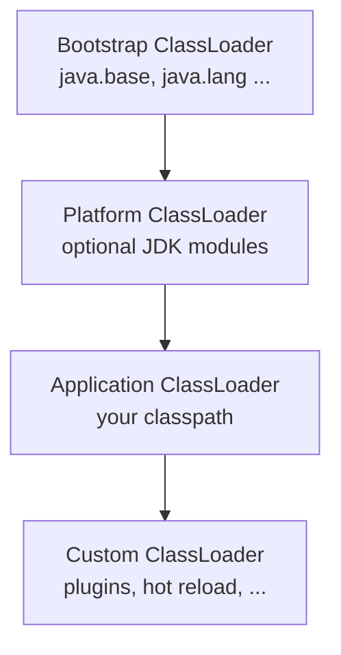
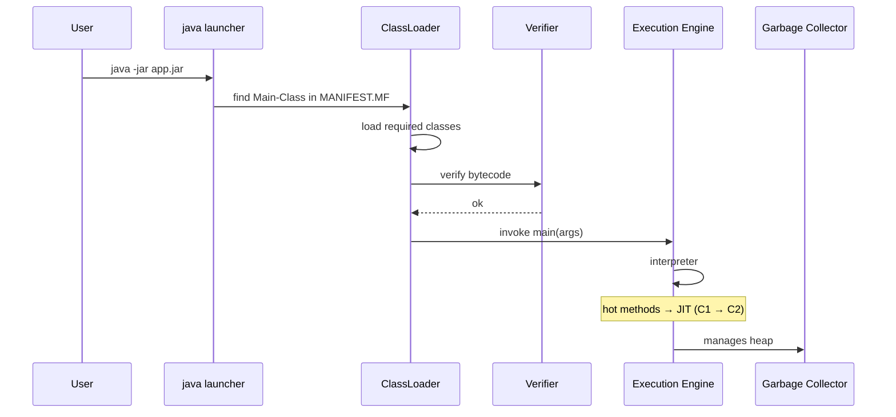

# JVM internals: classloader, bytecode, runtime data areas, JIT

## JVM memory areas



- **Heap**: all `new ...()` objects. Split into Young (Eden + Survivors) and Old/Tenured.
- **Stack**: a stack of **frames** (one per method call). Holds local variables, operand stack, references. One stack per thread.
- **Metaspace**: classes, methods, constants. Replaces the old "PermGen" since Java 8.
- **Code Cache**: native code generated by the JIT.

### Flow example

```java
void m(int x) {
    Person p = new Person("Anna", x);
}
```

- `x` and `p` are in the thread's **stack frame**.
- The `Person` object is on the **heap**.
- The `Person` class is in the **metaspace**.

## Classloaders



**Parent-first delegation**: before loading a class, each classloader asks its parent. This way JDK classes cannot be redefined by user code.

Loading operations:
1. **Loading**: find the `.class` and create the `Class` object.
2. **Linking**: verify bytecode, prepare static fields, resolve symbols.
3. **Initialization**: run static initializers.

When? **On first need** (when a class is first used). `final` primitive constants can be resolved without initializing the class.

### See who loaded what

```java
System.out.println(String.class.getClassLoader());     // null (bootstrap)
System.out.println(MyClass.class.getClassLoader());    // app classloader
```

## Bytecode

Compile `Hello.java` and disassemble:

```powershell
javac Hello.java
javap -c Hello.class
```

Example:

```
0: ldc           #2    // String "Hi"
2: astore_1
3: getstatic     #3    // Field java/lang/System.out
6: aload_1
7: invokevirtual #4    // Method println
10: return
```

Key instructions:
- `aload_N`, `astore_N` — load/store reference at slot N
- `iload_N`, `istore_N` — int
- `getstatic`, `putstatic` — static field access
- `getfield`, `putfield` — instance field access
- `invokevirtual` — polymorphic method call
- `invokestatic` — static method call
- `invokespecial` — constructors, `super.method()`
- `invokedynamic` — runtime resolution (lambdas, modern string concat)
- `invokeinterface` — interface call
- `new`, `dup`, `anewarray` — object/array creation

## Stack frames and operand stack

Each method has:
- **Locals**: slot array for local variables (parameters + `this` included).
- **Operand stack**: stack for computations; instructions read/write here.

```
int z = x + y;
```

Typical bytecode:
```
iload x      // push x to operand stack
iload y      // push y
iadd         // pop 2, push x+y
istore z     // pop into locals[z]
```

## JIT: from bytecode to native

Modern HotSpot uses **tiered compilation**:

1. **Interpreter**: runs bytecode slowly.
2. **C1 (Client)**: compiles to native, quick optimizations.
3. **C2 (Server)**: deep optimizations (inlining, escape analysis, ...).

When a method is called often ("hot"), it goes to C2.

See JIT decisions:

```powershell
java -XX:+PrintCompilation MyApp
```

### JIT optimizations

- **Method inlining**: copy method body into caller (no call overhead).
- **Escape analysis**: if an object doesn't "escape" the method, allocate on stack (no GC).
- **Loop unrolling**: unroll small loops.
- **Dead code elimination**.
- **Speculative inlining**: assume the most frequent class; if wrong, "deopt".

`-XX:+PrintInlining` shows inlined methods.

## What happens with `java -jar app.jar`



## Exercises

<details>
<summary>Ex 15.1 — Explore with javap</summary>

```java
public class Calc {
    public static int add(int a, int b) { return a + b; }
    public static void main(String[] args) { System.out.println(add(2, 3)); }
}
```
Compile and run `javap -c -v Calc.class`. Identify `iload_0`, `iload_1`, `iadd`, `ireturn`.

</details>

<details>
<summary>Ex 15.2 — PrintCompilation</summary>

Write a loop calling a trivial method 100k times. Run with `-XX:+PrintCompilation` and watch when it gets compiled (`n 3 ...` for C1, `n 4 ...` for C2).

</details>

<details>
<summary>Ex 15.3 — Stack overflow</summary>

```java
public class SO {
    static int n = 0;
    public static void f() { n++; f(); }
    public static void main(String[] a) {
        try { f(); } catch (StackOverflowError e) { System.out.println(n); }
    }
}
```

</details>

## Take-aways

- JVM = heap (objects) + per-thread stacks + metaspace (classes) + code cache (JIT).
- Parent-first classloaders. Get this and you understand `ClassNotFoundException` / `NoClassDefFoundError` bugs.
- Bytecode is a virtual instruction set. `javap -c` to read it.
- The JIT compiles hot methods to native via C1/C2. That's why Java is fast.

Next: memory and garbage collection.
