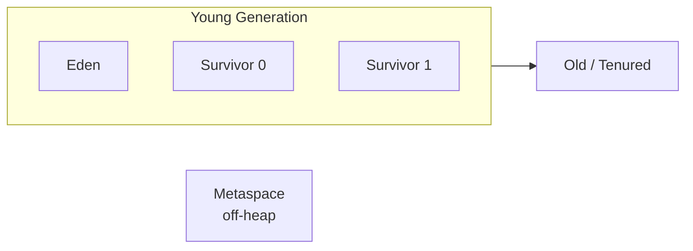

# Memory and garbage collection

## Generational heap



**Generational hypothesis**: most objects die young. So scan young first (more dead, faster GC).

### Object lifecycle

1. `new X()` ⟶ allocated in **Eden**.
2. Eden full ⟶ **Minor GC**: live objects copied to Survivor.
3. Survives `n` minor GCs ⟶ promoted to **Old**.
4. Old full ⟶ **Major GC** (Full GC): slow, stop-the-world.

## Mark-and-sweep + copying

Basic algorithm:
1. **Mark**: starting from GC roots (locals, statics, ...), mark everything reachable.
2. **Sweep/copy**: unmarked = garbage. Eden is copying: live objects are COPIED to survivor (compacts).

## GC algorithms in JDK 21

| GC | Pause | Throughput | Memory | Typical use |
|---|---|---|---|---|
| **Serial** (`-XX:+UseSerialGC`) | High | Medium | Low | Small apps, single-core |
| **Parallel** (`-XX:+UseParallelGC`) | High | **High** | Low | CPU-bound batch |
| **G1** (`-XX:+UseG1GC`) — DEFAULT | Low | Good | Medium | General-purpose apps |
| **ZGC** (`-XX:+UseZGC`) | <1 ms | Good | Larger | Ultra-low latency, large heaps |
| **Shenandoah** (`-XX:+UseShenandoahGC`) | <10 ms | Good | Larger | Low latency (RedHat) |

> For most server apps: **G1 default is fine**. For ultra-low latency (trading, gaming, ad-bidding) consider ZGC.

### Fundamental tuning

```powershell
java -Xms2g -Xmx4g -XX:+UseG1GC -XX:MaxGCPauseMillis=200 -jar app.jar
```

- `-Xms`: initial heap (won't shrink below).
- `-Xmx`: max heap. **Above this: OutOfMemoryError.**
- `-XX:+UseG1GC`: GC choice.
- `-XX:MaxGCPauseMillis`: pause target (G1 best-effort).

**Rule**: for servers set `-Xms == -Xmx`. Avoid runtime heap resizing.

### Monitoring

```powershell
jstat -gc <pid> 1000
jcmd <pid> GC.heap_info
jcmd <pid> GC.run   # force Full GC (don't in prod)
```

Live: VisualVM, JConsole, Java Mission Control, or Micrometer metrics.

## `OutOfMemoryError`: types

| Type | Cause |
|---|---|
| `Java heap space` | Heap too small for working set |
| `GC overhead limit exceeded` | >98% time in GC freeing <2% memory |
| `Metaspace` | Excessive class loading (classloader leak) |
| `Direct buffer memory` | Off-heap (NIO) exhausted |
| `Unable to create new native thread` | OS thread limit reached |

### Heap dump on crash

```powershell
java -XX:+HeapDumpOnOutOfMemoryError -XX:HeapDumpPath=./heap.hprof -jar app.jar
```

Analyze `heap.hprof` with **Eclipse MAT**: dominator tree, leak suspects, retained heap.

## Common Java memory leaks

- **Forgotten collections**: `static List<X>` growing forever.
- **Cache without eviction**: use `LinkedHashMap(accessOrder=true)` or **Caffeine**.
- **Listeners never removed**: hold the old object alive.
- **Unclean ThreadLocal** in reused threads (e.g. Tomcat).
- **Classloader leak**: webapp redeploy leaves old classloaders.

## Weak references (`WeakReference`, `SoftReference`)

```java
WeakReference<X> wr = new WeakReference<>(new X());
// when only wr points to X, GC can collect it
X x = wr.get();   // possibly null
```

- `WeakReference`: GC frees on next cycle if only weakly held.
- `SoftReference`: freed only on memory pressure. Used by some caches.
- `PhantomReference`: post-GC cleanup (rare).
- `WeakHashMap`: keys are `WeakReference`. Removed when no longer reachable.

## Exercises

<details>
<summary>Ex 16.1 — Force an OOM</summary>

```java
List<byte[]> chunks = new ArrayList<>();
while (true) chunks.add(new byte[10 * 1024 * 1024]);
```

Run with `-Xmx128m -XX:+HeapDumpOnOutOfMemoryError`. Open the hprof in MAT.

</details>

<details>
<summary>Ex 16.2 — jstat in action</summary>

Run the previous app. In another terminal:
```powershell
jps
jstat -gc <pid> 500
```
Watch EU (Eden used), OU (Old used), YGC, FGC.

</details>

<details>
<summary>Ex 16.3 — Compare GCs</summary>

Same workload with `-XX:+UseParallelGC` vs `-XX:+UseG1GC` vs `-XX:+UseZGC`. Measure latency and throughput.

</details>

## Take-aways

- Heap is generational: young (fast alloc) and old (long-lived).
- **G1 is the default** in JDK 21. ZGC for sub-ms pauses.
- `-Xms == -Xmx` on servers. Set both.
- `OutOfMemoryError`: dump + Eclipse MAT.
- Memory leaks ⟶ typically static collections or cache without eviction.

Next: practical profiling (JFR, async-profiler, jstack, jmap).
