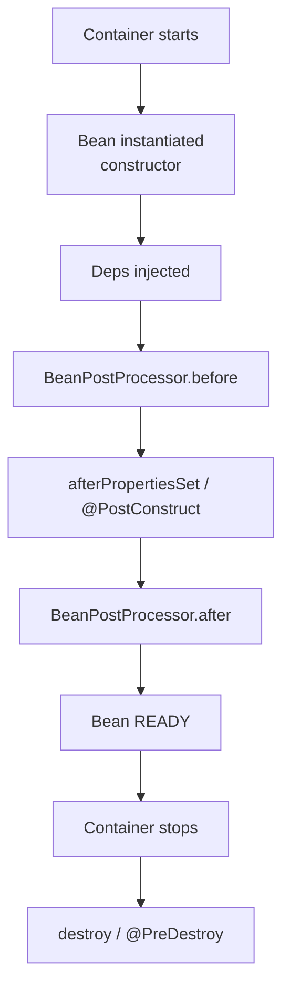

# Beans: scopes, lifecycle, BeanPostProcessor, FactoryBean

## The 6 Spring scopes

| Scope | Instances |
|---|---|
| `singleton` (default) | **One** per container |
| `prototype` | **New on each injection/getBean** |
| `request` | One per HTTP request |
| `session` | One per HTTP session |
| `application` | One per ServletContext |
| `websocket` | One per WebSocket |

```java
@Component
@Scope("prototype")
public class TaskRunner { ... }
```

### Trap: singleton injecting prototype

```java
@Service                                // singleton
public class A {
    @Autowired private B b;             // prototype
}
@Component @Scope("prototype")
public class B { ... }
```

When A is created, B is injected **once**. From then on A always has the same B (despite the scope). Fixes:

1. **`ObjectProvider<B>`**:
   ```java
   @Autowired private ObjectProvider<B> bProvider;
   public void doIt() { B b = bProvider.getObject(); /* new */ }
   ```
2. **Method injection** (`@Lookup`).
3. **Proxy** on the prototype.

## Lifecycle



### Init / destroy callbacks

```java
@Component
public class MyService {
    @PostConstruct
    public void init() { /* after construction + injection */ }
    @PreDestroy
    public void close() { /* before destroy */ }
}
```

Old-school:

```java
public class MyService implements InitializingBean, DisposableBean {
    @Override public void afterPropertiesSet() { ... }
    @Override public void destroy() { ... }
}
```

Or via `@Bean`:

```java
@Bean(initMethod = "init", destroyMethod = "close")
public MyService myService() { ... }
```

## BeanPostProcessor

Global hook that sees **all** beans before/after initialization:

```java
@Component
public class TimingBPP implements BeanPostProcessor {
    @Override
    public Object postProcessBeforeInitialization(Object bean, String name) {
        if (bean instanceof MyService s) { /* intervene */ }
        return bean;
    }
}
```

Spring uses BPP internally to implement `@Autowired`, `@Transactional`, AOP, ...

### BeanFactoryPostProcessor

Lower-level: operates on bean **definitions** before instantiation.

```java
@Component
public class MyBFPP implements BeanFactoryPostProcessor {
    @Override
    public void postProcessBeanFactory(ConfigurableListableBeanFactory bf) {
        BeanDefinition bd = bf.getBeanDefinition("myService");
        bd.setLazyInit(true);
    }
}
```

## `FactoryBean<T>`: bean factory

When creating a bean is complex:

```java
@Component
public class DataSourceFactoryBean implements FactoryBean<DataSource> {
    @Override public DataSource getObject() throws Exception {
        HikariDataSource ds = new HikariDataSource();
        return ds;
    }
    @Override public Class<?> getObjectType() { return DataSource.class; }
    @Override public boolean isSingleton() { return true; }
}
```

`@Autowired DataSource ds` receives the object from `getObject()`, NOT the `FactoryBean`. To get the factory: `@Qualifier("&dataSourceFactoryBean") FactoryBean<DataSource> fb;`.

## Lazy init

```java
@Component
@Lazy
public class HeavyService { ... }   // created on first use
```

Globally:
```yaml
spring.main.lazy-initialization: true
```

> Spring Boot 2.2+ supports lazy init. Faster startup, but config errors surface only on use.

## Profiles

```java
@Component
@Profile("dev")
public class InMemoryRepo implements Repo { ... }

@Component
@Profile("prod")
public class JdbcRepo implements Repo { ... }
```

Activate with `spring.profiles.active=prod` (env, properties, etc.).

## Exercises

<details>
<summary>Ex 23.1 — Singleton vs prototype</summary>

Create a singleton `@Service` injecting a `@Scope("prototype")`. Verify the prototype is always the same. Fix with `ObjectProvider`.

</details>

<details>
<summary>Ex 23.2 — @PostConstruct logger</summary>

Add `@PostConstruct` to log "bean X ready" on each of your services. Run and observe the order.

</details>

<details>
<summary>Ex 23.3 — Timing BeanPostProcessor</summary>

Implement a BPP that logs the init time of each bean.

</details>

## Take-aways

- Default scope: `singleton`. Almost always what you want.
- `prototype` with care. `ObjectProvider` to break it inside singletons.
- `@PostConstruct` for init, `@PreDestroy` for cleanup.
- `BeanPostProcessor` for global extensions (used by Spring itself and Lombok).
- `@Lazy`, `@Profile` for fine control.

Next: configuration (XML, Java config, profiles, conditionals).
