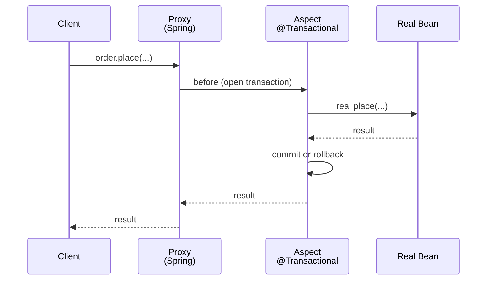

# AOP, proxies, @Transactional: what really happens

## AOP in two lines

**Aspect-Oriented Programming** lets you apply "cross-cutting" behavior (logging, transactions, security) to methods/classes without modifying them. Spring does this via **proxies**.

Vocabulary:
- **JoinPoint**: where the aspect intervenes (in Spring always method invocation).
- **Pointcut**: expression selecting JoinPoints.
- **Advice**: code to run (Before / After / Around).
- **Aspect**: class grouping pointcut + advice.

## Example: timing log

```java
@Aspect
@Component
public class TimingAspect {

    @Around("@annotation(it.zth.app.Timed)")
    public Object measure(ProceedingJoinPoint pjp) throws Throwable {
        long t0 = System.nanoTime();
        try {
            return pjp.proceed();
        } finally {
            long ms = (System.nanoTime() - t0) / 1_000_000;
            System.out.println(pjp.getSignature().getName() + " took " + ms + " ms");
        }
    }
}

@Retention(RUNTIME) @Target(METHOD)
public @interface Timed {}

@Service
public class OrderService {
    @Timed
    public Order place(NewOrder n) { ... }
}
```

Spring intercepts `place(...)`, runs the advice before/after, returns the result.

## Proxies: how the magic works

When a bean has aspects (e.g. `@Transactional`, `@Async`, custom AOP), Spring gives you a **proxy**, not the real class.



### JDK dynamic proxy vs CGLIB

- **JDK proxy**: the bean implements **an interface**, Spring creates an implementing proxy.
- **CGLIB**: bean has **no** interface, Spring creates a runtime **subclass**.

Spring Boot 2.0+ default: **CGLIB always** (`spring.aop.proxy-target-class=true`).

Consequences:
- Final and private methods **cannot** be intercepted.
- `final` classes can't be proxied (CGLIB subclasses them).

## `@Transactional`: the most important aspect

```java
@Service
public class OrderService {
    @Transactional
    public Order place(NewOrder n) {
        // all in one transaction
    }
}
```

What the proxy does:
1. Opens a transaction (gets a `Connection`, `setAutoCommit(false)`).
2. Runs the method.
3. No exception ⟶ **commit**.
4. **RuntimeException** or **Error** ⟶ **rollback**.
5. **Checked** exception ⟶ **commit** (default!). Override with `rollbackFor`:
   ```java
   @Transactional(rollbackFor = Exception.class)
   ```

### Propagation

```java
@Transactional(propagation = Propagation.REQUIRED)     // default
@Transactional(propagation = Propagation.REQUIRES_NEW) // always new (suspend existing)
@Transactional(propagation = Propagation.SUPPORTS)
@Transactional(propagation = Propagation.NOT_SUPPORTED)
@Transactional(propagation = Propagation.NEVER)
@Transactional(propagation = Propagation.MANDATORY)
@Transactional(propagation = Propagation.NESTED)       // savepoint
```

### Read-only

```java
@Transactional(readOnly = true)
public List<X> findAll() { ... }
```

Hibernate may optimize (no dirty checking).

## Trap: self-invocation

```java
@Service
public class A {
    @Transactional
    public void m1() { m2(); }     // m2 will NOT be transactional!

    @Transactional(propagation = REQUIRES_NEW)
    public void m2() { ... }
}
```

`this.m2()` calls the real class method directly, **bypassing the proxy**. Fixes:

1. Inject `A` into itself (`@Autowired private A self`). Ugly.
2. Move `m2` to another bean.
3. Use `AopContext.currentProxy()` (noisy).

**Lesson**: AOP annotations only fire when the method is called **through the proxy** (i.e. from outside the bean).

## Other AOP-based Spring annotations

- `@Async` (requires `@EnableAsync`).
- `@Scheduled` (requires `@EnableScheduling`).
- `@Cacheable`, `@CacheEvict`.
- `@Retryable` (Spring Retry).
- `@PreAuthorize`, `@Secured` (Spring Security).

All share the same proxy mechanism.

## Exercises

<details>
<summary>Ex 25.1 — Logging aspect</summary>

Create `@LogIt` annotation and aspect logging "[IN] X" before, "[OUT] X" after.

</details>

<details>
<summary>Ex 25.2 — @Transactional + rollback</summary>

Service with two updates inside `@Transactional` + throws `RuntimeException`. Verify rollback. Then throw checked exception: notice NO rollback. Add `rollbackFor`.

</details>

<details>
<summary>Ex 25.3 — Self-invocation</summary>

Reproduce the bug: two `@Transactional` methods in the same class, one calling the other. Observe the second doesn't open a new transaction even with `REQUIRES_NEW`.

</details>

## Take-aways

- Spring AOP = proxy interception (CGLIB by default).
- `@Transactional` is the most common case.
- **Rollback** only on RuntimeException, unless `rollbackFor`.
- **Self-invocation bypasses the proxy** — remember this.
- Same mechanism for `@Async`, `@Scheduled`, `@Cacheable`, `@PreAuthorize`.

Next: Spring Boot — auto-configuration, starters, actuator.
