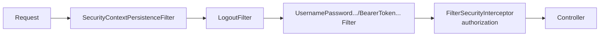

# Spring Security: filter chain, authentication, authorization

## What Spring Security is

A **Servlet filter chain** that intercepts each request before the controller. Solves authentication, authorization, protection (CSRF, XSS headers, ...).



## Adding Security

```xml
<dependency>
  <groupId>org.springframework.boot</groupId>
  <artifactId>spring-boot-starter-security</artifactId>
</dependency>
```

**Immediately** prompts for a password. Default is auto-generated and logged (`Using generated security password: ...`).

## Configuration (Spring Security 6+)

```java
@Configuration
@EnableWebSecurity
public class SecurityConfig {

    @Bean
    public SecurityFilterChain chain(HttpSecurity http) throws Exception {
        http
            .csrf(csrf -> csrf.disable())                  // for stateless REST
            .authorizeHttpRequests(auth -> auth
                .requestMatchers("/api/public/**").permitAll()
                .requestMatchers("/actuator/health").permitAll()
                .requestMatchers("/api/admin/**").hasRole("ADMIN")
                .anyRequest().authenticated()
            )
            .httpBasic(Customizer.withDefaults());
        return http.build();
    }

    @Bean
    public PasswordEncoder passwordEncoder() {
        return new BCryptPasswordEncoder();
    }
}
```

## `UserDetailsService`: where users come from

```java
@Service
public class JpaUserDetailsService implements UserDetailsService {

    private final UserRepository repo;
    public JpaUserDetailsService(UserRepository repo) { this.repo = repo; }

    @Override
    public UserDetails loadUserByUsername(String username) {
        var u = repo.findByEmail(username)
            .orElseThrow(() -> new UsernameNotFoundException(username));
        return User.builder()
            .username(u.getEmail())
            .password(u.getPasswordHash())
            .roles(u.getRoles().toArray(String[]::new))
            .build();
    }
}
```

Spring automatically compares the provided password against the hash using the configured `PasswordEncoder`.

## Authorization

### URL level

See `requestMatchers(...).hasRole("ADMIN")`.

### Method level

```java
@EnableMethodSecurity
@Configuration
public class MethodSec {}

@Service
public class OrderService {

    @PreAuthorize("hasRole('ADMIN') or #order.customerId == authentication.principal.id")
    public Order get(Order order) { ... }
}
```

## JWT (bearer token)

JWT = JSON Web Token. A signed string the server issues at login. Clients include it in `Authorization: Bearer <token>` on subsequent requests.

```xml
<dependency>
  <groupId>org.springframework.boot</groupId>
  <artifactId>spring-boot-starter-oauth2-resource-server</artifactId>
</dependency>
```

```yaml
spring:
  security:
    oauth2:
      resourceserver:
        jwt:
          issuer-uri: https://auth.acme.com
```

```java
http.oauth2ResourceServer(o -> o.jwt(Customizer.withDefaults()));
```

Spring validates the signature using public keys from `https://auth.acme.com/.well-known/jwks.json`.

### Issuing JWTs with `JwtEncoder`

```java
@Bean
public JwtEncoder jwtEncoder(/*RSA keys*/) {
    return new NimbusJwtEncoder(new ImmutableJWKSet<>(jwkSet));
}

public String issue(String subject, Collection<String> roles) {
    JwtClaimsSet claims = JwtClaimsSet.builder()
        .issuer("https://my-app")
        .issuedAt(Instant.now())
        .expiresAt(Instant.now().plus(1, ChronoUnit.HOURS))
        .subject(subject)
        .claim("roles", roles)
        .build();
    return encoder.encode(JwtEncoderParameters.from(claims)).getTokenValue();
}
```

## OAuth2 / OpenID Connect

To delegate login to Google, Microsoft, Keycloak, Okta, Auth0:

```xml
<dependency>
  <groupId>org.springframework.boot</groupId>
  <artifactId>spring-boot-starter-oauth2-client</artifactId>
</dependency>
```

```yaml
spring:
  security:
    oauth2:
      client:
        registration:
          google:
            client-id: ${GOOGLE_CLIENT_ID}
            client-secret: ${GOOGLE_CLIENT_SECRET}
            scope: openid,profile,email
```

```java
http.oauth2Login(Customizer.withDefaults());
```

Result: `/login` has a "Login with Google" button.

## CSRF, CORS, XSS headers

- **CSRF**: defense against forged forms. For **stateless REST APIs** disable: `csrf().disable()`.
- **CORS**: see section 29.
- **Security headers**: Spring Security default enables `X-Frame-Options`, `X-Content-Type-Options`, `Content-Security-Policy`, `Strict-Transport-Security`.

## Password hashing

```java
String hash = encoder.encode("password123");
// $2a$10$...
boolean ok = encoder.matches("password123", hash);
```

**Always BCrypt** (or Argon2). **Never** SHA-256/MD5: too fast, brute-forceable.

## Exercises

<details>
<summary>Ex 31.1 — App with form login</summary>

Add Spring Security, define an in-memory `UserDetailsService` with 2 users (`user/USER`, `admin/ADMIN`). Protect `/admin/**` to `ADMIN`.

</details>

<details>
<summary>Ex 31.2 — JWT resource server</summary>

Configure as "resource server" with `issuer-uri` of a test Keycloak/Auth0. Add `@PreAuthorize` on an endpoint.

</details>

<details>
<summary>Ex 31.3 — Method security</summary>

Enable `@EnableMethodSecurity`. Add `@PreAuthorize("hasRole('ADMIN')")` on a service method. Verify calling as a normal user yields 403.

</details>

## Take-aways

- `SecurityFilterChain` bean: the modern way to configure.
- `UserDetailsService` to integrate with your DB.
- **BCrypt** for passwords.
- JWT with `oauth2-resource-server` (API side).
- OAuth2/OIDC for external login.
- CSRF disabled for stateless REST APIs.

Next: Spring Cloud — microservices, config server, discovery, gateway.
