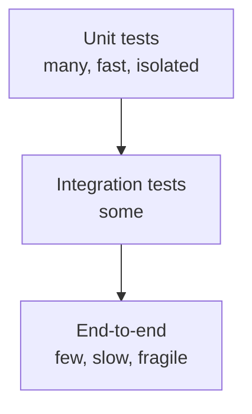

# Testing: JUnit 5, Mockito, MockMvc, Testcontainers

## The test pyramid



**80% unit, 15% integration, 5% E2E**. Sensible balance.

## JUnit 5

```java
import org.junit.jupiter.api.*;
import static org.junit.jupiter.api.Assertions.*;
import static org.assertj.core.api.Assertions.assertThat;

class CalcTest {

    Calc calc;

    @BeforeEach void setup() { calc = new Calc(); }

    @Test
    void sum() {
        assertEquals(5, calc.add(2, 3));
        assertThat(calc.add(2, 3)).isEqualTo(5);
    }

    @Test
    void division_by_zero() {
        assertThrows(ArithmeticException.class, () -> calc.div(1, 0));
    }

    @ParameterizedTest
    @CsvSource({"1, 1, 2", "2, 3, 5", "10, 20, 30"})
    void parameterized(int a, int b, int expected) {
        assertThat(calc.add(a, b)).isEqualTo(expected);
    }

    @Disabled("flaky, to fix")
    @Test
    void test_flaky() {}
}
```

Lifecycle:
- `@BeforeAll` / `@AfterAll` — once (static).
- `@BeforeEach` / `@AfterEach` — before/after each test.

## AssertJ: fluent assertions

```java
assertThat(list).hasSize(3).contains("a", "b").doesNotContain("z");
assertThat(map).containsEntry("a", 1);
assertThat(customer).hasFieldOrPropertyWithValue("name", "Anna");
```

Already in `spring-boot-starter-test`.

## Mockito: mocks and verify

```java
@ExtendWith(MockitoExtension.class)
class OrderServiceTest {

    @Mock CustomerRepository repo;
    @Mock PaymentGateway pay;
    @InjectMocks OrderService svc;

    @Test
    void place_order() {
        Customer c = new Customer("Anna");
        when(repo.findById(1L)).thenReturn(Optional.of(c));
        when(pay.charge(any(), any())).thenReturn("TX123");

        Order o = svc.place(1L, BigDecimal.TEN);

        assertThat(o.getTxId()).isEqualTo("TX123");
        verify(pay).charge(c, BigDecimal.TEN);
        verify(repo, never()).save(any());
    }

    @Test
    void argument_captor() {
        var captor = ArgumentCaptor.forClass(Order.class);
        svc.save(new Order(...));
        verify(repo).saveOrder(captor.capture());
        assertThat(captor.getValue().getTotal()).isEqualTo(BigDecimal.TEN);
    }
}
```

`@Mock`, `@Spy`, `@InjectMocks`, `when(...).thenReturn(...)`, `verify(...)`, `verifyNoMoreInteractions(...)`.

## Spring tests

### `@SpringBootTest` (full integration)

```java
@SpringBootTest
class AppIntegrationTest {

    @Autowired CustomerService svc;

    @Test
    void create_persists() {
        var c = svc.create("Anna");
        assertThat(c.getId()).isNotNull();
    }
}
```

Loads the WHOLE Spring context. **Slow**: use for true end-to-end tests.

### `@WebMvcTest` (MVC only)

```java
@WebMvcTest(CustomerController.class)
class CustomerControllerTest {

    @Autowired MockMvc mvc;
    @MockBean CustomerService svc;

    @Test
    void get_by_id() throws Exception {
        when(svc.get(1L)).thenReturn(new CustomerDto(1L, "Anna"));

        mvc.perform(get("/api/customers/1"))
           .andExpect(status().isOk())
           .andExpect(jsonPath("$.name").value("Anna"));
    }
}
```

Loads only Spring MVC (no JPA, no Security unless configured). Fast.

### `@DataJpaTest`

```java
@DataJpaTest
class CustomerRepositoryTest {

    @Autowired CustomerRepository repo;

    @Test
    void find_by_email() {
        repo.save(new Customer("anna@x.it"));
        var found = repo.findByEmail("anna@x.it");
        assertThat(found).isPresent();
    }
}
```

Only JPA + in-memory H2 by default. Fast.

## Testcontainers: real DBs in tests

```xml
<dependency>
  <groupId>org.testcontainers</groupId>
  <artifactId>junit-jupiter</artifactId>
  <scope>test</scope>
</dependency>
<dependency>
  <groupId>org.testcontainers</groupId>
  <artifactId>postgresql</artifactId>
  <scope>test</scope>
</dependency>
```

```java
@SpringBootTest
@Testcontainers
class IntegrationTest {

    @Container
    @ServiceConnection
    static PostgreSQLContainer<?> postgres = new PostgreSQLContainer<>("postgres:16-alpine");

    @Autowired CustomerRepository repo;

    @Test
    void real_db() {
        repo.save(new Customer("Anna"));
        assertThat(repo.findAll()).hasSize(1);
    }
}
```

`@ServiceConnection` (Spring Boot 3.1+) auto-configures the `DataSource`. No more connection strings.

**Slow**: starts real Postgres in Docker. Use for critical tests (native queries, transactions). For the rest, `@DataJpaTest` with H2.

## REST Assured / RestTemplate for E2E

```java
given()
    .baseUri("http://localhost:8080")
    .contentType(ContentType.JSON)
    .body("""
        {"name":"Anna"}""")
.when()
    .post("/api/customers")
.then()
    .statusCode(201)
    .body("id", notNullValue());
```

## Exercises

<details>
<summary>Ex 33.1 — Unit test with Mockito</summary>

Test `OrderService.place(...)` mocking repository and payment gateway.

</details>

<details>
<summary>Ex 33.2 — `@WebMvcTest`</summary>

Test `CustomerController.create(...)`. Verify 400 returned when `name` empty.

</details>

<details>
<summary>Ex 33.3 — Testcontainers with Postgres</summary>

Integration test saving/loading entities on real Postgres.

</details>

## Take-aways

- 80% unit, 15% integration, 5% E2E.
- JUnit 5 + AssertJ. Mockito for dependencies.
- `@SpringBootTest` (slow, complete), `@WebMvcTest` (MVC only), `@DataJpaTest` (JPA only).
- **MockMvc** to test controllers without a server.
- **Testcontainers** for real DB/Kafka/Redis in tests.

Next: the crown of the path — Spring Batch in depth.
