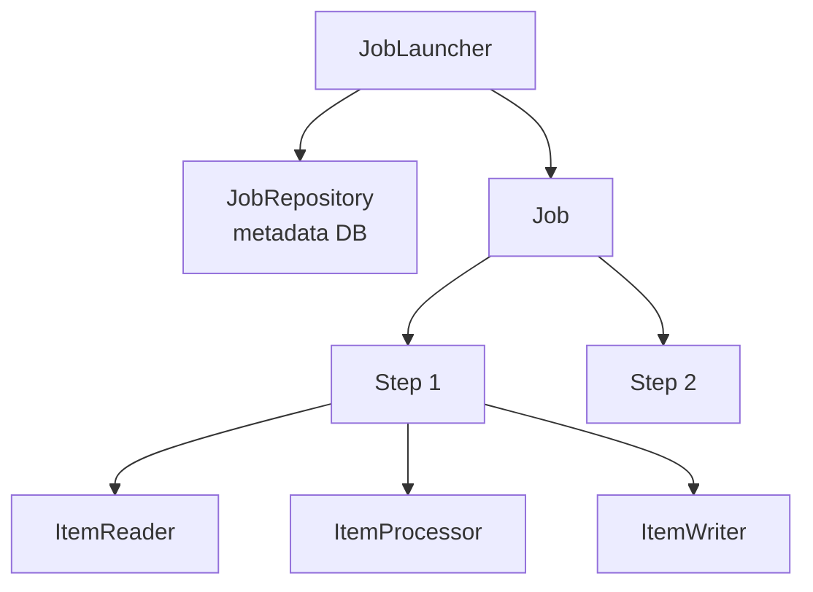
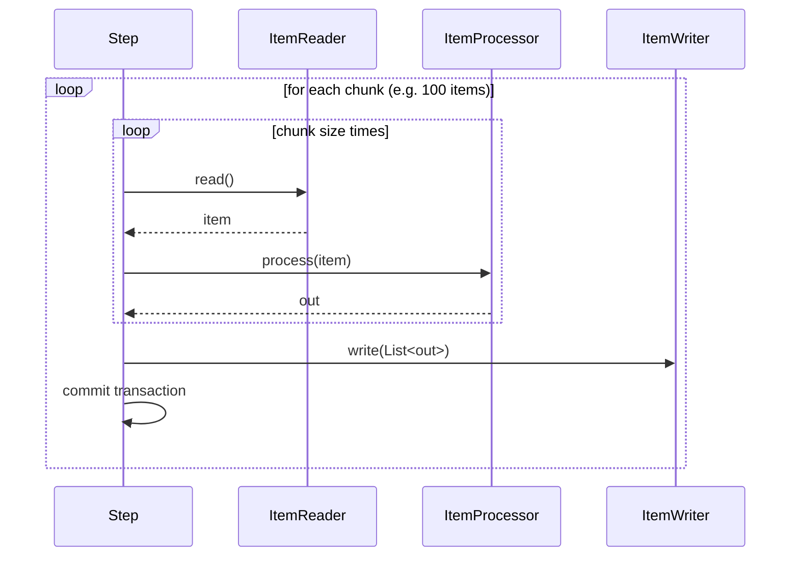

# Spring Batch intro: domain model and first Job

## What Spring Batch is for

Spring Batch is Java's standard framework for **batch processing**: non-interactive workloads that process large data volumes (thousands/millions/billions of records), typically scheduled overnight.

Real-world examples:

- **Bank ETL**: daily import of transactions from source systems, normalization, data warehouse loading.
- **Payment reconciliation**: compare bank statements with app transaction logs.
- **Monthly statements**: generation of millions of statement PDFs.
- **Risk management**: nightly VaR recalculation.
- **Master data sync**: customer master updates.
- **Mass invoicing**: issue 100,000 invoices in one job.

What Spring Batch provides:

- **Chunk** management (transactions per block, not per row).
- **Restart**: if the job crashes mid-way, you resume from where it left off.
- **Skip / retry** of problematic records.
- **Multi-thread** and **partitioning** for scaling.
- Persistent **metadata** on DB (job execution, step execution, state).
- Integration with Spring Boot, scheduling, monitoring.

## Domain model



| Component | Role |
|---|---|
| **`Job`** | Unit of execution (e.g. "daily transactions import"). Contains N steps. |
| **`Step`** | A phase of the job. Two kinds: **chunk-oriented** or **tasklet**. |
| **`ItemReader<T>`** | Reads one item at a time from a source. |
| **`ItemProcessor<I, O>`** | Transforms an item (or filters by returning `null`). Optional. |
| **`ItemWriter<O>`** | Writes a **chunk** of items (list). |
| **`JobLauncher`** | Starts a Job with `JobParameters`. |
| **`JobRepository`** | Persists metadata (executions, states, contexts). |
| **`JobExecution`** | A specific execution of a Job. |
| **`StepExecution`** | A specific execution of a Step. |
| **`ExecutionContext`** | Persisted key/value map: state for restart. |

## Chunk-oriented step

The step reads **N** items (chunk size, e.g. 100), processes them, writes them — all in **one transaction**. Commit, then next chunk.



**Why chunks?**
- Faster than "one transaction per row".
- Fault-tolerant: rollback only the current chunk.
- Great for batch insert.

## Minimal setup (Spring Boot)

```xml
<dependency>
  <groupId>org.springframework.boot</groupId>
  <artifactId>spring-boot-starter-batch</artifactId>
</dependency>
<dependency>
  <groupId>org.springframework.boot</groupId>
  <artifactId>spring-boot-starter-data-jpa</artifactId>
</dependency>
<dependency>
  <groupId>org.postgresql</groupId>
  <artifactId>postgresql</artifactId>
</dependency>
```

```yaml
spring:
  batch:
    jdbc:
      initialize-schema: always   # creates BATCH_JOB_* tables
    job:
      enabled: false              # don't run jobs at startup
  datasource:
    url: jdbc:postgresql://localhost:5432/mydb
    username: postgres
    password: secret
```

## First Job: CSV → DB

`customers.csv`:
```
id,name,email
1,Anna,anna@x.it
2,Beppe,beppe@x.it
3,Carla,carla@x.it
```

Entity:
```java
@Entity
@Table(name = "customer")
public class Customer {
    @Id Long id;
    String name;
    String email;
}
```

Job config:
```java
@Configuration
public class CustomerImportJob {

    @Bean
    public FlatFileItemReader<Customer> reader() {
        return new FlatFileItemReaderBuilder<Customer>()
            .name("customerReader")
            .resource(new ClassPathResource("customers.csv"))
            .linesToSkip(1)
            .delimited()
            .names("id", "name", "email")
            .targetType(Customer.class)
            .build();
    }

    @Bean
    public ItemProcessor<Customer, Customer> processor() {
        return c -> {
            c.setEmail(c.getEmail().toLowerCase());
            return c;
        };
    }

    @Bean
    public JpaItemWriter<Customer> writer(EntityManagerFactory emf) {
        JpaItemWriter<Customer> w = new JpaItemWriter<>();
        w.setEntityManagerFactory(emf);
        return w;
    }

    @Bean
    public Step importStep(JobRepository jobRepo, PlatformTransactionManager tx,
                            ItemReader<Customer> reader,
                            ItemProcessor<Customer, Customer> processor,
                            ItemWriter<Customer> writer) {
        return new StepBuilder("importStep", jobRepo)
            .<Customer, Customer>chunk(100, tx)
            .reader(reader)
            .processor(processor)
            .writer(writer)
            .build();
    }

    @Bean
    public Job importJob(JobRepository jobRepo, Step importStep) {
        return new JobBuilder("importJob", jobRepo)
            .start(importStep)
            .build();
    }
}
```

## Launching the Job

### From CommandLineRunner

```java
@SpringBootApplication
public class App implements CommandLineRunner {

    private final JobLauncher launcher;
    private final Job importJob;

    public App(JobLauncher launcher, @Qualifier("importJob") Job importJob) {
        this.launcher = launcher;
        this.importJob = importJob;
    }

    public static void main(String[] a) { SpringApplication.run(App.class, a); }

    @Override
    public void run(String... args) throws Exception {
        JobParameters params = new JobParametersBuilder()
            .addLong("ts", System.currentTimeMillis())
            .toJobParameters();
        launcher.run(importJob, params);
    }
}
```

`JobParameters` must be **unique** per run (otherwise Spring Batch refuses, thinking it's a restart).

### From REST

```java
@RestController
public class JobController {
    private final JobLauncher launcher;
    private final Job importJob;
    public JobController(JobLauncher launcher, @Qualifier("importJob") Job importJob) {
        this.launcher = launcher; this.importJob = importJob;
    }
    @PostMapping("/jobs/import")
    public Map<String, Object> run() throws Exception {
        var p = new JobParametersBuilder()
            .addLong("ts", System.currentTimeMillis())
            .toJobParameters();
        var exec = launcher.run(importJob, p);
        return Map.of("status", exec.getStatus(), "id", exec.getId());
    }
}
```

### From `@Scheduled`

```java
@EnableScheduling
@Component
public class JobScheduler {
    @Scheduled(cron = "0 0 2 * * *")
    public void nightly() throws Exception {
        var p = new JobParametersBuilder()
            .addLocalDate("date", LocalDate.now())
            .toJobParameters();
        launcher.run(importJob, p);
    }
}
```

## Result verification

The `BATCH_JOB_EXECUTION` table tells you whether the job succeeded:

```sql
SELECT job_instance_id, status, exit_code, start_time, end_time
FROM batch_job_execution
ORDER BY start_time DESC;
```

`status`: `COMPLETED`, `FAILED`, `STOPPED`, `STARTED`, `ABANDONED`.

## ExecutionContext

Map persisted to `BATCH_STEP_EXECUTION_CONTEXT` and `BATCH_JOB_EXECUTION_CONTEXT`. Spring Batch uses it for restart (e.g. "I read up to record 4500"), and you can use it for custom state:

```java
@Component
@StepScope
public class MyReader implements ItemReader<X> {
    private long offset = 0;

    @BeforeStep
    public void beforeStep(StepExecution se) {
        offset = se.getExecutionContext().getLong("offset", 0);
    }

    @AfterStep
    public ExitStatus afterStep(StepExecution se) {
        se.getExecutionContext().putLong("offset", offset);
        return ExitStatus.COMPLETED;
    }
}
```

## Exercises

<details>
<summary>Ex 34.1 — Hello batch</summary>

Minimal setup. Job with a single "tasklet" step printing "hello from batch". Launch from `CommandLineRunner` and check `BATCH_JOB_EXECUTION` on H2.

</details>

<details>
<summary>Ex 34.2 — Chunk CSV → DB</summary>

Implement the example job. Verify that 1000 records in CSV produce 1000 rows in DB.

</details>

<details>
<summary>Ex 34.3 — Job state</summary>

Launch the job twice with the same `JobParameters` (e.g. fixed `ts`). What happens on the 2nd? Change the parameter: the job runs again.

</details>

## Take-aways

- Spring Batch = framework for non-interactive processes on large volumes.
- **Domain model**: Job → Step → Reader + Processor + Writer.
- **Chunk-oriented** (default): transaction per chunk, not per record.
- `JobParameters` unique per run.
- Metadata is **persisted** ⟶ restart, audit, monitoring for free.

Next: JobRepository and metadata in detail.
