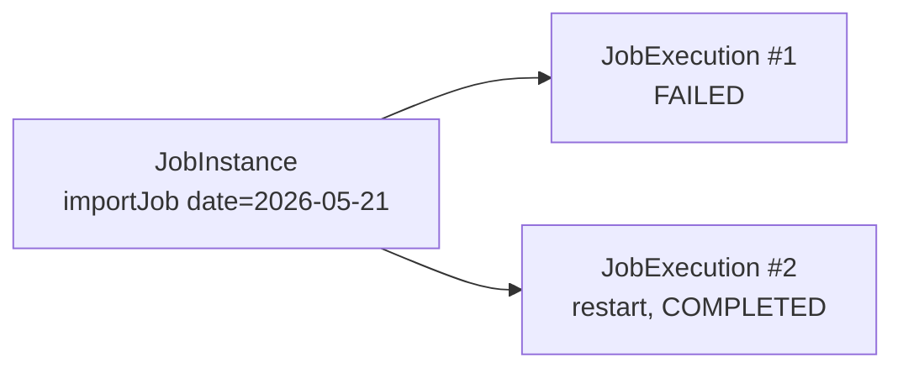

# JobRepository, JobLauncher, metadata schema

## The BATCH_* tables

When `spring.batch.jdbc.initialize-schema=always`, Spring creates:

| Table | Contents |
|---|---|
| `BATCH_JOB_INSTANCE` | A logical job instance (name + identifying parameters). |
| `BATCH_JOB_EXECUTION` | A concrete execution. A `JobInstance` may have multiple executions (restarts). |
| `BATCH_JOB_EXECUTION_PARAMS` | Parameters used. |
| `BATCH_JOB_EXECUTION_CONTEXT` | Job ExecutionContext (serialized). |
| `BATCH_STEP_EXECUTION` | Per-step execution. `read_count`, `write_count`, `commit_count`, `skip_count`, etc. |
| `BATCH_STEP_EXECUTION_CONTEXT` | Per-step ExecutionContext. |
| `BATCH_*_SEQ` | PK sequences. |

## JobInstance vs JobExecution



- **JobInstance** = ("job name" + identifying parameters). Unique for that combination.
- **JobExecution** = an attempt. If the first fails, you can have more (restart) on the same JobInstance.

Spring Batch identifies a JobInstance from `JobParameters` marked **identifying**:

```java
new JobParametersBuilder()
    .addLocalDate("businessDate", date)
    .addString("env", "prod", false)
    .toJobParameters();
```

> Re-launching with same identifying params and previous run `COMPLETED`: Spring refuses (`JobInstanceAlreadyCompleteException`). If `FAILED` or `STOPPED`: treated as **restart**.

## JobExplorer: metadata queries

```java
@Autowired JobExplorer jobExplorer;

List<JobInstance> instances = jobExplorer.getJobInstances("importJob", 0, 10);
JobExecution exec = jobExplorer.getJobExecution(id);
Set<String> names = jobExplorer.getJobNames();
Set<JobExecution> running = jobExplorer.findRunningJobExecutions("importJob");
```

## JobOperator: runtime commands

```java
@Autowired JobOperator op;

op.startNextInstance("importJob");
op.restart(executionId);
op.stop(executionId);
op.abandon(executionId);
```

## Datasource for metadata: separate from business

In production, **separate** the Batch metadata datasource from the business one: lets you truncate/restore business data without touching batch logs.

```java
@Configuration
public class BatchConfig extends DefaultBatchConfiguration {
    @Override
    @Bean
    protected DataSource getDataSource() {
        return new HikariDataSource(...);
    }
}
```

Or declare two `@Bean DataSource` and use `@BatchDataSource`.

## Cleanup

Tables grow with each execution. To avoid gigabytes:

```sql
DELETE FROM batch_step_execution_context
WHERE step_execution_id IN (
    SELECT step_execution_id FROM batch_step_execution
    WHERE start_time < NOW() - INTERVAL '90 days'
);
DELETE FROM batch_step_execution WHERE start_time < NOW() - INTERVAL '90 days';
-- ...
```

Spring Batch 5.x has "deleteJobInstance" APIs.

## Quick lookup query

```sql
SELECT
    ji.job_name,
    je.status,
    je.exit_code,
    je.start_time,
    je.end_time,
    EXTRACT(EPOCH FROM (je.end_time - je.start_time)) AS duration_seconds
FROM batch_job_execution je
JOIN batch_job_instance ji ON ji.job_instance_id = je.job_instance_id
ORDER BY je.start_time DESC
LIMIT 50;
```

## Exercises

<details>
<summary>Ex 35.1 — Explore the tables</summary>

Launch a job 3 times with different params. Inspect `BATCH_JOB_INSTANCE` (3 rows), `BATCH_JOB_EXECUTION` (3 rows).

</details>

<details>
<summary>Ex 35.2 — Manual restart</summary>

Force a fail in the processor (throw at record 50). Job ends FAILED. Relaunch with **same** params: Spring continues from where it stopped (if reader is restartable).

</details>

<details>
<summary>Ex 35.3 — JobExplorer endpoint</summary>

`GET /batch/jobs/{name}/runs` returning last 20 executions with status and duration.

</details>

## Take-aways

- JobInstance = name + identifying params. JobExecution = single attempt.
- `JobExplorer` for queries, `JobOperator` for runtime commands.
- Separate metadata datasource from business datasource.
- Periodically clean tables.

Next: chunk processing in detail (commit interval, skip, retry).
