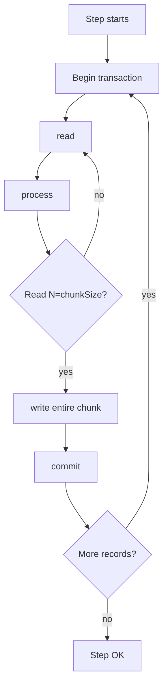

# Chunk processing in detail

## Anatomy of a chunk-oriented step



Basic configuration:

```java
return new StepBuilder("step", jobRepo)
    .<In, Out>chunk(100, tx)
    .reader(reader)
    .processor(processor)
    .writer(writer)
    .build();
```

## Sizing the chunk

| Chunk size | Pros | Cons |
|---|---|---|
| 1 | Maximum granularity, precise restart | Expensive transactions, slow |
| 100-500 | Sweet spot for many cases | — |
| 1000-5000 | High throughput | Expensive rollback on error; more memory |
| 10,000+ | Great with batch-friendly writers (JDBC `addBatch`) | Memory, long-held locks |

**Rule**: start at 100, benchmark. Equilibrium: where throughput plateaus.

## Skip: tolerate errors

```java
.<In, Out>chunk(100, tx)
.reader(reader)
.processor(processor)
.writer(writer)
.faultTolerant()
.skipLimit(50)
.skip(InvalidRecordException.class)
.noSkip(SystemException.class)
```

If `InvalidRecordException` is thrown in reader/processor/writer:
- Record is **skipped** (logged in `BATCH_STEP_EXECUTION.skip_count`).
- Up to `skipLimit` total skips per step. Above, the step fails.

### What happens to the chunk?

Spring does a subtle trick: when a skippable exception occurs during **writing**, it doesn't know which record caused it. Solution:
1. Rollback the chunk.
2. Re-process **one at a time**, finding the culprit.
3. Skip only that one, retry the others.

Consequence: writer in "single-item" mode is slower. **Skip what's necessary**, not as a generic shock absorber.

### Skip listener

```java
@Component
public class MySkipListener implements SkipListener<In, Out> {
    public void onSkipInRead(Throwable t) { log.warn("skip read: {}", t.getMessage()); }
    public void onSkipInProcess(In item, Throwable t) { log.warn("skip proc {}: {}", item, t.getMessage()); }
    public void onSkipInWrite(Out item, Throwable t) { log.warn("skip write {}: {}", item, t.getMessage()); }
}
```

Register:
```java
.listener(new MySkipListener())
```

## Retry: transient errors

```java
.faultTolerant()
.retryLimit(3)
.retry(TransientException.class)
.retry(DataAccessResourceFailureException.class)
```

Transient error ⟶ Spring retries up to `retryLimit` (with exponential backoff if configured).

```java
.backOffPolicy(new ExponentialBackOffPolicy() {{
    setInitialInterval(200);
    setMultiplier(2);
    setMaxInterval(5000);
}})
```

### Skip + Retry together

Order: retry first (if transient succeeds). Then skip (if persistent).

## What happens on rollback

When a chunk rolls back:
- **DB writes** are reverted.
- `read_count` stays (read isn't transactional).
- Records are re-processed in the next chunk.

**Consequence**: processor side-effects (e.g. `System.out.println`, an email) are NOT undone. Processor idempotency is a virtue.

## `noRollback` (specific writers)

```java
.faultTolerant()
.noRollback(BusinessValidationException.class)
```

Case: "soft" validation that shouldn't invalidate the whole transaction.

## Various listeners

```java
.listener(stepListener)         // @BeforeStep, @AfterStep
.listener(chunkListener)        // @BeforeChunk, @AfterChunk, @AfterChunkError
.listener(itemReadListener)
.listener(itemProcessListener)
.listener(itemWriteListener)
.listener(skipListener)
.listener(retryListener)
```

## Pattern: errors to "dead letter queue"

```java
public class ErrorDlqWriter implements SkipListener<In, Out> {

    private final JdbcTemplate jdbc;

    @Override
    public void onSkipInProcess(In item, Throwable t) {
        jdbc.update(
            "INSERT INTO batch_errors(payload, error, ts) VALUES (?, ?, NOW())",
            item.toString(), t.getMessage()
        );
    }
}
```

In production: skipped records get **archived** for manual reprocessing.

## Exercises

<details>
<summary>Ex 36.1 — Chunk size benchmark</summary>

Run Ex 34.2's job with chunk 1, 10, 100, 1000, 10000. Time each. Find the sweet spot.

</details>

<details>
<summary>Ex 36.2 — Controlled skip</summary>

In processor, throw `InvalidRecordException` if `email` lacks `@`. Configure `skipLimit(10)`. Verify `BATCH_STEP_EXECUTION.skip_count`.

</details>

<details>
<summary>Ex 36.3 — Transient retry</summary>

Simulate a writer that fails 2 out of 100. Configure retry and verify success.

</details>

## Take-aways

- Chunk = transactional unit. Size: benchmark 100-1000.
- `.faultTolerant()` + `.skip(...)` + `.retry(...)` for error handling.
- Skip listener mandatory for audit.
- Processor idempotency: the chunk may roll back.

Next: tasklets, flow control (decisions, splits, conditionals).
