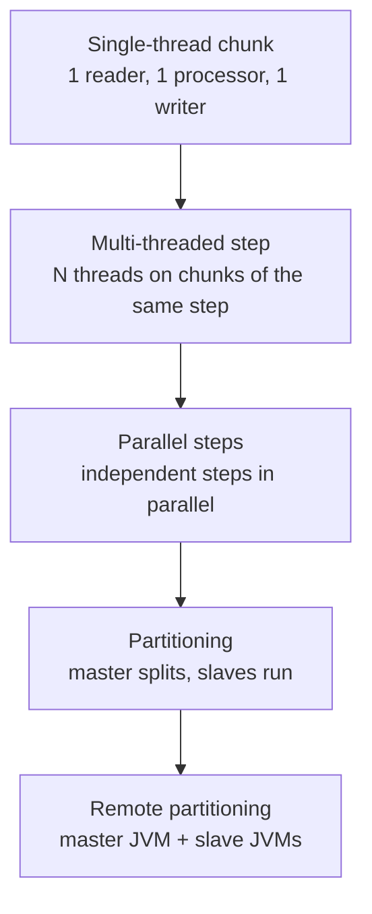
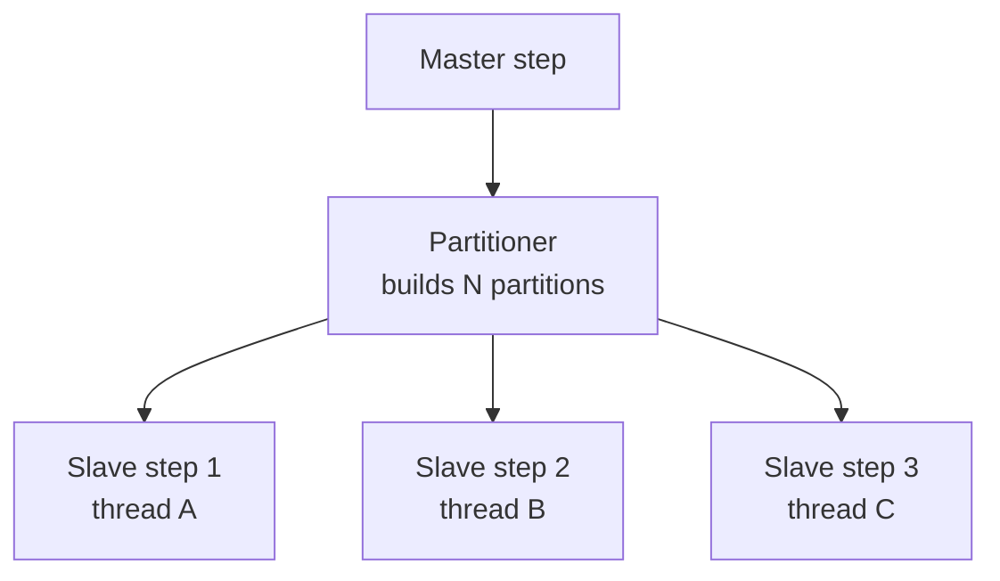
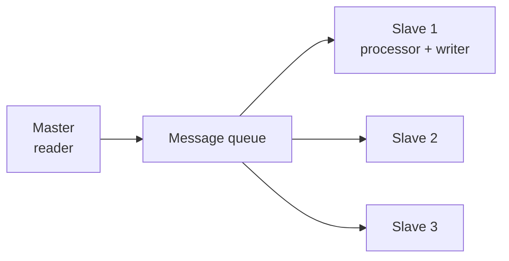

# Scaling: parallelizing Jobs

## Four strategies



## 1) Multi-threaded step

Multiple threads run the same step concurrently.

```java
@Bean
public Step mtStep(JobRepository jr, PlatformTransactionManager tx,
                    ItemReader<X> reader, ItemWriter<X> writer) {
    return new StepBuilder("mt", jr)
        .<X, X>chunk(100, tx)
        .reader(reader)
        .writer(writer)
        .taskExecutor(new ThreadPoolTaskExecutor() {{
            setCorePoolSize(8);
            setMaxPoolSize(8);
            initialize();
        }})
        .build();
}
```

**Constraints**:
- The **reader must be thread-safe** (most standard ItemReaders are NOT).
- `JdbcCursorItemReader` NOT thread-safe.
- `JdbcPagingItemReader` IS thread-safe.
- `FlatFileItemReader` not thread-safe (threads would read random lines).

For files: use `SynchronizedItemStreamReader` as a wrapper, but there's still a bottleneck.

> Multi-threaded step works well with paging DB readers. For files: prefer partitioning.

## 2) Parallel steps (split)

See section 37: independent steps in `Flow.split()`.

Typical: "step A downloads from source 1, step B from source 2, then step C merges".

## 3) Local partitioning

The **master** splits work into **N partitions**. Each partition runs a **slave** step instance in a different thread.



```java
@Component
public class CityPartitioner implements Partitioner {
    @Override
    public Map<String, ExecutionContext> partition(int gridSize) {
        Map<String, ExecutionContext> partitions = new HashMap<>();
        List<String> cities = List.of("Milan", "Rome", "Naples", "Turin");
        int i = 0;
        for (String city : cities) {
            ExecutionContext ec = new ExecutionContext();
            ec.putString("city", city);
            partitions.put("partition-" + (i++), ec);
        }
        return partitions;
    }
}

@Bean
public Step slaveStep(JobRepository jr, PlatformTransactionManager tx) {
    return new StepBuilder("slave", jr)
        .<Customer, Customer>chunk(500, tx)
        .reader(partitionedReader(null))
        .writer(writer())
        .build();
}

@Bean
@StepScope
public JdbcPagingItemReader<Customer> partitionedReader(
        @Value("#{stepExecutionContext['city']}") String city) {
    // reader filtered by city
}

@Bean
public Step masterStep(JobRepository jr, Step slaveStep, CityPartitioner partitioner) {
    return new StepBuilder("master", jr)
        .partitioner("slave", partitioner)
        .step(slaveStep)
        .taskExecutor(new SimpleAsyncTaskExecutor())
        .gridSize(4)
        .build();
}
```

**Advantages over multi-thread**:
- Each partition has its own reader (usually over disjoint subsets).
- No synchronization.
- Restart works per partition.

Patterns:
- **By range**: `WHERE id BETWEEN 1 AND 1000`, then 1001-2000, ...
- **By natural key**: per city, per category, per day.
- **By hash**: `WHERE MOD(id, 4) = 0` for partition 0, etc.

## 4) Remote partitioning

Master and slaves on **different JVMs** (or machines). Master sends messages (RabbitMQ, Kafka, JMS); slaves consume and process.

Complex setup. Used in production on Kubernetes for horizontal scaling.

See `spring-batch-integration` (`MessageChannelPartitionHandler`).

## Remote chunking

Different from partitioning: the **master** has the reader and sends chunks via messaging to slaves that process and write.



When? Reader is the bottleneck and processor is heavy. Rarer than partitioning.

## Tuning: how many threads?

CPU-bound: `logical core count`. I/O-bound (DB, HTTP): more, benchmark.

`spring.task.execution.pool.core-size = 8` (Spring Boot 3) for default executor.

## Which strategy?

| Scenario | Strategy |
|---|---|
| Fast reader, light processor, small data | Single-thread |
| Paginated DB reader, light processor | **Multi-threaded step** |
| Two independent sources then merge | **Parallel steps (split)** |
| Data partitionable by natural key | **Local partitioning** |
| Extreme throughput, K8s | **Remote partitioning** |

## Exercises

<details>
<summary>Ex 40.1 — Multi-threaded</summary>

Ex 34.2 job with `JdbcPagingItemReader`. Add `taskExecutor` with 4 threads. Measure speedup.

</details>

<details>
<summary>Ex 40.2 — Range partitioning</summary>

Partitioner splitting 1M records into 8 partitions of 125k. Each slave reads a range with `JdbcPagingItemReader`. Measure total time.

</details>

<details>
<summary>Ex 40.3 — Partitioned restart</summary>

Force a fail at 50% in one partition. On restart, only the failed partition runs again.

</details>

## Take-aways

- 4 scaling strategies. Choose based on bottleneck.
- **Multi-thread step**: thread-safe reader required (paging yes).
- **Local partitioning**: most powerful manageable pattern.
- **Remote partitioning**: horizontal scaling on K8s.
- Benchmark before choosing chunk size and thread count.

Next: listeners, restart, monitoring, K8s integration.
