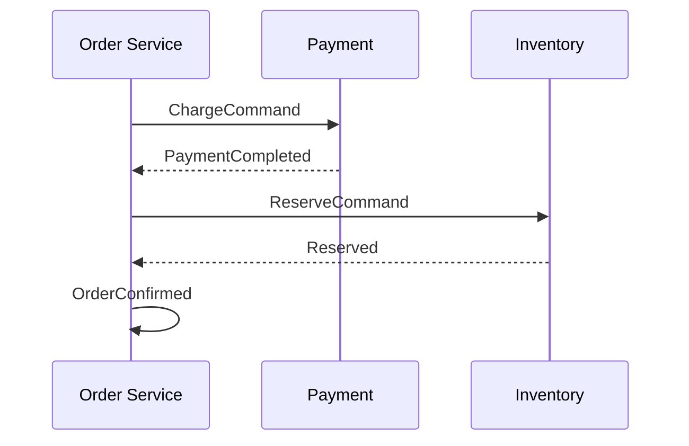

# Essential design patterns in Java/Spring

## GoF patterns in modern Java

### Singleton

A single instance.

```java
public class Logger {
    private static final Logger INSTANCE = new Logger();
    private Logger() {}
    public static Logger get() { return INSTANCE; }
}
```

In Spring, default scope is singleton: all `@Component` are singletons **per ApplicationContext**. Don't hand-roll singletons in Spring.

### Factory Method / Abstract Factory

Decentralize creation.

```java
public interface Connection { ... }

public class ConnectionFactory {
    public static Connection of(String type) {
        return switch (type) {
            case "tcp" -> new TcpConnection();
            case "udp" -> new UdpConnection();
            default -> throw new IllegalArgumentException();
        };
    }
}
```

In Spring: `@Bean` methods in `@Configuration` *are* factory methods.

### Builder

For objects with many optional params:

```java
public class HttpRequest {
    private final String url;
    private final String method;
    private final Map<String, String> headers;

    private HttpRequest(Builder b) { ... }
    public static Builder builder() { return new Builder(); }

    public static class Builder {
        private String url, method = "GET";
        private final Map<String, String> headers = new HashMap<>();
        public Builder url(String u) { this.url = u; return this; }
        public Builder method(String m) { this.method = m; return this; }
        public Builder header(String k, String v) { this.headers.put(k, v); return this; }
        public HttpRequest build() { return new HttpRequest(this); }
    }
}

HttpRequest r = HttpRequest.builder().url("...").header("X", "Y").build();
```

In practice: use **Lombok `@Builder`** or **records** + explicit constructor.

### Strategy

Swap algorithm at runtime.

```java
public interface PricingStrategy {
    BigDecimal price(Cart cart);
}

public class StandardPricing implements PricingStrategy { ... }
public class BlackFridayPricing implements PricingStrategy { ... }

@Service
public class Checkout {
    private PricingStrategy strategy;
    public void setStrategy(PricingStrategy s) { this.strategy = s; }
    public BigDecimal price(Cart c) { return strategy.price(c); }
}
```

In Spring: inject `List<PricingStrategy>` and pick dynamically. Or `@Qualifier`.

### Template Method

Fixed algorithm, variable details.

```java
public abstract class HttpService {
    public final Response call(Request r) {
        beforeCall(r);
        Response res = doCall(r);
        afterCall(r, res);
        return res;
    }
    protected void beforeCall(Request r) {}
    protected abstract Response doCall(Request r);
    protected void afterCall(Request r, Response res) {}
}
```

### Observer / Pub-Sub

Decouple producers/consumers.

In Spring:
```java
@Component
public class OrderService {
    private final ApplicationEventPublisher publisher;
    public void place(Order o) {
        publisher.publishEvent(new OrderPlacedEvent(o));
    }
}

@Component
public class EmailListener {
    @EventListener
    public void on(OrderPlacedEvent e) { ... }
}
```

`@Async` for async execution.

### Decorator

Add behavior to an object without modifying it.

```java
public interface DataSource {
    Connection getConnection();
}

public class CachingDataSource implements DataSource {
    private final DataSource delegate;
    public CachingDataSource(DataSource d) { this.delegate = d; }
    @Override public Connection getConnection() {
        return delegate.getConnection();
    }
}
```

In Spring: `@Cacheable`, `@Transactional` are decorators (via proxy).

### Adapter

Adapt one interface to another.

```java
public interface PaymentGateway {
    String charge(BigDecimal amount);
}

public class StripeAdapter implements PaymentGateway {
    private final StripeApi stripe;

    @Override
    public String charge(BigDecimal amount) {
        return stripe.createCharge(amount.movePointRight(2).intValueExact()).id();
    }
}
```

Isolate your app from external APIs.

### Proxy

Replace the real object with a stand-in. Spring AOP uses proxies everywhere.

### Command

Wrap a request as an object.

```java
public interface Command {
    void execute();
}

public class SendEmail implements Command {
    private final Email email;
    @Override public void execute() { /* send */ }
}

queue.submit(new SendEmail(...));
```

Java's `Runnable` is essentially a Command.

## DDD-lite patterns

### Repository

Persistence abstraction:

```java
public interface CustomerRepository {
    Optional<Customer> findById(long id);
    Customer save(Customer c);
}
```

Spring Data gives you the implementation for free.

### Service

Orchestrating business logic:

```java
@Service
public class OrderService {
    private final CustomerRepository customers;
    private final InventoryService inventory;
    private final PaymentGateway payment;

    @Transactional
    public Order place(NewOrder req) {
        Customer c = customers.findById(req.customerId()).orElseThrow();
        inventory.reserve(req.items());
        String txId = payment.charge(c, req.total());
        // ...
    }
}
```

### Value Object

Immutable, only its value matters (no identity).

```java
public record Money(BigDecimal amount, String currency) {
    public Money {
        Objects.requireNonNull(amount);
        Objects.requireNonNull(currency);
    }
    public Money add(Money other) {
        if (!currency.equals(other.currency)) throw new IllegalArgumentException();
        return new Money(amount.add(other.amount), currency);
    }
}
```

Modern Java **records** are perfect for this.

### Aggregate

"Root" entity managing a graph of others.

```java
@Entity
public class Order {
    @Id Long id;
    @OneToMany(cascade = ALL, orphanRemoval = true)
    List<OrderLine> lines = new ArrayList<>();

    public void addLine(Product p, int qty) {
        if (qty <= 0) throw new IllegalArgumentException();
        lines.add(new OrderLine(p, qty));
    }
}
```

The `Order` aggregate is the only "entry point": you don't manipulate `OrderLine` externally.

### Specification

See section 27.

### Saga (microservices)

Distributed transactions via events.



On error: emit **compensating events** (Refund, Release).

## Anti-patterns to avoid

- **God class**: 2000-line classes. Split by responsibility.
- **Anemic domain model**: entities with only getters/setters, all logic in services. For complex rules, move logic into entities.
- **Service Locator**: instead of DI. Use DI.
- **Mutable singleton**: shared state, guaranteed concurrency bugs.
- **N+1**: see section 20.

## Exercises

<details>
<summary>Ex 42.1 — Strategy for VAT</summary>

`VatStrategy` with `Standard` (22%), `Reduced` (10%), `SuperReduced` (4%). Inject `Map<String, VatStrategy>` into a service.

</details>

<details>
<summary>Ex 42.2 — Builder with record</summary>

`record HttpReq(String url, String method, Map<String,String> headers)` with inner fluent `builder()` factory.

</details>

<details>
<summary>Ex 42.3 — Event-driven</summary>

`OrderPlacedEvent`, listener sending email. Add `@Async`.

</details>

## Take-aways

- The 10 GoF patterns in Java: most are already "embodied" in Spring.
- DDD-lite: Repository + Service + Value Object + Aggregate for complex apps.
- Saga for distributed transactions (microservices).
- Avoid anti-patterns: god class, service locator, mutable singleton.

Next: production-grade performance tuning and observability.
