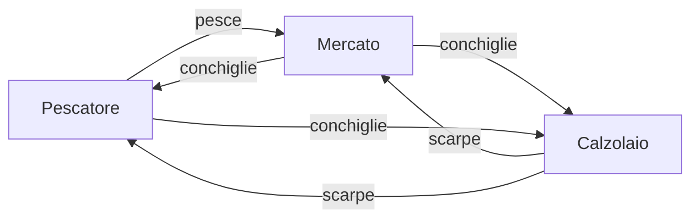
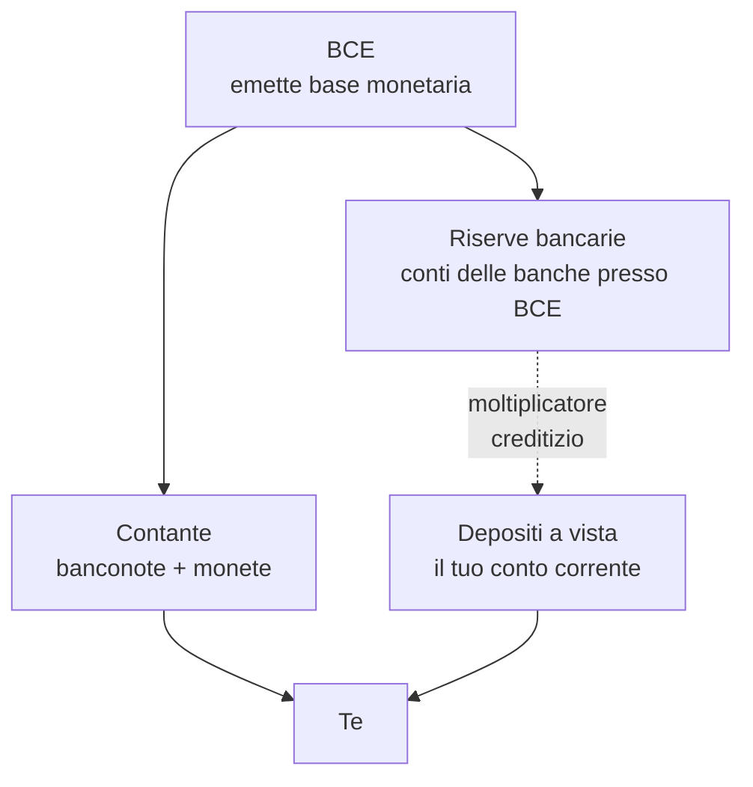

# Cos'è il denaro (e come è cambiato)

Se ti chiedo cos'è il denaro, probabilmente pensi alle banconote nel portafoglio o al saldo del conto. Bene: hai già toccato due cose molto diverse fra loro, e questo capitolo serve a capire perché. Il denaro non è un oggetto: è un **accordo sociale** che si è evoluto per migliaia di anni. Conoscere questa evoluzione cambia il modo in cui leggi le notizie sull'inflazione, sulle banche centrali, su Bitcoin e sui mutui.

## 1. Perché il baratto non bastava

Immagina un mondo senza denaro. Sei un pescatore e vuoi un paio di scarpe. Devi trovare un calzolaio che (a) abbia scarpe della tua taglia, (b) voglia pesce, (c) voglia esattamente la quantità di pesce che hai oggi. Gli economisti chiamano questo problema la **doppia coincidenza dei desideri**: serve che le due controparti vogliano l'una ciò che l'altra ha, contemporaneamente.

Risultato: o trovi un calzolaio molto affamato, o non compri scarpe. Il baratto funziona in piccoli villaggi ma collassa appena la divisione del lavoro cresce. Quindi le società hanno iniziato a usare un **bene intermedio**: una cosa che tutti accettano in cambio di altro, anche se non gli serve direttamente.

Le conchiglie qui sono **merce-moneta**: hanno un valore intrinseco limitato ma sono accettate da tutti.

## 2. Le tappe storiche

| epoca | forma di denaro | esempio |
|---|---|---|
| ~9000 a.C. | merci-moneta (commodity money) | bestiame, sale, grano, conchiglie cauri |
| ~700 a.C. | metallo coniato | stateri di Lidia, electrum |
| ~1100 d.C. | banconote cartacee | Cina dei Song (jiaozi) |
| ~1600 | banconote convertibili in oro | Banco di Stoccolma 1661 |
| 1944 | gold-exchange standard | Bretton Woods (dollaro ancorato a oro, altre valute al dollaro) |
| 1971 | fiat money pura | Nixon chiude il gold window |
| 1995→ | moneta scritturale / digitale | bonifici elettronici, carte, app |
| 2009→ | criptovalute decentralizzate | Bitcoin (Nakamoto 2008) |
| 2020→ | CBDC sperimentali | e-CNY cinese, euro digitale in studio |

Tre punti di rottura importanti:

- **VII secolo a.C., Lidia**: la prima moneta coniata standardizzata. Il re garantisce peso e purezza con un sigillo. Nasce l'idea di **fiducia istituzionale** dietro la moneta.
- **1971, Nixon**: il dollaro non è più convertibile in oro a 35$/oncia. Da quel giorno **tutte le valute principali sono "fiat"**: valgono perché lo Stato dice che valgono (e perché tu lo accetti).
- **2009, Bitcoin**: per la prima volta una moneta esiste senza emittente, senza banca centrale, senza Stato — solo software e crittografia. Indipendentemente da cosa ne pensi, è una rottura concettuale enorme.

## 3. Le tre funzioni del denaro

Tutti i manuali di macroeconomia (Mishkin, Blanchard, Mankiw) ripetono la stessa tassonomia. Il denaro è denaro se svolge **tutte e tre** queste funzioni:

### 3.1 Mezzo di scambio (medium of exchange)
È accettato in pagamento. Se vai in un bar a Milano e ordini un caffè, paghi con euro. Non puoi pagare con barre d'oro: l'oro è una **riserva di valore** ma non un mezzo di scambio quotidiano.

### 3.2 Unità di conto (unit of account)
È il metro che usi per misurare il valore di tutte le altre cose. Quando dici "questo divano costa 800€", stai usando l'euro come **righello del valore**. In un'economia con iperinflazione (vedremo il caso Weimar nel [capitolo sull'inflazione](04-inflazione.html)), il denaro smette di essere unità di conto perché i prezzi cambiano ogni ora e la gente inizia a fare i conti in dollari o in beni reali.

### 3.3 Riserva di valore (store of value)
Se metto 1000€ sotto il materasso, fra un anno dovrebbero valere ancora qualcosa. Questa funzione è la più fragile: l'inflazione la erode. Con il 3% di inflazione annua, 1000€ di oggi valgono circa 740€ fra 10 anni in potere d'acquisto reale.

> Una moneta che fallisce anche una sola di queste tre funzioni smette di essere moneta. È il motivo per cui la riforma monetaria post-iperinflazione richiede di **introdurre una nuova valuta**, non di "aggiustare" quella vecchia.

## 4. Fiat money: cosa significa davvero

"Fiat" è latino: *fiat lux*, "sia fatta la luce". **Fiat money è denaro per decreto**: vale perché lo Stato lo impone come *legal tender* (moneta a corso legale) e perché collettivamente lo accettiamo.

Punti chiave:

1. **Non ha valore intrinseco**: una banconota da 50€ è un foglio di cotone-lino che costa pochi centesimi a stampare.
2. **Non è convertibile in nulla di tangibile**: nessuno alla BCE ti darà oro o argento in cambio.
3. **Si regge su tre pilastri**: la fiducia nello Stato emittente, l'obbligo legale di accettarla, e la rete di accettazione di tutti gli altri.
4. **La quantità è discrezionale**: la banca centrale può espandere o contrarre l'offerta (lo vedremo nel [capitolo sulle banche centrali](03-banche-centrali.html)).

Questo significa che la stabilità del denaro fiat dipende interamente dalla **credibilità della banca centrale**. Se la gente smette di crederci, il sistema crolla — è successo molte volte, dall'assignat francese (1789) al bolívar venezuelano (oggi).

## 5. Moneta legale, contante, depositi: non sono la stessa cosa

Qui c'è una confusione comune. Quando guardi il tuo conto e leggi "saldo: 3.500€", quei 3.500€ **non sono denaro della BCE**: sono un **credito** verso la tua banca commerciale.

- **Contante (cash)**: banconote € e monete €. Sono **passività della BCE/Eurosistema**. Se la tua banca fallisce, le banconote nel tuo portafoglio valgono comunque.
- **Depositi bancari**: sono **passività della banca commerciale**. Se Unicredit fallisse, i tuoi depositi sarebbero protetti solo fino a 100.000€ dal Fondo Interbancario di Tutela dei Depositi (FITD, normativa UE).
- **Moneta scritturale / elettronica**: è il deposito visto dal punto di vista del flusso (bonifici, carte di debito, SEPA Instant). Tecnicamente è sempre un deposito che si muove.

Differenza pratica: in caso di crisi bancaria, **il contante è più sicuro del deposito**. Per questo nelle code agli ATM durante una crisi (Grecia 2015, Cipro 2013) la gente preleva tutto: sta convertendo un credito su banca in moneta della banca centrale.

## 6. Gli aggregati monetari: M0, M1, M2, M3

Le banche centrali misurano la "quantità di denaro" in circolazione con aggregati a strati crescenti di liquidità. La definizione BCE per l'area euro:

| aggregato | cosa include | grado di liquidità |
|---|---|---|
| **M0** (base monetaria) | contante in circolazione + riserve bancarie presso BCE | massima |
| **M1** | M0 (escluse riserve) + depositi a vista | altissima |
| **M2** | M1 + depositi con scadenza ≤ 2 anni + depositi rimborsabili con preavviso ≤ 3 mesi | media |
| **M3** | M2 + pronti contro termine + quote di fondi monetari + titoli di debito a breve | minore |

Un esempio numerico al 2024 (ordini di grandezza, fonte: BCE Statistical Data Warehouse):

- M1 area euro ≈ **10.700 miliardi €**
- M3 area euro ≈ **16.500 miliardi €**

Perché ti importa? Perché:

1. La **crescita di M3** è uno degli indicatori storici usati dalla BCE per valutare le pressioni inflazionistiche di medio periodo (il "secondo pilastro" della strategia BCE fino al 2021).
2. Quando senti dire "la FED stampa denaro", in realtà si parla di espansione di M0 (riserve bancarie) via QE — non significa automaticamente che cresca M2/M3, perché dipende da quanto le banche prestano.

## 7. Esempio numerico: come una banca "crea" denaro

Una banca riceve un deposito da te di 1.000€. Tiene una **riserva obbligatoria** (in area euro è 1% sui depositi a vista dal 2012, era 2% prima) e presta il resto.

| passo | banca | depositi totali | riserve | prestiti |
|---|---|---|---|---|
| 1 | A riceve 1.000€ | 1.000 | 10 | 990 |
| 2 | i 990 finiscono in B | 1.990 | 19,9 | 1.970,1 |
| 3 | i 980,1 finiscono in C | 2.970,1 | 29,7 | 2.940,4 |
| ... | | | | |
| ∞ | limite | 100.000 | 1.000 | 99.000 |

Il **moltiplicatore monetario** teorico è $1/r$ dove $r$ è il coefficiente di riserva. Con $r = 1\%$, il moltiplicatore è 100. Nella realtà è molto più basso perché le banche tengono riserve in eccesso e la gente tiene contante, ma il principio resta: **le banche commerciali creano moneta scritturale ogni volta che concedono un prestito**.

Formula sintetica:

$$M = m \cdot B$$

dove $M$ è l'offerta totale di moneta, $B$ la base monetaria (M0) e $m$ il moltiplicatore.

## 8. Bitcoin e "moneta digitale": perché il nome è ambiguo

Bitcoin viene spesso chiamato "moneta digitale", ma rispetto alle tre funzioni:

- **Mezzo di scambio**: accettato sì, ma marginalmente. Non puoi pagare il caffè a Milano in BTC (legalmente sì in El Salvador dal 2021, di fatto poco usato).
- **Unità di conto**: nessuno fattura in BTC. La volatilità (±10% al giorno non è raro) lo rende inutilizzabile come righello.
- **Riserva di valore**: dibattito aperto. Storicamente è cresciuto molto (da centesimi a decine di migliaia di dollari) ma con drawdown del −80%.

Quindi: Bitcoin oggi è più simile a un **asset speculativo o "oro digitale"** che a una moneta nel senso classico. È una rottura tecnologica importantissima (la blockchain risolve il problema della *double spending* senza un'autorità centrale, paper Nakamoto 2008), ma chiamarlo "moneta" è una semplificazione.

Le **CBDC** (Central Bank Digital Currency) sono un'altra storia: sono moneta della banca centrale in forma digitale. L'euro digitale, in fase di studio dalla BCE (decisione attesa 2025–26), sarebbe **passività della BCE** come il contante, ma su infrastruttura digitale.

## 9. Esercizio guidato

Esercizio: calcola quanto vale 1000€ di oggi fra 30 anni con inflazione media 2%

Usa la formula del potere d'acquisto reale:

$$PV_{\text{reale}} = \frac{FV}{(1+i)^n}$$

Dove $FV = 1000$, $i = 0{,}02$, $n = 30$.

$$PV_{\text{reale}} = \frac{1000}{(1{,}02)^{30}} = \frac{1000}{1{,}8114} \approx 552{,}07 \text{ €}$$

Risposta: **1000€ di oggi, lasciati sotto il materasso per 30 anni con inflazione 2%, varranno in potere d'acquisto circa 552€ di oggi**. Quasi metà. Per questo "tenere i soldi fermi" è già una decisione di investimento — e quasi sempre cattiva. Ne riparleremo nel [capitolo sull'inflazione](04-inflazione.html) e in quello su [risparmio vs investimento](07-risparmio-vs-investimento.html).

Esercizio: distingui questi strumenti per aggregato monetario

Per ciascuno, indica se rientra in M0, M1, M2, M3 o nessuno:

1. Banconota da 20€ nel tuo portafoglio
2. Saldo del tuo conto corrente Intesa
3. BOT a 12 mesi
4. Azioni Apple
5. Quote di fondo monetario
6. Riserve di Unicredit presso la BCE

**Soluzione:**

1. M0 (contante in circolazione) e quindi anche M1, M2, M3
2. M1 (deposito a vista)
3. M3 (titolo di debito a breve emesso da un MFI? In realtà i titoli di Stato non rientrano in M3 perché l'emittente non è una IFM; trabocchetto: i BOT NON sono in M3)
4. nessuno (azioni non sono moneta)
5. M3 (quote di fondi monetari)
6. M0 (base monetaria, parte non-contante)

## 10. Riferimenti e letture

- Friedman, M. (1956), *The Quantity Theory of Money: A Restatement*.
- Mishkin, F.S., *The Economics of Money, Banking and Financial Markets*, 13ª ed., 2022 — capitolo 1–3.
- BCE, *Monetary Aggregates*, [https://www.ecb.europa.eu/stats/money_credit_banking/monetary_aggregates](https://www.ecb.europa.eu/stats/money_credit_banking/monetary_aggregates).
- Nakamoto, S. (2008), *Bitcoin: A Peer-to-Peer Electronic Cash System*.
- Eichengreen, B. (2011), *Exorbitant Privilege* — storia del dollaro.

## 11. Cosa portare via

> Il denaro è un'istituzione sociale, non un oggetto. La sua stabilità si regge sulla fiducia in chi lo emette. Capire questo è il prerequisito per capire **tutto il resto della finanza**: tassi d'interesse, inflazione, mutui, investimenti, crisi bancarie.

Nel prossimo capitolo vediamo [come si muove il denaro nel sistema finanziario](02-sistema-finanziario.html): chi presta a chi, attraverso quali intermediari, e perché esistono mercati primari e secondari.
