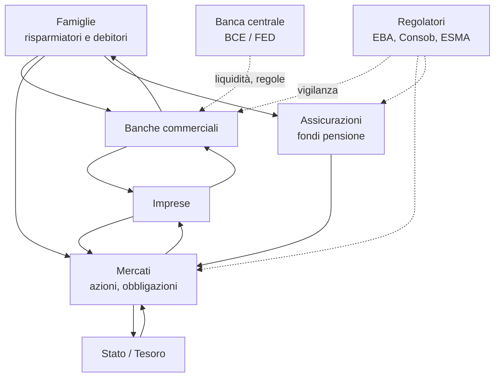
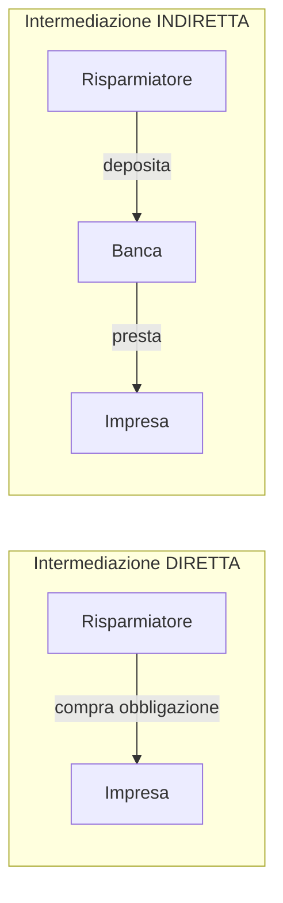
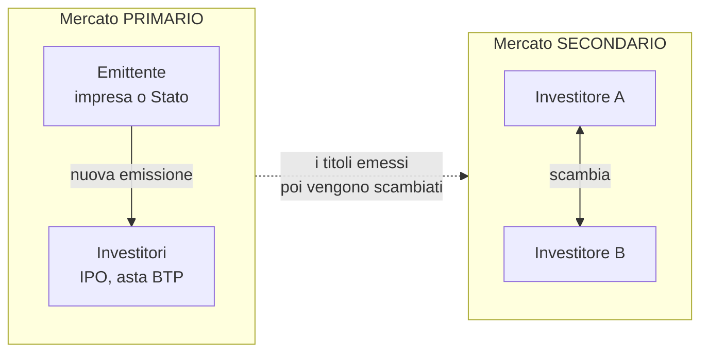

# Il sistema finanziario: come funziona davvero

Il sistema finanziario è la **plumbing** dell'economia: il sistema di tubature che sposta denaro da chi ce l'ha (e non sa cosa farne) a chi ne ha bisogno (e ha un progetto). Quando funziona, non lo noti. Quando si rompe — Lehman 2008, banche regionali USA 2023, Monte dei Paschi anni '10 — diventa la cosa più importante del mondo.

In questo capitolo ti porto dentro la mappa: chi sono gli attori, quali ruoli giocano, attraverso quali mercati passano i soldi, e cosa significa la frase "shadow banking" che senti ripetere.

## 1. Una sola domanda da cui parte tutto

> Come fa il risparmio di una famiglia di Torino ad arrivare a un'azienda di Bologna che vuole costruire un nuovo capannone?

Tre risposte possibili:

1. La famiglia compra direttamente azioni o obbligazioni dell'azienda. → **intermediazione diretta** via mercati.
2. La famiglia deposita i soldi in banca, e la banca presta all'azienda. → **intermediazione indiretta** via banche.
3. La famiglia investe in un fondo, che a sua volta compra obbligazioni dell'azienda. → intermediazione mista (mercato + intermediario non bancario).

Ognuno di questi canali ha pro, contro, rischi e costi diversi. Il sistema finanziario serve a far convivere tutti e tre.

## 2. Gli attori: chi sta in scena

Vediamoli uno per uno.

### 2.1 Famiglie (households)
Risparmiano e si indebitano. Sono **il datore di lavoro implicito** del sistema finanziario: senza il loro risparmio non c'è capitale da intermediare. In Italia la ricchezza finanziaria netta delle famiglie è di circa 5.300 miliardi di euro (Banca d'Italia, 2023).

### 2.2 Imprese (firms)
Hanno bisogno di capitale per investire. Possono finanziarsi in tre modi:

- **Equity**: emettendo azioni (chi le compra diventa socio).
- **Debito bancario**: prestiti dalle banche.
- **Debito di mercato**: emettendo obbligazioni o commercial paper.

Il mix dipende dalla dimensione: una PMI italiana media si finanzia all'80%+ via banche; una grande corporate (Eni, Ferrari, Intesa) ha accesso ai mercati obbligazionari globali.

### 2.3 Banche commerciali
Il loro mestiere è **trasformazione delle scadenze**: prendono in prestito a breve (depositi a vista che puoi ritirare oggi) e prestano a lungo (mutui a 25 anni). Questa è la loro funzione economica chiave — e anche la loro principale fonte di rischio (lo vedremo nel [capitolo sulle crisi bancarie](27-crisi-bancarie.html)).

### 2.4 Fondi (asset managers)
Raccolgono denaro da molti investitori e lo investono in portafogli diversificati. Categorie:

- **Fondi comuni** (mutual funds, OICR in italiano): aperti, prezzati ogni giorno.
- **ETF** (Exchange Traded Funds): quotati in borsa come azioni, tipicamente passivi.
- **Hedge fund**: meno regolati, strategie complesse.
- **Private equity / venture capital**: investono in aziende non quotate.

### 2.5 Assicurazioni e fondi pensione
Raccolgono premi/contributi, investono il malloppo per decenni, pagano sinistri o pensioni. Sono **investitori istituzionali pazienti**: il loro orizzonte è a 30+ anni. Per questo sono i compratori naturali di titoli a lunga scadenza (BTP 30 anni, obbligazioni infrastrutturali).

### 2.6 Banche centrali
Emettono moneta, fissano i tassi di policy, regolano la liquidità del sistema. Ne parliamo nel [capitolo dedicato](03-banche-centrali.html).

### 2.7 Regolatori
Definiscono regole e vigilano. In Europa:

- **EBA** (European Banking Authority): regole bancarie.
- **ESMA** (European Securities and Markets Authority): mercati e fondi.
- **EIOPA**: assicurazioni e fondi pensione.
- **Consob** (Italia): vigilanza su intermediari e mercati italiani.
- **IVASS**: assicurazioni in Italia.
- **SSM** (Single Supervisory Mechanism, in BCE): vigila direttamente sulle banche "significative" dell'eurozona.

### 2.8 Stato / Tesoro
È al tempo stesso **debitore principale** (emette titoli di stato per finanziare deficit) e **arbitro** (decide le regole fiscali, garantisce i depositi tramite il FITD, salva istituti in crisi).

## 3. Intermediazione diretta vs indiretta

**Diretta**: il risparmiatore acquista direttamente lo strumento finanziario dell'emittente (es. azione Apple, BTP). Il rischio dell'emittente è tutto suo. Il vantaggio: niente intermediario che si prende un margine. Lo svantaggio: deve sapere cosa fa, non ha protezione automatica.

**Indiretta**: tra risparmiatore e impresa c'è un intermediario (banca, fondo). L'intermediario porta tre cose:

1. **Trasformazione delle scadenze** (banca: depositi brevi → prestiti lunghi).
2. **Trasformazione del rischio** (banca: prestito unico rischioso → milioni di depositi insiriti, diversificazione).
3. **Trasformazione delle taglie** (banca: tanti piccoli depositi → un grande prestito a una corporate).

Il prezzo dell'intermediazione è lo **spread**: differenza fra tasso che la banca paga sui depositi (es. 1%) e tasso a cui presta (es. 4%). Il margine 3% copre costi, perdite su crediti e profitto.

## 4. Mercati primari vs secondari

- **Mercato primario**: si crea uno strumento nuovo. Esempio: Ferrari fa IPO nel 2015 a Wall Street, raccoglie capitale dagli investitori. Lo Stato italiano emette un BTP a 10 anni in asta, raccoglie cassa.
- **Mercato secondario**: scambio fra investitori di strumenti già esistenti. Quando compri azioni Ferrari su Borsa Italiana, Ferrari non riceve un euro: stai comprando da un altro investitore.

Perché ti importa la distinzione?

1. **Solo il primario fornisce capitale all'emittente**. Il secondario sposta il rischio fra investitori.
2. **Il secondario rende possibile il primario**: senza secondario, nessuno comprerebbe BTP a 30 anni perché non potresti uscirne. La **liquidità del secondario** è la pre-condizione per il primario.
3. I prezzi del secondario sono il **segnale di prezzo** per future emissioni primarie. Se i BTP 10 anni rendono al 4% sul secondario, il Tesoro dovrà offrire ~4% nella prossima asta.

## 5. Strumenti finanziari principali

| strumento | cos'è | chi paga cosa | rischio principale |
|---|---|---|---|
| **Azione** (equity) | quota di proprietà di una società | dividendi (eventuali) + capital gain | impresa fallisce, prezzo crolla |
| **Obbligazione corporate** | prestito a una società | cedole + rimborso | impresa fa default |
| **Titolo di Stato** (BTP, Bund, Treasury) | prestito allo Stato | cedole + rimborso | default sovrano (raro nei paesi sviluppati), inflazione, rialzo tassi |
| **Mutuo** | prestito ipotecario alla famiglia | rate periodiche | mutuatario non paga, banca esegue ipoteca |
| **Derivato** (futures, options, swap) | contratto il cui valore dipende da un sottostante | flussi variabili | controparte, mercato |
| **ETF** | fondo passivo quotato | nessun obbligo, segue indice | mercato sottostante |
| **Deposito bancario** | passività della banca | interessi (di solito bassi) | banca fallisce (protetto fino a 100.000€ FITD) |

Ne riparleremo nei capitoli su [obbligazioni](10-obbligazioni.html), [azioni](09-azioni.html), [derivati](21-derivati.html) e [ETF](20-etf-vs-fondi.html).

## 6. Disintermediazione e shadow banking

Negli ultimi 30 anni una fetta crescente di credito **non passa più dalle banche**. Il fenomeno si chiama **disintermediazione** o, quando avviene tramite soggetti non bancari ma con funzioni simil-bancarie, **shadow banking** ("sistema bancario ombra").

Esempi di shadow banking:

- **Fondi monetari (MMF)**: tu compri quote, loro investono in commercial paper a brevissimo. Funzionano come un conto, ma non sono banche e non hanno l'assicurazione sui depositi.
- **Securitization vehicles (SPV)**: cartolarizzazione. La banca prende 10.000 mutui, li impacchetta in un veicolo (SPV), emette obbligazioni (RMBS, MBS) e le vende a investitori. Risultato: il rischio dei mutui esce dalla banca e va sul mercato.
- **Hedge fund e private credit**: prestano alle imprese senza essere banche.
- **Repo market**: prestiti a brevissimo collateralizzati da titoli.

> Lo shadow banking è uno dei motori della crisi 2008. Quando i veicoli di cartolarizzazione di mutui subprime hanno smesso di trovare compratori, il sistema si è bloccato in pochi giorni. È un sistema **opaco**, **interconnesso** e **fragile**, ma non illegale: spesso è più efficiente del bancario tradizionale, finché funziona.

Dimensioni: il **Financial Stability Board** stima che il "Non-Bank Financial Intermediation" (NBFI) globale valga circa **63 trilioni di dollari**, oltre la metà del settore bancario tradizionale (FSB Global Monitoring Report 2023).

## 7. Funzioni del sistema finanziario (Merton & Bodie)

Robert Merton e Zvi Bodie, in un classico paper del 1995, sintetizzarono le **6 funzioni del sistema finanziario** che sono indipendenti dalla forma istituzionale (bancaria, di mercato, ibrida):

1. **Sistemi di pagamento**: spostare denaro fra agenti (carte, bonifici, SEPA Instant).
2. **Allocazione delle risorse nel tempo e nello spazio**: trasformare risparmio in investimento, prestare a chi è lontano geograficamente.
3. **Gestione del rischio**: assicurazioni, derivati, diversificazione.
4. **Pooling di risorse**: aggregare piccoli risparmi in grandi importi finanziabili.
5. **Informazione e price discovery**: i mercati producono prezzi che guidano le decisioni di investimento.
6. **Mitigazione dei problemi di incentivi**: contratti, collaterali, governance per allineare interessi.

Quando guardi un nuovo prodotto finanziario (es. un ETF tematico, una stablecoin, un BTP), chiediti: quali di queste funzioni svolge davvero, e per chi?

## 8. Esempio numerico: chi guadagna in un mutuo

Tu compri casa con un mutuo. Vediamo dove finiscono i soldi.

- Prezzo casa: 250.000€
- Mutuo: 200.000€ a 25 anni, tasso fisso 3,5%
- Rata mensile (formula francese): ≈ 1.001€/mese
- Totale rate in 25 anni: ≈ 300.300€
- Interessi totali pagati: 100.300€

Dove vanno questi 100.300€?

| destinatario | quota indicativa |
|---|---|
| depositanti della banca (interessi sui conti) | ~25% |
| costi operativi della banca (personale, IT) | ~30% |
| accantonamenti per perdite su crediti | ~15% |
| capitale della banca (margine / utile) | ~20% |
| imposte | ~10% |

Vedi che il **40–45% del costo del mutuo non torna mai ai depositanti**. È il prezzo dell'intermediazione bancaria.

Ne parliamo nei capitoli su [mutui](14-mutui.html) e [costo del capitale](08-tassi-di-interesse.html).

## 9. Esercizio

Esercizio: classifica questi flussi come intermediazione diretta o indiretta

Per ognuno indica se è **intermediazione diretta** (risparmiatore → emittente, magari via mercato) o **intermediazione indiretta** (passa attraverso un intermediario bancario o assimilato):

1. Compri 5.000€ di azioni Stellantis in borsa.
2. Apri un PAC su un fondo comune azionario globale.
3. Sottoscrivi un BTP all'asta tramite la tua banca.
4. La banca ti concede un mutuo casa di 200.000€.
5. Sottoscrivi un'obbligazione Eni in collocamento privato.
6. La tua assicurazione vita investe i premi in BTP.

**Soluzione:**

1. **Diretta** (mercato secondario, lo strumento è già esistente — Stellantis riceve i 5000€ solo se è una nuova emissione primaria).
2. **Indiretta** (passi attraverso un fondo che è un intermediario non bancario).
3. **Diretta** (la banca è solo collocatrice, il BTP è un rapporto fra te e il Tesoro).
4. **Indiretta** (intermediazione bancaria classica).
5. **Diretta** (mercato primario).
6. Punto di vista tuo: indiretta (tramite assicurazione). Punto di vista assicurazione → Stato: diretta.

Esercizio: chi sopporta il rischio?

Considera questi scenari. Per ognuno, dimmi **chi sopporta il rischio finale di credito** (cioè chi perde soldi se il debitore non paga):

1. Hai un conto corrente Intesa con 50.000€.
2. La tua banca ha cartolarizzato il tuo mutuo in un RMBS venduto a fondi pensione.
3. Compri un BTP italiano sul mercato secondario.
4. Hai un fondo monetario che detiene commercial paper di una corporate.

**Soluzione:**

1. Tu (sopra 100.000€) e il FITD/Intesa (sotto 100.000€). In realtà i depositi protetti sono i tuoi soldi recuperati dal FITD se la banca fallisce, finanziato dalle banche aderenti.
2. I fondi pensione che hanno comprato l'RMBS. La banca ha trasferito il rischio.
3. Tu: se l'Italia fa default, perdi parte del capitale.
4. Tu, indirettamente, tramite il fondo. Il fondo monetario non ha protezione FITD.

## 10. Riferimenti

- Merton, R.C. & Bodie, Z. (1995), *A Conceptual Framework for Analyzing the Financial Environment*.
- Mishkin, F.S., *The Economics of Money, Banking and Financial Markets*, cap. 2–8.
- Banca d'Italia, *Relazione Annuale*, sezione sui flussi finanziari.
- Financial Stability Board, *Global Monitoring Report on Non-Bank Financial Intermediation*, 2023.
- Allen, F. & Gale, D. (2000), *Comparing Financial Systems* — confronto banche vs mercati.

## 11. Cosa portare via

> Il sistema finanziario è un insieme di **funzioni** (pagamenti, allocazione, rischio, pooling, informazione, incentivi) che possono essere svolte da forme istituzionali diverse: banche, mercati, fondi, shadow banking. Quando una forma fallisce, le funzioni passano (o crollano) ad altre forme.

Il prossimo capitolo entra nel ruolo di chi governa la liquidità di tutto questo sistema: [le banche centrali](03-banche-centrali.html).
