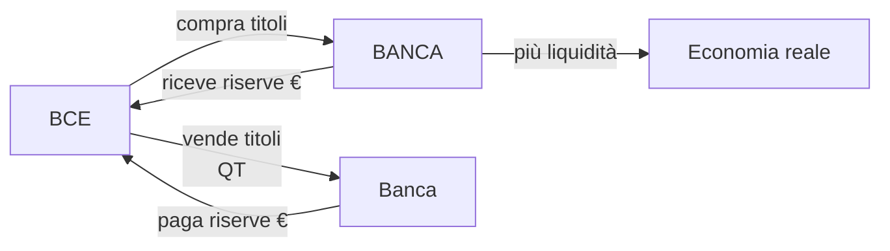

# Banche centrali (BCE, FED, BOE, BOJ)

Le banche centrali sono le **istituzioni più potenti** del sistema finanziario contemporaneo. Non eleggi nessuno di loro, ma decidono il costo del tuo mutuo, la quotazione del cambio euro/dollaro che usi quando vai in vacanza, e — indirettamente — quanto sopravvivrà il tuo potere d'acquisto fra 10 anni.

In questo capitolo vediamo:

- I quattro mandati (BCE, FED, Bank of England, Bank of Japan).
- Gli strumenti di policy: tassi, riserve, OMO, QE/QT, forward guidance.
- I momenti storici recenti che cambiarono il modo di fare politica monetaria.
- Perché l'indipendenza dal governo è un valore (e quando è in pericolo).

## 1. Cos'è una banca centrale

Una banca centrale è l'**emittente esclusivo della valuta legale** di un'area monetaria. In più, tipicamente:

- è la **banca delle banche commerciali** (gestisce le loro riserve);
- è la **banca dello Stato** (gestisce conti e debito pubblico, con limiti);
- è il **prestatore di ultima istanza** (lender of last resort) verso le banche in crisi di liquidità;
- vigila sulle banche (in Europa lo fa direttamente per le banche "significative" via SSM);
- conduce la **politica monetaria** per perseguire i suoi obiettivi statutari.

## 2. Quattro banche centrali, quattro mandati

| banca centrale | mandato | obiettivo numerico |
|---|---|---|
| **BCE** (Eurosistema) | stabilità dei prezzi (primario), supporto a politiche economiche UE (secondario, subordinato) | inflazione HICP **2% simmetrico** nel medio periodo |
| **FED** (USA) | **dual mandate**: stabilità prezzi + massima occupazione | inflazione PCE **2% average inflation targeting** (dal 2020) |
| **BOE** (UK) | stabilità prezzi (primario), sostegno politica economica governo (secondario) | CPI **2%** |
| **BOJ** (Giappone) | stabilità prezzi e stabilità sistema finanziario | CPI **2%** (formalmente dal 2013) |

> Il mandato BCE è **gerarchico**: prima la stabilità dei prezzi, poi tutto il resto. Quello FED è **paritario**: deve bilanciare prezzi e occupazione. Questa differenza spiega molte divergenze di policy fra BCE e FED, specie in fasi recessive.

## 3. La struttura BCE in due righe

- **Consiglio direttivo** (Governing Council): 6 membri del Comitato esecutivo + i 20 governatori delle banche centrali nazionali dell'eurozona. Decide le linee guida.
- **Comitato esecutivo**: presidente (oggi Lagarde), vicepresidente, 4 membri. Gestisce l'operatività.
- **Eurosistema**: BCE + banche centrali nazionali dell'eurozona (Banca d'Italia, Bundesbank, Banque de France...).

Le decisioni di policy vengono prese **in collegio** ma operativamente eseguite dalle BCN nazionali (es. la Banca d'Italia esegue le operazioni di mercato in Italia).

## 4. Gli strumenti convenzionali

### 4.1 Tasso di policy

È il prezzo a cui la banca centrale presta riserve alle banche commerciali a brevissimo termine. Per la BCE ci sono tre tassi fondamentali:

| tasso | a cosa serve | livello (esempio, set 2024) |
|---|---|---|
| **Main Refinancing Operations (MRO)** | tasso di riferimento per operazioni settimanali | 3,65% |
| **Deposit Facility Rate (DFR)** | tasso pagato alle banche su riserve depositate overnight | 3,50% |
| **Marginal Lending Facility (MLF)** | tasso per prestiti overnight d'emergenza | 3,90% |

Dal 2022 la BCE conduce la politica **principalmente tramite il DFR**, perché le banche dell'area euro sono in eccesso di liquidità (effetto del QE storico) e quindi il tasso che conta è quello sul deposito presso la BCE.

Negli USA il tasso di riferimento è il **Federal Funds Rate**, un target range (es. 5,25–5,50% nel 2024) gestito tramite IOER (Interest On Excess Reserves) e ON RRP.

### 4.2 Riserve obbligatorie
Le banche devono detenere una % dei depositi come riserve presso la banca centrale. Nell'area euro è **1% dal 2012** (era 2%). Sono uno strumento residuale: oggi la liquidità si gestisce molto più con tassi e operazioni di mercato.

### 4.3 Operazioni di mercato aperto (OMO)
La banca centrale compra o vende titoli sul mercato per immettere o assorbire liquidità.

- **Pronti contro termine (repo)**: la BCE compra titoli con patto di rivendita a breve. Inietta liquidità temporanea.
- **Operazioni outright**: acquisti definitivi di titoli (il caso QE).
- **TLTRO** (Targeted Longer-Term Refinancing Operations): prestiti a lungo termine (3–4 anni) alle banche, condizionati al fatto che a loro volta prestino al settore privato. Usate massicciamente 2014–2022.

## 5. Gli strumenti non convenzionali

Dopo il 2008, le banche centrali hanno scoperto che **tagliare i tassi a zero non bastava**. Si sono inventate nuovi strumenti.

### 5.1 Quantitative Easing (QE)

Acquisto su larga scala di titoli (di Stato o privati) con creazione di nuove riserve. Effetti attesi:

1. **Comprime i rendimenti dei titoli lunghi** (la banca centrale è un compratore enorme che alza i prezzi e abbassa i rendimenti).
2. **Spinge gli investitori verso asset più rischiosi** (azioni, corporate bond), gonfiando i loro prezzi.
3. **Espande la base monetaria** (M0), ma l'effetto su M2/M3 dipende dalla capacità delle banche di prestare.

Esempi:

- **FED**: QE1 (2008–10), QE2 (2010–11), QE3 (2012–14), QE pandemico (2020–22). Bilancio FED da ~900 mld$ (2007) a 9 trilioni$ (2022).
- **BCE**: APP (Asset Purchase Programme) da 2015, PEPP (Pandemic Emergency Purchase Programme) da marzo 2020 a marzo 2022. Bilancio BCE da ~2 trilioni€ (2014) a ~9 trilioni€ (2022).
- **BOJ**: QE praticamente continuo dal 2001, oggi il suo bilancio è circa **130% del PIL giapponese** — il più estremo al mondo.

### 5.2 Quantitative Tightening (QT)
Il contrario: la banca centrale non rinnova i titoli a scadenza (o li vende). Riduce le riserve e il bilancio. La BCE ha avviato il QT del PEPP da luglio 2024.

### 5.3 Forward guidance
Comunicare in anticipo l'orientamento di policy per influenzare le aspettative. Esempio classico:

> "Il Consiglio direttivo prevede che i tassi di interesse di riferimento della BCE rimangano ai livelli attuali per un periodo prolungato."
> — BCE, ricorrente 2014–21

Effetto: appiattisce la curva dei tassi a termine. Costo: se devi cambiare idea, la credibilità ne risente.

### 5.4 Yield Curve Control (YCC)
Strumento usato da BOJ: la banca centrale fissa un **target sul rendimento di una scadenza** (es. JGB 10 anni a 0%) e compra/vende quanto serve per tenerlo lì. È una forma estrema di QE.

## 6. Momenti storici che hanno cambiato il gioco

### 6.1 Lehman, 15 settembre 2008
Lehman Brothers fallisce, il mercato interbancario si congela. La FED inietta liquidità senza precedenti, taglia i Fed Funds da 5,25% (sett 2007) a 0–0,25% (dic 2008) in 15 mesi. **Inizia l'era della politica monetaria non convenzionale.**

### 6.2 Crisi del debito sovrano area euro, 2010–12
Grecia, Irlanda, Portogallo, Spagna, Italia. Spread BTP-Bund supera 550 bp nel novembre 2011. L'eurozona rischia di rompersi.

### 6.3 "Whatever it takes", 26 luglio 2012
Mario Draghi, allora presidente BCE, parla a Londra:

> *"Within our mandate, the ECB is ready to do whatever it takes to preserve the euro. And believe me, it will be enough."*

Senza fare nulla operativamente, gli spread crollano. Lo strumento che ne seguirà è l'**OMT** (Outright Monetary Transactions), annunciato a settembre 2012 — un programma di acquisti illimitati di titoli sovrani per paesi sotto programma EFSF/ESM, **mai effettivamente attivato**, ma la sua sola esistenza ha placato i mercati. È uno dei casi più studiati di **politica monetaria via aspettative**.

### 6.4 QE BCE 2015–22
Draghi avvia l'APP in marzo 2015. La BCE ha comprato ~5 trilioni di euro di titoli fino al 2022. Effetto principale: tenere i rendimenti dei titoli di Stato dell'area euro estremamente bassi (Bund 10 anni in negativo dal 2019 al 2022).

### 6.5 Ciclo di rialzi BCE 2022–24
Dopo il rimbalzo post-pandemico e l'invasione russa dell'Ucraina (feb 2022), l'inflazione HICP eurozona schizza al **10,6%** (ott 2022). La BCE alza il DFR da −0,5% (giugno 2022) a **4,0%** (sett 2023) in 14 mesi: il ciclo di rialzi più aggressivo nella sua storia.

Effetti sul tuo portafoglio:

- Mutui variabili in Italia: rate aumentate del 50–70% rispetto al 2021.
- BTP 10 anni: dai minimi sotto l'1% (2021) ai picchi sopra il 4,5% (ott 2023).
- Conti deposito: tornano a rendere il 3–4%, dopo anni di zeri.

## 7. Bilancio della BCE oggi

Il bilancio della BCE è esploso con il QE. Composizione approssimativa (dati 2024, semplificati):

| voce | valore approssimativo |
|---|---|
| Titoli detenuti per fini di politica monetaria (APP + PEPP) | ~4,3 trilioni € |
| Operazioni di rifinanziamento (TLTRO residue) | ~50 mld € |
| Oro | ~600 mld € |
| Riserve in valuta estera | ~500 mld € |
| **TOTALE attivo** | **~6,5 trilioni €** |

Dal picco di ~9 trilioni nel 2022, il QT ha già ridotto il bilancio di oltre 2 trilioni. Obiettivo BCE: tornare a un bilancio "snello", senza un target esplicito ma stimato attorno a 4–5 trilioni nel medio periodo.

## 8. Indipendenza dalle politiche

> *L'indipendenza della banca centrale dalla politica è un asset di credibilità: significa che il governo non può forzare la stampa di moneta per finanziare la spesa pubblica, scenario che storicamente porta a iperinflazione.*

Tre livelli di indipendenza (Debelle & Fischer 1994):

1. **Indipendenza degli obiettivi**: chi decide il target? BCE: lo definisce il Consiglio direttivo (trattati). FED: il Congresso fissa il mandato, il FOMC interpreta.
2. **Indipendenza degli strumenti**: chi sceglie le leve? Tutte e quattro le banche citate hanno piena indipendenza strumentale.
3. **Indipendenza personale**: durata del mandato dei governatori, condizioni di rimozione. Lagarde: mandato 8 anni non rinnovabile.

Casi storici di erosione dell'indipendenza:

- **Turchia 2019–24**: Erdoğan rimuove tre governatori per disaccordi sui tassi, l'inflazione TR esplode oltre il 70%.
- **Argentina anni '70–'90 e di nuovo 2020s**: tipico esempio di dominanza fiscale.
- **Stati Uniti, dibattito 2024–26**: critiche dell'amministrazione Trump alla FED hanno riacceso il dibattito.

## 9. Esempio numerico: come un rialzo di 25 bp arriva al tuo mutuo

Tasso BCE (DFR) sale da 3,50% a 3,75% (+25 bp). Sequenza:

1. Le banche dell'area euro vedono crescere il rendimento delle riserve presso BCE → aumenta il loro costo opportunità di prestare a tasso fisso → richiedono di più sui nuovi prestiti.
2. L'**Euribor 3 mesi** (tasso interbancario, riferimento dei mutui variabili) sale di circa 20–25 bp nei giorni successivi.
3. Mutuo variabile esistente di 200.000€ residui a 20 anni con TAN Euribor + 1,2%:
   - Prima: Euribor 3,55% + 1,2% = 4,75% → rata ~1.293€/mese
   - Dopo: Euribor 3,80% + 1,2% = 5,00% → rata ~1.320€/mese
   - **+27€ al mese × 12 mesi = +324€/anno**

Spalmato su tutta la zona euro, ogni 25 bp di rialzo costano alle famiglie italiane qualche miliardo di euro l'anno in interessi aggiuntivi.

## 10. Esercizio

Esercizio: classifica gli strumenti come "convenzionali" o "non convenzionali"

Per ognuno, indica se è strumento convenzionale o non convenzionale, e brevemente perché:

1. Rialzo del DFR di 25 bp.
2. PEPP da 1850 mld €.
3. Operazione MRO settimanale a 7 giorni.
4. Forward guidance "tassi fermi a lungo".
5. Acquisti di obbligazioni corporate (CSPP).
6. TLTRO-III.

**Soluzione:**

1. Convenzionale (manovra del tasso di policy).
2. Non convenzionale (QE pandemico).
3. Convenzionale (operazione di rifinanziamento standard).
4. Non convenzionale (comunicazione strategica).
5. Non convenzionale (espansione del bilancio su asset privati).
6. Non convenzionale (operazioni di rifinanziamento condizionate a lungo termine).

Esercizio: confronto BCE vs FED

Per ognuna delle seguenti situazioni, immagina come reagirebbero BCE e FED, **dato il rispettivo mandato**:

1. Disoccupazione USA al 6%, inflazione PCE al 2%.
2. Disoccupazione UE al 7,5%, inflazione HICP al 5%.
3. Inflazione USA al 2%, inflazione UE al 2%, ma crescita UE −0,5%.

**Soluzione:**

1. La FED ha pressione a **tagliare** i tassi (deviazione dalla massima occupazione), pur con inflazione a target. Mandato duale.
2. La BCE ha pressione a **rialzare** i tassi (inflazione sopra target), ignorando in larga parte la disoccupazione perché il mandato è gerarchico.
3. La FED può star ferma (entrambi gli obiettivi sono a target). La BCE è incerta: l'inflazione è a target, ma può sostenere la crescita come obiettivo secondario solo se non compromette il primario. Probabilmente fermi i tassi e usi guidance accomodante.

## 11. Riferimenti

- BCE, *The Monetary Policy of the ECB*, 3rd edition, 2011 (+ aggiornamenti strategici 2021 sul nuovo target simmetrico al 2%).
- Mishkin, F.S., *The Economics of Money, Banking and Financial Markets*, cap. 12–17.
- Bernanke, B. (2015), *The Courage to Act* — memoir della FED durante la crisi.
- Draghi, M. (2012), discorso "Whatever it takes" — testo integrale su sito BCE.
- Debelle, G. & Fischer, S. (1994), *How Independent Should a Central Bank Be?*.
- BCE Monthly / Economic Bulletin (le previsioni macro vengono aggiornate 4 volte all'anno).

## 12. Cosa portare via

> La banca centrale è l'**arbitro del prezzo del denaro**. Quando alza i tassi: i mutui costano di più, i depositi rendono di più, l'inflazione tende a calare, la crescita rallenta. Quando li taglia: l'opposto. Capire questo legame è il prerequisito per capire **tutto** il resto: investimenti, mutui, valutazioni di aziende e immobili.

Il prossimo capitolo entra nel dettaglio del fenomeno che le banche centrali combattono: [l'inflazione](04-inflazione.html).
