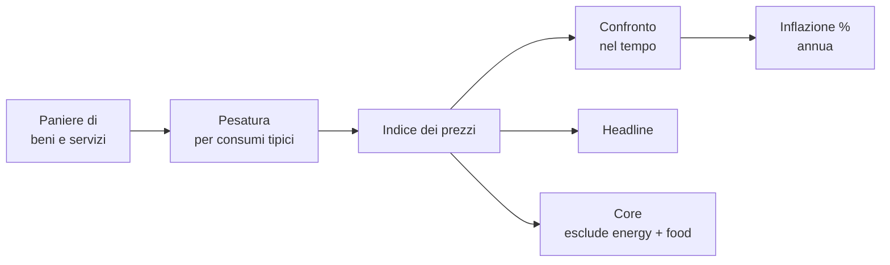

# Inflazione, deflazione, potere d'acquisto

L'inflazione è il fenomeno economico **più equivocato** della finanza personale. La maggior parte delle persone sa che "esiste", ma sottovaluta il suo effetto compound nel medio-lungo periodo. In questo capitolo metto in fila:

- Cosa è e cosa non è inflazione.
- Come la misurano gli istituti di statistica (Istat, Eurostat, BLS).
- Cause: di domanda, di costo, monetarie, da aspettative.
- La formula del potere d'acquisto e un esempio numerico devastante.
- Iperinflazioni storiche: cosa hanno in comune.
- Effetti redistributivi: chi guadagna e chi perde.

## 1. Definizione e tipologie

**Inflazione**: aumento generalizzato e persistente del livello dei prezzi dei beni e servizi in un'economia. Misurata come **variazione percentuale annua** di un indice dei prezzi.

Distinguila da fenomeni che NON sono inflazione:

| fenomeno | descrizione |
|---|---|
| **Inflazione** | tutti i prezzi salgono, in media, in modo persistente |
| **Aumento di un prezzo singolo** | la pasta sale del 10% ma il resto resta fermo → no |
| **Shock una tantum** | l'IVA passa dal 20 al 22% una volta sola → +2% al CPI, ma non è inflazione strutturale |
| **Deflazione** | il livello generale dei prezzi **scende** |
| **Disinflazione** | l'inflazione rallenta ma resta positiva (es. da 8% a 3%) |
| **Stagflazione** | inflazione alta + crescita bassa o negativa contemporaneamente |
| **Iperinflazione** | inflazione > 50% al mese (Cagan 1956) |

## 2. Come si misura: CPI, HICP, PCE

L'inflazione non si "misura" in senso assoluto: si **costruisce un indice** dei prezzi di un paniere rappresentativo di beni e servizi, e se ne osserva la variazione nel tempo.

### 2.1 CPI (Consumer Price Index)
In Italia lo calcola **Istat**, negli USA il **BLS**. Misura il costo di un paniere fisso di consumo per la famiglia media.

### 2.2 HICP (Harmonised Index of Consumer Prices)
È l'indice **armonizzato dell'eurozona**, calcolato secondo regole comuni Eurostat. È quello che usa la BCE per il suo target del 2%. Differenze rispetto al CPI nazionale italiano:

- Pesi diversi (HICP non include la casa di proprietà in modo significativo, il NIC italiano sì).
- Tratta gli sconti differentemente.
- Standardizzato per consentire confronti fra paesi.

### 2.3 PCE (Personal Consumption Expenditure)
È l'indice preferito dalla **FED**. Differenze rispetto al CPI USA: pesi che si aggiornano più velocemente (formula a catena), include consumi pagati da terzi (es. spesa sanitaria coperta da assicurazione). Tipicamente PCE è un decimo o due **sotto** il CPI USA.

### 2.4 Headline vs Core
- **Headline**: indice totale, include energia e alimentari freschi.
- **Core**: esclude energia e alimentari freschi (e talvolta tabacco e alcol). Più stabile, mostra la **tendenza di fondo**.

Le banche centrali guardano molto il core perché energy/food sono volatili e i loro shock sono spesso temporanei.

## 3. Indici Laspeyres e Paasche

Per costruire un indice dei prezzi servono pesi. Due approcci classici:

### 3.1 Indice di Laspeyres
Usa la **composizione del paniere del periodo base**. Formula:

$$P_L = \frac{\sum_i p_i^t \cdot q_i^0}{\sum_i p_i^0 \cdot q_i^0}$$

Dove $p_i^t$ è il prezzo del bene $i$ al tempo $t$, $q_i^0$ è la quantità al tempo base 0.

Pro: dati di consumo del periodo base sono noti.
Contro: **tende a sovrastimare l'inflazione** perché ignora la sostituzione (se la pasta rincara, le famiglie consumano più riso, ma Laspeyres tiene fissa la composizione del paniere).

### 3.2 Indice di Paasche
Usa la **composizione del paniere del periodo corrente**:

$$P_P = \frac{\sum_i p_i^t \cdot q_i^t}{\sum_i p_i^0 \cdot q_i^t}$$

Tende a **sottostimare** l'inflazione (perché cattura immediatamente la sostituzione verso beni meno cari).

### 3.3 Indice di Fisher
Media geometrica di Laspeyres e Paasche:

$$P_F = \sqrt{P_L \cdot P_P}$$

Compromesso ottimale. Lo usano molti istituti moderni (BLS dal 2002 per il C-CPI-U, Eurostat per alcune sottoclassi).

> In sintesi: l'indice ufficiale che leggi sul giornale (HICP, CPI) è una **approssimazione** del livello dei prezzi, costruita con scelte metodologiche che hanno tutte un piccolo bias.

## 4. Le cause: 4 tipi di inflazione

### 4.1 Inflazione da domanda (demand-pull)
La domanda aggregata supera l'offerta potenziale. Tipico in economie surriscaldate, vicino al pieno impiego.

Esempio: USA 2021–22 post-pandemia. Stimoli fiscali enormi (assegni Biden), risparmi accumulati, riapertura → demand pull che ha contribuito al picco di CPI 9,1% (giugno 2022).

### 4.2 Inflazione da costi (cost-push)
Shock dal lato dell'offerta che aumenta i costi di produzione (energia, materie prime, salari).

Esempio: 1973 — embargo OPEC, prezzo petrolio quadruplica, USA e Europa in stagflazione.
Esempio: 2022 — invasione russa dell'Ucraina, prezzo gas in Europa esplode (TTF da 80 a 350 €/MWh), elettricità segue, inflazione HICP eurozona al 10,6% in ottobre.

### 4.3 Inflazione monetaria
Eccesso di crescita dell'offerta di moneta rispetto alla crescita reale dell'economia. Teoria quantitativa (Friedman):

$$MV = PY$$

dove $M$ è la moneta, $V$ la velocità di circolazione, $P$ il livello dei prezzi, $Y$ il PIL reale. Se $V$ è stabile e $Y$ cresce di poco, far esplodere $M$ porta $P$ a crescere.

Esempio: Zimbabwe 2008, Venezuela 2017–24. La banca centrale finanzia direttamente lo Stato stampando, $M$ esplode, $P$ pure.

### 4.4 Inflazione da aspettative
Le aspettative sono **profezie autoavveranti**. Se i lavoratori si aspettano inflazione al 5%, chiedono aumenti salariali al 5%, le imprese trasferiscono il costo del lavoro sui prezzi → l'inflazione realizzata sale al 5%. Spirale **prezzi-salari**.

Per spezzarla, le banche centrali devono **ancorare le aspettative**. Se la BCE è credibile e ripete "torneremo al 2%", e i mercati le credono, la spirale non parte (è esattamente quello che la BCE ha cercato di fare nel 2022–24).

## 5. Formula del potere d'acquisto

Il potere d'acquisto reale di una somma futura $FV$ in termini di prezzi di oggi, dato un tasso di inflazione $i$ medio annuo per $n$ anni, è:

$$PV_{\text{reale}} = \frac{FV}{(1+i)^n}$$

Equivalentemente, il valore nominale necessario fra $n$ anni per mantenere il potere d'acquisto di $PV$ oggi è:

$$FV = PV \cdot (1+i)^n$$

## 6. Esempio numerico: 1000€ oggi fra 20 anni al 3% di inflazione

Quanto valgono 1000€ di oggi fra 20 anni, in potere d'acquisto, se l'inflazione media è 3%?

$$PV_{\text{reale}} = \frac{1000}{(1{,}03)^{20}} = \frac{1000}{1{,}8061} \approx 553{,}68 \text{ €}$$

**553,68 €** in beni di oggi. Cioè se metti 1000€ sotto il materasso oggi e li tiri fuori fra 20 anni, potrai comprare quello che oggi compri con 554 €. **Hai perso quasi la metà del potere d'acquisto.**

Tabella confronto al variare dell'inflazione media (1000€ oggi, in $n$ anni):

| inflazione media | dopo 10 anni | dopo 20 anni | dopo 30 anni |
|---|---|---|---|
| 1% | 905 € | 820 € | 742 € |
| 2% | 820 € | 673 € | 552 € |
| 3% | 744 € | 554 € | 412 € |
| 5% | 614 € | 377 € | 231 € |
| 10% | 386 € | 149 € | 57 € |

> Lezione brutale: **lasciare denaro fermo per 20 anni con inflazione 3% è peggio di pagare un'imposta del 45% una volta sola**.

## 7. Inflazione attesa vs realizzata

Distinguere:

- **Inflazione attesa** ($\pi^e$): cosa si aspettano gli agenti economici. Misurata via:
  - **Inflation swap** sui mercati (es. 5Y5Y forward, indicatore preferito della BCE).
  - **Breakeven inflation rate** = rendimento BTP nominale − rendimento BTP indicizzato (BTP€i).
  - Surveys di previsori e famiglie (ECB SPF, University of Michigan).
- **Inflazione realizzata** ($\pi$): cosa effettivamente è successo, misurata da Istat/Eurostat.

La differenza $\pi - \pi^e$ ha effetti redistributivi enormi:

- Se $\pi > \pi^e$ (inflazione sorprende al rialzo): **debitori vincono**, creditori perdono. I debitori restituiscono moneta che vale meno di quanto si aspettavano.
- Se $\pi < \pi^e$: l'opposto.

**Esempio**: nel 2021 i mutui a tasso fisso sono stati erogati con TAN attorno all'1,5–2%, presupponendo inflazione attesa ~1,8%. L'inflazione realizzata 2022–23 è stata 8–10%. I mutuatari a tasso fisso hanno enormemente guadagnato: pagano cedole nominali fisse mentre i loro stipendi (parzialmente) si adeguano. Le banche e i fondi che detengono quei mutui hanno (in termini reali) perso.

## 8. Iperinflazioni storiche

| caso | periodo | picco mensile | causa |
|---|---|---|---|
| **Weimar (Germania)** | 1921–23 | ~30.000% al mese (ott 1923) | riparazioni di guerra, stampa per pagare salari minatori in sciopero |
| **Ungheria** | 1945–46 | **~4,2 × 10¹⁶ % al mese** (luglio 1946) — record assoluto | distruzione bellica, governo stampa per ricostruzione |
| **Zimbabwe** | 2007–08 | ~7,96 × 10¹⁰ % al mese (nov 2008) | stampa per finanziare deficit, riforma agraria fallita |
| **Venezuela** | 2017–19 | ~80.000% annuo, picchi mensili oltre il 200% | crisi petrolio, sanzioni, dominanza fiscale |
| **Argentina** | ricorrente, 1989, 2023–24 | 100–200% annuo (2024) | dominanza fiscale persistente |

**Elementi comuni** delle iperinflazioni:

1. La banca centrale **non è indipendente**: è obbligata a finanziare il governo.
2. **Dominanza fiscale**: il deficit pubblico è enorme, niente entrate fiscali sufficienti, niente mercati disposti a comprare debito → la stampa è l'unica via.
3. **Crisi di fiducia**: la valuta perde la funzione di riserva di valore, le persone tengono il meno possibile in valuta locale e fuggono verso dollari/oro/beni reali.
4. La velocità di circolazione $V$ esplode (nessuno tiene moneta in tasca), accelerando l'inflazione.
5. Si esce **solo** con riforma monetaria + ancoraggio fiscale credibile (Germania 1923: Rentenmark; Ungheria 1946: Forint; Argentina 1991: convertibilità — fallita poi nel 2001).

## 9. Stagflazione: il caso anni '70

Anni '70 USA ed Europa: inflazione **e** disoccupazione contemporaneamente alte. Crisi del paradigma keynesiano della curva di Phillips (che suggeriva un trade-off netto).

Cause:

1. Shock petroliferi (1973, 1979): cost-push violento.
2. Politiche monetarie troppo accomodanti negli anni '60 e prima metà '70.
3. Aspettative di inflazione "disancorate" dopo anni di crescita dei prezzi.

Numeri USA:

| anno | CPI | disoccupazione |
|---|---|---|
| 1973 | 6,2% | 4,9% |
| 1974 | 11,0% | 5,6% |
| 1975 | 9,1% | 8,5% |
| 1979 | 11,3% | 5,8% |
| 1980 | 13,5% | 7,1% |

Soluzione: **Volcker shock** (1979–82). Paul Volcker, presidente FED, alza i Fed Funds fino al 20% (giugno 1981). Recessione devastante, disoccupazione USA al 10,8% nel 1982. L'inflazione crolla al 3,2% nel 1983. **Lezione**: per disancorare aspettative servono rialzi brutali e una banca centrale credibile a costo di una recessione.

## 10. Effetti redistributivi: chi vince, chi perde

| categoria | effetto di inflazione alta |
|---|---|
| **Debitori a tasso fisso** | vincono (restituiscono moneta che vale meno) |
| **Creditori a tasso fisso** (es. obbligazionisti) | perdono |
| **Mutuatari a tasso variabile** | perdono nel breve (le rate salgono) ma vincono nel lungo se gli stipendi rincorrono |
| **Pensionati con pensione non indicizzata** | perdono |
| **Pensionati con pensione indicizzata** (es. INPS rivalutazione ISTAT) | parzialmente protetti |
| **Lavoratori con scala mobile / CCNL aggiornato** | parzialmente protetti |
| **Lavoratori senza adeguamento** | perdono |
| **Possessori di asset reali** (immobili, oro, azioni) | tendenzialmente vincono |
| **Stato indebitato in valuta locale** | vince (riduce il debito reale) |
| **Stato indebitato in valuta estera** | non beneficia, anzi: l'inflazione può svalutare il cambio |

> Storicamente, l'inflazione è la **tassa più regressiva** sui ceti medio-bassi che tengono i risparmi sul conto e hanno stipendi non indicizzati. È stata usata da molti governi come "tassa silenziosa" per ridurre il debito pubblico in termini reali (il caso classico è il finanziamento del welfare europeo del dopoguerra).

## 11. Deflazione: l'altra faccia

La deflazione (prezzi che scendono) può sembrare positiva ("le cose costano meno!"), ma macroeconomicamente è **molto pericolosa**:

1. Le famiglie rimandano gli acquisti aspettando prezzi più bassi → domanda crolla.
2. I debiti diventano più pesanti in termini reali (il valore del debito è fisso, ma i tuoi redditi nominali scendono).
3. Le imprese tagliano gli investimenti e i salari nominali, scatenando un circolo vizioso.

Esempio storico: **Giappone, "lost decades" 1995–2013**. Inflazione media vicina a zero o negativa per due decenni. La BOJ ha provato di tutto (tassi zero, QE, YCC) per uscirne. Solo dal 2022 sembra essere tornata stabilmente sopra il 2%.

La **Grande Depressione** USA 1929–33 è il caso più drammatico: deflazione del 25% cumulata, disoccupazione al 25%, PIL crollato del 30%.

## 12. Esercizio

Esercizio: calcola il potere d'acquisto in scenari diversi

Hai 50.000€ oggi. Calcola il loro potere d'acquisto reale fra 15 anni in 3 scenari:

A. Inflazione media 1,5%
B. Inflazione media 3%
C. Inflazione media 5%

**Soluzione:**

Formula: $PV_{\text{reale}} = \frac{50000}{(1+i)^{15}}$

A. $\frac{50000}{(1{,}015)^{15}} = \frac{50000}{1{,}2502} \approx 39.992 \text{ €}$

B. $\frac{50000}{(1{,}03)^{15}} = \frac{50000}{1{,}5580} \approx 32.092 \text{ €}$

C. $\frac{50000}{(1{,}05)^{15}} = \frac{50000}{2{,}0789} \approx 24.051 \text{ €}$

Quindi se lasci 50.000€ sul conto per 15 anni con inflazione 3% (target BCE), hai perso 17.900€ di potere d'acquisto. Più della metà al 5%.

Esercizio: distingui le cause dell'inflazione

Per ognuna di queste situazioni reali, classifica la causa principale di inflazione (domanda, costi, monetaria, aspettative):

1. USA 2021: stimoli fiscali da 5 trilioni, risparmi accumulati pandemia, riaperture → CPI 9,1% nel 2022.
2. Europa 2022: gas russo tagliato, TTF a 350€/MWh, energia raddoppia → HICP 10,6%.
3. Zimbabwe 2008: banca centrale stampa per pagare debito pubblico → 80 miliardi % annuo.
4. Italia anni '70: TFR e scala mobile spingono salari, prezzi seguono, salari rispondono → inflazione persistente al 15-20%.

**Soluzione:**

1. Principalmente da domanda (con componente monetaria via M2 esploso).
2. Da costi (shock energetico).
3. Monetaria pura (dominanza fiscale).
4. Da aspettative / spirale prezzi-salari (con cause iniziali di costo, ma poi autoalimentate).

## 13. Riferimenti

- Cagan, P. (1956), *The Monetary Dynamics of Hyperinflation* — definizione classica e analisi dei casi storici.
- Friedman, M. (1968), *The Role of Monetary Policy* — discorso AEA, "inflation is always and everywhere a monetary phenomenon".
- Mishkin, F.S., *The Economics of Money, Banking and Financial Markets*, cap. 22–24.
- BCE, *Strategia di politica monetaria*, revisione 2021 (target simmetrico 2%).
- Eurostat, *HICP methodology*.
- Reinhart, C. & Rogoff, K. (2009), *This Time Is Different* — 800 anni di crisi finanziarie.
- Sargent, T. (1982), *The Ends of Four Big Inflations* — i 4 casi di iperinflazione europei post-1923.

## 14. Cosa portare via

> L'inflazione è una **tassa silenziosa** sul risparmio. Capirla bene è il prerequisito per qualsiasi decisione di investimento di lungo periodo. La domanda non è "ho perso soldi quest'anno?", ma "il mio patrimonio mantiene il potere d'acquisto nel medio periodo?". Se la risposta è no, devi reagire.

Il prossimo capitolo entra negli strumenti per **proteggersi dall'inflazione**: [tassi di interesse e curva dei rendimenti](08-tassi-di-interesse.html), e più avanti [BTP indicizzati e asset reali](10-obbligazioni.html).
