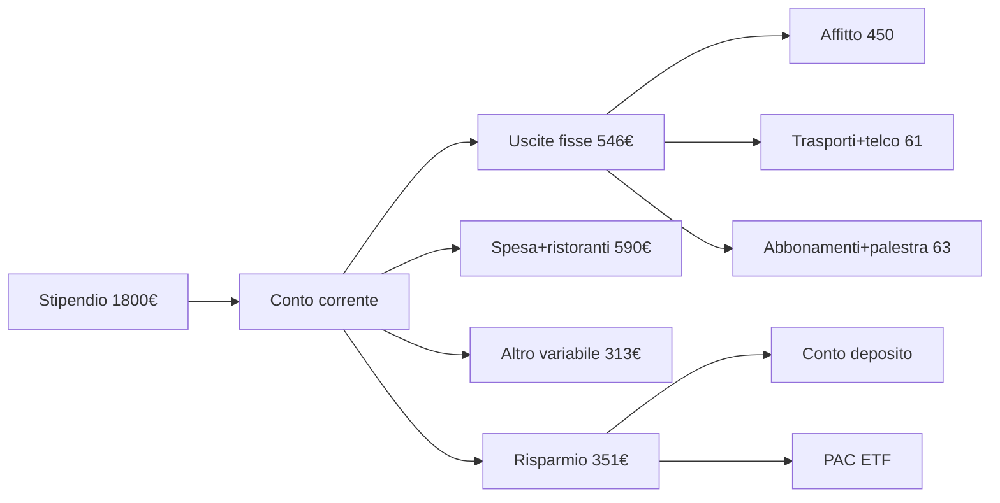
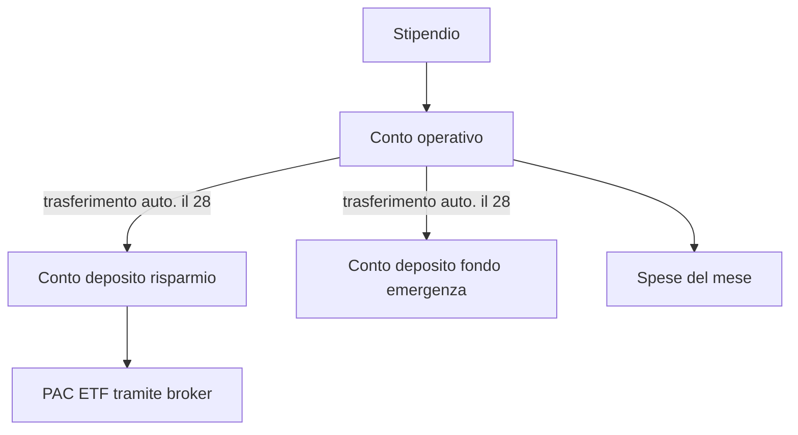

# Budget personale e cash flow

Se non sai dove vanno i tuoi soldi, qualcun altro lo sa benissimo. Il budget non è una dieta: è il pannello di controllo della tua vita finanziaria. In questa sezione costruiremo il tuo, partendo da uno stipendio realistico di 1.800€ netti al mese.

La logica è semplice: **quello che entra**, **quello che esce**, **quello che resta**. Tutto il resto sono dettagli — importanti, ma dettagli.

## Cash flow personale: la formula base

Il cash flow personale è semplicemente la differenza tra entrate e uscite in un periodo definito (di solito un mese).

$$\text{Cash Flow} = \text{Entrate} - \text{Uscite}$$

Sembra banale, ma il 60% degli italiani non sa rispondere con precisione alla domanda "quanto spendi al mese?". E senza quel numero, ogni discorso su risparmio, investimenti, mutuo o pensione è puro teatro.

### Le tre voci che devi separare

| Categoria | Cosa contiene | Esempi (€/mese) |
|---|---|---|
| **Entrate nette** | Stipendio netto, partita IVA (al netto di tasse e contributi), affitti attivi, dividendi | 1.800 |
| **Uscite fisse** | Affitto/mutuo, bollette, abbonamenti, assicurazioni, rate, trasporti casa-lavoro | 950 |
| **Uscite variabili** | Spesa alimentare, ristoranti, vestiti, svago, regali, salute | 600 |
| **Risparmio** | Quello che resta e va su un conto separato | 250 |

Nota: il risparmio **non è ciò che avanza a fine mese**. È una voce di uscita programmata. "Pay yourself first" — paga prima te stesso, poi tutti gli altri.

### Tasso di risparmio

La metrica più importante della tua finanza personale è il **tasso di risparmio**:

$$\text{Tasso di risparmio} = \frac{\text{Entrate} - \text{Uscite}}{\text{Entrate}} \times 100$$

Sull'esempio sopra: $(1800 - 1550)/1800 = 0{,}139 = 13{,}9\%$.

Cosa significa in pratica?

| Tasso di risparmio | Giudizio | Anni di stipendio per anno di libertà |
|---|---|---|
| < 5% | Allarme rosso | quasi infiniti |
| 5–15% | Sopravvivenza | ~30 anni di lavoro per andare in pensione |
| 15–30% | Buono | ~20 anni |
| 30–50% | Ottimo (FIRE possibile) | ~12–17 anni |
| > 50% | Estremo (FIRE precoce) | ~10 anni o meno |

La regola dietro questi numeri è la stessa che muove il movimento [FIRE](32-fire.html) e la deriva matematicamente dalla somma di un'annualità composta: risparmiando il 50% di quello che guadagni, in 17 anni accumuli un capitale che ti permette di vivere di rendita (al 4% di prelievo annuo).

## Le tre regole di pollice più usate

Le regole semplificate ti aiutano a iniziare quando non hai dati storici. Non sono sacre: aggiustale.

### Regola 50/30/20

Popolarizzata dalla senatrice USA Elizabeth Warren:

- **50% bisogni**: affitto, bollette, spesa base, trasporti, assicurazioni obbligatorie
- **30% desideri**: ristoranti, viaggi, abbonamenti streaming, hobby
- **20% futuro**: risparmio, investimenti, rimborso debiti extra-obbligatori

Sui 1.800€ del nostro esempio: 900€ bisogni, 540€ desideri, 360€ futuro. Realistico? In una grande città italiana il 50% "bisogni" salta subito: a Milano un monolocale costa già 800–1.000€ di affitto. La regola va adattata.

### Regola 60/20/20

Variante più "europea" pensata per chi ha costi fissi alti:

- **60% spese vive** (fissi + variabili necessari)
- **20% lifestyle** (extra)
- **20% risparmio/investimento**

### Zero-based budgeting

Ogni euro entra in una categoria, fino a far quadrare a zero:

$$\text{Entrate} - \sum_i \text{Categoria}_i = 0$$

È il metodo della app **YNAB** (You Need A Budget). Più rigoroso, più efficace, più impegnativo. Funziona benissimo se il tuo reddito è variabile (freelance, commissioni).

## Esempio guidato: 1.800€/mese, vita normale

Marco, 28 anni, sviluppatore junior a Torino. Stipendio: 1.800€ netti × 14 mensilità = 25.200€/anno, ~2.100€/mese spalmati. Per semplicità usiamo 1.800€ × 12 e mettiamo le 2 mensilità extra (3.600€) come bonus di risparmio.

### Step 1 — Estrai i numeri reali

Per 2 mesi consecutivi traccia tutto. Letteralmente tutto. Caffè da 1,20€ inclusi. Senza giudizio: solo dati.

### Step 2 — Categorizza

| Voce | €/mese | Note |
|---|---|---|
| Affitto stanza in condivisione | 450 | bollette incluse |
| Abbonamento mensile GTT | 38 | trasporto pubblico |
| Internet casa (quota su 2) | 15 | |
| Telefono | 8 | offerta operatore virtuale |
| Spesa supermercato | 250 | |
| Ristoranti/bar | 180 | 6 cene fuori |
| Palestra | 35 | |
| Abbonamenti (Netflix, Spotify, ChatGPT) | 28 | 3 servizi |
| Vestiti | 50 | media annuale ÷ 12 |
| Salute (dentista, farmacia) | 30 | media annuale ÷ 12 |
| Regali e occasioni | 40 | |
| Tasse universitarie residue / corsi | 25 | |
| Svago/viaggi (accumulo) | 100 | |
| **Totale uscite** | **1.249** | |
| **Risparmio teorico** | **551** | |

Tasso di risparmio teorico: $551/1800 \approx 30{,}6\%$. Ottimo... sulla carta.

### Step 3 — Confronta con la realtà

Dopo 2 mesi di tracciamento, Marco scopre:
- Ristoranti veri: 280€ (non 180)
- Spesa supermercato: 310€
- Spese impreviste (taxi, regali extra, riparazioni): 90€

Uscite reali: 1.449€. Risparmio reale: 351€ → tasso $\approx 19{,}5\%$. Ancora buono, ma 200€/mese di gap rispetto al budget di carta. Questo è il momento "dove vanno i miei soldi?" che tutti viviamo.

### Step 4 — Visualizza il flusso

Questo è il "diagramma Sankey del povero" — non perfetto, ma rende l'idea. Su [SankeyMATIC](https://sankeymatic.com) puoi farlo bello.

## Le spese "leak": dove perdi soldi senza accorgertene

Le emorragie silenziose ammontano facilmente a 100–200€/mese. I sospetti soliti:

### Abbonamenti dimenticati

Apri ora le tue ricorrenze sulla carta. Probabilmente trovi:
- Servizio cloud da 2,99€ che non usi
- App fitness sottoscritta a gennaio per il "nuovo anno"
- Newsletter premium "in prova" e mai cancellata
- Doppio Netflix (uno tuo, uno con la famiglia)

Media nazionale italiana: 4,2 abbonamenti attivi per persona, di cui 1,3 inutilizzati. Costo medio del fantasma: ~14€/mese = **168€/anno**.

### Food delivery e caffè

Glovo/Deliveroo/Just Eat aggiungono 3–5€ di commissione + tip + maggiorazione del menù (in media +18%). Una cena da 12€ al ristorante diventa 18–20€ a casa.

Un caffè al bar costa 1,20€. Tutti i giorni lavorativi: $1{,}20 \times 22 = 26{,}40€/\text{mese} = 316{,}80€/\text{anno}$. Investiti al 5% reale per 30 anni: ~21.000€. Non sto dicendo che non puoi prendere il caffè — sto dicendo che è una scelta consapevole, non un'abitudine inconsapevole.

### Micro-acquisti su Amazon

L'1-click è progettato per farti spendere senza pensare. Trucco: aggiungi al carrello, aspetta 48 ore, ricontrolla. Il 40% delle volte non lo compri più.

### Bollette mal configurate

- Tariffa luce non confrontata da 3+ anni
- Operatore telefonico con vecchio piano (stesso operatore offre piani nuovi più economici allo stesso prezzo)
- Conto corrente con canone su cui paghi 80€/anno mentre N26/Revolut sono gratis

Tempo per fixare: 2 ore. Risparmio annuo: facile 300€.

## Lifestyle inflation: il nemico invisibile

Lo stipendio sale del 20%, le spese salgono del 25%. È la storia di quasi tutti.

Il meccanismo: appena guadagni di più, "ti meriti" l'auto più nuova, l'appartamento più grande, il ristorante più bello. La trappola psicologica si chiama **edonismo adattivo**: il livello base di felicità si riadatta in 6–12 mesi al nuovo standard, ma le spese rimangono.

### Esempio numerico

Anna, designer, passa da 1.700€ a 2.400€ netti.

| | Prima | Dopo (lifestyle inflation) | Dopo (smart) |
|---|---|---|---|
| Stipendio | 1.700 | 2.400 | 2.400 |
| Affitto | 500 | 750 (casa nuova) | 500 |
| Auto | 0 (bici) | 250 (leasing) | 0 |
| Ristoranti | 120 | 250 | 150 |
| Altro variabile | 580 | 700 | 600 |
| Risparmio | 500 | 450 | **1.150** |
| Tasso risparmio | 29% | 18,8% | **47,9%** |

Stesso aumento, due futuri completamente diversi. La regola d'oro: **salva metà di ogni aumento**, spendi il resto. Non sei un asceta, ma non sei nemmeno una vittima del marketing.

## Tracciamento: app vs Excel

### App dedicate

| App | Punti forti | Limiti | Prezzo |
|---|---|---|---|
| **YNAB** | Zero-based, filosofia rigorosa, community fortissima | In inglese, 99$/anno, curva ripida | 99$/anno |
| **Money Manager (Realbyte)** | Semplice, offline, multi-account | UI datata, sync premium | Free / 9,99€ una tantum |
| **1Money** | Veloce data entry, multi-valuta | No import banca | Free / premium |
| **Splitwise + Excel** | Per coppie/coinquilini | Solo spese condivise | Free |
| **Wallet by Budgetbakers** | PSD2: legge il conto in automatico | 60€/anno per import bancario | Free / 60€/anno |
| **Spendee** | UI molto pulita, viaggi | Connessione banche italiana limitata | Free / premium |

### Foglio di calcolo

Per i veri puristi. Un template minimo:

| Data | Categoria | Sottocategoria | Importo | Note |
|---|---|---|---|---|
| 2025-09-03 | Fisse | Affitto | -450 | settembre |
| 2025-09-05 | Spesa | Supermercato | -78,30 | Esselunga |
| 2025-09-05 | Bar | Caffè | -1,20 | |

Con tabelle pivot ottieni report identici a una app a pagamento. Tempo investito: ~5 min/giorno.

### PSD2 e open banking

Dal 2018, la direttiva europea **PSD2** obbliga le banche a esporre API. App come Wallet, Tinaba, Revolut Premium possono leggere automaticamente i movimenti di tutti i tuoi conti. Più comodo, meno controllo (ti fidi del terzo). Decidi tu.

## Fondo "buffer" e separazione dei conti

Una volta che il budget funziona, separa fisicamente i flussi:

Il **buffer** sul conto operativo dovrebbe essere ~1 mese di spese: ti protegge dagli "imprevisti" e non ti costringe a toccare il fondo emergenza per la lavatrice rotta.

## Esercizio guidato

Esercizio: il tuo primo budget in 30 minuti

**Obiettivo**: stimare il tuo tasso di risparmio reale.

**Step 1** — Scarica l'estratto conto degli ultimi 3 mesi (CSV o PDF) dalla tua banca.

**Step 2** — Crea un foglio con queste colonne:
- Data
- Categoria (Fissa / Variabile / Entrata)
- Sottocategoria (es. Affitto, Spesa, Ristoranti)
- Importo

**Step 3** — Categorizza ogni movimento. Per i prelievi cash, fai una stima a memoria o segna "contanti non tracciati".

**Step 4** — Calcola:
- Entrate medie mensili
- Uscite fisse medie
- Uscite variabili medie
- Tasso di risparmio

**Step 5** — Identifica almeno 2 "leak" e calcola quanto ti costano in un anno.

**Domanda finale**: se applicassi la regola 50/30/20, di quanto sforeresti? In quale categoria?

**Bonus**: se il tuo tasso di risparmio è sotto il 15%, scrivi 3 azioni concrete da fare entro 30 giorni per portarlo al 20% (es. cancellare 2 abbonamenti, ridurre del 30% i ristoranti, cambiare gestore luce).

Esercizio: simula 5 anni di tasso di risparmio

Assumi:
- Stipendio iniziale: 1.800€/mese × 14
- Aumento annuo medio: +3%
- Tasso di risparmio costante: scegli 10%, 25%, 40%
- Investimento al 5% reale annuo (al netto dell'inflazione)

Calcola il capitale accumulato a 5 anni nei 3 scenari, usando la formula del montante di rendita:

$$M = R \cdot \frac{(1+i)^n - 1}{i}$$

dove $R$ è il versamento annuo, $i = 0{,}05$, $n = 5$.

Soluzione attesa (approssimativa):
- 10%: capitale ~14.000€
- 25%: capitale ~35.000€
- 40%: capitale ~56.000€

Riflessione: la differenza tra "salvo il 10%" e "salvo il 40%" non è 4× di sforzo. È una scelta su 100€ di stipendio al mese × 5 anni. Vale la pena?

## Errori da evitare

1. **Aspettare di "sapere quanto guadagnerò" prima di iniziare**: il budget si fa con i numeri di oggi, anche se sono incerti.
2. **Tracciare per 2 settimane e abbandonare**: serve costanza minima di 3 mesi per avere dati statisticamente utili.
3. **Categorie troppo dettagliate**: 30 categorie sono troppe. 8–12 è il sweet spot.
4. **Ignorare le spese annuali**: bollo auto, IMU, regali di Natale, dentista. Vanno spalmate sui 12 mesi.
5. **Confondere budget e diario**: il budget è **prescrittivo** (cosa dovrebbe succedere), il diario è **descrittivo** (cosa è successo). Servono entrambi, ma sono cose diverse.

## Approfondimenti e riferimenti

- [Piramide finanziaria e fondo emergenza](06-piramide-finanziaria.html): il passo successivo, una volta che il budget regge.
- [Conti correnti e pagamenti](07-conti-e-pagamenti.html): dove tenere fisicamente la liquidità del mese.
- [Tasso di risparmio e FIRE](32-fire.html): cosa succede se porti il risparmio sopra il 40%.
- Libro: *The Psychology of Money* — Morgan Housel (anche in italiano).
- Libro: *Your Money or Your Life* — Vicki Robin (il classico del cash flow consapevole).
