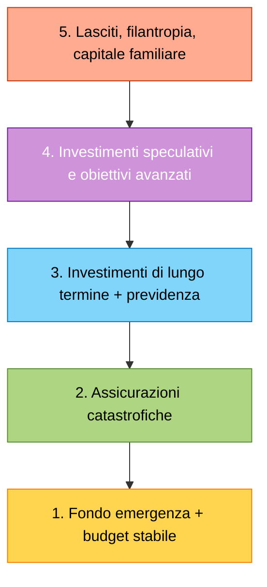
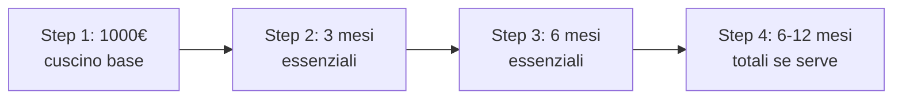
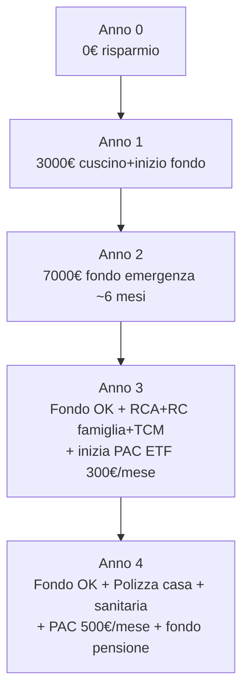

# Piramide finanziaria e fondo emergenza

C'è un ordine sacro nella finanza personale: prima ti proteggi, poi cresci. Mettere soldi in Bitcoin mentre non hai un euro per il dentista d'emergenza è come comprare la palestra senza avere il tetto sopra la testa. In questa sezione costruiamo la **piramide finanziaria**, partendo dalla base che salva la vita: il fondo emergenza.

## La piramide di Maslow finanziaria

Negli anni '40 lo psicologo Abraham Maslow propose una gerarchia dei bisogni umani: prima fisiologici, poi sicurezza, poi appartenenza, poi stima, poi autorealizzazione. La finanza personale ha una struttura speculare.

**Regola d'oro**: non si salta un livello. Non si compra l'azione tech meme prima di avere l'RC auto pagata. Non si parla di pensione integrativa se non c'è il fondo emergenza.

### Cosa contiene ciascun livello

| Livello | Strumenti tipici | Quanto pesa nel patrimonio liquido |
|---|---|---|
| 1. Fondo emergenza | Conto corrente buffer + conto deposito liquido + BTP brevissimo | 3-6 mesi di spese |
| 2. Assicurazioni | RCA, polizza casa, sanitaria, vita TCM, RC capofamiglia | 1-3% del reddito annuo |
| 3. Lungo termine | PAC su ETF globali, fondi pensione, BTP a medio-lungo | 50-70% dei flussi di risparmio |
| 4. Speculativi | Singole azioni, crypto, oro, P2P lending, immobiliare in leva | max 5-10% del netto |
| 5. Lasciti | Polizze vita per eredi, donazioni, trust, fondazioni | dipende dal patrimonio |

## Il fondo emergenza: la base della base

Il **fondo emergenza** (o *emergency fund*, o *fondo per imprevisti*) è una riserva liquida che ti permette di assorbire shock senza:
- accendere prestiti al consumo
- vendere investimenti in perdita
- chiedere soldi a famiglia o amici
- rinunciare a cure mediche / riparazioni essenziali

### Quanto deve essere grande?

La regola standard è **3-6 mesi di spese essenziali**. Non di reddito: di **spese**. La differenza è enorme.

| Profilo | Mesi consigliati | Logica |
|---|---|---|
| Dipendente pubblico, single, no figli | 3 mesi | Reddito molto stabile, NASpI come paracadute |
| Dipendente privato a tempo indeterminato | 4-6 mesi | Stabile ma licenziabile, NASpI fino a 24 mesi |
| Coppia con figli, mutuo, monoreddito | 6-9 mesi | Cash flow rigido, conseguenze gravi se salta |
| Freelance, partita IVA, commissioni | 9-12 mesi | Reddito volatile, no ammortizzatori automatici |
| Lavoratore stagionale o intermittente | 12+ mesi | Mesi senza incassi prevedibili |

### Esempio numerico

Stefania, 32 anni, dipendente privato. Stipendio: 2.200€ netti × 14 = 30.800€/anno.

**Spese mensili dettagliate**:

| Voce | €/mese | Essenziale? |
|---|---|---|
| Affitto | 650 | Sì |
| Bollette luce/gas/acqua | 130 | Sì |
| Internet + telefono | 35 | Sì |
| Spesa alimentare | 280 | Sì |
| Trasporti | 70 | Sì |
| Assicurazione auto + bollo (annualizzati) | 90 | Sì |
| Mutuo (se c'era) | 0 | — |
| Palestra | 40 | No |
| Ristoranti | 150 | No |
| Streaming | 25 | No |
| Vestiti | 60 | Misto (50% sì) |
| Salute | 30 | Sì |
| Regali, occasioni | 40 | No |
| **Totale uscite** | **1.600** | |
| **Spese essenziali** | **1.285** | |

Calcolo del fondo emergenza:
- **Minimo (3 mesi essenziali)**: $1.285 \times 3 = 3.855€$
- **Standard (6 mesi essenziali)**: $1.285 \times 6 = 7.710€$
- **Conservativo (6 mesi totali)**: $1.600 \times 6 = 9.600€$

Target ragionevole per Stefania: **5.000–10.000€**.

### Costruzione progressiva

Non si crea il fondo in un colpo. Si costruisce per **milestone**:

**Step 1: i primi 1.000€**. Sono il cuscino che ti permette di assorbire il 90% degli imprevisti: lavatrice rotta (300-500€), gomma forata (80€), gatto al pronto soccorso veterinario (250€). Senza questi 1.000€ vivi nello stress permanente.

A 350€/mese di risparmio, il primo cuscino arriva in ~3 mesi.

**Step 2: 3 mesi essenziali**. Stefania ci arriva in ~12 mesi (al netto di Step 1).

**Step 3: 6 mesi essenziali**. Altri ~11 mesi. Totale: ~26 mesi (poco più di 2 anni).

Una volta raggiunto Step 3, **il flusso di risparmio si redirige completamente verso gli investimenti** (livello 3 della piramide). Il fondo emergenza non si "fa crescere": si **rabbocca** se lo usi.

## Dove tenere il fondo emergenza

Il fondo emergenza ha 3 vincoli:
1. **Liquidità**: devo poterlo prelevare in 24-72 ore
2. **Sicurezza del capitale nominale**: non posso permettermi che valga il 30% in meno il giorno che mi serve
3. **Tasso ≥ 0**: ok perdere in termini reali contro l'inflazione, non in termini nominali

Da questi 3 vincoli escludiamo: azioni, ETF, obbligazioni di lunga scadenza, crypto, immobili, oro fisico, fondi pensione (bloccati). Restano:

### Opzioni concrete (2025-2026)

| Strumento | Rendimento lordo tipico | Liquidità | Vincoli | Garanzia |
|---|---|---|---|---|
| Conto corrente | 0–0,5% | Immediata | Nessuno | FITD 100k€ |
| Conto remunerato (es. Cherry Bank, Banca Sella, Banca Aidexa) | 2–4% | 1-2 giorni lavorativi | Spesso minimo | FITD 100k€ |
| Conto deposito **libero** | 2–3,5% | 1-3 giorni | Nessuno | FITD 100k€ |
| Conto deposito **vincolato** 6-12 mesi | 3–4,5% | Solo a scadenza (penali se sblocchi) | Vincolo durata | FITD 100k€ |
| BTP scadenza < 12 mesi | 2,5–3,5% netto | 1 giorno (vendita sul mercato) | Volatilità minima ma esistente | Stato italiano |
| Fondi monetari (es. *Amundi Smart Cash*) | ~3,5% lordo | 1 giorno | TER 0,1-0,3% | Nessuna FITD; rischio emittente bassissimo |

### Strategia consigliata

Spezza il fondo in **due tranche**:

- **Tranche calda (1-2 mesi)**: liquidi sul conto corrente o conto deposito libero. Disponibile in giornata.
- **Tranche fredda (resto del fondo)**: vincolato a 6-12 mesi, o BTP brevissimi. Tasso più alto, ma comunque accessibile entro 1 settimana in caso estremo.

Esempio per Stefania (target 8.000€):
- 2.000€ su conto corrente extra o deposito libero
- 6.000€ su deposito vincolato 12 mesi al 4% → genera 240€ lordi/anno (~177€ netti)

### Il dilemma del tasso reale negativo

Se l'inflazione è al 3% e il tuo conto deposito rende il 3,5% lordo (= 2,59% netto al 26%), in **termini reali stai perdendo lo 0,4% l'anno**.

$$\text{Tasso reale} \approx \text{Tasso nominale netto} - \text{Inflazione}$$

Su 8.000€: -32€/anno di potere d'acquisto. Domanda: vale la pena tenere lì 8.000€?

**Risposta**: sì, assolutamente. Il fondo emergenza non è un investimento, è un'**assicurazione**. Il costo del premio (32€/anno) è ridicolo rispetto al beneficio (non finire in prestito personale al 9% TAEG se ti serve liquidità).

Tieni a mente: massimizzare il rendimento del fondo emergenza è ottimizzare la cosa sbagliata. Il vero KPI è **velocità di accesso**.

### Errore classico: investire il fondo emergenza in ETF

"Tanto la borsa rende il 7%". Vero in media su 30 anni. Falso nel singolo anno. Nel 2008 l'MSCI World fece -42%. Nel marzo 2020 perse il 35% in 4 settimane.

Se la tua emergenza coincide con un crollo (e succede: licenziamenti e crolli arrivano spesso insieme — vedi 2008, 2020), vendi a metà prezzo proprio quando ti servono i soldi. Doppia botta.

## Secondo livello: assicurazioni catastrofiche

Una volta che il fondo emergenza copre le piccole e medie sorprese, devi coprire le grandi. Le grandi sono quelle che il fondo emergenza non può assorbire: 50.000€ di causa civile, 200.000€ di incidente grave, 80.000€ per ricostruire una casa.

### Le assicurazioni che servono davvero

| Assicurazione | Obbligatoria? | Perché serve | Costo annuo tipico |
|---|---|---|---|
| **RC auto** | Sì (per legge) | Senza, non guidi | 300–900€ |
| **RC capofamiglia** | No | Copre danni a terzi causati da te, partner, figli, animali domestici. Costa 30-80€ all'anno e copre fino a 1-2M€ | 30–80€ |
| **Polizza casa multirischio** | No (sì se mutuo) | Incendio, furto, eventi atmosferici, danni d'acqua | 150–400€ |
| **Sanitaria integrativa** | No | Copre franchigie SSN, ricoveri, alta diagnostica | 300–1.500€ |
| **TCM (Temporanea Caso Morte)** | No (sì se hai famiglia o mutuo) | Capitale ai beneficiari in caso di tuo decesso | 100–500€ a 30 anni |
| **Long Term Care** | No | Copre non autosufficienza (Alzheimer, ictus) | 400–1.000€ |

### Cosa NON serve (quasi mai)

- **Polizze "ramo vita unit-linked"** vendute in banca come "investimento sicuro": costi del 3-5% l'anno, illiquide. Non sono assicurazioni, sono prodotti finanziari travestiti.
- **Estensioni di garanzia** su elettronica al 15-20% del prezzo: statisticamente sfavorevoli.
- **Assicurazioni "viaggio premium"** quando hai già carta di credito Gold che copre il viaggio.
- **Polizze CPI (Credit Protection Insurance)** abbinate ai prestiti personali: caricate di costi (spesso 10-15% del capitale), spesso superflue.

### Regola del costo accettabile

Una polizza "fa la sua parte" se rispetta queste due condizioni:
1. Copre un rischio che **non puoi assorbire da solo** (=danno > 10-20% del tuo patrimonio liquido o reddito annuo)
2. Premio < 5% del capitale assicurato moltiplicato per la probabilità annua dell'evento

Esempio: TCM da 200.000€ a 30 anni costa ~150€/anno. Capitale × probabilità annua di morte a 30 anni (≈0,1%) = 200€. Premio 150€ < 200€ → tariffa fair. (Le compagnie applicano un margine; sotto il "fair" è già un buon affare per te.)

## Terzo livello: previdenza e investimenti di lungo termine

Una volta che la base è solida, si passa alla **crescita patrimoniale**:

- **Fondo pensione complementare** (vedi [Pensioni e previdenza complementare](23-pensioni.html)): TFR + contributi del datore + deduzione fiscale (max 5.164,57€/anno).
- **PAC su ETF globali** (es. MSCI World, FTSE All-World): orizzonte 10+ anni.
- **BTP a medio-lungo termine** per parte difensiva del portafoglio.
- **Investimento immobiliare** (prima casa con mutuo razionale, eventualmente seconda casa per reddito).

A questo livello la priorità non è più "non perdere" ma **rendimento reale composto**.

## Esempio completo: Marco, 4 anni di percorso

Marco, 26 anni, freelance designer.
- Reddito netto medio: 24.000€/anno (variabile mese a mese)
- Spese totali: 18.000€/anno → essenziali 14.000€
- Tasso di risparmio: 25%

A 4 anni Marco ha:
- 8.000€ di fondo emergenza (6 mesi essenziali)
- Polizze base in essere
- ~5.000€ in ETF (in crescita)
- 1.500€ di contributi su fondo pensione

A 30 anni, con questo ritmo, ha ~50-60.000€ di patrimonio liquido + capacità di assorbire la maggior parte degli shock. Non è ricchezza, è **resilienza**. Ed è il prerequisito per tutto il resto.

## Esercizi

Esercizio: dimensiona il tuo fondo emergenza

**Step 1** — Recupera dal tuo budget (sezione precedente) le tue spese mensili totali.

**Step 2** — Categorizza ogni voce in:
- **Essenziale** (non puoi tagliarla nemmeno disoccupato: affitto/mutuo, utenze, spesa base, assicurazioni obbligatorie, trasporti minimi, salute)
- **Comprimibile** (la dimezzeresti se restassi senza lavoro: ristoranti, vestiti, palestra)
- **Tagliabile** (la azzereresti del tutto: abbonamenti non essenziali, regali, viaggi)

**Step 3** — Calcola:
- Spese essenziali mensili (E)
- Fondo minimo (3 mesi) = E × 3
- Fondo standard (6 mesi) = E × 6

**Step 4** — Confronta con quello che hai ora:
- Quanto liquido hai oggi? (conto corrente + deposito + bond brevissimi)
- A quanti mesi essenziali corrisponde?
- Quanto ti manca per arrivare al target?

**Step 5** — Calcola **quanti mesi** ti servono per coprire il gap, dato il tuo tasso di risparmio attuale.

Esercizio: scegli dove parcheggiare il fondo

Hai 8.000€ da destinare al fondo emergenza. Devi decidere come spezzarlo. Considera questi vincoli:
- 1 mese di spese essenziali deve essere disponibile in giornata
- Inflazione attesa: 2,5%
- Aliquota su rendite finanziarie: 26%

Opzioni:
- A: 8.000€ tutto sul conto corrente (0% rendimento)
- B: 2.000€ conto corrente + 6.000€ deposito libero al 3,2% lordo
- C: 2.000€ conto corrente + 6.000€ deposito vincolato 12 mesi al 4,2% lordo
- D: 2.000€ conto corrente + 6.000€ BTP scadenza 6 mesi al 3% netto

**Domande**:
1. Quale tra B, C, D rende di più al netto? (Suggerimento: $3{,}2\% \cdot (1-0{,}26) = 2{,}37\%$; $4{,}2\% \cdot 0{,}74 = 3{,}11\%$; $3\%$ netto.)
2. Qual è il "rendimento reale" (al netto dell'inflazione) di ciascuna opzione?
3. In quale scenario di emergenza l'opzione C è peggiore di B?
4. Quale sceglieresti tu, e perché?

## Errori frequenti

1. **Considerare l'investimento ETF come fondo emergenza**: classico errore "yolo". Il giorno che ti serve, magari l'ETF è -25%.
2. **Tenere il fondo sullo stesso conto corrente delle spese**: psicologicamente lo "vedi" e lo erodi. Tienilo su un conto separato senza app facile.
3. **Sotto-dimensionare per "tasso reale negativo"**: il fondo emergenza è un'assicurazione, non un investimento. -2%/anno reali è il premio.
4. **Sovra-dimensionare a 24 mesi**: oltre i 6-12 mesi diventa capitale che dovrebbe crescere, non parcheggiarsi.
5. **Saltare al livello 3 prima del livello 1**: comprare crypto prima di aver pagato la rata della carta di credito.
6. **Sottoscrivere "polizze vita" investimento credendo siano protezione**: confusione classica spinta dalle banche.

## Approfondimenti

- [Conti correnti e conti deposito](07-conti-e-pagamenti.html): dove parcheggiare le tranche.
- [BTP e titoli di Stato](18-btp-titoli-stato.html): per la tranche di medio-breve.
- [Assicurazioni di base](22-assicurazioni.html): TCM, RC famiglia, sanitaria, polizza casa in dettaglio.
- [Fondi pensione e previdenza](23-pensioni.html): il terzo pilastro.
- [Asset allocation](20-asset-allocation.html): bilanciare i livelli 3-4.
