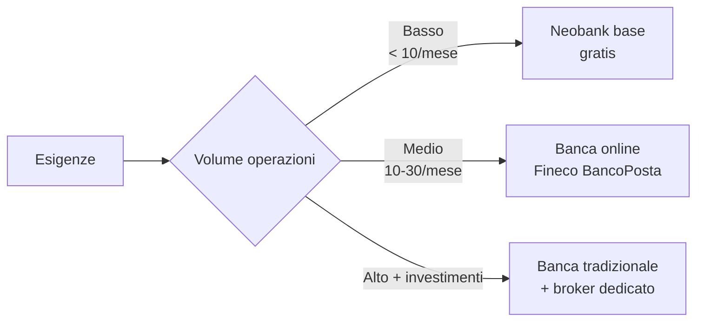

# Conti correnti, conti deposito, sistemi di pagamento

Il conto corrente è la "scheda madre" della tua vita finanziaria: ci passa stipendio, affitto, bollette, abbonamenti, prelievi. Pagarlo troppo o usarlo male è un'emorragia che molti subiscono senza accorgersene. In questa sezione vediamo come funziona, quanto deve costare, e come orchestrarlo con conto deposito, carte e neobank.

## Conto corrente vs conto deposito vs libretto

Le tre cose si confondono spesso. Sono diverse.

| | Conto corrente | Conto deposito | Libretto postale |
|---|---|---|---|
| Funzione | Movimentazione quotidiana | Parcheggio capitale | Risparmio storico |
| Pagamenti diretti | Sì (bonifico, SDD, carta) | No | Limitati |
| Rendimento | 0–0,5% | 2–4,5% | 0–3% (libretto smart) |
| Liquidità | Immediata | Libero: 1-3 gg / Vincolato: solo a scadenza | Buona |
| Costi tipici | 0–150€/anno (canone) | Spesso 0 + bollo 34,20€ se > 5.000€ | Bassi |
| Garanzia | FITD 100k€ | FITD 100k€ | Garanzia Stato (Cassa DP) |
| A chi serve | Tutti | Chi vuole rendimento su liquidità | Eredità affettiva, nonni |

**Sintesi**: il conto corrente è dove "vivono" i tuoi soldi del mese. Il conto deposito è dove "dormono" quelli del fondo emergenza (tranche fredda). Il libretto postale oggi è quasi sempre subottimale (vinto da conti deposito Cherry, Banca Aidexa, ecc.), ma rimane diffuso per ragioni storiche.

## Costi del conto corrente: la lista completa

### Canone

Il **canone** è il costo fisso che la banca ti addebita per il "servizio". Spazia da 0€ (neobank, conti smart) a 200€/anno (banche tradizionali, conti "premium").

- Banca tradizionale standard: 90-150€/anno
- Banca tradizionale con stipendio accreditato: spesso 0€ (promozione "salary discount")
- Banca online (Fineco, BancoPosta Online): 0-3,90€/mese
- Neobank (Revolut, N26, Hype, BuddyBank, Tinaba): 0€/mese sul piano base

### Imposta di bollo

In Italia è un'imposta **di legge** (DPR 642/1972):

- **34,20€/anno** per persone fisiche se la **giacenza media annua è > 5.000€**
- **100€/anno** per persone giuridiche
- Sui conti deposito è **sempre dovuta** indipendentemente dalla giacenza
- Sui dossier titoli: **0,2%** della giacenza titoli (con minimo di 34,20€)

L'imposta di bollo non è "tassa della banca": la banca la incassa per conto dello Stato.

### Commissioni operative

Su tutti i conti, le banche tradizionali tipicamente caricano:

| Operazione | Banca tradizionale | Banca online | Neobank |
|---|---|---|---|
| Bonifico ordinario online | 0–2€ | 0€ | 0€ |
| Bonifico SEPA istantaneo | 1–3€ | 0,50€–2€ | 0€ |
| Prelievo ATM stessa banca | 0€ | 0€ | 0€ |
| Prelievo ATM altra banca | 1–2€ | 0–2€ | 0€ (fino al limite) |
| Prelievo ATM estero | 2-5€ + 1-2% | 0-2€ | 0€ (fino al limite) |
| Estratto conto cartaceo | 0,80€/mese | spesso non disponibile | non disponibile |
| Domiciliazione bollette | 0–0,30€/operazione | 0€ | 0€ |
| Commissione cambio valuta carta | 1-2% | 0,5-1% | 0% nel weekday (Revolut, Wise) |

### Tassi attivi e passivi

- **Tasso attivo** (cosa la banca ti paga sulle giacenze): tipicamente 0% per il conto corrente, qualche decimale per i "conti remunerati".
- **Tasso passivo** (cosa paghi se vai in scoperto): in Italia il TAEG dello scoperto è alto: 9-15% annuo. È **debito tossico** — un fondo emergenza ti evita di toccarlo.
- **TAEG carta revolving**: 15-25% annuo. Da evitare come la peste tranne emergenze (vedi sotto).

## IBAN, BIC, ABI, CAB: anatomia di un codice

### IBAN

L'**IBAN** (International Bank Account Number) identifica univocamente un conto bancario europeo. Per l'Italia ha 27 caratteri:

```
IT 60 X 05428 11101 000000123456
```

Decomponiamo:

| Posizione | Significato | Esempio |
|---|---|---|
| 1-2 | Codice paese (ISO 3166) | IT |
| 3-4 | Cifre di controllo | 60 |
| 5 | CIN (Control Internal Number) | X |
| 6-10 | **ABI** (Associazione Bancaria Italiana) — identifica la banca | 05428 (BPER, esempio) |
| 11-15 | **CAB** (Codice Avviamento Bancario) — identifica la filiale | 11101 |
| 16-27 | Numero conto | 000000123456 |

Il CIN è una cifra di controllo per evitare errori di digitazione (algoritmo mod 26 sui caratteri precedenti). Le cifre di controllo (pos. 3-4) sono **MOD-97**: garantiscono che un IBAN sbagliato venga rilevato istantaneamente (probabilità di falso positivo ~1/97).

### BIC/SWIFT

Il **BIC** (Bank Identifier Code), spesso chiamato **SWIFT code**, identifica la banca a livello globale. 8 o 11 caratteri:

```
BCITITMM     (Intesa Sanpaolo, sede)
BCITITMMXXX  (versione 11 caratteri)
```

- Primi 4: codice banca
- 5-6: codice paese
- 7-8: codice città
- 9-11: codice filiale (opzionale)

Serve solo per bonifici fuori SEPA. Per bonifici SEPA, il solo IBAN basta.

## Sistemi di pagamento

Sapere "come" si muovono i soldi cambia il tuo modo di gestirli.

### SEPA: il bonifico europeo

**SEPA** (Single Euro Payments Area) copre 36 paesi (UE + Svizzera, UK, Norvegia, Islanda, Liechtenstein, Monaco, San Marino, Andorra, Città del Vaticano). All'interno dell'area:
- Bonifici in euro
- Trattati come "domestici" (stessi tempi, stessi costi)
- Solo IBAN richiesto

Esistono **3 tipi** di bonifico SEPA:

| Tipo | Tempi | Costo | Limite |
|---|---|---|---|
| **SCT (SEPA Credit Transfer) ordinario** | 1 giorno lavorativo | Spesso 0€ online, 2-5€ in filiale | 999.999.999€ |
| **SCT Inst (SEPA Instant)** | < 10 secondi, 24/7/365 | 0–3€ | 100.000€ (dal 2024) |
| **SDD (SEPA Direct Debit)** | 5 gg per il primo, 2 gg per i successivi | 0€ (lato pagante) | Variabile |

Dal 2024 (regolamento UE 2024/886) le banche devono offrire SCT Inst **allo stesso prezzo** dello SCT ordinario, e da gennaio 2025 in **invio** è obbligatorio per tutte le banche euro-area.

### SDD (SEPA Direct Debit)

L'**addebito diretto SEPA** è il modo standard per pagare bollette ricorrenti (luce, gas, telefono, abbonamenti, palestra, palestra, donazioni).

Sostituisce il vecchio **RID** italiano (Rapporti Interbancari Diretti). Da agosto 2014, tutti i RID sono migrati automaticamente a SDD.

- **SDD Core** (consumatore): 8 settimane di diritto di **rimborso senza domande**, fino a 13 mesi per addebiti non autorizzati.
- **SDD B2B** (business): nessun diritto di rimborso, deve essere preautorizzato in banca.

Il diritto di rimborso 8 settimane è una delle tutele più sottovalutate: se Sky/Vodafone/qualcuno ti addebita per errore o senza diritto, hai 8 settimane per dire "indietro tutto" via app/sportello, senza dover provare nulla.

### SWIFT internazionale

Quando esci dalla SEPA, sei nel mondo **SWIFT** (Society for Worldwide Interbank Financial Telecommunication):
- 11.000 banche in 200 paesi
- Tempi: 1-5 giorni lavorativi (dipende da quante banche intermedie)
- Costi: 15-40€ per bonifico + spese banche intermedie + spread valutario (1-3%)
- Diviso in: **OUR** (paghi tu tutte le spese), **SHA** (condividete), **BEN** (paga il beneficiario)

Per inviare soldi fuori EU, oggi le neobank multi-valuta (Wise, Revolut, Lightyear) sono **molto** più economiche delle banche tradizionali. Su una rimessa di 1.000€ verso USA: banca tradizionale ~25-40€ totali, Wise ~7-10€.

### Wero / EPI

Nel 2024-2025 è partito **Wero**, il sistema di pagamento P2P europeo (alternativa a PayPal/Venmo). Sviluppato dall'**EPI** (European Payments Initiative). Permette pagamenti istantanei via telefono/email tra utenti delle banche aderenti (BPCE, Deutsche Bank, ING, Intesa Sanpaolo, ecc.).

## Carte: debito, credito, prepagate, revolving

### Carta di debito

Pagamenti scalano **immediatamente** dal conto corrente. Se non c'è saldo, non passa.

- **Bancomat / PagoBANCOMAT**: circuito italiano, accettato ovunque in Italia, raramente all'estero.
- **Visa Debit / Mastercard Debit**: circuiti internazionali, accettati ovunque.

Costi: 0–30€/anno (canone), spesso azzerato se vincolata al conto corrente o ai neobank.

### Carta di credito

Pagamenti **rinviati** al mese successivo (estratto conto mensile). La banca anticipa, tu rimborsi a saldo unico (di solito il 15 del mese successivo).

- **Carta a saldo**: paghi tutto entro il giorno X. Zero interessi.
- **Carta revolving**: paghi solo una rata minima (es. 30€ o 5% del dovuto), e il resto frutta interessi al **15-25% TAEG**.

**Avvertenza**: la revolving è una delle trappole più costose della finanza personale. È pensata per il prestito sotto mentite spoglie. Evita.

| Tipo | TAN | TAEG tipico | A chi serve |
|---|---|---|---|
| Carta a saldo | 0% | 0% (solo canone) | Tutti, se gestita |
| Carta revolving "convenienza" | 14-18% | 17-22% | Quasi nessuno |
| Carta revolving da supermercato | 18-25% | 22-29% | Nessuno |

Le carte di credito hanno benefici reali:
- **Tutele su acquisti** (chargeback per ordini non consegnati, frodi, ecc.)
- **Assicurazioni viaggio** integrate (Gold/Platinum)
- **Cashback / miles** (1-3% spesso)
- **Storia creditizia** positiva (vedi [Credit score](08-credit-score-crif.html))

### Carta prepagata

Carta caricata in anticipo. Non collegata a conto corrente vero e proprio (anche se le "evolute" come PostePay Evolution **hanno** IBAN proprio).

- **PostePay**: storica, ma con commissione di ricarica (1€/200€)
- **PostePay Evolution**: con IBAN, simile a un conto corrente light
- **HYPE Start**: gratuita, IBAN, limiti annuali (2.500€)
- **Revolut Standard**: gratuita, IBAN UE, multi-valuta

Sono utili per:
- Acquisti online (limitare l'esposizione di frode)
- Adolescenti / studenti (controllo parentale)
- Viaggi (separare i fondi)

### Carta virtuale

Carta usa-e-getta o ricaricabile, esistente solo nell'app. Numero, scadenza, CVV cambiano ad ogni transazione (o on-demand). Difesa quasi perfetta contro phishing/frodi su siti dubbi.

Offerta da Revolut, N26, Hype, Wise, alcune banche tradizionali (Fineco, Sella).

## FITD: la garanzia che salva i risparmiatori

Il **FITD** (Fondo Interbancario di Tutela dei Depositi) è un consorzio obbligatorio delle banche italiane (eccetto quelle che usano FGD per le BCC). Tutela i depositi fino a **100.000€ per depositante per banca**.

### Cosa è garantito
- Conto corrente (saldo)
- Conto deposito (saldo)
- Libretto di risparmio
- Assegni circolari, certificati di deposito nominativi

### Cosa NON è garantito
- Titoli (azioni, obbligazioni, ETF) — anche se depositati presso la banca, sono tuoi, non del bilancio bancario, quindi una pulizia di insolvenza non li tocca
- Valute estere
- Strumenti finanziari "evoluti" (polizze unit-linked, fondi)

### Come funziona in pratica
- La soglia 100k€ è **per banca**, non per conto. Se hai 2 conti nella stessa banca per 60k€ ciascuno, ti garantiscono solo 100k€ totali.
- È **per depositante**: se sei cointestatario, la quota viene divisa.
- Se hai 200k€ liquidi, splittali su due banche differenti.

### Scenari recenti
- **Banca Etruria, Marche, Chieti, Ferrara, Carige (2015-2017)**: liquidazione coatta. I depositi sotto 100k€ rimborsati al 100%, sopra parzialmente persi (insieme a bond subordinati).
- **Credito Cooperativo Cassa Padana / Cassa Rurale / ecc.**: nessun default, rimangono dietro FGD.

Lezione: non tenere mai più di 100k€ in **una** banca, neanche per pochi giorni.

## Confronto neobank vs banche tradizionali



### Le principali italiane/europee

| Banca | Canone | IBAN | Servizi principali | Punto debole |
|---|---|---|---|---|
| **Revolut Standard** | 0€ | UE (LT/IE) | Multi-valuta, crypto, vault, instant | Customer care via chat |
| **N26 Standard** | 0€ | UE (DE) | Spaces, Instant, virtual cards | Chiuso ai nuovi italiani per un periodo |
| **Hype Start** | 0€ | IT (BPER) | App italiana, contante in tabaccheria | Limite 2.500€/anno su Start |
| **BuddyBank** | 9,90€/mese | IT | Concierge 24/7, assicurazioni | Costo |
| **Tinaba** | 0€ | IT | Banca + investimenti + crowdfunding | Servizi limitati |
| **Mooney** | 0€ | IT | Tabaccheria + bollettini | Servizi limitati |
| **Fineco** | 3,95€/mese | IT | Conto + broker professional | Canone (ma azzerabile con stipendio) |
| **Intesa SP / Unicredit / BPER / BNL** | 5–12€/mese | IT | Sportello fisico, mutui, prestiti | Costi se non azzerabile |
| **Banca Sella / Mediolanum / Widiba** | 0–4€/mese | IT | Mix tra tradizionale e online | Servizi a volte limitati |

### Esempio: 10 operazioni/mese a confronto

Profilo: stipendio 1.800€/mese accreditato, 1 bonifico affitto, 1 bonifico risparmio, 5 SDD (utenze + abbonamenti), 2 prelievi ATM, 1 pagamento bollettino F24.

| Voce | Banca tradizionale tipo (no stipendio) | Banca tradizionale (stipendio domiciliato) | Fineco | Revolut |
|---|---|---|---|---|
| Canone annuo | 144€ | 0€ (azzerato) | 0€ (azzerato con stipendio > 2.500€) o 47€ | 0€ |
| Bonifici (24/anno) | 0–48€ | 0€ | 0€ | 0€ |
| Prelievi (24/anno) | 0€ | 0€ | 0–10€ | 0€ entro limite |
| SDD (60/anno) | 0–18€ | 0€ | 0€ | 0€ |
| F24 (12/anno) | 0€ | 0€ | 0€ | non disponibile (qui serve banca italiana) |
| Imposta di bollo | 34,20€ | 34,20€ | 34,20€ | 34,20€ se giacenza > 5k€ |
| **Totale annuo** | **196–244€** | **34,20€** | **34,20–91€** | **0–34,20€** |

**Risparmio annuo passando a Revolut o equivalente**: ~150-200€. Su 30 anni di vita lavorativa: ~5.000€ + interesse composto. Non poco.

⚠️ Attenzione: la neobank pura **non ha servizi** come mutui, fido grande, F24 (alcune), assegni. Se ti servono, mantieni una banca tradizionale "leggera" come secondo conto.

## Esercizi

<details>
<summary>Esercizio: calcola il costo annuo del tuo conto corrente</summary>

**Step 1** — Recupera l'estratto conto del 31 dicembre dell'ultimo anno (oppure documento di sintesi annuale ICCD, che è obbligatorio entro il 31 marzo dell'anno successivo).

**Step 2** — Identifica:
- Canone mensile × 12
- Commissioni bonifici (totali nell'anno)
- Commissioni prelievi
- Commissioni domiciliazioni
- Imposta di bollo
- Altre voci

**Step 3** — Calcola il **TCV** (Indicatore Sintetico di Costo) confrontandolo con quello "ufficiale" dichiarato dalla banca. Differenza?

**Step 4** — Confronta con il costo equivalente su un'alternativa (Revolut, Fineco, Banca Sella). Se la differenza è > 100€/anno, hai un caso per cambiare.

**Step 5** — Calcola l'impatto su 20 anni della differenza, supponendo che il differenziale venga investito al 4% reale:

$$M = D \cdot \frac{(1+0{,}04)^{20} - 1}{0{,}04}$$

con $D$ = differenza annua. Risultato sorprendente.

</details>

<details>
<summary>Esercizio: SCT vs SCT Inst nella vita reale</summary>

Hai 3.000€ sul conto corrente principale. Vuoi spostarli sul conto deposito che paga il 3,8% lordo. Il deposito ha valuta solo dei bonifici "compensati" (= effettivamente disponibili).

- Bonifico SCT ordinario: parte alle 17:00 di mercoledì → disponibile sul deposito venerdì → 2 giorni di mancato interesse
- Bonifico SCT Inst: disponibile in 10 secondi

Calcola **quanto perdi** scegliendo SCT ordinario invece di SCT Inst, per ciascuno dei seguenti scenari:
1. 3.000€ per 2 giorni a 3,8% lordo
2. 30.000€ per 5 giorni a 3,8% lordo

Il costo del SCT Inst è 1€. **Vale la pena**?

(Soluzioni: scenario 1 → $3000 \times 0{,}038 \times (2/365) \approx 0{,}62€$ → no, SCT ordinario meglio. Scenario 2 → $30000 \times 0{,}038 \times (5/365) \approx 15{,}62€$ → sì, SCT Inst meglio.)

</details>

## Errori comuni

1. **Restare in una banca per inerzia**: la portabilità conto corrente esiste dal 2015 (D.Lgs. 11/2010) ed è gratuita. La banca nuova fa tutto al posto tuo in 12 giorni lavorativi.
2. **Confondere conto deposito vincolato e ETF obbligazionari**: il primo ha garanzia FITD, il secondo no. A parità di rendimento, il vincolato è più sicuro.
3. **Lasciare > 100k€ in una sola banca**: oltre la soglia FITD, sei esposto al rischio bancario.
4. **Usare la revolving senza saperlo**: alcune carte sono revolving "by default" (es. American Express Verde, alcune carte Findomestic). Controlla i piani di rimborso.
5. **Fare bonifici esteri con banche tradizionali**: spread + commissioni = 3-5% di costo. Usa Wise/Revolut.
6. **Ignorare l'addebito SDD non autorizzato**: hai 8 settimane di rimborso senza domande. Usalo.
7. **Tenere il fondo emergenza al 0% sul conto corrente**: bastano 30 minuti per aprire un deposito al 3,5%.

## Approfondimenti

- [Credit score, CRIF e identità finanziaria](08-credit-score-crif.html): perché le tue scelte bancarie influenzano la tua "reputazione".
- [Mutui](14-mutui.html): la carta vincente è la banca con il **miglior mutuo**, non con il miglior conto corrente. Spesso non coincidono.
- [Investimenti via broker](15-broker.html): IBAN ≠ broker. Servono entrambi.
- [Frode e phishing](27-frode-phishing.html): proteggere il conto da SIM swap, social engineering, malware.
