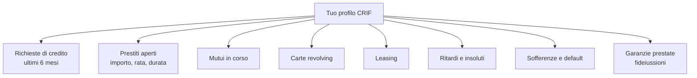
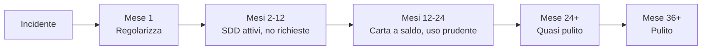

# Credit score, CRIF e identità finanziaria

In ogni momento, da qualche parte, un computer sta assegnando un numero alla tua **affidabilità finanziaria**. Quel numero decide se ti danno il mutuo, a che tasso, se ti affittano la casa, se ti aprono il fido sul conto. La maggior parte delle persone non lo conosce, non lo controlla, e scopre la sua esistenza solo quando la banca dice "no". In questa sezione ti spiego come funziona in Italia (con CRIF, Experian, CTC) e nel mondo (FICO, VantageScore), cosa lo determina, e come si ricostruisce dopo un errore.

## Cos'è un Sistema di Informazioni Creditizie (SIC)

Un **SIC** è una banca dati privata che raccoglie informazioni sui rapporti di credito tra cittadini, imprese e istituzioni finanziarie. La logica:
- Quando chiedi un prestito, la banca consulta il SIC per "leggere" la tua storia
- Tutte le banche e finanziarie obbligatoriamente segnalano al SIC i nuovi rapporti, le rate, i ritardi
- Il SIC restituisce un report — e in alcuni casi un **punteggio** — che la banca usa per decidere

In Italia non esiste un'unica banca dati pubblica come il FICO americano. Esistono **diversi SIC privati**, ciascuno gestito da una società:

| SIC | Società | Quota mercato approssimativa | Note |
|---|---|---|---|
| **CRIF** | Centrale Rischi Finanziari | ~85% del mercato | Il più grande, copre praticamente tutte le banche |
| **Experian** | Experian Italia | ~15-20% | Internazionale, molto usato all'estero |
| **CTC** | Consorzio per la Tutela del Credito | ~10% | Storicamente legato a finanziarie |
| **Assilea** | Associazione del Leasing | Specifica | Solo per leasing |

Inoltre esistono:

- **Centrale dei Rischi (CR) della Banca d'Italia**: SIC **pubblico**, gestito dalla BdI. Obbligatoria segnalazione per esposizioni > 30.000€ (soglia ridotta nel 2009 da 75.000€). Diversa logica: registra solo grandi posizioni e default formali, non i piccoli prestiti.
- **CAI (Centrale di Allarme Interbancaria)**: gestita da BdI. Registra assegni e carte revocate per insolvenza, per 6 mesi. Finire sul CAI è "patente sospesa" finanziaria.

### Differenza con il rating creditizio

Attenzione a non confondere:

| | Credit score (SIC) | Rating creditizio |
|---|---|---|
| Soggetto | Persone fisiche e PMI | Imprese grandi e Stati |
| Emittente | CRIF, Experian, FICO, ecc. | Moody's, S&P, Fitch, DBRS |
| Scala | Punteggio numerico (es. 300-850) o categoria | Lettere (AAA, AA, A, BBB, ... D) |
| Pubblico | Privato per il consumatore | Pubblico, mosso il mercato |
| Esempio | "Mario Rossi ha un FICO 720" | "Italia ha rating BBB" |

I due mondi si toccano nei mutui cartolarizzati: chi compra obbligazioni MBS guarda il **rating** (S&P) del pacchetto, che dipende dai **credit score** (FICO) dei singoli mutuatari. Vedi crisi 2008.

## Come funziona il SIC in Italia (CRIF in particolare)

CRIF (Centrale Rischi Finanziari) è di gran lunga il SIC dominante. Sede a Bologna, fondata 1988. Ogni mese tutte le banche e finanziarie aderenti **inviano automaticamente** i dati a CRIF.

### Cosa entra nel tuo profilo CRIF

**Note importanti**:
- Anche le **richieste rifiutate** vengono registrate (per 6 mesi)
- I **bonifici, conti correnti senza scoperto, stipendi, pagamenti carta a saldo** non sono in CRIF
- Le multe NON sono in CRIF, ma se vai in cartella esattoriale Agenzia Entrate Riscossione le banche possono ottenere altrove l'informazione
- Le **bollette luce/gas/telefono** non sono in CRIF (eccetto se finite in recupero crediti formale)

### Tempi di conservazione dati

Definiti dal **Codice di deontologia** dei SIC (Garante Privacy, delibera 8/2004 aggiornata):

| Tipo di dato | Durata conservazione |
|---|---|
| Richieste di credito rifiutate o rinunciate | 30 giorni o 180 giorni (a seconda dei casi) |
| Rapporti regolarmente estinti (positivi) | **36 mesi** dall'estinzione |
| Ritardi di 1-2 rate poi regolarizzati | **12 mesi** dalla regolarizzazione |
| Ritardi di 3+ rate poi regolarizzati | **24 mesi** dalla regolarizzazione |
| Default, sofferenze, prestiti non rimborsati | **36 mesi** dalla data dell'evento (estendibile a 60 in alcuni casi) |
| Dati anagrafici se nessun rapporto attivo | Cancellati dopo l'ultimo evento |

**Caso pratico**: hai un ritardo di 3 mesi su una rata, poi paghi tutto. La segnalazione "regolarizzata" resta visibile per 24 mesi. Se cerchi un mutuo in quei 24 mesi, la banca lo vede e probabilmente alza il tasso o ti rifiuta.

### Diritto di accesso

Per legge (Codice Privacy, GDPR art. 15) puoi richiedere il **tuo report CRIF gratuitamente**, una volta. Modalità:
- Online via [www.consumatori.crif.com](https://www.consumatori.crif.com)
- Per posta raccomandata
- Tempi: 15 giorni (massimo 30)

Costo: 0€ se è la prima richiesta o se contesti dati. Successive: 7,80€-31,00€ a seconda del dettaglio.

**Cosa controllare**:
- I tuoi rapporti sono tutti veri?
- I ritardi segnalati sono corretti?
- Ci sono prestiti che non ricordi (frode di identità)?
- Le date di estinzione sono giuste?

Se trovi errori, chiedi rettifica via PEC o raccomandata. CRIF ha 30 giorni per rispondere. Se rifiutano, ricorso al Garante Privacy o al Tribunale.

## Il credit score americano: FICO e VantageScore

Negli USA il sistema è molto più centralizzato e visibile al consumatore. Tre bureau federali (**Equifax, Experian, TransUnion**) raccolgono i dati. Sui dati grezzi, due algoritmi calcolano lo score:

### FICO Score

Sviluppato da Fair Isaac Corporation. Scala **300-850**. Usato dal ~90% dei prestatori USA.

| Fascia FICO | Categoria | % popolazione |
|---|---|---|
| 800-850 | Eccezionale | ~21% |
| 740-799 | Molto buono | ~25% |
| 670-739 | Buono | ~21% |
| 580-669 | Mediocre | ~16% |
| 300-579 | Scarso | ~16% |

### Composizione del FICO

Il calcolo esatto è proprietario, ma Fair Isaac pubblica i pesi:

| Fattore | Peso | Cosa misura |
|---|---|---|
| **Payment history** | 35% | Pagamenti puntuali |
| **Amounts owed** | 30% | Utilizzo del credito (Credit Utilization Ratio) |
| **Length of credit history** | 15% | Età media dei conti |
| **Credit mix** | 10% | Diversità (mutuo + carta + auto-loan) |
| **New credit** | 10% | Richieste recenti |

Formula concettuale (semplificata):

$$\text{FICO} \approx w_1 \cdot \text{Payments} + w_2 \cdot \text{Utilization} + w_3 \cdot \text{Length} + w_4 \cdot \text{Mix} + w_5 \cdot \text{NewCredit}$$

### Credit Utilization Ratio

Una delle metriche più importanti, calcolata su carte di credito:

$$\text{CUR} = \frac{\text{Saldo non pagato a fine ciclo}}{\text{Limite totale}}$$

- < 10% → eccellente
- 10-30% → buono
- 30-50% → sufficiente
- > 50% → penalizzante
- > 90% → segnale di crisi

Esempio: hai una carta con limite 5.000$. Se a fine mese il saldo (prima del pagamento) è 4.500$, il CUR è 90%, anche se poi paghi tutto. FICO leggerà 90% e ti penalizzerà.

### VantageScore

Sviluppato congiuntamente dai 3 bureau nel 2006. Scala **300-850** (nelle versioni recenti). Più tollerante di FICO sui "thin file" (poche linee di credito) — usato spesso dai siti gratuiti tipo Credit Karma.

## Errori che rovinano il credit score

### 1. Ritardi nei pagamenti

Il fattore #1 (35% del FICO, alta importanza anche in CRIF). Anche **un solo ritardo > 30 giorni** può:
- Far perdere 60-110 punti FICO
- Rimanere visibile 7 anni (USA) o 12-24 mesi regolarizzato (IT)
- Far rifiutare il mutuo nei 12-24 mesi successivi (IT)

Trick: imposta **addebito automatico SDD** per ogni rata. Anche se hai i soldi, dimenticarsi 1 giorno costa carissimo.

### 2. Utilizzo carta sopra il 30%

Negli USA molti credono che "pagare tutto a fine mese" basti. Falso: il bureau riceve il saldo **alla data di chiusura del ciclo** (statement date), prima del pagamento. Se in quel giorno la carta era al 60%, FICO vede 60%.

Soluzione: paga **in anticipo** durante il mese, o richiedi un **aumento di limite** (senza usarlo).

### 3. Richieste di credito multiple in breve tempo

Ogni "hard inquiry" toglie 2-5 punti. Se in 6 mesi fai 8 richieste (es. shop around per prestito personale), perdi 20-40 punti.

**Eccezione "rate shopping"**: per mutui e auto, FICO raggruppa richieste fatte entro 14-45 giorni come un'unica inquiry. In Italia CRIF non ha questa tolleranza esplicita: meglio non fare più di 2-3 richieste in 30 giorni.

### 4. Chiusura della carta più vecchia

Sembra controintuitivo: chiudere una carta inutilizzata **abbassa** lo score, perché:
- Riduce il limite totale → aumenta il CUR delle altre
- Riduce l'età media dei conti

Meglio tenerla attiva con un piccolo addebito ricorrente (es. abbonamento Netflix da 12,99€) e pagarla a saldo.

### 5. Credit mix monoclasse

Avere solo carte di credito (e nessun prestito rateale) o solo un mutuo (e nessuna carta) penalizza marginalmente. Mix sano: 1 carta a saldo, 1 prestito rateale a basso importo, eventualmente mutuo.

### 6. Co-firma allegre

Se firmi come **garante** (fideiussore) per il prestito di un amico/familiare, quel prestito appare anche sul **tuo** profilo. Se l'altro non paga, il tuo score si schianta. Pensaci due volte.

## Esempio numerico: l'effetto di un ritardo > 30 giorni

Andrea ha un mutuo, una carta di credito Visa, un prestito personale. Profilo CRIF "pulito" da 4 anni. A causa di un cambio banca pasticciato, una rata del prestito personale (250€) salta. Si accorge dopo 35 giorni e paga immediatamente con mora.

**Conseguenze nei 24 mesi successivi**:

| Effetto | Stima |
|---|---|
| Punteggio interno banca (immaginiamo equivalente FICO) | Da ~740 a ~620 (-120 punti) |
| Spread richiesto da banca per un nuovo mutuo | Da 1,2% a 2,1% (+0,9 punti percentuali) |
| Su mutuo 150.000€ a 25 anni: differenza rata mensile | ~65€/mese |
| Costo totale aggiuntivo su 25 anni | ~19.500€ |

**Lezione**: un ritardo di 35 giorni può costare quasi 20.000€ in interessi aggiuntivi sulla casa. Non è "una svista": è una scelta finanziaria.

## Come ricostruire dopo un incidente

Se hai una segnalazione negativa attiva, non c'è scorciatoia: tempo + comportamento esemplare.

### Step 1: ottieni il report e capisci esattamente cosa c'è
- Richiesta gratuita CRIF + Experian + CTC (le 3 banche dati principali)
- Sui report, identifica: tipo di evento, data, importo, banca segnalante

### Step 2: rettifiche
Se ci sono errori (dati sbagliati, doppie segnalazioni, prestiti non tuoi): rettifica formale via PEC. CRIF ha 30 giorni per rispondere.

### Step 3: regolarizza tutto
Se ci sono ritardi attivi, pagali. La segnalazione "regolarizzata" rimane per 12-24 mesi, ma migliora rispetto a "in essere".

### Step 4: comportamento esemplare per 24-36 mesi
- Nessuna nuova richiesta di credito non strettamente necessaria
- Pagamenti puntuali (SDD attivi)
- Eventualmente apri una carta di credito a saldo con limite basso e usala al 10% — pagamento puntuale → segnale positivo

### Step 5: nuovo report dopo 24 mesi
La maggior parte delle segnalazioni minori sarà sparita. Sei "presentabile" per un mutuo.

## Cosa NON è (e non sarà mai) il credit score

Alcune leggende metropolitane da sfatare:

1. **"Avere debiti aumenta il punteggio"**: falso in Italia. In USA è parzialmente vero: avere linee di credito attive **e ben gestite** ti dà storia. Avere debiti **non pagati** rovina sempre.
2. **"Cancellare il CRIF è possibile pagando un avvocato"**: falso. Si possono **rettificare errori**, non cancellare segnalazioni legittime. Chi promette il "salvataggio CRIF" a pagamento è quasi sempre una truffa.
3. **"Tassa Equitalia / cartelle = CRIF"**: falso. L'Agenzia Entrate Riscossione non segnala al CRIF. Però una cartella attiva blocca il rilascio di fido bancario in altri modi.
4. **"Conto corrente in rosso = CRIF"**: vero solo se l'extra-fido diventa "sofferenza" (oltre 90 giorni di scoperto non autorizzato). Lo sforamento occasionale rientrato in 24-48 ore non finisce in CRIF.
5. **"Tutte le banche vedono lo stesso score"**: falso. Vedono lo stesso **report** (i fatti), ma ciascuna ha il proprio **modello di scoring interno** che pesa i fatti diversamente.

## Esercizi

Esercizio: richiedi e leggi il tuo report CRIF

**Step 1** — Vai su [www.consumatori.crif.com](https://www.consumatori.crif.com) e segui la procedura "Richiesta report gratuita".

**Step 2** — In attesa del report (15-30 giorni), prepara questa checklist su quello che ti aspetti di vedere:
- Quanti prestiti aperti hai? (numero esatto)
- Quante carte di credito (escluse a saldo) hai?
- Hai mai avuto un ritardo? Quando? Risolto?
- Hai richieste di credito recenti?

**Step 3** — Quando arriva il report, confronta:
- Tutto ciò che è elencato è tuo? 
- Le date e gli importi corrispondono?
- Ci sono segnalazioni "vecchie" che dovrebbero essere scadute?
- Ci sono richieste che non ricordi (sospetto di frode di identità)?

**Step 4** — Se trovi errori, scrivi una PEC formale a CRIF (`direzione.compliance@pec.crif.com`) chiedendo rettifica, allegando copia del documento e prova del corretto stato.

**Bonus**: richiedi gratuitamente anche il report Experian Italia e CTC. Confronta. Spesso uno ha info che gli altri non hanno.

Esercizio: simula l'impatto di un ritardo sul tuo mutuo futuro

Ipotesi:
- Vuoi comprare casa tra 2 anni
- Mutuo previsto: 180.000€, 25 anni
- Spread "pulito" che otterresti oggi: 1,0% su Euribor 3M
- Penalizzazione attesa per un ritardo > 30gg attivo: +0,8 punti su spread
- Euribor 3M atteso: 2,5% (esempio)

**Calcolo**:
1. Rata mensile con tasso "pulito" (1,0% + 2,5% = 3,5%): usa la formula della rata francese o un calcolatore online
2. Rata mensile con tasso "sporco" (+0,8%, totale 4,3%)
3. Differenza mensile × 12 × 25 = costo totale aggiuntivo

(Hint: rata 25 anni a 3,5% su 180.000€ ≈ 901€/mese. A 4,3% ≈ 983€/mese. Differenza: ~82€/mese × 300 = ~24.600€ di interessi extra)

**Riflessione**: vale la pena giocare con i pagamenti per risparmiare 1 giorno di interesse, sapendo che un ritardo > 30gg costa quanto un'auto?

Esercizio: costruisci credit score se sei "thin file"

Sei al primo lavoro, 24 anni, nessun prestito mai aperto. Vuoi comprare casa tra 3 anni. Cosa fai?

**Piano in 5 mosse**:
1. Apri una **carta di credito a saldo** (non revolving!) presso la tua banca. Limite basso (es. 1.000€).
2. Usala per spese normali (~150-300€/mese) e paga sempre il saldo intero a fine mese.
3. Dopo 12 mesi di buon utilizzo, valuta un piccolo **prestito personale finalizzato** (es. 2.000€ a 12 mesi per elettrodomestico o corso). Anche se hai i contanti, in quel caso pagarlo in rate puntuali costruisce storia.
4. Mantieni **conto corrente attivo** con stipendio domiciliato da almeno 12 mesi.
5. Dopo 24-36 mesi di buona condotta, hai una storia "leggibile" da chi ti darà il mutuo.

**Caveat**: il punto 3 ha un costo (interessi sul prestito non strettamente necessario). Pesa se valga il "vantaggio storia" o no.

## Errori comuni

1. **Non conoscere il proprio CRIF**: l'80% degli italiani non l'ha mai consultato. È gratis. Fallo.
2. **Pensare che "Equitalia = CRIF"**: sono universi separati. Però entrambi possono bloccarti il mutuo, per ragioni diverse.
3. **Cadere in truffe di "cancellazione CRIF"**: nessuno può cancellare segnalazioni legittime. Chi lo promette è un truffatore o un avvocato che ti farà solo ricorsi senza esito.
4. **Trascurare la **stale data**: una segnalazione vecchia di 36+ mesi dovrebbe essere sparita. Se è ancora lì, chiedi rettifica.
5. **Co-firmare per amici/famigliari senza pensarci**: il loro prestito è anche tuo, lo score loro influenza il tuo.
6. **Chiudere la carta più vecchia perché "non la uso"**: tenerla viva con uso minimo migliora lo storico.

## Approfondimenti

- [Prestiti personali e cessione del quinto](09-prestiti.html): cosa succede al tuo CRIF ad ogni rata.
- [Mutui](14-mutui.html): perché il credit score è la chiave del tasso.
- [Frode e furto d'identità](27-frode-phishing.html): come scoprire prestiti aperti a tuo nome senza saperlo.
- [Etica della finanza personale](33-etica-finanza.html): cosa significa essere "creditworthy" come scelta morale, non solo tecnica.

## Riferimenti normativi

- **Codice di deontologia e di buona condotta per i sistemi informativi gestiti da soggetti privati in tema di crediti al consumo, affidabilità e puntualità nei pagamenti** (Provvedimento Garante Privacy 16/11/2004, aggiornato GDPR-compliant 2019)
- **Codice della Privacy** (D.Lgs. 196/2003 + GDPR 2016/679): articoli sul diritto di accesso (art. 15) e rettifica (art. 16)
- **D.Lgs. 11/2010**: portabilità del conto corrente
- **Regolamento UE 2024/886**: sui bonifici istantanei (impatto indiretto su flusso bancario, non sul SIC)
