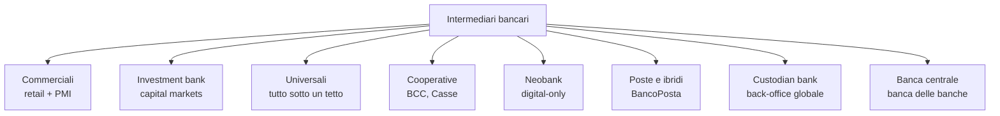
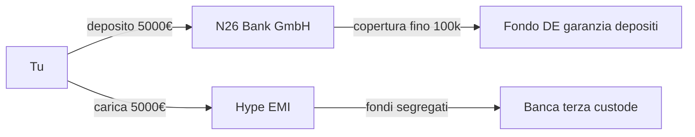

# Tipologie di banche (e perché le neobank sono diverse)

Quando dici "la mia banca" stai usando una parola che copre realtà completamente diverse: una BCC di paese da 200 milioni di attivo, JPMorgan da 4.000 miliardi, Revolut con licenza lituana, e Poste Italiane che tecnicamente non è una banca. Capire le tipologie ti aiuta a scegliere dove tenere i soldi, a chi chiedere un mutuo e perché ti propongono certi prodotti.

## Una mappa di partenza

Sono tutte etichettate "banca" ma fanno mestieri diversi. Vediamoli uno a uno.

## Banche commerciali (retail e corporate)

Sono quelle che immagini quando senti la parola: sportelli, conti correnti, mutui, prestiti alle famiglie e alle piccole imprese. In Italia: Intesa Sanpaolo (retail divisione), Unicredit Italy, BPER, Banco BPM. Nel mondo: Wells Fargo, Lloyds, Santander.

**Come guadagnano.** Due fonti principali:

1. **Margine di interesse (NIM = Net Interest Margin)**: incassano dai prestiti (mutuo al 3.5%) pagando poco sui depositi (conto allo 0.5%). La differenza è il loro carburante.
2. **Commissioni**: tenuta conto, bonifici extra-SEPA, prelievi su ATM altrui, gestione del risparmio.

Tipico NIM di una banca commerciale europea: $1.5\%$ - $2.5\%$ dell'attivo. Se ha 100 mld di attivo, parliamo di 1.5–2.5 mld l'anno solo di margine.

**Modello distributivo.** Storicamente: filiali fisiche. Negli ultimi 10 anni Intesa è passata da 6.300 a 3.500 filiali, Unicredit da 4.200 a 2.300. Il costo di una filiale (affitto, personale, sicurezza) è 300–600 mila € l'anno. Se non genera abbastanza margine, chiude.

## Banche d'investimento (investment bank)

Non vedono mai il tuo stipendio. Lavorano con grandi imprese, fondi, governi. Mestieri:

- **M&A advisory**: ti aiuto a comprare/vendere una società, prendo l'1–2% del controvalore.
- **Equity & Debt Capital Markets (ECM/DCM)**: porto la tua azienda in borsa (IPO) o ti aiuto a emettere bond.
- **Trading**: comprano e vendono titoli, valute, derivati. Per conto cliente (flow) o proprio (prop trading).
- **Research**: analisti che pubblicano report. È un costo che si "ripaga" perché orienta le commissioni.

**I nomi che contano.** Goldman Sachs, Morgan Stanley (pure investment bank dopo lo split del 1933), JPMorgan (universale), Bank of America Merrill Lynch, Citi, e in Europa Deutsche Bank, BNP Paribas, Barclays. Boutique italiane: Mediobanca, Equita.

### Da Glass-Steagall a Gramm-Leach-Bliley

Negli USA, dal 1933 al 1999 il **Glass-Steagall Act** separava per legge le banche commerciali dalle investment bank. Nato dopo il crash del '29: tenere i depositi dei risparmiatori lontani dalla speculazione. Nel 1999 il **Gramm-Leach-Bliley Act** lo abrogò, permettendo la nascita di colossi come Citigroup. Nove anni dopo, crisi del 2008. Lezione comoda da raccontare ma con dati controversi: la causa principale del 2008 fu il mercato dei mutui subprime e dei CDO, non strettamente la fusione commerciale/investment.

## Banche universali (modello europeo)

In Europa la separazione Glass-Steagall non c'è mai stata. Una banca universale fa **tutto**: retail, corporate, asset management, investment banking, assicurazioni. Vantaggi: economie di scopo, possono fare cross-selling. Svantaggi: too big to fail, conflitti di interesse, gestione del rischio complessa.

| Banca | Paese | Attivo (€ mld, ~2024) | Universale? |
|---|---|---|---|
| BNP Paribas | FR | ~2.600 | sì |
| Santander | ES | ~1.800 | sì |
| Intesa Sanpaolo | IT | ~960 | sì |
| Deutsche Bank | DE | ~1.330 | sì, ma sta tornando a focus |
| Unicredit | IT | ~785 | sì |

## Banche cooperative: BCC e Casse di Risparmio

In Italia, una fetta importante del territorio è coperta da banche cooperative. Due famiglie storiche:

- **Banche di Credito Cooperativo (BCC)**: nate alla fine dell'800 con ispirazione cattolica (Raiffeisen tedesco). Soci-clienti, ognuno vale un voto indipendentemente dal capitale. Operatività **locale**: la BCC di un comune presta principalmente in quel territorio. Dal 2016 raggruppate in due grandi gruppi: **ICCREA Banca** e **Cassa Centrale Banca**, più la Raiffeisen sudtirolese.
- **Casse di Risparmio**: nate nell'800 come strumento di risparmio popolare. La Legge Amato del 1990 le ha trasformate in SpA + Fondazione bancaria. Quasi tutte sono confluite in gruppi più grandi (Intesa nasce dalla Cariplo, Cassa di Risparmio di Padova-Rovigo, Banca CR Firenze, ecc.). Le Fondazioni sono rimaste come azionisti con missione filantropica.

**Perché ti interessa?** Una BCC ti conosce di persona, presta volentieri ai commercianti del quartiere, ma ha meno scala per servizi digitali e tassi su grandi importi.

## Poste Italiane: l'anomalia

Tecnicamente Poste Italiane SpA **non è una banca**, ma offre conti (BancoPosta), libretti di risparmio, buoni fruttiferi postali, mutui (in partnership) e gestione del risparmio. Detiene 80+ miliardi in conti correnti, ai quali non può prestare a terzi: per legge li deposita presso il MEF/Cassa Depositi e Prestiti.

Ha una licenza limitata (IMEL/EMI per i pagamenti, partnership bancarie per il credito). È un caso unico al mondo per dimensione: ~12.500 uffici postali contro ~21.000 filiali bancarie totali italiane. Spesso è l'unica "banca" rimasta nei piccoli comuni.

## Neobank: cosa cambia davvero

Termine usato male. Distinguiamo:

- **Neobank pura**: licenza bancaria propria, app-first, niente filiali. Esempi: **N26** (licenza tedesca BaFin), **Bunq** (NL), **Monzo** e **Starling** (UK).
- **Challenger bank**: simile, ma può avere alcune filiali leggere o partnership. Es. **Revolut** (licenza bancaria lituana dal 2018, espande EU progressivamente; in UK ha appena ottenuto piena licenza nel 2024).
- **Fintech con e-money license**: NON sono banche. **Hype** (gruppo BPER ora; in passato Banca Sella), **Tinaba**, **Buddybank** (è una banca: Unicredit). Usano una licenza EMI/IMEL: possono detenere fondi tuoi (segregati) ma non prestare.

### La differenza che conta: dove sono i tuoi soldi?

Quando metti 5.000 € in N26, sono **depositi bancari** coperti dal Fondo Tedesco di Tutela dei Depositanti fino a 100.000 €.

Quando metti 5.000 € in Hype o Tinaba con licenza EMI, sono **fondi di moneta elettronica** custoditi in un conto segregato presso una banca terza. Tecnicamente non sono "depositi" e NON sono coperti dal Fondo Interbancario di Tutela dei Depositi italiano. Sono comunque protetti dalla segregazione: se l'IMEL fallisce, i tuoi soldi non finiscono nel calderone fallimentare, ma il recupero passa dal liquidatore e può richiedere mesi.

Non è uno scandalo: è una scelta di prodotto. Ma se ci tieni più di 1–2 stipendi, vale la pena saperlo.

### Come guadagnano le neobank?

Hanno costi operativi bassissimi (no filiali, no contante quasi). Margini:

- **Interchange fee**: ogni volta che paghi col POS, l'esercente paga una commissione (~0.2–0.3% in EU per debito, ~1% per credito). Una fetta arriva alla tua banca emittente.
- **FX markup**: cambi valuta. Revolut famoso per spread bassi nel weekend, allargati il weekend.
- **Sottoscrizioni premium**: piani mensili (Revolut Premium/Metal, N26 Smart/You/Metal).
- **Lending e investing**: stanno entrando nel credito (Revolut credit cards in alcuni paesi), brokeraggio (Revolut Trading, N26 azioni), crypto.

Il modello regge se hanno volume. Revolut: oltre 45 milioni di clienti, finalmente in profitto strutturale dal 2023.

## Banche custodi (custodian banks)

Non le vedi mai ma muovono il mondo. **State Street, BNY Mellon, Northern Trust, JPMorgan Securities Services** custodiscono titoli per fondi, assicurazioni, fondi pensione. Funzioni:

- Custodia fisica/elettronica dei titoli.
- Settlement (consegna vs pagamento) sui mercati globali.
- Corporate actions (dividendi, splits, fusioni).
- Reporting di compliance.

BNY Mellon custodisce **oltre 50 trilioni** di dollari di asset. Più del PIL mondiale annuale. Non sono ricchi così: custodiscono per conto terzi. Guadagnano commissioni piccolissime (basis points) ma sui volumi gigantesco.

## Banche d'affari / merchant bank

Termine vecchio europeo, oggi più sfumato. In Italia **Mediobanca** nacque (1946) come merchant bank, ha sempre fatto consulenza M&A, finanziamenti industriali, partecipazioni strategiche. Recentemente ha espanso al wealth management (acquisizione Banca Esperia, CheBanca!) ed è oggetto di un'OPS da parte di Monte dei Paschi nel 2025.

## Banche centrali (ripasso veloce)

Già viste nel modulo sulla banca centrale. Ricorda: BCE per l'Eurozona, Banca d'Italia come braccio nazionale che esegue politica monetaria, vigilanza significativa, supervisione delle banche meno significative, gestione del contante.

## Una piccola storia delle banche

Il "banco" della parola "banca" è il **banchetto** dei cambiavalute nel Medioevo italiano. Quando un cambiavalute falliva, il banco veniva rotto: **bancarotta**.

- **Medici** (Firenze, 1397–1494): rete europea di filiali, contabilità a partita doppia (codificata da Luca Pacioli nel 1494), prestiti ai sovrani europei (e ai Papi: Giovanni XXIII e Leone X erano Medici).
- **Fugger** (Augusta, XV–XVI sec.): finanziarono Carlo V (elezione 1519). Quando Filippo II fece default nel 1557, il sistema fugger crollò: lezione antica sul rischio sovrano.
- **Rothschild** (Francoforte → 5 capitali europee, dal 1810): pionieri delle obbligazioni statali (finanziarono Wellington a Waterloo), prestiti governativi su scala continentale, telegramma e information arbitrage.
- **JP Morgan** (NYC, 1871): salvò il governo USA nel panic del 1893 e nel 1907 (prima ancora che esistesse la FED, che nascerà nel 1913 proprio per questa ragione).

Oggi le **tre nazioni-banche globali** sono Cina (Bank of China, ICBC), USA (JPMorgan, BoA, Citi, Wells), Europa (HSBC, BNP, Santander). Le 5 banche cinesi più grandi superano per attivo le top 5 USA.

## Tabella di sintesi: chi fa cosa

| Tipo | Esempi | Cliente tipo | Guadagna da | Filiali? |
|---|---|---|---|---|
| Commerciale | Intesa, Unicredit, BPER | Famiglie + PMI | Margine interesse + commissioni | Sì, in calo |
| Investment | Goldman, Morgan Stanley | Corporate, fondi | M&A fee, trading, ECM/DCM | No |
| Universale | BNP, Santander, IS | Tutti | Tutto sopra | Sì |
| Cooperativa (BCC) | ICCREA, Cassa Centrale | Soci-clienti locali | Margine interesse | Sì, capillare in piccoli comuni |
| Cassa di risparmio | Cariparma (oggi Crédit Agricole IT) | Storicamente piccoli risparmiatori | Margine + gestito | Sì, fuse in gruppi |
| Poste / BancoPosta | Poste Italiane | Tutti, soprattutto anziani | Commissioni + spread CDP | Sì, ufficio postale |
| Neobank | N26, Revolut, Bunq | Mobile-first, viaggiatori | Interchange + premium + FX | No |
| EMI / IMEL | Hype (oggi banca), Tinaba | Microspese, giovani | Commissioni + premium | No |
| Custodian | BNY Mellon, State Street | Fondi e istituzionali | bp su asset custoditi | No |
| Banca centrale | BCE, Fed, PBoC | Banche commerciali | Signoraggio | Sì, ma non per te |

## Come scegliere dove tenere i soldi

Ragionamento pratico:

1. **Liquidità operativa (stipendio, bollette)** → una banca con buona app + costi bassi. Neobank o conto online di banca tradizionale (es. Fineco, IngDirect Conto Arancio).
2. **Cuscinetto 3–6 mesi di spese** → su un conto deposito o un piccolo libretto BCC, con tassi più alti. Verificare copertura FITD.
3. **Investimenti** → broker dedicato o gestione separata. Non lasciare 50.000 € fermi su un conto.
4. **Mutuo** → confronto su 3–4 banche, di cui almeno una piccola del territorio. Spesso le BCC offrono spread migliori per LTV bassi.
5. **Travel** → carta multivaluta neobank per i cambi (Revolut, Wise, N26 Metal).

Diversificare la banca, non solo gli investimenti.

Esercizio: identifica la tipologia

Per ciascuna, indica tipologia e modello di guadagno principale:

1. La tua "banca" Hype che usi per piccole spese.
2. La cassa di paese di tua nonna in Veneto.
3. La sezione di Goldman che ha portato in borsa Ferrari nel 2015.
4. Mediobanca quando consiglia un'acquisizione.
5. State Street quando custodisce 1 miliardo di un fondo pensione olandese.

**Risposte rapide:**

1. EMI/IMEL (oggi acquisita nel gruppo BPER come Banca, ma il prodotto Hype mantiene l'impostazione e-money per piani base). Guadagno: interchange + abbonamenti premium.
2. BCC o ex-cassa di risparmio. Margine di interesse su prestiti locali.
3. Investment bank divisione ECM. Commissione IPO (tipicamente 2–4% sul flottante).
4. Merchant/Investment bank ramo M&A advisory. Success fee + retainer.
5. Custodian bank. Pochi basis point su 1 miliardo = ~100–300 mila € l'anno.

## Letture consigliate

- Banca d'Italia, "Tematiche istituzionali — Il sistema bancario italiano" (pubblicato annualmente).
- EBA, "Risk Dashboard" trimestrale per dati aggregati EU.
- Per gli appassionati di storia: *Lombard Street* di Walter Bagehot (1873), ancora attuale sui meccanismi della banca centrale.

Nella [prossima sezione](10-bilancio-banca-basilea.html) entriamo nel bilancio di una banca e capiamo come Basilea III/IV obbliga a tenere capitale adeguato — e perché quando una banca "fallisce" succede di solito al venerdì sera.
