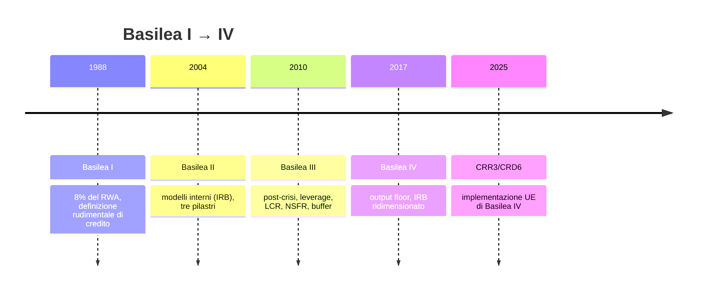
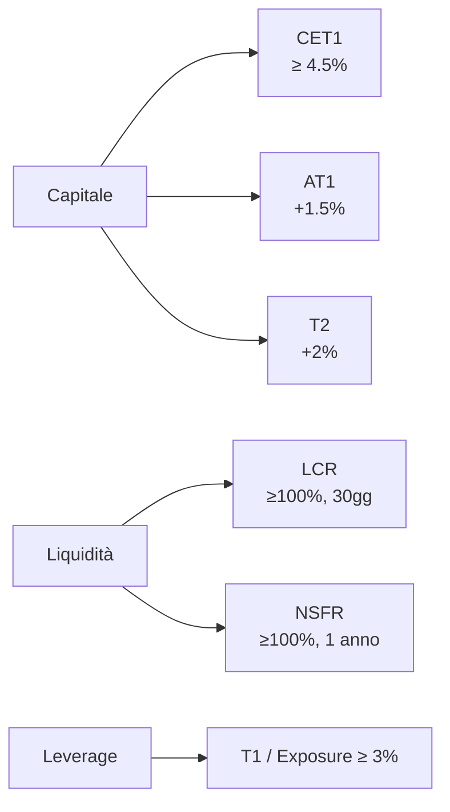
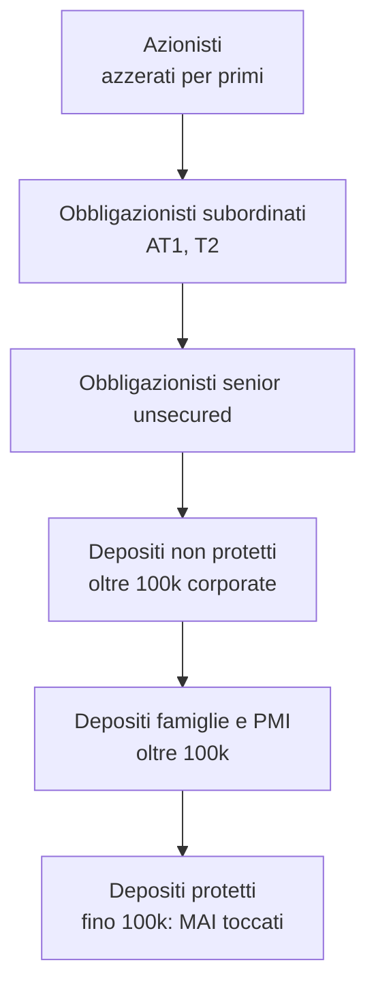

# Il bilancio di una banca e Basilea III/IV

Una banca è un'azienda particolare: la sua materia prima è il denaro degli altri. Per questo il suo bilancio si legge "al contrario" rispetto a quello di una società normale, e per questo è regolata pesantemente. Capirne lo stato patrimoniale è il passo obbligato per giudicare se è solida — o se sta per fare la fine di SVB.

## Lo stato patrimoniale, leggibile

Lo schema di alto livello del bilancio bancario:

| Attivo (impieghi del denaro) | Passivo (raccolta del denaro) |
|---|---|
| Cassa e riserve in BCE | Depositi clientela |
| Crediti verso banche | Debiti verso banche |
| Crediti verso clientela (prestiti, mutui) | Obbligazioni emesse |
| Titoli (govies, bond corporate, azioni) | Passività subordinate |
| Partecipazioni | Patrimonio netto (capitale + riserve + utili) |
| Immobili, immateriali | |

Lato attivo, dall'alto al basso ordini per liquidità decrescente. Lato passivo per esigibilità crescente.

### Una banca italiana media nel 2024

Un esempio sintetico (numeri tondi, **rappresentativi**, non bilancio reale di nessuno) per una banca commerciale italiana da 200 miliardi di attivo:

| Voce | € mld | % attivo |
|---|---|---|
| Cassa + riserve BCE | 20 | 10% |
| Crediti vs banche | 6 | 3% |
| Crediti vs clientela | 110 | 55% |
| Titoli (di cui BTP) | 50 (35) | 25% |
| Immobili + altro | 14 | 7% |
| **Totale attivo** | **200** | **100%** |

Dal lato del passivo:

| Voce | € mld | % attivo |
|---|---|---|
| Depositi clientela | 130 | 65% |
| Obbligazioni emesse | 30 | 15% |
| Debiti vs banche / Repo | 20 | 10% |
| Patrimonio netto | 16 | 8% |
| Altri (TFR, fondi rischi) | 4 | 2% |
| **Totale passivo** | **200** | **100%** |

Nota: il **leverage** è enorme. €16 mld di capitale finanziano €200 mld di attivo. Una piccola perdita sull'attivo (8%) brucia tutto il capitale. Per questo Basilea esiste.

## Conto economico: come si fa il profitto

Schema condensato (in lordo, € mld su 200 di attivo, tipico):

```
Margine di interesse (NIM × attivo)        + 3.5
Commissioni nette                          + 2.0
Trading + dividendi                        + 0.3
─────────────────────────────────────────
Margine di intermediazione (revenue)         5.8

Spese amministrative (personale + IT)      - 3.0
Rettifiche su crediti (loan-loss provision)- 0.6
Altri costi/svalutazioni                   - 0.3
─────────────────────────────────────────
Utile lordo                                  1.9
Tasse (~28%)                               - 0.5
─────────────────────────────────────────
Utile netto                                  1.4
```

Indicatori chiave:
- **Cost/Income** = costi operativi / revenue → qui $3.0 / 5.8 \approx 52\%$. Sotto 50% è eccellente; oltre 70% segnala problemi.
- **ROE** = utile / patrimonio netto → $1.4 / 16 \approx 8.75\%$. Sopra 10% buono; sopra 15% raro.
- **ROA** = utile / attivo → $1.4 / 200 = 0.7\%$. Le banche hanno ROA piccolo, leverage alto.

## NPL: i crediti deteriorati

I prestiti che non vengono ripagati. Categorie regolamentari (Banca d'Italia):

| Categoria | Definizione |
|---|---|
| Sofferenze | Cliente in stato di insolvenza |
| Inadempienze probabili (UTP) | Banca ritiene improbabile pagamento integrale |
| Esposizioni scadute deteriorate | Rate scadute oltre 90 giorni e oltre soglia |

**NPL ratio** = NPL lordi / crediti lordi totali.

L'Italia ha vissuto un ciclo durissimo: nel 2015 banche con NPL ratio del 17%, una media di 360 miliardi di sofferenze nel sistema. Oggi, dopo cessioni massicce (es. cartolarizzazioni con GACS), il sistema italiano è sotto al 3%, in linea EU.

**Texas ratio** = NPL netti / patrimonio tangibile. Indica quanto patrimonio servirebbe per "assorbire" gli NPL. Sopra il 100% è zona rossa: la banca non ha capitale sufficiente. Storica metrica nella crisi delle savings & loan texane anni '80.

## Basilea: la scala dei requisiti

Il **Comitato di Basilea per la vigilanza bancaria** (BCBS) è ospitato dalla BRI (Bank for International Settlements) a Basilea, Svizzera. Non è legge: pubblica standard. Poi UE/USA/Giappone li recepiscono.



### Basilea I (1988)

Una regola sola, ma rivoluzionaria: **capitale ≥ 8% degli attivi ponderati per il rischio (RWA)**.

I pesi RWA erano grossolani:
- 0% per cash e titoli di Stato OCSE
- 20% per banche OCSE
- 50% per mutui ipotecari residenziali
- 100% per prestiti corporate

Esempio: una banca con 100 mld di mutui residenziali → RWA = 50 mld → capitale richiesto = 4 mld. La stessa banca con 100 mld di prestiti corporate → RWA = 100 mld → capitale richiesto = 8 mld.

### Basilea II (2004)

Tre pilastri:

1. **Requisiti minimi di capitale** (rischio di credito + mercato + operativo). Introduzione dei modelli interni (IRB Foundation/Advanced) per banche grandi: la banca calcola PD (probability of default), LGD (loss given default), EAD (exposure at default) sui propri dati.
2. **Supervisione (SREP)**: l'autorità può chiedere capitale aggiuntivo se vede rischi specifici (Pillar 2 Requirement, P2R, e Guidance P2G).
3. **Disciplina di mercato**: disclosure obbligatoria (Pillar 3).

Problema emerso nel 2008: i modelli interni erano troppo permissivi. Le banche più grandi usavano IRB per ridurre il capitale assorbito.

### Basilea III (2010)

Reazione alla crisi 2008. Novità chiave:

- **CET1** (Common Equity Tier 1): solo capitale di qualità primaria (azioni ordinarie + riserve + utili). Minimo 4.5% di RWA, più buffer di conservazione del 2.5%, più buffer anticiclico, più buffer per banche sistemiche (G-SIB, O-SII). Totale minimo nei fatti: 10–13% per una banca media UE.
- **Leverage ratio**: capitale Tier 1 / esposizione totale **non ponderata**. Minimo 3%. Frena chi gioca con i pesi RWA.
- **LCR** (Liquidity Coverage Ratio): asset liquidi di alta qualità / deflussi netti a 30 giorni in scenario di stress ≥ 100%. Risposta a Northern Rock e Bear Stearns.
- **NSFR** (Net Stable Funding Ratio): funding stabile disponibile / funding stabile richiesto ≥ 100%. Orizzonte 1 anno.



### Basilea IV (2017, in vigore 2025 in UE)

Il pacchetto finale ridimensiona i modelli interni. Concetto chiave: **output floor**.

L'output floor dice: il RWA calcolato con modelli interni non può essere inferiore al **72.5%** del RWA calcolato col metodo standard. In pratica vincola le banche grandi a tenere più capitale, riducendo l'arbitraggio tra modelli.

Implementato in UE da CRR3 / CRD6, transizione fino al 2030 sull'output floor (47.5% al 2025 → 72.5% nel 2030).

## La formula del CET1 ratio

$$
\text{CET1 ratio} = \frac{\text{CET1 capital}}{\text{RWA}}
$$

dove:

$$
\text{RWA} = \sum_i (\text{Esposizione}_i \times w_i)
$$

con $w_i$ peso di rischio dell'asset i-esimo (standard o IRB).

### Esempio numerico

Banca con €100 mld di attivo composto da:

| Asset | Esposizione | Peso (standard) | RWA |
|---|---|---|---|
| Cash + BCE | 10 | 0% | 0 |
| BTP italiani | 25 | 0%* | 0 |
| Mutui residenziali LTV<80 | 30 | 35% | 10.5 |
| Mutui residenziali LTV>80 | 5 | 50% | 2.5 |
| Prestiti corporate investment grade | 15 | 50% | 7.5 |
| Prestiti corporate non-IG | 10 | 100% | 10.0 |
| Crediti deteriorati netti | 2 | 150% | 3.0 |
| Altri | 3 | 100% | 3.0 |
| **Totale** | **100** | | **36.5** |

*nota: peso 0% sui titoli di Stato in valuta UE è una semplificazione politica EU, dibattuta.

Capitale CET1 della banca: €4.5 mld.

$$
\text{CET1 ratio} = \frac{4.5}{36.5} = 12.33\%
$$

Sopra il minimo regolamentare consolidato (~10–11%). Buona salute.

Se invece il capitale fosse €3 mld: CET1 ratio = 8.2%. Sotto il P2R richiesto. La BCE/Bankitalia interviene: piano di risanamento, divieto di pagare dividendi, eventualmente raccolta di capitale (rights issue).

## La crisi del 2008 in 5 righe

Mutui subprime USA → cartolarizzati in MBS (Mortgage-Backed Securities) → reimpacchettati in CDO (Collateralized Debt Obligations) → rating AAA da Moody's/S&P → comprati da banche europee e fondi → quando i mutui collassano (2007), tutta la catena salta → **Lehman Brothers** fallisce 15 settembre 2008.

Fed inietta liquidità, TARP da $700 mld, FDIC raddoppia copertura, IFRS e GAAP rivedono valutazioni mark-to-market. Nasce Basilea III.

## Le crisi italiane: MPS, Etruria, Veneto banks

- **Monte dei Paschi di Siena** (2016–2017): la banca più antica del mondo (fondata 1472) trascina sofferenze enormi dall'acquisizione di Antonveneta (2008, pagata €9 mld, oggi pochi mld). Ricapitalizzazione precauzionale 2017 con intervento del Tesoro: lo Stato diventa azionista al 68%. Oggi tornata in utile, lo Stato ha venduto progressivamente fino al 26%, e ora MPS è il bidder ostile su Mediobanca (2025).
- **Banca Etruria, Banca Marche, CariChieti, CariFerrara** (2015): risolte con un meccanismo di **resolution** che zero-ò gli obbligazionisti subordinati (~12.500 risparmiatori). Scoppia il caso dei "subordinati Etruria", problema politico enorme.
- **Veneto Banca + Popolare di Vicenza** (2017): in liquidazione coatta, attivi sani trasferiti a Intesa per €1 simbolico, garanzia statale fino a 17 mld.

## SVB e Credit Suisse, marzo 2023

Due crisi in due settimane, di natura diversa:

**Silicon Valley Bank (10 marzo 2023)**: banca delle startup tech californiane. Sbagliò due cose:
1. Aveva concentrato i depositi su un'unica industria (tech VC).
2. Aveva investito in titoli di Stato USA a lunga scadenza in fase di tassi 0%. Quando la Fed alzò al 5%, quei titoli persero il 15–25% del valore. Erano classificati "Held to Maturity" — niente impatto in conto economico, ma in caso di vendita per liquidità emergono le perdite.

Quando i VC sussurrarono "uscite", $42 mld uscirono in **un giorno**. Bank run digitale. FDIC chiuse SVB il venerdì sera, riaperse il lunedì sotto controllo, garantì tutti i depositi (anche oltre 250k$).

**Credit Suisse (19 marzo 2023)**: anni di scandali (Greensill, Archegos, fuga di clienti). Quando SVB scuote la fiducia, parte un'emorragia di depositi. La FINMA svizzera orchestra una fusione forzata con UBS (per $3 mld in azioni, da $7 mld il venerdì prima). Per la prima volta gli **AT1** (cocos, contingent convertibles) vengono azzerati prima degli azionisti, scelta giuridicamente discussa che ha riscritto i premi al rischio sui AT1 globali.

## Bail-in: chi paga se la banca fallisce

Direttiva UE **BRRD** (Bank Recovery and Resolution Directive, 2014). Gerarchia di chi assorbe le perdite, dal primo all'ultimo:



Il bail-in evita il bail-out (salvataggio coi soldi pubblici). Per le banche significative la decisione di resolution è del **Single Resolution Board** (SRB) a Bruxelles.

## Come leggere il prossimo bilancio di banca

Apri il fascicolo investor relations di una banca quotata (Intesa, Unicredit). Cerca:

1. **CET1 ratio fully loaded**: deve essere comodamente sopra il requisito minimo (di solito ≥ 13% per le grandi italiane).
2. **NPL ratio gross/net**: meno del 5% (lordo) è la media EBA.
3. **Coverage ratio NPL**: rettifiche su NPL / NPL lordi. Sopra il 50% è prudente.
4. **Texas ratio**: ricalcola e confronta nel tempo.
5. **LCR e NSFR**: devono essere sopra 100% (di solito 140–180%).
6. **Leverage ratio**: sopra 5% è confortante (minimo 3%).
7. **Cost/income**: trend di efficienza.
8. **MREL** (Minimum Requirement for Eligible Liabilities): cuscinetto di passività bail-inable in caso di resolution.

<details>
<summary>Esercizio: diagnosi rapida</summary>

Banca X, fine 2024:
- Attivo €150 mld
- CET1 €13 mld
- RWA €95 mld
- NPL lordi €4 mld, NPL netti €2 mld
- Patrimonio tangibile €11 mld
- Cost/income 58%
- ROE 9%
- LCR 145%, NSFR 122%, Leverage ratio 5.2%

Calcola:

1. CET1 ratio
2. NPL ratio lordo
3. Texas ratio (NPL netti / patrimonio tangibile)
4. Verdetto: solida, da monitorare, critica?

**Risposte:**

1. $13 / 95 = 13.68\%$ — sopra requisito.
2. $4 / (4 + \text{crediti lordi performing})$. Se i crediti totali sono ~€90 mld lordi, NPL ratio ≈ $4/90 = 4.4\%$ — accettabile, sotto soglia EBA del 5%.
3. $2 / 11 = 18\%$ — molto sotto la soglia critica 100%.
4. **Solida.** CET1 buono, NPL contenuti, liquidità sopra requisiti, leverage confortante. ROE basso ma migliorabile. Cost/income medio.

</details>

## Cosa rimane fuori

- I derivati e il loro netting sotto IFRS9 — meriterebbero una pagina.
- IFRS9 ed expected credit loss (ECL): cambia drasticamente il calcolo delle rettifiche su crediti.
- Stress test EBA / SSM: simulazioni biennali con scenario avverso.

Per ora basta questo. Nella [prossima sezione](11-mutui.html) usiamo quello che hai imparato sui prestiti per esplorare in dettaglio il mutuo: il prodotto bancario più importante della tua vita.
