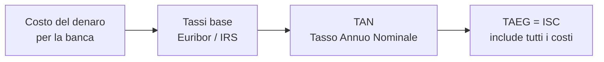
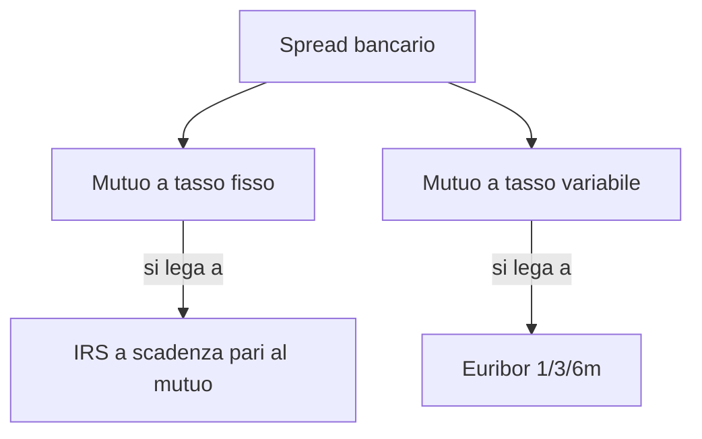
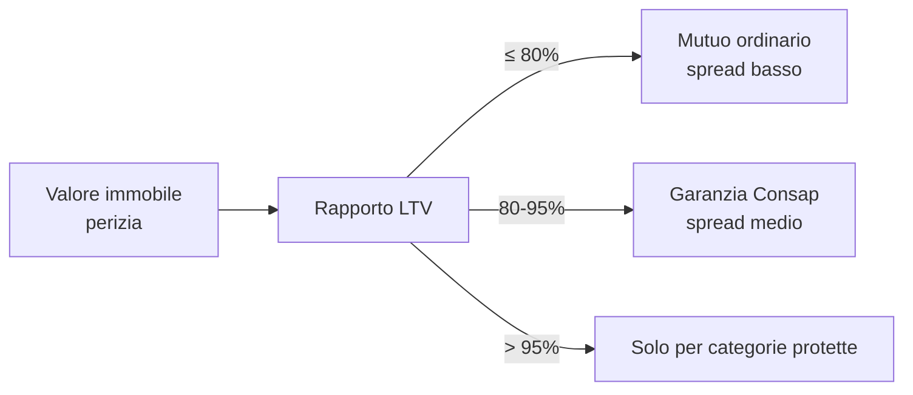

# Mutui (fisso, variabile, misto, surroga, INPS)

Il mutuo è probabilmente il contratto economico più grande che firmerai in vita tua. Una decisione che ti lega per 20–30 anni con flussi di cassa per centinaia di migliaia di euro. Eppure molti lo trattano come l'acquisto di una caffettiera. Questa sezione ti dà gli strumenti per capire cosa stai firmando e per riconoscere le trappole.

## Cos'è un mutuo (e cosa non è)

Un **mutuo** è un contratto in cui una banca ti presta una somma di denaro che restituisci con rate periodiche comprensive di interessi. Tecnicamente, il Codice Civile (art. 1813) parla di mutuo come prestito di cose fungibili.

Quando parliamo di "mutuo" nel linguaggio comune intendiamo quasi sempre il **mutuo ipotecario**: la banca iscrive una **ipoteca di primo grado** sull'immobile a garanzia. Se non paghi, può espropriare l'immobile.

**Mutuo ipotecario vs prestito personale**:

| Caratteristica | Mutuo ipotecario | Prestito personale |
|---|---|---|
| Importo tipico | 50.000 – 500.000 € | 1.000 – 30.000 € |
| Durata | 10 – 30 anni | 12 – 84 mesi |
| Garanzia | Ipoteca su immobile | Nessuna (chirografario) |
| TAEG tipico (2025) | 3% – 4.5% | 7% – 12% |
| Costi accessori | Notaio, perizia, imposta, polizza | Bolli, eventuale assicurazione |
| Finalità | Acquisto/ristrutturazione casa | Libera |

L'ipoteca è il motivo per cui il mutuo è 4 volte più economico di un prestito personale: la banca rischia meno.

## I tassi: il caos di acronimi spiegato

### TAN

Il **TAN** (Tasso Annuo Nominale) è il tasso "puro" del prestito. Su 200.000 € al 3% TAN, paghi circa 6.000 €/anno di interessi al primo anno (semplifico).

Il TAN può essere:
- **Fisso**: rimane uguale per tutta la durata. Si lega all'IRS (Interest Rate Swap) corrispondente alla durata.
- **Variabile**: cambia periodicamente seguendo un indice (Euribor 1/3/6 mesi) + uno spread bancario.

### TAEG (= ISC)

Il **TAEG** (Tasso Annuo Effettivo Globale), chiamato anche **ISC** (Indicatore Sintetico di Costo), include il TAN più tutti i costi obbligatori del finanziamento:

- Spese di istruttoria
- Spese di incasso rata
- Imposta sostitutiva
- Perizia tecnica
- Polizze obbligatorie (es. incendio e scoppio)
- Spese di gestione conto (se imposte)

Non include: spese notarili, polizze non obbligatorie, spese assicurative facoltative.

**Esempio**: due banche ti propongono un mutuo a TAN 3.20%.
- Banca A: TAEG 3.32%. Polizza incendio inclusa, niente costi nascosti.
- Banca B: TAEG 3.85%. Polizza incendio "consigliata" obbligatoriamente, spesa istruttoria 1500€, spese mensili rata 4€.

Banca B costa **0.53 punti** in più. Su 200.000€ a 25 anni, sono circa **15.000 € totali**.

Regola: **confronta i TAEG**, non i TAN.

### Euribor e IRS: cosa sono davvero

- **Euribor** (Euro Interbank Offered Rate): il tasso al quale le banche eurozona si prestano denaro fra loro. Scadenze 1 settimana, 1, 3, 6, 12 mesi. Pubblicato giornalmente dall'European Money Markets Institute (EMMI). È un indice di breve termine. Riflette la BCE.
- **IRS** (Interest Rate Swap): il prezzo, sul mercato dei derivati, per "scambiare" un flusso a tasso variabile con uno a tasso fisso. IRS 25Y = il fisso che il mercato chiede per coprire un variabile di 25 anni. Riflette le aspettative di tassi futuri.

Il **TAN** finale = indice base (Euribor o IRS) + **spread** bancario. Lo spread è il margine della banca. Cambia di banca in banca: oggi va da 0.5% a 2.5%.

## Tipologie di mutuo

### 1. Tasso fisso

Rata che resta uguale per sempre. Ti proteggi dai rialzi, paghi di più in partenza (il fisso costa più del variabile quasi sempre, perché paghi la copertura).

Quando ha senso: quando temi i rialzi, quando vuoi certezza nel budget, quando i tassi sono storicamente bassi (es. 2020–2021).

### 2. Tasso variabile

Rata che cambia. Tipicamente Euribor 3 mesi + spread. Parti più basso. Se i tassi salgono, la rata sale anche di parecchio.

Quando ha senso: quando il mutuo è breve (≤10 anni), quando i tassi sono già alti e ti aspetti scendano, quando hai capacità di assorbire rate più alte.

**Caso 2022–2024**: l'Euribor 3 mesi è passato da **-0.5%** a **+4%** in 18 mesi. Chi aveva un variabile Euribor 3m + spread 1% a marzo 2022 pagava 0.5%; a marzo 2024 pagava 5%. Su 200.000€ residui a 20 anni, la rata è passata da ~876€ a ~1320€. **+50% in 18 mesi**.

### 3. Variabile con CAP

Variabile con un tetto massimo. Es. Euribor 3m + 1.5%, con CAP al 4%. Se Euribor + spread va sopra 4%, paghi al massimo 4%.

Costa più del variabile puro (la banca paga un'opzione cap). Compromesso ragionevole.

### 4. Misto

Inizia variabile (o fisso) per X anni, poi passa all'altro (o resta a scelta del cliente alla scadenza del periodo iniziale). Es. 5 anni fisso al 3%, poi variabile o ri-fisso a condizioni di mercato.

Buono per chi non vuole decidere subito. Attenzione: spesso il fisso del primo periodo è promozionale e il riprezzamento sfavorevole.

### 5. Tasso d'ingresso

Tasso scontato per i primi 1–2 anni, poi ordinario. Promo civetta: leggi sempre il tasso "a regime".

## La rata francese: formula e calcolo

Il **piano di ammortamento alla francese** è lo standard in Italia: rata costante, in cui la quota interessi diminuisce nel tempo e la quota capitale aumenta.

Formula della rata:

$$
R = C \cdot \frac{i \cdot (1+i)^n}{(1+i)^n - 1}
$$

dove:
- $R$ = rata periodica
- $C$ = capitale erogato
- $i$ = tasso periodico (mensile = TAN/12)
- $n$ = numero rate (mesi)

### Esempio: 200.000 € a 25 anni al 3.5% fisso

$$
C = 200{.}000, \quad i = \frac{0{.}035}{12} = 0{.}0029167, \quad n = 300
$$

Calcoliamo passo passo:

$(1+i)^n = 1{.}0029167^{300}$

Si calcola: $\ln(1.0029167) \approx 0.002912$. Moltiplicato per 300 = $0.8736$. $e^{0.8736} \approx 2.395$.

$$
R = 200{.}000 \cdot \frac{0{.}0029167 \cdot 2{.}395}{2{.}395 - 1} = 200{.}000 \cdot \frac{0{.}006985}{1{.}395} = 200{.}000 \cdot 0{.}005007
$$

$$
R \approx 1{.}001{,}40 \, \text{€}
$$

**Rata mensile ≈ 1.001 €**.

**Costo totale**: $300 \times 1.001 = 300.300 €$. Interessi totali: $300.300 - 200.000 = 100.300 €$. Su 25 anni paghi metà del capitale di nuovo in interessi.

### Come cambia con la durata

Stesso prestito, 200.000 € al 3.5%:

| Durata | Rata mensile | Costo totale | Interessi totali |
|---|---|---|---|
| 10 anni | ~1.977 € | ~237.300 € | ~37.300 € |
| 15 anni | ~1.430 € | ~257.300 € | ~57.300 € |
| 20 anni | ~1.160 € | ~278.300 € | ~78.300 € |
| 25 anni | ~1.001 € | ~300.300 € | ~100.300 € |
| 30 anni | ~898 € | ~323.300 € | ~123.300 € |

Allungare la durata abbassa la rata, ma aumenta nettamente gli interessi totali. Da 25 a 30 anni: -10% sulla rata, +23% sugli interessi.

### Come cambia con il tasso

200.000 € a 25 anni:

| TAN | Rata mensile | Interessi totali |
|---|---|---|
| 2.0% | ~848 € | ~54.200 € |
| 3.0% | ~948 € | ~84.500 € |
| 3.5% | ~1.001 € | ~100.300 € |
| 4.0% | ~1.056 € | ~116.700 € |
| 5.0% | ~1.169 € | ~150.700 € |

Un punto di tasso in più costa ~16.000 € in interessi. Negoziare lo spread vale.

## Loan-to-Value (LTV): l'80% magico

**LTV** = importo del mutuo / valore di perizia dell'immobile.

In Italia, la **regola dell'80%** dice che il mutuo "ordinario" copre fino all'80% del valore. Sopra:

- **LTV > 80%**: tecnicamente possibile, ma servono garanzie aggiuntive (fideiussione di parente, polizza monoline, **Fondo Consap**). Spread più alto.
- **LTV > 95%**: praticamente impossibile fuori dal Consap.

**Fondo di Garanzia Prima Casa Consap**: gestito da Consap SpA, copre fino al 50% (a volte 80% per categorie specifiche) del finanziamento. Accesso prioritario per giovani <36 anni con ISEE basso, coppie giovani, monogenitori, alloggi popolari. Quando funziona, la banca presta anche al 95% LTV.

## Mutuo prima casa: le agevolazioni

Se compri la casa dove abiti (prima casa), in Italia hai diritto a:

- **Imposta sostitutiva** sul mutuo al **0.25%** (invece del 2% sulla seconda casa). Su 200.000€ sono **500€** invece di 4.000€.
- **Imposta di registro/IVA ridotta** sull'acquisto: 2% del valore catastale (3% per acquisto da impresa con IVA 4%).
- **Detrazione IRPEF del 19%** sugli interessi passivi, fino a un massimo di 4.000€/anno (760€ effettivi all'anno).
- **Niente Consap per under 36** con ISEE ≤ 40.000 (norma rifinanziata di anno in anno; verifica al momento dell'acquisto).

Requisito: dichiarare di voler trasferire la residenza nel Comune entro 18 mesi e non possedere altra prima casa.

## Surroga: il super-potere del consumatore

La **surroga** (Legge Bersani 2007, art. 8) ti permette di trasferire il mutuo da una banca all'altra **senza costi**, conservando l'ipoteca esistente. Né penale, né nuovo notaio (in realtà il notaio interviene per la cessione, ma a carico della nuova banca).

Quando conviene: se i tassi sono scesi rispetto a quando hai firmato. Se hai un fisso al 4% e oggi il fisso è al 3%, una surroga ti fa risparmiare migliaia di euro.

Calcolo rapido: residuo 150.000€, restano 18 anni, vecchio TAN 4%, nuovo TAN 3%. Risparmio mensile circa 78€. Su 216 mesi = **~16.800 €**.

Cosa serve: documentazione standard mutuo (busta paga, ultima dichiarazione, atto di provenienza, perizia esistente). Tempi: 30–60 giorni.

Cosa non puoi fare con la surroga: aumentare il capitale o cambiare il debitore. Per quello serve **sostituzione** (più costosa).

## Mutuo INPS dipendenti pubblici

L'**INPS Gestione Dipendenti Pubblici** (ex-INPDAP) eroga mutui agevolati ai dipendenti pubblici iscritti alla Gestione Unitaria Prestazioni Creditizie e Sociali (con almeno 1 anno di anzianità contributiva).

Caratteristiche:
- TAN agevolato (sotto i tassi di mercato di solito).
- Importo fino a 300.000€.
- Durata fino a 30 anni.
- Solo per prima casa o ristrutturazione.
- Bando semestrale: si fa domanda, l'INPS valuta per graduatoria.

È un'occasione che molti dipendenti pubblici non sfruttano per ignoranza.

## Estinzione anticipata

Puoi estinguere il mutuo prima della scadenza:

- **Estinzione parziale**: paghi un anticipo straordinario, accorci la durata (rata invariata) o riduci la rata (durata invariata).
- **Estinzione totale**: paghi tutto il residuo.

Per i **mutui prima casa stipulati dopo il 2 febbraio 2007** (Legge Bersani-bis) **non si paga penale**. Per i mutui non-prima-casa o anteriori, la penale è regolata da accordi ABI con tetti.

Strategia: ogni anticipo riduce gli interessi futuri. Versare 10.000€ al 5° anno su un mutuo di 25 anni al 3.5% taglia ~7.000€ di interessi futuri se accorci la durata.

## CRIF e centrale rischi

La **CRIF** (Centrale Rischi Finanziari) è il sistema di informazioni creditizie più usato in Italia. Quando chiedi un mutuo, la banca interroga CRIF (e altre, come Experian, Cerved) per vedere:

- Mutui e prestiti in corso (e regolarità dei pagamenti)
- Rate scadute > 30 giorni (segnalate)
- Insolvenze conclamate (segnalate per 36 mesi)
- Solo per i prestiti, anche le richieste recenti

Se hai una rata in ritardo segnalata, la banca può rifiutare il mutuo o alzare lo spread. La segnalazione si cancella dopo 12 mesi dalla regolarizzazione per ritardi singoli, 24 mesi per ritardi ripetuti, 36 mesi per insolvenza.

**Cosa fare**: chiedi un estratto della tua posizione CRIF prima di chiedere mutuo (gratuito una volta l'anno).

## Le trappole più comuni

1. **Spread alto sul variabile**. Quando i tassi base sono bassi, il variabile sembra attraente. Ma uno spread di 2% nasconde il vero costo: se Euribor sale al 4%, paghi 6%.
2. **Polizze "obbligatorie"**. La polizza incendio è realmente obbligatoria. Le polizze vita o protezione impiego sono **facoltative**. Spesso vengono incluse senza che te ne accorga. **Costo medio**: 3.000–8.000€ una tantum per una polizza vita su un mutuo da 200.000€. Confronta polizze esterne: di solito risparmi il 30–50%.
3. **Costi notarili occulti**. Il notaio è scelto da te (non dalla banca). Chiedi preventivi: per un mutuo da 200k atto + iscrizione ipoteca costano 2.500–4.000€ inclusi tributi.
4. **TAN civetta nel primo periodo**. Promo a 1.99% per 24 mesi, poi 4.50% per 23 anni. Calcola il costo medio ponderato.
5. **Spese mensili di gestione**. Quei 3€/mese di "spese rata" sono 36€/anno = 900€ in 25 anni.
6. **Mutuo a tasso variabile a 30 anni**. Esponi 30 anni di rate al mercato. Salvo casi specifici, è gioco d'azzardo.
7. **Ignorare la surroga**. Dopo 3–5 anni, controlla i tassi. Se il mercato è sceso ≥ 0.5%, fai surroga.

## Checklist pre-firma

Prima di firmare un mutuo:

- [ ] Confronto TAEG (non solo TAN) di almeno 3 banche.
- [ ] Verifica spread esplicito sul contratto.
- [ ] Verifica indice di riferimento (Euribor 1/3/6m, IRS).
- [ ] Polizze obbligatorie elencate e quantificate.
- [ ] Spese di istruttoria e gestione esplicitate.
- [ ] Preventivo notarile separato (3 preventivi).
- [ ] Stima rate future in scenario stress (variabile +3%).
- [ ] Verifica clausole estinzione anticipata.
- [ ] Letta la sezione "esempio rappresentativo" del PIES (Prospetto Informativo Europeo Standardizzato).

## Quanto puoi permetterti? La regola del terzo

Le banche applicano la regola: **rata mensile ≤ 1/3 del reddito netto familiare**.

Se la tua famiglia ha 3.000€ netti/mese, rata massima 1.000€. Considerando i parametri tipici (3.5% fisso, 25 anni), questo si traduce in un mutuo massimo di circa 200.000€ — a patto che tu abbia il 20% di anticipo in cash.

Per casa da 250.000€ servono: 50.000€ propri + 200.000€ di mutuo + 15.000–20.000€ di costi (notaio, imposte, eventuale agenzia).

Esercizio: scegli il mutuo

Devi comprare una casa da 220.000€. Hai 50.000€ di anticipo + 12.000€ per costi. Reddito familiare netto 3.200€/mese. Banche ti propongono:

- **Banca A**: TAN fisso 3.20% a 25 anni, TAEG 3.31%, spese 1.500€, polizza incendio inclusa.
- **Banca B**: TAN fisso 3.10% a 25 anni, TAEG 3.55%, polizza vita "consigliata" 4.000€ una tantum, spese istruttoria 1.800€.
- **Banca C**: TAN variabile Euribor 3m + 1.30% a 25 anni, attualmente 4.00%, TAEG 4.21%, niente costi accessori straordinari.

Domande:
1. Quanto chiedi di mutuo?
2. Qual è il LTV?
3. Quale offerta sceglieresti?

**Risposte:**

1. Costo casa 220k - anticipo 50k = **170.000€** di mutuo (con 12k già destinati ai costi).
2. LTV = 170k/220k = **77.3%**. Sotto soglia 80%: niente Consap necessario.
3. Calcoliamo rata di 170k a 25 anni:
   - Banca A (3.20%): R ≈ 824€/mese
   - Banca B (3.10%): R ≈ 815€/mese — ma con +4.000€ polizza
   - Banca C (4.00% oggi, ma variabile): R ≈ 898€/mese, e se Euribor sale del 2% la rata può andare a ~1.080€

Su 25 anni la rata di Banca B è 815×300 = 244.500€ + 4.000€ polizza = 248.500€. Banca A: 824×300 = 247.200€. **Banca A più economica totale** e con TAEG migliore.

Banca C è la più rischiosa: 898×300 = 269.400€ se tassi non si muovono, di più se salgono. Vale solo se hai forte fiducia che i tassi scendano e capacità di assorbire rate maggiori.

Scelta razionale: **Banca A**. Tutte le rate sono comunque sotto 1/3 di 3.200€ = 1.066€.

## Una nota sulla casa come investimento

Il discorso "comprare casa è sempre meglio dell'affitto" è una semplificazione. Confrontare richiede:

- Costo opportunità dell'anticipo investito.
- Costi di manutenzione (~1%/anno del valore casa).
- IMU/TASI se non prima casa.
- Liquidità (la casa non si vende in un giorno).

In molte città italiane oggi il **rent ratio** (canone annuo / prezzo) è 3–4%. Con mutui al 3.5%, comprare conviene **se** stai in quella casa per 8+ anni e i prezzi non scendono. Sotto i 5 anni, statisticamente è meglio l'affitto.

Nella [prossima sezione](12-prestiti-carte-cessione.html) vediamo i prestiti personali, le carte revolving e la cessione del quinto: il lato meno luminoso del credito, dove il TAEG può superare il 20% senza che te ne accorga.
