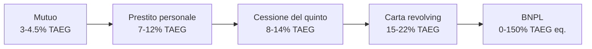
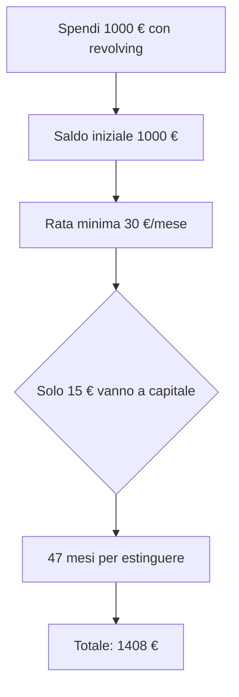

# Prestiti personali, carte revolving, cessione del quinto

Il credito al consumo è il lato meno luminoso della finanza personale. Qui i tassi salgono, le fee si moltiplicano e la stessa rata mensile può nascondere costi totali completamente diversi. Imparare a leggerli ti fa risparmiare migliaia di euro o ti evita di firmare contratti che non capisci. Andiamo dai prestiti tradizionali alle nuove forme (BNPL), passando per le insidie classiche delle revolving.

## La gerarchia del costo del credito

Questa è la scala grezza dei tassi tipici in Italia oggi. Spoiler: più cresce il rischio percepito per il finanziatore (o più piccolo è l'importo), più sale il costo.

## Il prestito personale

Un **prestito personale** è un finanziamento di liquidità senza garanzia reale (chirografario). La banca o la finanziaria ti dà X € e tu li restituisci in N rate mensili. Importi tipici: 1.000 – 30.000 €. Durata: 12 – 84 mesi.

Due varianti:

### Prestito finalizzato

Il prestito è "legato" a un acquisto specifico: auto, motorino, mobili, viaggio, dentista. La finanziaria paga direttamente il venditore. Esempi: Findomestic, Agos Ducato, Compass.

Spesso il venditore "sponsorizza" il prestito offrendo TAN 0% (è il venditore che paga la finanziaria, il costo è già nel prezzo). Ma il **TAEG può essere > 0** se ci sono spese di istruttoria.

### Prestito non finalizzato

I soldi arrivano sul tuo conto e li usi come vuoi. La banca ti chiede a cosa serve solo per profilare il rischio. Importi maggiori, TAN più alto.

### TAN tipici (2025)

| Importo | Durata | TAN | TAEG |
|---|---|---|---|
| 5.000 € | 36 mesi | 6.5% | 7.5% |
| 10.000 € | 60 mesi | 7.0% | 7.8% |
| 15.000 € | 72 mesi | 8.0% | 8.9% |
| 25.000 € | 84 mesi | 9.0% | 9.7% |

Più piccolo è l'importo, più alto è il TAEG: le spese fisse pesano percentualmente di più. Più lunga è la durata, più cresce il TAN nominale.

### Calcolo della rata: usa la stessa formula del mutuo

$$
R = C \cdot \frac{i (1+i)^n}{(1+i)^n - 1}
$$

Esempio: 5.000 € a 36 mesi al 6.5% TAN.

$i = 0.065/12 = 0.005417$, $n = 36$.

$(1+i)^n = 1.005417^{36} \approx 1.2147$.

$R = 5000 \cdot \frac{0.005417 \cdot 1.2147}{1.2147 - 1} = 5000 \cdot \frac{0.006581}{0.2147} = 5000 \cdot 0.03065 \approx 153.30 \, €$

Rata: **~153 €/mese**. Costo totale: 36 × 153 = 5.508 €. Interessi: 508 €. Sembra poco. Aggiungi 200 € di spese istruttoria, e il TAEG passa da 6.5% a ~8%.

## Carte di credito: a saldo vs revolving

Esistono due tipi di carte di credito, ed è cruciale distinguerli.

### Carta a saldo (charge card)

Funzionamento: spendi durante il mese, a una data fissa (es. il 15 del mese successivo) la banca **addebita l'intera somma** sul tuo conto. Niente interessi, niente "rate". È un comodo differimento di 30–45 giorni.

Esempi: la classica American Express verde, gran parte delle Visa/MasterCard standard delle banche italiane.

Costo: spesso solo il canone annuo (15–80 €). Nessun interesse se paghi a scadenza.

### Carta revolving (rotativa)

Funzionamento: spendi e poi rimborsi a **rate mensili minime** (es. 30 €/mese o 3% del saldo). Sulla parte non ancora rimborsata maturano **interessi composti** al tasso revolving.

Tasso revolving tipico: **18% – 24% TAEG**. Sì, hai letto bene.

Esempi: tante carte "fidaty" dei centri commerciali (Conforama, IKEA Family, Postemobile, eccetera), carte revolving di Findomestic/Compass, opzione "rateizza" su carte Visa di banche tradizionali.

### Trappola della revolving: l'esempio classico

Spendi 1.000 € e attivi "rateizzazione" in 12 mesi con TAN 18% (TAEG ~19.5%).

Calcolo rata: $i = 0.18/12 = 0.015$, $n = 12$, $C = 1000$.

$(1.015)^{12} \approx 1.1956$.

$R = 1000 \cdot \frac{0.015 \cdot 1.1956}{0.1956} = 1000 \cdot \frac{0.01793}{0.1956} = 1000 \cdot 0.0917 \approx 91.68 €$

Rata: 91.68 €/mese × 12 = **1.100 € totali**. Hai pagato **10% in più** per quei 1.000 €. Spendi 1.000 €, restituisci 1.100 €. È quanto serve a una banca per fare un mestiere fantastico.

Se non rimborsi del tutto e usi la revolving "rotativa" continuamente:

- Saldo 1.000 €, rimborso 30 €/mese (3%).
- Interesse mensile su 1.000 €: $1000 \times 0.015 = 15 €$.
- La tua rata da 30 € contiene: 15 € di interessi, 15 € di capitale.
- Mese 2: saldo 985 €, interesse $14.78 €$, capitale 15.22 €.
- ...

Ci vogliono **circa 47 mesi** per rimborsare 1.000 € pagando 30 €/mese al 18%. Pagherai 1.408 € totali. **+40.8%**.

Aggiungi che spesso non smetti di usarla, e il saldo cresce.

## Cessione del quinto dello stipendio (CQS)

La **CQS** è un prestito particolare riservato a dipendenti e pensionati. La rata viene trattenuta direttamente dalla busta paga (o pensione) dal datore di lavoro e versata alla finanziaria.

### Caratteristiche

- **Massimo 1/5 dello stipendio netto** (da cui il nome). Es. netto 1.800 € → rata max 360 €.
- **Durata massima 10 anni** (120 rate).
- **Garanzie obbligatorie**: polizza vita + polizza rischio impiego (cofidi). Costose: tipicamente 5–10% del capitale.
- **Si può fare anche se sei segnalato in CRIF**: la garanzia è la trattenuta in busta, non il tuo merito creditizio.

### Chi può farla

- **Dipendenti pubblici e statali**: condizioni migliori (TAEG più bassi). Es. INPS gestione dipendenti pubblici eroga direttamente.
- **Dipendenti privati**: bisogna che l'azienda abbia un certo tetto di dipendenti e accetti la cessione (in genere sì, per legge).
- **Pensionati INPS**: anche qui condizioni regolamentate, tassi soglia pubblicati.

### Costi reali

Il TAN nominale di una CQS sembra basso (6–8%), ma il **TAEG include la polizza obbligatoria** e schizza al 8–14%.

Esempio: CQS 20.000 € a 120 mesi (10 anni), TAN 6%, polizza 1.500 € una tantum, spese 300 €.

Rata calcolata sul TAN nominale: ~222 €/mese.

Costo totale: 120 × 222 = 26.640 €. Più polizza e spese (1.800 €). **Totale 28.440 €** per averne avuti 20.000. Interessi effettivi: 8.440 € su 20k = ~42% di costo totale su 10 anni, corrispondente a TAEG ~8% circa.

### Quando ha senso la CQS

- Se sei segnalato in CRIF e nessun'altra banca ti presta.
- Se vuoi un controllo automatico delle rate (sicurezza che non saltano).
- Se sei pensionato e vuoi importi grandi (auto, sostegno familiari).

Quando **NON** ha senso:

- Se hai un merito creditizio buono e potresti ottenere un prestito personale al 7%, andare a CQS al 10% è una perdita secca.
- Se ti propongono CQS per "consolidare" altri debiti, può essere una trappola: l'agente prende commissione, tu paghi di più nel lungo periodo.

## TEGM e tassi soglia anti-usura

La **Legge 108/96** stabilisce che un prestito è **usuraio** se il suo tasso supera il **tasso soglia** trimestrale.

Banca d'Italia pubblica trimestralmente il **TEGM** (Tasso Effettivo Globale Medio) per categoria di credito. Esempio (categorie tipiche, valori approssimativi 2024–2025):

| Categoria | TEGM | Soglia (TEGM × 1.25 + 4 pp) |
|---|---|---|
| Mutui ipotecari fissi | ~4.0% | ~9.0% |
| Mutui variabili | ~5.0% | ~10.25% |
| Prestiti personali fino 5k | ~12.5% | ~19.6% |
| Prestiti personali oltre 5k | ~10.5% | ~17.1% |
| Cessione del quinto fino 15k | ~12.0% | ~19.0% |
| Carte revolving | ~17.0% | ~25.25% |

Formula tasso soglia: $\text{soglia} = \text{TEGM} \times 1.25 + 4 \text{ pp}$.

Se un finanziamento supera la soglia, è penalmente perseguibile. Le revolving sono spesso vicinissime alla soglia.

## BNPL: il credito travestito da pagamento

**Buy Now Pay Later**: paga in 3 o 4 rate senza interessi (apparenti). Esempi: **Klarna, Scalapay, Afterpay, Clearpay**.

Funzionamento tipico (3 rate Scalapay):
- Compri online 150 €.
- Paghi 50 € subito, 50 € a 30 giorni, 50 € a 60 giorni.
- TAEG dichiarato: 0%.

Cosa nascondono:

1. **Costo trasferito al merchant**: il negozio paga al BNPL una commissione del 3–6% sulla transazione. Questa fee si riflette comunque nei prezzi.
2. **Penali pesanti se salti una rata**: 5–25 € di fee per rata in ritardo, a volte percentuali aggiuntive.
3. **Soft credit check**: alcuni BNPL non segnalano in CRIF in modo standard, ma stanno emergendo nuovi protocolli (es. CRIF-BNPL).
4. **Effetto psicologico**: il prezzo "spalmato" abbassa la percezione del costo, incentiva l'acquisto compulsivo. Studi recenti mostrano +50% di propensione all'acquisto.

### Quando il BNPL diventa caro

Se salti una rata:

- Scalapay: penale 10 € + 10 € per ogni rata successiva non pagata.
- Klarna: penale fino a 15 € + interessi su saldo.

Esempio: acquisti 150 € in 3 rate. Salti la seconda da 50 €. Penale 10 €. Saldo dovuto 50 + 10 = 60 €. Costo nominale del finanziamento di 100 € (le altre due rate): 10 €. **TAEG equivalente sul rate non pagato**: enorme — può superare 100% in regime annuo equivalente.

### Klarna in Italia: licenza bancaria

Klarna ha licenza bancaria svedese ed è regolata come banca. Ciò significa che a differenza di Scalapay (più recentemente acquisita anche da gruppi finanziari), Klarna può anche offrire prestiti più strutturati e ha obblighi di trasparenza maggiori.

## La formula del TAEG (definizione regolatoria)

Definizione UE (Direttiva 2008/48/CE):

$$
\sum_{k=1}^{m} \frac{C_k}{(1+X)^{t_k}} = \sum_{l=1}^{m'} \frac{D_l}{(1+X)^{s_l}}
$$

dove:
- $C_k$ = importi erogati al consumatore al tempo $t_k$
- $D_l$ = rimborsi (rate + spese) versati al tempo $s_l$
- $X$ = TAEG (annuo)

In parole: $X$ è il tasso che rende il valore attuale dei flussi in entrata uguale al valore attuale dei flussi in uscita. Lo si risolve numericamente (Newton-Raphson).

Implicazioni:
- Il TAEG include **ogni costo obbligatorio** per ottenere il credito.
- Una spesa una tantum di 200 € all'inizio è equivalente a circa 8% di TAEG aggiuntivo su un prestito 1000 € a 12 mesi.
- Spostare costi nel tempo (dopo l'erogazione) li fa "pesare meno" attualizzati. Per questo motivo le polizze pagate up-front gonfiano molto il TAEG.

## Confronto integrale: 5.000 € presi in prestito

Tabella comparativa **rigorosamente comparabile**: stesso importo, stesso uso. Durate diverse perché ogni prodotto ha le sue.

| Prodotto | Durata | TAN | TAEG | Rata | Costo totale | Costo extra vs capitale |
|---|---|---|---|---|---|---|
| Prestito personale | 36 mesi | 6.5% | 7.5% | 153 € | 5.508 € | +508 € (10.2%) |
| Cessione del quinto | 60 mesi | 6.0% | 9.5% | 97 € | 5.820 € + 350 € polizza = 6.170 € | +1.170 € (23.4%) |
| Revolving | 36 mesi rate fisse | 18% | 19.5% | 181 € | 6.516 € | +1.516 € (30.3%) |
| BNPL Klarna 36 mesi | (non offerto >12) | - | - | - | - | - |
| BNPL 3 rate (no penali) | 2 mesi | 0% | 0% | 1.666 €/rata | 5.000 € | 0 € (se rispetti tutto) |

Nota:
- Il **prestito personale** è il prodotto più equilibrato per importi medi a medio termine.
- La **CQS** allunga molto la durata (rata bassa) ma il costo totale schizza per via di polizze e tasso più alto.
- La **revolving** ti fa pagare il 30% in più. Su 5.000 € sono 1.500 € regalati alla finanziaria.
- Il **BNPL** a brevissimo è apparentemente gratis, ma serve solo per micro-acquisti (200–1000 €) e ha penali pesanti.

**Conclusione operativa**: se hai bisogno di 5.000 €, prima cerca un prestito personale. Solo se segnalato CRIF passi a CQS. **Evita la revolving** come prima opzione.

## Come dire di no alle offerte aggressive

Cassiera o sportellista che ti propone:

- "Carta di credito con rateizzazione automatica". Chiedi: **a saldo o revolving?** Se ti dice revolving, dì grazie e no.
- "Prestito personale super conveniente". Chiedi: **TAEG?** Confronta con altre 2 banche.
- "Polizza prestito per maggiore sicurezza". Quasi sempre facoltativa. Esci di lì e confronta.
- "Cessione del quinto è la migliore opzione". Chiedi un secondo parere e calcola il TAEG totale incluse le polizze.
- "Scalapay/Klarna gratis al checkout". Se non sei sicuro al 100% di pagare ogni rata, paga tutto subito.

## Consolidamento del debito: prudenza

Il **consolidamento** unisce più prestiti/revolving in un unico finanziamento, di solito a tasso medio inferiore. Si fa con un prestito personale, o spesso con una CQS, o con un mutuo di liquidità.

Quando funziona: se sostituisci debiti revolving al 20% con un prestito personale al 8%, è un risparmio reale.

Quando è una trappola:
- Se l'agente (broker) prende una grossa fee one-shot inclusa nel finanziamento (può essere 5–10% del capitale).
- Se la nuova durata è molto più lunga delle precedenti (rata bassa ma costo totale alto).
- Se ti viene proposto un mutuo di liquidità (10–20 anni) per consolidare debiti che ne avresti tre.

## Il default e cosa succede

Se salti rate ripetutamente:

1. **Segnalazione CRIF**: a 30, 60, 90 giorni. Cancellazione a 12–36 mesi dalla regolarizzazione.
2. **Solleciti, decreto ingiuntivo**: il creditore può ottenere un titolo esecutivo.
3. **Pignoramento del 5° dello stipendio**: massimo 1/5 (il "quinto" diventa una garanzia per il creditore).
4. **Pignoramento mobiliare/immobiliare**: i beni vengono messi all'asta.
5. **Esdebitazione del consumatore** (Legge 3/2012, oggi nel Codice della Crisi 2022): permette al sovraindebitato di accedere a procedure per liberarsi dei debiti residui, sotto il controllo di un OCC (Organismo di Composizione della Crisi).

## Strumenti utili

- **Centrale Rischi Banca d'Italia**: visura gratuita del tuo report (online via SPID).
- **CRIF**: estratto annuale gratuito al [consumatori.crif.com](https://consumatori.crif.com).
- **TEGM trimestrale**: pubblicato su [bancaditalia.it/compiti/vigilanza/avvisi-pub/tassi-usura](https://www.bancaditalia.it/compiti/vigilanza/avvisi-pub/tassi-usura).
- **Calcolatore TAEG**: vari online (verifica con Banca d'Italia).
- **OCC (Organismi di Composizione della Crisi)**: ordine dei dottori commercialisti, ordine degli avvocati, camere di commercio.

Esercizio: trova la trappola

Ti propongono 3 opzioni per acquistare un divano da 1.500 €:

1. **Pagamento immediato**: -3% di sconto = 1.455 €.
2. **Finanziamento del negozio**: 10 rate da 165 € (totale 1.650 €), TAEG 16%.
3. **Scalapay 3 rate**: 500 € × 3, totale 1.500 €, TAEG 0%.

Domande:
1. Qual è la più economica in assoluto?
2. Quanto risparmi rispetto all'opzione peggiore?
3. Quando ti conviene il finanziamento opzione 2?
4. C'è un rischio nascosto nella 3?

**Risposte:**

1. Opzione 1: 1.455 €. La più economica.
2. Rispetto a opzione 2 (1.650 €) risparmi **195 €** (-12%).
3. Mai, se hai i soldi liquidi. Solo se non hai i 1.500 € e devi assolutamente comprare ora — ma anche in quel caso un prestito personale dalla tua banca a TAEG 8% costerebbe meno.
4. **Sì**: se salti una rata, penale 10–20 € per rata in ritardo + segnalazione potenziale. Inoltre paghi il prezzo pieno (1.500 €) invece di negoziare lo sconto: stai effettivamente "perdendo" 45 € di sconto rispetto al pagamento in cash. Su un divano da 1.500 €, BNPL 0% costa comunque 45 € in più del miglior pagamento contante.

## Conclusione operativa

Il credito al consumo è uno strumento. Usato bene, ti permette di anticipare una spesa importante. Usato male, ti fa pagare il 30–50% in più senza rendertene conto. Tre regole d'oro:

1. **Confronta sempre il TAEG**, mai il TAN, mai "la rata bassa".
2. **Mai accettare una revolving** se hai alternative; mai usarla rotativamente.
3. **Costruisci un fondo emergenza** (3–6 mesi di spese): è il miglior "prestito" a tasso 0% — quello che fai a te stesso.

Hai completato il modulo Banking & Credit. Da qui in avanti il sito si occupa di investimento, mercati e gestione del rischio personale.
